# **L1 使用Terragrunt优化Terraform代码**

Terragrunt它如何帮助我们减少Terraform 代码中的代码冗余。我们将讨论了它的基本原理和使用案例。

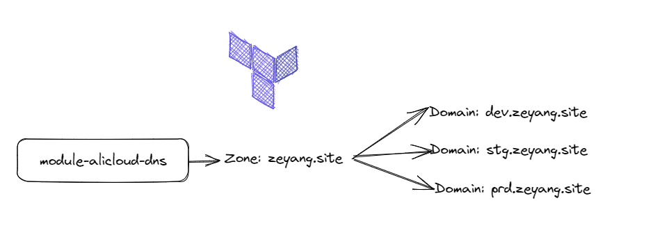

**Terragrunt是一个开源的基于命令行的扩展IaC（基础设施即代码）工具，它是Terraform的一个封装器，使得Terraform代码更易于管理，尤其在处理大型复杂基础设施时更为方便**。它提供了诸多便利功能，例如自动化环境管理，管理重复代码，自动验证IAM和VPC等等

本次实验为了演示效果，我们创建模块`module-alicloud-dns`用于后面各个环境引用。然后先通过terraform原始代码进行发布，最后terragrunt优化代码并发布资源。代码库：[https://jihulab.com/terraform3](https://jihulab.com/terraform3)

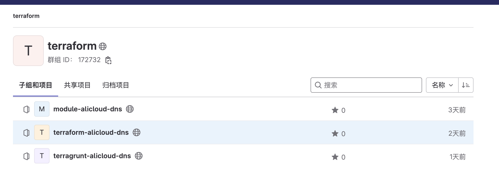

配置AK、SK、Region认证信息

```
export ALICLOUD_ACCESS_KEY="LTAI5B"
export ALICLOUD_SECRET_KEY="soXvKoF6G"
export ALICLOUD_REGION="cn-beijing"
```

使用Terraform代码发布基础设施

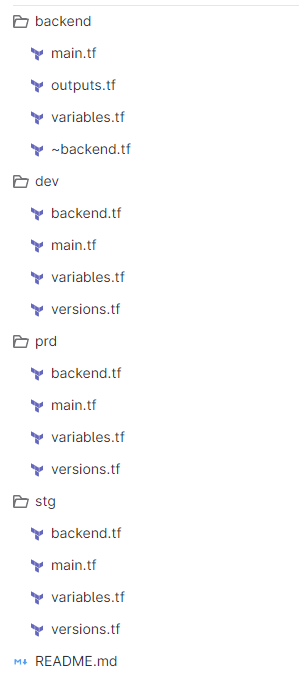

## 部署Backend

`main.tf` 定义阿里云的`OSS bucket` 和`tablestore`. (`oss\tablestore`的命名可以自定义，唯一)

```
provider "alicloud" {
  region     = "cn-beijing"
}

## oss
resource "alicloud_oss_bucket" "tfbucket" {
  bucket = "tf-backend-datas"
  acl    = "private"
}

## tablestore
resource "alicloud_ots_instance" "tftable" {
  name        = "tftablenew"
  description = "terraform tablestore"
  accessed_by = "Any"
  tags = {
    Created = "TF"
    For     = "Building table"
  }
}

resource "alicloud_ots_table" "basic" {
  instance_name = alicloud_ots_instance.tftable.name
  table_name    = "myterraformtable"
  primary_key {
    name = "LockID"
    type = "String"
  }
  time_to_live                  = -1
  max_version                   = 1
  deviation_cell_version_in_sec = 1
}
```

使用命令部署：（注意先把`.backend.tf`移动到其他目录）

```
terraform init 
terraform plan 
terraform apply --auto-approve 
```

将状态文件从本地转换成OSS -- 加入`backend.tf`  (将backend.tf放回原处)后运行terraform init

```
terraform {
  backend "oss" {
    bucket              = "tf-backend-datas"   #要和部署的一致
    prefix              = "global/backend"
    key                 = "terraform-global-backend.tfstate"
    region              = "cn-beijing"
    tablestore_endpoint = "https://tftablenew.cn-beijing.ots.aliyuncs.com"  #注意tablestore的命名
    tablestore_table    = "myterraformtable"
  }
}
```

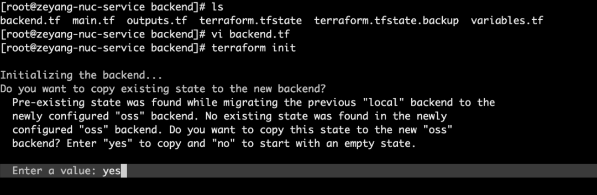

在阿里云控制台进行验证，如图所示。

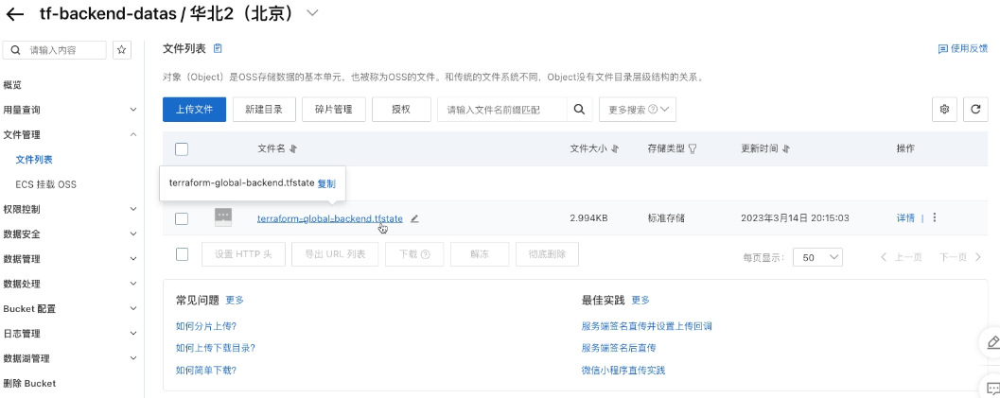


## 部署Dev环境

进入dev目录，可以看到backend.tf、main.tf、variables.tf、versions.tf。


检查backend.tf中的oss和tablestore的命名是否和部署的backend是否一致。

验证一致后， 运行部署命令：

```
terraform init 
terraform plan 
terraform apply --auto-approve 
```

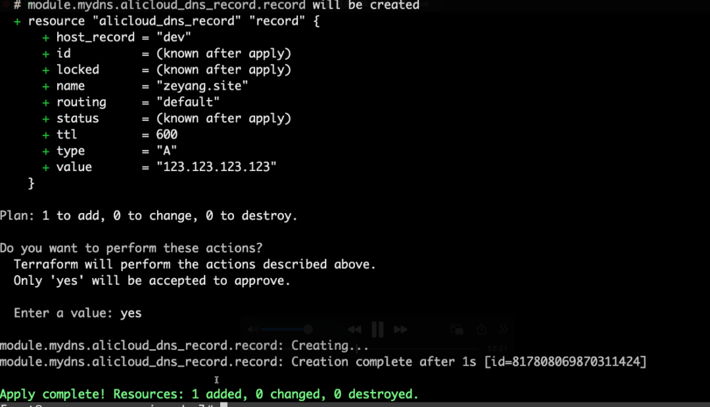

在阿里云控制台进行验证，如图所示。

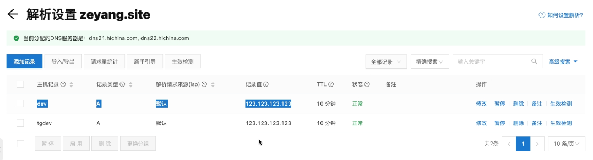

此处不再重复演示STG和PRD环境的发布，如有需要可以自行参考DEV环境进行发布STG和PRD环境。

### Terraform的问题


* versions.tf 代码重复
* module 导入的代码重复
* backend.tf配置代码重复
* provider配置重复

### **Terragrunt**

Terragrunt是由 Gruntwork 维护的Terraform 的包装器，允许管理远程状态和 Terraform 模块。它旨在减少代码重复。此外，它非常易于使用，因为您只需安装它并在所有 Terraform CLI 命令中替换terraform为terragrunt即可。

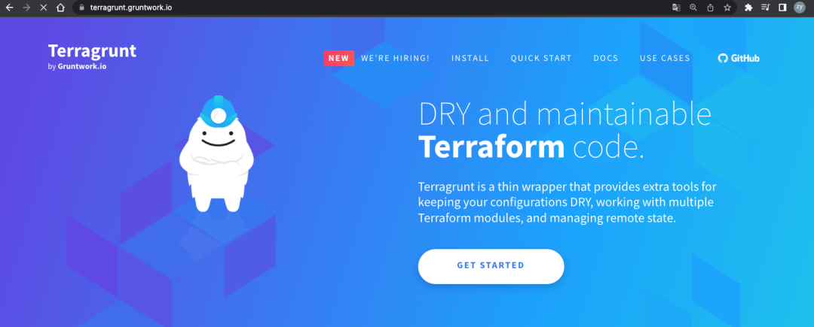

让我们看看我们可以用 Terragrunt 做些什么来改进我们的 Terraform 代码库！将 Terraform 代码的逻辑与其实现分离:

Terragrunt 的主要优点是它允许将代码 Terraform 的逻辑（位于Terraform模块中）与其实现（位于调用 Terraform 模块的不同环境的配置）分离。因此，Terragrunt 可以被视为编排 Terraform 模块的工具。


**具体来说，我们会将`*.tf `配置中的传统文件替换为 Terragrunt.hcl配置文件。通过这样做，我们将能够定义`module-alicloud-dns`在我们存储库中的任何地方调用模块时传递的输入值。**在此配置中，值分解很简单！

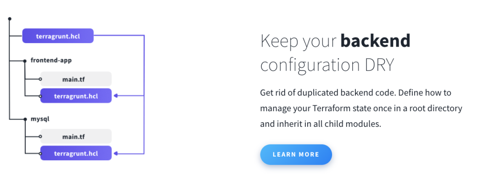

使用Terragrunt优化TF代码

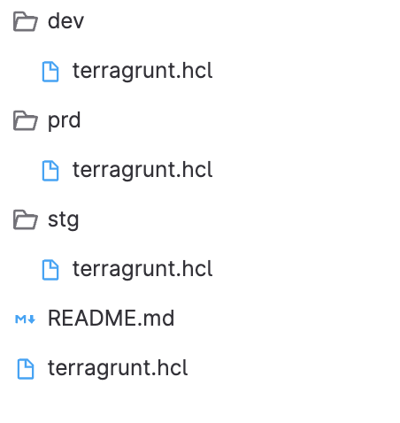


将旧（Terraform）代码中的Provider、Backend、Terraform、Module配置放到根目录下的`terragrunt.hcl`然后每个环境下的`terragrunt.hcl`配置集成root配置。

### **优化Provider配置**

文件：`/terragrunt.hcl`

```
// define provider
generate "provider" {
    path = "provider.tf"
    if_exists = "overwrite_terragrunt"
    contents = <<EOF
    provider "alicloud" {
}
EOF
}
```

### **优化Terraform配置**

文件：`/terragrunt.hcl`

```
// define terraform configuration
generate "versions" {
  path = "versions.tf"
  if_exists = "overwrite_terragrunt"
  contents = <<EOF
terraform { 
  required_version = ">=1.1.8"
  required_providers {
    alicloud = {
      source  = "hashicorp/alicloud"
      version = "1.164.0"
    }
  }
}
EOF
}
```

### **优化Module配置**

文件：`/terragrunt.hcl`

```
// define terraform configuration
generate "versions" {
  path = "versions.tf"
  if_exists = "overwrite_terragrunt"
  contents = <<EOF
terraform { 
  required_version = ">=1.1.8"
  required_providers {
    alicloud = {
      source  = "hashicorp/alicloud"
      version = "1.164.0"
    }
  }
}
EOF
}
```

### 优化Module配置

文件：`/terragrunt.hcl`

```
// define modules
terraform {
  source ="git::https://jihulab.com/terraform3/module-alicloud-dns.git?ref=v0.0.1"
}
```

### 优化Backend配置

文件：`/terragrunt.hcl`

```
// define backend 
remote_state {
  backend = "oss"
  generate = {
    path      = "backend.tf"
    if_exists = "overwrite_terragrunt"
  }
  config = {
    bucket              = "tf-backend-datas"
    prefix              = "env/${path_relative_to_include()}"
    key                 = "terraform.tfstate"
    region              = "cn-beijing"
    tablestore_endpoint = "https://tftablenew2023.cn-beijing.ots.aliyuncs.com"
    tablestore_table    = "myterraformtable"
  }
}
```

### Dev环境继承配置

**文件：`/dev/terragrunt.hcl`**

```
include "root" {
  path = find_in_parent_folders()
}

inputs = {
  dns_zone_name = "zeyang.site"
  dns_record    = "tgdev"
  eip           = "123.123.123.123"
  record_type   = "A"
}
```

运行命令：

```
terragrunt init
terragrunt plan
terragrunt apply 
```

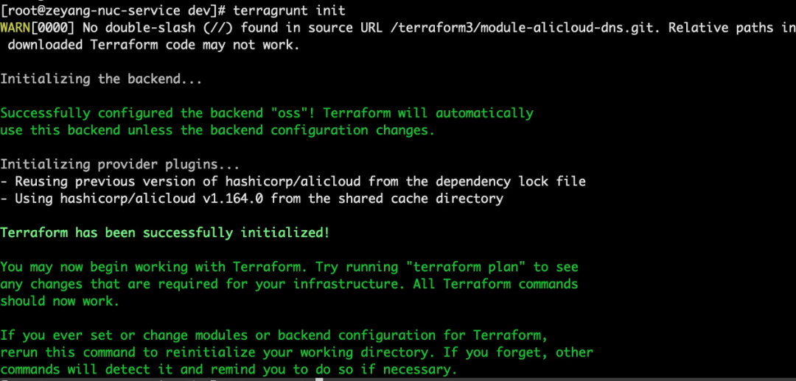

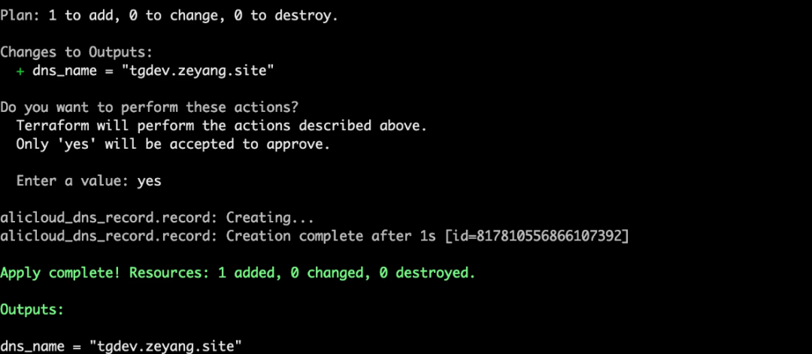

在阿里云控制台进行验证，如图所示。

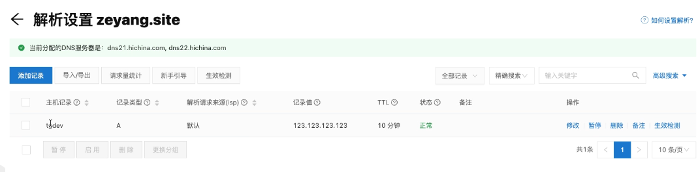

### Stg环境继承配置

文件：`/stg/terragrunt.hcl`

```

include "root" {
    path = find_in_parent_folders()
}

inputs = {
    dns_zone_name = "zeyang.site"
    dns_record    = "tgstg"
    eip           = "123.123.123.124"
    record_type   = "A"
}
```

运行terragrunt init命令后会生成`.terragrunt-cache`目录：

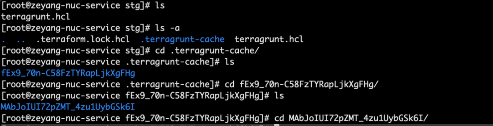

会自动生成这些文件：

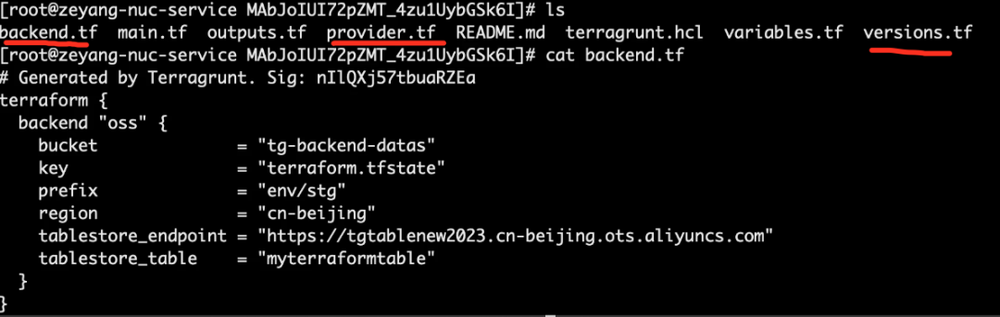


**总结：**

在本文中，我们发现了Terragrunt以及它如何帮助我们减少Terraform 代码中的代码冗余。我们讨论了它的基本原理和使用案例。

