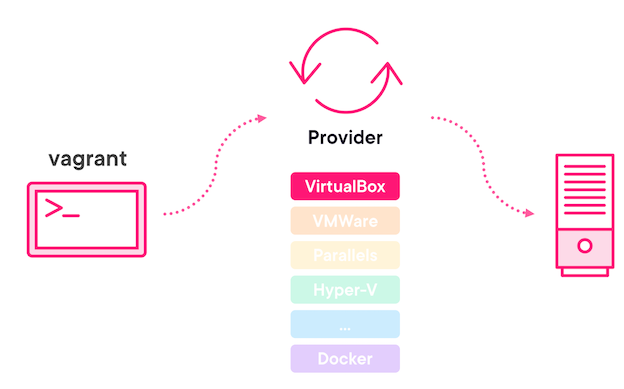

# **1 Creating VMs Effortlessly**

## **1 Install Vagrant on macOS and Wintel**

[https://github.com/hashicorp/vagrant-installers](https://github.com/hashicorp/vagrant-installers)

```
PS C: \Users\> winget search vagrant

Name	Id 		Version  Source
Vagrant Hashicorp Vagrant 2.3.0  winget
```

```
$ choco search vagrant
Chocolatey v0.11.3
vagrant 2.3. 1p[Approved] Downloads cached for licensed users
...
```

### **What Is a Provider?**



**Install VirtualBox on macOS and Wintel**

```
$ brew search virtualbox
$ brew install virtualbox
```

[https://www.virtualbox.org/wiki/Downloads](https://www.virtualbox.org/wiki/Downloads)

### Vagrant init

```
vagrant init generic/ubuntu2204

vagrant up
```

```
$ vagrant init hashicorp/precise64

A `Vagrantfile` has been placed in this directory. You are now
ready to `vagrant up` your first virtual environment! Please read
the comments in the Vagrantfile as well as documentation on
`vagrantup.com` for more information on using Vagrant.

$ vagrant ssh
vagrant@precise64:~$ 

$ vagrant@precise64:~$ ps
  PID TTY          TIME CMD
 1185 pts/0    00:00:00 bash
 1286 pts/0    00:00:00 ps
 
$ cat /etc/lsb-release
DISTRIB_ID=Ubuntu
DISTRIB_RELEASE=12.04
DISTRIB_CODENAME=precise
DISTRIB_DESCRIPTION="Ubuntu 12.04 LTS"

$ uname -a
Linux precise64 3.2.0-23-generic #36-Ubuntu SMP Tue Apr 10 20:39:51 UTC 2012 x86_64 x86_64 x86_64 GNU/Linux


$ pstree
init-+-VBoxService---7*[{VBoxService}]
     |-atd
     |-cron
     |-dbus-daemon
     |-dhclient
     |-dhclient3
     |-6*[getty]
     |-irqbalance
     |-ntpd
     |-rpc.idmapd
     |-rpc.statd
     |-rpcbind
     |-rsyslogd---3*[{rsyslogd}]
     |-sshd---sshd---sshd---bash---pstree
     |-udevd---2*[udevd]
     |-upstart-socket-
     `-upstart-udev-br
```

```
$ vagrant status
Current machine states:

default                   running (virtualbox)

$ vagrant halt

$ vagrant status
Current machine states:

default                   poweroff (virtualbox)
```

**Taking Box as granted**

```
Org/User    Box Name
generic/ubuntu2204   
```

### Using the Parallels Provider on Apple Silicon Macs

```
vagrant plugin install vagrant-parallels
```

**Virtualbox Windows VM to Box with vagrant package --base**


```
VBoxManage list vms
"win-11" {321976ce-e45b-49e7-afc8-1cb54341f6f0}

$ vagrant package --base win-11

$ vagrant box list -i 

$ ls
win11.box

$ vagrant box add win11  .\win11.box

$ vagrant init win11
```