# **10 使用 Vault + Cert Manager 管理 Kubernetes 集群中的数字证书**

## 前言

之前的文章介绍了如何使用 OpenSSL 来创建我们的个人数字证书体系，<mark>但是 OpenSSL 只是一个本地化的工具，当用户需要申请一个数字证书时，它无法作为服务器来提供自动化签发证书的功能</mark>。 

**Vault 就应对了这种需求，它是由 Hashicorp 公司开发的一款专门用来管理各种数字证书、密钥、密码、登录凭证等各类机密信息的服务器程序。我们既可以在 Vault 中直接创建证书体系，也可以把创建好的 CA 证书导入 Vault，然后由其管理证书的签发和吊销事项**。 

我们有一个 Web 应用，部署在集群中，它需要一个数字证书，这时候只需要它发送一个 CSR 请求到 Vault 服务器，Vault 就能自动对请求者进行验证并使用保存好的 CA 来签发用户证书。

**Cert Manager** 是一款云原生应用程序，它作为一个服务类工具，可以帮助 Kubernetes 集群中的应用创建证书请求 (CSR)，转发给 Vault Server，由 Vault Server 中 CA 签名认证后颁发证书，然后再保存到 Secret 资源对象中供应用程序使用。

有了 Vault + Cert Manager 这套系统，k8s 集群中的微服务所需要的证书服务就变得完全自动化了。

一个大致的示意图如下：

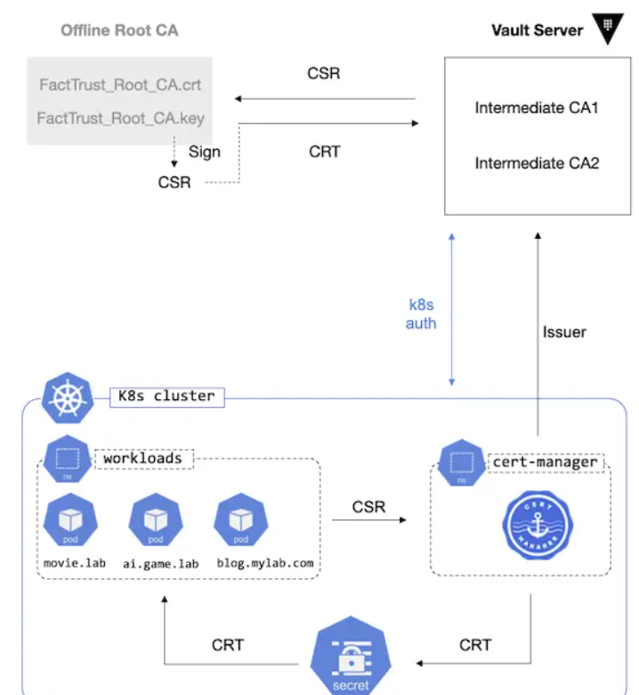

## 第一部分：安装并配置 Vault

下面的命令用于在 Ubuntu 下安装 Vault 程序

```
$ curl -fsSL https://apt.releases.hashicorp.com/gpg | gpg --dearmor | sudo tee /usr/local/share/keyrings/vault.gpg > /dev/null
$ echo "deb [signed-by=/usr/local/share/keyrings/vault.gpg] https://apt.releases.hashicorp.com $(lsb_release -cs) main" \
    | sudo tee /etc/apt/sources.list.d/vault.list
sudo apt update
sudo apt install vault
```

安装成功后，会自动生成一个自签名的证书（用于启动 HTTPS 服务）。

根据之前的文章，我们已经搭建了自己的 CA 证书体系，所以我们可以用自己的 CA 证书来签名得到一个应用程序（也就是这里的 vault)所需的数字证书。

创建 vault 自身所需的证书过程如下：

```
$ openssl req -new -sha256 -nodes \
    -keyout vault.key \
    -out vault.csr \
    -subj="/O=HashiCorp/CN=vault-dev.lab"

$ openssl ca -days 364 -in vault.csr -out vault.crt \
    -cert FactTrust_RSA_ICA1-PKCS8.crt
    -keyfile CA/private/FactTrust_RSA_ICA1.key \
    -extensions usr_ext \
    -config <(cat /etc/ssl/openssl.cnf -<<END
[usr_ext]
basicConstraints = CA:FALSE
subjectKeyIdentifier = hash
keyUsage = digitalSignature,keyEnciperment
extendedKeyUsage = clientAuth,serverAuth,codeSigning
subjectAltName = @alt_names
[alt_names]
IP.1 = 127.0.0.1
IP.2 = 192.168.3.3
DNS.1 = localhost
DNS.2 = vault-dev.lab
END
)
```

上面的命令和原理在之前已经介绍过，这里就不多介绍。

接下来配置 vault 并启动

默认的配置文件是 `/etc/vault.d/vault.hcl`

我们把生成好的证书和 Key 信息填入其中：

```
$ listener "tcp" {
    address       = "0.0.0.0:8200"
    tls_cert_file = "/opt/vault/tls/vault.crt"
    tls_key_file  = "/opt/vault/tls/vault.key"
}
```

启动

```
sudo systemctl start vault
```

或

```
$ vault server -config=/etc/vault.d/vault.hcl
```

配置环境变量，以便可以在使用 vault 命令时，其自动连接正确的 server 地址

```
$ export VAULT_ADDR='https://127.0.0.1:8200'
```
接下来需要要对 vault 进行初始化

```
$ vault operator init -key-shares=3 -key-threshold=2
```

vault 服务器的登陆认证使用了多重密钥，默认是 5 个密钥，解密门限是 3，这里设置 3 个密钥，解密门限为 2。

**Tips：**

这里的多重密钥是 vault 自动生成的，但我们也可以使用之前介绍的 GPG Key，比如：

```
$ vault operator init -key-shares=3 -key-threshold=2 \
    -pgp-keys="alice.asc,bob.asc,david.asc"
```

注意：如果使用 gpg key，那么 gpg 导出公钥的时候需要用 base64，不能用 `--armor`。

init 完成后会生成 root token（输出在屏幕中），我们后续需要用这个 token 进行才可以登录。不过，登陆之前，还需要先 unseal：

```
vault operator unseal
```
依次执行 3 次 unseal 命令，每次填入一个 key 即可。

unseal 之后，就可以执行 `vault login` 登录了（输入 root token）。

**<mark>登录成功，vault 还会把 token 保存在 `~/.vault-token` 以方便后续操作</mark>**。

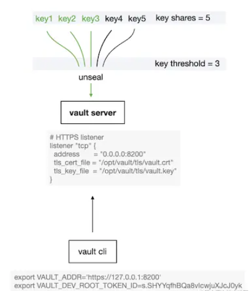

## 第二部分：Vault 启动 PKI 引擎并创建 CA 证书

### Vault 中的机密信息存储引擎（Secret Engine）

Vault 提供多种存储引擎来保存不同类型的机密信息（Secret)，常见的比如 kv, ssh, pki, active directory 等等。我们数字证书应该使用 pki 引擎来存储和管理。

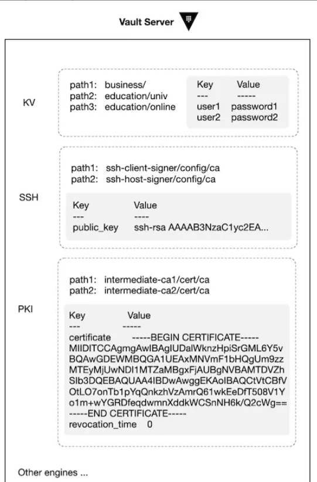

这里的 path 是挂载点 (mount point)，一个 secret engine 就相当于一个文件系统，里面可以有多个挂载点，每个挂载点就是一个路径 path。

### PKI 引擎

在实际操作之前，先理一下我们需要的证书组织结构。

跟之前介绍的使用 OpenSSl 创建的证书体系一样，我们需要有 **Root CA，Intermediate CAs, User Certificate**。Vault 支持直接在 pki 引擎中创建这三类证书。

不过，虽然 Vault 的安全性高，它毕竟也是一个需要联网的软件，只要联网，就免不了有风险。

因此，业界的最佳实践是把 Root CA 放在一个 Offline 的存储媒介上（比如 Yubikey），用它签发一些有效期短的 Intermediate CA 证书，然后把这些 Intermediate CA 证书导入到 Vault 中进行管理。

**Intermediate CA 的 Key 和 CSR 在 Vault 中创建，然后我们用 Offline Root CA 对 CSR 签名得到证书后再导入 Vault 即可**。

### 1. 创建 Offline Root CA

```
$ mkdir factsign
$ cd factsign
$ mkdir -pv {newcerts,CA/private}
$ touch index.txt
$ echo "01" > serial
$ echo "01" > crlnumber
$ echo 'gM6*NTNtu^&YCnKB6=' > rcapass
$ openssl enc -aes256 -pbkdf2 -salt -in capass -out capass.enc
$ openssl req -x509 -newkey rsa:4096 -sha256 -days 7300 -passout file:capass.enc \
    -keyout FactSign_Root_CA.key -out FactSign_Root_CA.crt \
    -subj "/C=US/O=Security/OU=www.factsign.com/CN=FactSign Root CA" \ 
    -addext keyUsage=critical,cRLSign,keyCertSign,digitalSignature
$ mv {capass.enc,FactSign_Root_CA.key} CA/private/
$ rm capass
$ chmod 700 CA/private
```

至此，离线的 Offline Root CA 就创建好了， 接下来需要把它导入到操作系统的 Trusted Key Store 中去。

**Linux (Ubuntu)**

```
$ sudo cp FactSign_Root_CA.crt /usr/local/share/ca-certificates/
$ sudo update-ca-certificates
```
**macOS**

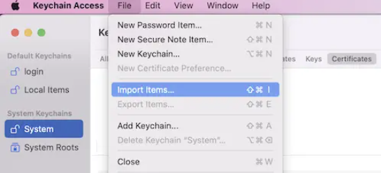

注：为了简略起见，上面省略了把 Key 转换成 `pkcs#8` 格式的步骤，不过不影响使用。

### 2. 在 Vault 中创建 Intermediate CA 的 Key 和 CSR

```
$ vault secrets enable -path=pki_rsa_ica1 pki

$ vault secrets tune -max-lease-ttl=43800h pki_rsa_ica1

$ vault write -format=json pki_rsa_ica1/intermediate/generate/internal \
    common_name="FactSign RSA ICA1 from Offline Root CA" \
    format="pem" \
    private_key_format="pkcs8" \
    key_type="rsa" \
    key_bits="4096" \
    signature_bits=256 \
    country="US" \ 
    organization="Security" \
| jq -r '.data.csr' > pki_rsa_ica1.csr
```

### 3. 使用 Offline Root CA 对 ICA's CSR 签名

```
$ openssl ca -days 1825 -passin file:capass.enc  \
    -in pki_rsa_ica1.csr -out pki_rsa_ica1.crt \
    -cert FactSign_Root_CA.crt \
    -keyfile CA/private/FactSign_Root_CA.key \
    -extensions ica_ext \
    -config <(cat ca.cnf -<<END
[ica_ext]
basicConstraints = critical,CA:TRUE,pathlen:0
subjectKeyIdentifier = hash
keyUsage = critical,digitalSignature,keyCertSign,cRLSign
extendedKeyUsage = clientAuth,serverAuto
authorityInfoAccess = OCSP;URI:http://ocsp.factsign.com/,caIssuers;URI:http://factsign.com/certs/FactSignRootCA.der
crlDistributionPoints = URI:http://crl.factsign.com/FactSignRootCA.crl
certificatePolicies = @pol
[pol]
policyIdentifier = 2.5.29.32
CPS.1 = "https://www.factsign.com/CPS"
userNotice.1 = @notice
[notice]
explicitText = "UTF8:Notice An use of this Certificate constitutes acceptance of the Relying Party Agreement located at https://www.factsign.com/rpa-ua"
END
)
```

### 4. 把 Intermediata CA 证书导入 Vault

```
$ vault write pki_rsa_ica1/intermediate/set-signed certificate=@pki_rsa_ica1.crt
```
导入成功之后，可以通过如下命令来查看证书：

```
$ vault read -format=json pki_rsa_ica1/cert/ca | jq -r .data.certificate | \
    openssl x509 -text -noout -in /dev/stdin
```

查看证书链 `ca_chain`

```
$ vault read pki_rsa_ica1/cert/ca_chain -format=json
```

CA Chain 也叫 CA bundle，由签发链上的所有 CA 证书构成，由于当前 vault 中仅有一个 Intermediate CA，所以其内容只有当前的证书自身；如果在 vault 中再使用 ica1 签发一个 ica2 下级 CA 证书，那么 ca_chain 就是 ica1 + ica2。

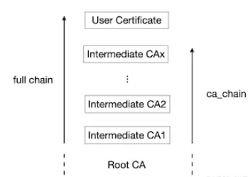

说明：

由于 Root CA 根证书是已经受系统信任的（我们已把它放在操作系统的 Key store 中），所以 ca chain 和 full chain 中并不需要包含 Root CA。

### 5. 设置 URLs

CA 证书都是需要提供 Issuer 证书信息和撤销列表 CRL 的，我们在 x509 v3 extensions 中已经提供了这些信息，但是 vault 中还多了一个步骤，需要单独再设置 URLs，如下：

```
$ vault write pki_rsa_ica1/config/urls \
    issuing_certificates="http://127.0.0.1:8200/v1/pki_rsa_ica1/ca" \
    crl_distribution_points="http://127.0.0.1:8200/v1/pki_rsa_ica1/crl"
```

这里说明一下，这里的 URLs 应该设置为 HTTP 协议，但是注意到，前面我们启动的 vault 是 HTTPS 协议的，所以这里就遇到了一个矛盾点，vault 官方建议的做法是在 vault 前面部署一个反向代理服务器（nginx）来处理 HTTPS 连接，然后 vault 仅在内网部署为 HTTP 服务，这里就不过多介绍更多细节了。

6. **使用 Intermediate CA 签发一个用户证书** Vault 中有严格的权限管理，对每个要执行的动作，都必须先关联一个 Role，而这个 Role 则绑定了一定的操作权限。

因此，这里我们要签发证书之前，必须先创建 Role

```
$ vault write pki_rsa_ica1/roles/mylab-com allowed_domains=mylab.com allow_subdomains=true max_ttl=720h
$ vault write pki_rsa_ica1/issue/mylab-com common_name=blog.mylab.com
```

上面的 `write pki_rsa_ica1/issue/...` 操作会把 certificates 和 key 都打印在屏幕，我们需要把用户的 Key 和 Certificate 保存到文件（比如，保存为 `blog.key` 和 `blog.crt`），因为后续搭建 HTTPS 服务时需要用到。

查看所有已签发的证书列表

```
$ vault list pki_rsa_ica1/certs
```
查看所签发的证书的详细信息

```
$ vault read pki_rsa_ica1/cert/68-3c-aa-83-8c-8c-b1-7c-65-51-cd-4b-76-c1-a7-da-d4-eb-54-d0 -format=json | jq -r .data.certificate | openssl -text -noout -in /dev/stdin
```

**7. 提取 `ca_chain` 并与用户证书合并**

这一步很关键，如果 web 应用程序只有上面的用户证书，那是不够的，因为 ICA 并没有被系统信任（操作系统或浏览器目前只信任了 Root CA 根证书）。所以我们必须把 full chain 作为 web 应用程序的证书才能成功建立 HTTPS 连接。

第一步：提取 ca_chain

```
$ vault read -format=json pki_rsa_ica1/cert/ca_chain | \
    jq -r .data.certificate > ca_chain.pem
```

第二步：与用户证书合并

```
$ cat blog.pem ca_chain.pem > fullchain.pem
```

`fullchain.pem` 的结构是，用户证书在最上面，它的直接 Issuer 在其下面，然后以此类推，如下：

注：root ca 已经导入操作系统受信任，所以 fullchain.pem 中无需包含它（当然，包含了也没关系）。

现在我们已经有了一个完整的证书链，我们用 nginx 搭建一个简单 HTTPS 服务来测试一下。

`/etc/nginx/conf.d/blog.conf`

```
server {
    listen 443 ssl;
    server_name blog.mylab.com;
    ssl_certificate           /etc/nginx/ssl/fullchain.pem;
    ssl_certificate_key       /etc/nginx/ssl/blog.key
    ssl_protocols TLSv1.2 TLSv1.3;
    ssl_ciphers ECDHE-ECDSA-AES128-GCM-SHA256:ECDHE-RSA-AES128-GCM-SHA256:ECDHE-ECDSA-AES256-GCM-SHA384:ECDHE-RSA-AES256-GCM-SHA384:ECDHE-ECDSA-CHACHA20-POLY1305:ECDHE-RSA-CHACHA20-POLY
    ssl_prefer_server_ciphers on;
    location / {
        proxy_pass http://127.0.0.1:8085;
    }
}
```

注：http://127.0.0.1:8085/ 是本地一个简单的 web 页面，nginx 做反向代理提供 HTTPS 链接。部署成功之后（别忘了配置 DNS），在浏览器中输入 `https://blog.mylab.com/` 即可打开页面。


点击🔒，可以看到证书信息如下：

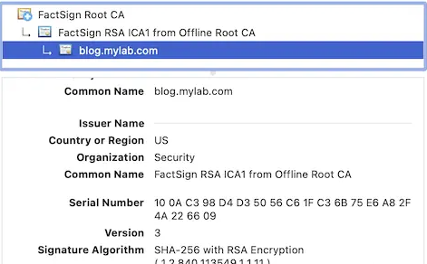

至此，我们已经实现了一套完整的证书体系，并通过 vault 实现了为应用程序自动签发数字证书的功能。

### External CA Pool

手动使用 Root CA 来签发 Intermediate CA 的这个步骤并不够智能，有没有好的解决方案？

答案是有，Vault 提供了 Plugin 功能，用户可以使用第三方插件来管理 Intermediate CA 的申请和撤销，这使得 Vault 可以支持多种外部的 CA Pool。

**gcppca** 是 Google Cloud Platform 平台上的这样一个 Vault 插件，它可以为 Vault 注册外部 CA Pool，这样，在 Vault 中就可以利用外部 CA 来申请到数字证书了，不管是申请用户证书还是 Intermediate CA 证书，都很方便，更好地扩展了 Vault 的功能。

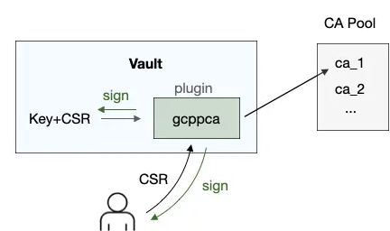

接下来，我们继续深入一步，使用 cert-manager 为 Kubernetes 集群中的应用来管理证书。

## 第三部分：使用 cert-manager 为 kubernetes 集群中的应用程序自动颁发证书

### 前言

实际上 vault 可直接对接 kubernetes，它提供了 kubernetes authenticate 方法，也就是说，kubernetes 中的应用可以使用经授权的 token 登录 vault，从中获取的 secret 信息，比如 password 等。

cert-manager 则专门为证书管理而生，极大地方便了从 kubernetes 外部证书源获取证书的操作。

在架构上 cert-manager 作为 Certificate Requester，它支持从多种不同的 Issuer 来申请证书，包括 Vault, Acme (Let's Encrypt), Venafi 等，它甚至还支持自己创建和管理自签名 CA 证书。

### 1. 安装 cert-manager

```
$ kubectl apply -f https://github.com/jetstack/cert-manager/releases/latest/download/cert-manager.yaml
```
安装成功后，k8s 中会增加如下几个资源：

* Challenge
* Order
* CertificateRequest
* Certificate
* ClusterIssuer
* Issuer

### 2. Vault 认证

`cert-manager` 需要访问 `vault server` 的 `pki engine`，并执行 Sign 的操作（即 `pki_rsa_ica1/issue/mylab-com common_name=blog.mylab.com`) 以便获得客户证书，因此需要有 vault 的登录权限和 pki engine 访问权限。Vault 支持以下几种认证方式：

* Token Authentication
* AppRole Authentication
* Kubernetes Authentication

这里不一一介绍，只介绍 Kubernetes Authentication 这种方式。

**1) 在 kubernetes 中创建 service account 及 clusterrolebinding**

这种认证方式的原理是 Vault 支持使用 kubernetes 中的 service account token 来，本质上是它把认证过程代理了给了 kubernetes，只有一个有效的 service account token 才能登录 vault。

因此，我们需要先在 kubernetes 中创建 service account，并创建关联这个 service account 的相关权限 (clusterrolebinding )。

```
$ kubectl -n default create serviceaccount vault-auth-certmanager

$ cat << EOF | kubectl apply -f -  
apiVersion: rbac.authorization.k8s.io/v1
kind: ClusterRoleBinding
metadata:
  name: role-tokenreview-binding
  namespace: default
roleRef:
  apiGroup: rbac.authorization.k8s.io
  kind: ClusterRole
  name: system:auth-delegator
subjects:
- kind: ServiceAccount
  name: vault-auth-certmanager
  namespace: default
EOF
```

我们把 `jwt_token`，`k8s_host`,`ca_crt` 等信息应该导出至环境变量，方便后续操作引用（假设 Vault 和 k8s master 在同一台机器）：

```
$ export VAULT_SA_NAME=$(kubectl -n default get sa vault-auth-certmanager -o jsonpath="{.secrets[*]['name']}")

$ export SA_JWT_TOKEN=$(kubectl -n default get secret $VAULT_SA_NAME -o jsonpath="{.data.token}" | base64 --decode; echo)  

$ export SA_CA_CRT=$(kubectl -n default get secret $VAULT_SA_NAME -o jsonpath="{.data['ca.crt']}" | base64 --decode; echo)

$ export K8S_HOST=$(kubectl config view --raw --minify --flatten \
    --output 'jsonpath={.clusters[].cluster.server}')
```

2) 在 Vault 中配置 kubernetes 的登录凭证
这一步 Vault 需要访问 kubernetes，以便其能确认 jwt-token 是否有效，如果有效，那么就可以认证通过。因此，我们把上一个步骤中保存好的信息填入 auth/kubernetes 挂载点。

```
$ vault auth enable kubernetes

$ vault write auth/kubernetes/config \
    token_reviewer_jwt="$SA_JWT_TOKEN" \
    kubernetes_host="$K8S_HOST" \
    kubernetes_ca_cert="$SA_CA_CRT" \
  issuer="https://kubernetes.default.svc.cluster.local"
```

**写入好配置之后，查看一下**

```
$ vault read auth/kubernetes/config
```
vault 中所有的路径访问都有 ACL 控制，所以接下来我们需要创建一个 role，并关联访问 `pki_rsa_ica/`  这个 PKI path 的 policy。

(1) 创建 policy

```
$ cat pki-policy.hcl
path "pki_rsa_ica1" {  capabilities = ["create", "read", "update", "delete", "list", "sudo"]} 

$ vault policy write pki_policy pki_policy.hcl

$ vault read sys/policy/pki_policy
```

(2) 创建 role 并关联 policy

```
$ vault write auth/kubernetes/role/cert-manager-role \
    bound_service_account_names=vault-auth-certmanager \
    bound_service_account_namespaces='default' \
    policies=pki_policy \
    ttl=720h

$ vault read auth/kubernetes/role/cert-manager-role
$ vault list auth/kubernetes/role/cert-manager-role
```

注：TTL 配置，Vault 中默认的 max_ttl 是 768h，如果我们把 ttl 设置得比 768h 大，那么会被 cap。不过我们可以手动设置 `max_ttl` 大于 768h。

Short-lived Token

由于 Vault 并不会自动 refresh token，所以不使用 short-lived token。但是从 kubernetes 1.21 开始，有了两点改动：

* JWT token 有过期时间，而且生命周期与 pod 相同
* JWT 的 iss 字段跟集群的配置有关

这就给使用 vault 带来了一些挑战，从 1.9.0 版本开始，vault 默认不再验证 issuser 字段，因为 kubernetes 自己会验证，vault 没必要重复劳动。

```
disable_iss_validation=true
```
(3) 创建 pki engine 下的 role

前面的 role 是 `auth/kubernetes` 挂载点下的，用于获得访问 pki 路径的权限，我们还需要在 pki 路径下创建一个专门用于控制签发证书的 role，没有这个 role，我们就无法 `Issue Certificate`。

```
$ vault write pki_rsa_ica1/roles/any_name allow_any_name=true max_ttl=720h ttl=720h not_before_duration=10s

$ vault read pki_rsa_ica1/roles/any_name
```

注：这个 role 只在需要签发用户证书的时候有用，所以我们把它的 ttl 设置的比较短即可，属于一个即用即弃的临时性角色。为了图方便，我们这里使用 `allow_any_name` 来允许其签发任何域名，你可以根据自己的需求来添加可签发的域名限制。

### 3. cert-manager Issuer/ClusterIssuer

现在我们需要回到 Kubernetes 中，创建 Issuer 对象，它会使用我们上面配置好的 kubernetes auth 信息来映射一个 CA 到 kubernetes 中，然后我们就可以通过创建 Certificate 对象来获得一个用户证书了，`cert-manager` 会将该证书保存在我们指定的 Secret 对象中。

`vault-issuer-by-sa.yaml`

```
apiVersion: cert-manager.io/v1
kind: Issuer
metadata:
  name: vault-issuer-by-sa
  namespace: default
spec:
  vault:
    path: pki_rsa_ica1/sign/any_name
    server: https://vault-dev.lab:8200
    caBundle: LS0tLS1CRUdJTiBDRURS0tLS0tCk1JSUVCekNDQXUrZ0F3...S0tLS0tCg==
    auth:
      kubernetes:
        role: cert-manager-role
        mountPath: /v1/auth/kubernetes
        secretRef:
          name: vault-auth-certmanager-token-j5vgx
          key: token
```

注：


由于 `Vault Server` 使用了 HTTPS 协议，因此上次文件中必须添加 caBundle 字段，其值是签发 `vault.crt` 的 CA 证书的 base64 值（`cat FactSign_Root_CA.crt | base64 -w 0`），必须是单行格式（不包含 `\n`）。

`caBundle` 是用来认证 `vault.crt` 的，没有它就无法与 `Vault Server` 建立 HTTPS 连接。

执行下列命令：

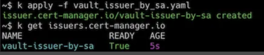

**Issuer 和 ClusterIssuer 区别**

如果使用的是 Issuer，那么只能签发与 Issuer 在相同 namespace 的 Certificate。
如果使用的是 ClusterIssuer，它可以签发任何 namespace 的 Certificate。

需要注意的是： 如果使用 ClusterIssuer，那么前面的 Service Account 必须创建在 cert-manager  这个 namespace 中，否则 cert-manager 会提示找不到该 service account token。

### 4. cert-manager Certificate

Issuer 或 ClusterIssuer 所签发的 Certificate 最终是需要保存在 Secret 对象中并被 Web 程序所引用，所以请确保其 namespace 与想要访问该 Certificate 的 Web 程序所在的 namespace 相同。

现在假设把 Web 应用部署在 default namespace 中，因此，Certificate, 及 Secret 都需要在这个 namespace 中。

**`vault_certificate_by_sa.yaml`**

```
apiVersion: cert-manager.io/v1
kind: Certificate
metadata:
name: vault-cert-by-issuer
namespace: default
spec:
secretName: tls-vault-cert-issuer
duration: 720h # 90d
renewBefore: 36h
subject:
  organizations:
  - homelab
commonName: "*.myblog.com"
dnsNames: 
- echo.myblog.com
- hello.myblog.com
isCA: false
privateKey:
  algorithm: RSA
  encoding: PKCS8
  size: 2048
usages:
  - server auth
  - client auth
```

`secretName: tls-vault-cert-issuer` 是我们指定的想要用于保存 Certificate 内容的 Secret，cert-manager 在成功签发证书之后会自动创建该 Sercret 为我们保存内容。

查看 Secret 对象：

解码 tls.crt

```
$ k get secret tls-vault-cert-clusterissuer -o jsonpath="{.data['tls.crt']}" | base64 --decode1
```
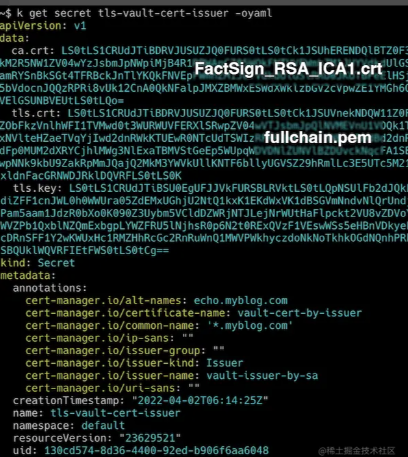

可以看到，tls.crt 是一个 full chain，它包含了两个证书，一个是 Issuer （即 CA）的证书，一个是 Web 程序的证书。


### 5. Kubernetes 中部署 Web 应用

下面我们将在 k8s 集群中部署一个简单的 web 应用，并使用上面所签发的证书来启动 HTTPS 服务。

(1) Deployment

`echo-myblog-com.yaml`

```
apiVersion: apps/v1
kind: Deployment
metadata:
  name: echo-myblog-com
  namespace: default
spec:
  selector:
    matchLabels:
      app: echo-myblog-com
    replicas: 1
    template:
      metadata:
        labels:
          app: echo-myblog-com
      spec:
        containers:
          - name: echo-myblog-com
            image: hashicorp/http-echo
            args:
            - "-text=hello, this is echo.myblog.com 
            ports:
            - containerPort: 5678
```

(2) Service

`echo-service.yaml`

```
apiVersion: apps/v1
kind: Service
metadata:
  name: echo-myblog-com
  namespace: default
spec:
  ports:
  - port: 80
    targetPort: 5678
  selector:
    app: echo-myblog-com
```

(3) Ingress

`echo-ingress.yaml`

```
apiVersion: networking.k8s.io/v1
kind: Ingress
metadata:
  name: echo-myblog-com-ingress
  namespace: default
  annotations:
    nginx.ingress.kubernetes.io/rewrite-target: /
spec:
  ingressClassName: nginx
  tls:
    - hosts:
      - echo.myblog.com
      secretName: tls-vault-cert-clusterissuer 
rules: 
- host: echo.myblog.com
  http:
    paths:
      - path: /
        pathType: Prefix
        backend:
          service:
            name: echo-myblog-com
            port:
              number: 80
```

执行：

```
kubectl apply -f echo-deploy.yaml -f echo-service.yaml -f echo-ingress.yam
```

最后，我们需要修改一下本地的 DNS 配置，使得 echo.myblog.com 域名指向正确的 LoadBalancer IP 地址（由 MetalLB 提供）。

然后打开浏览器，输入 https://echo.myblo.com/ 即可看到网页内容：


查看证书

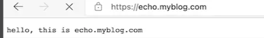

查看证书


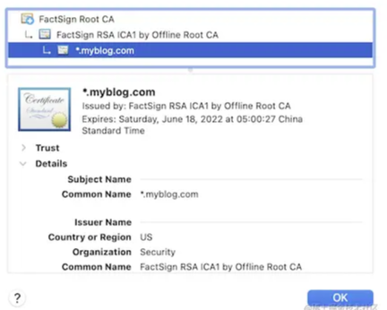