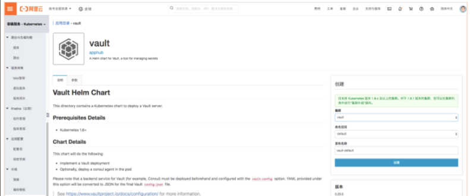
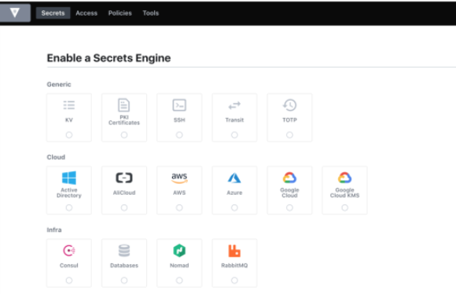
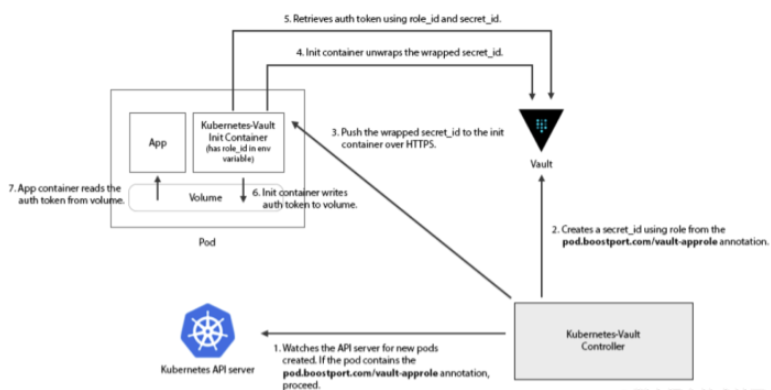
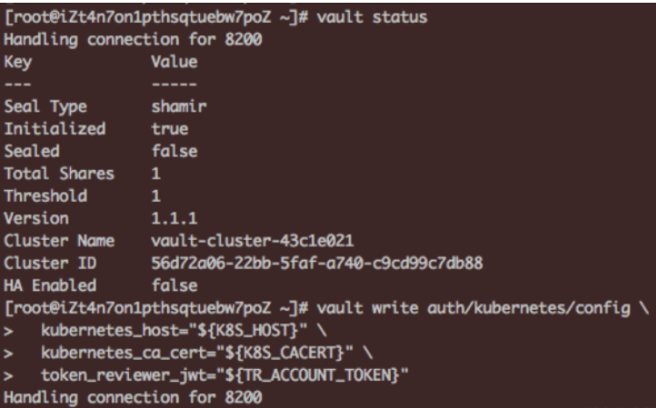
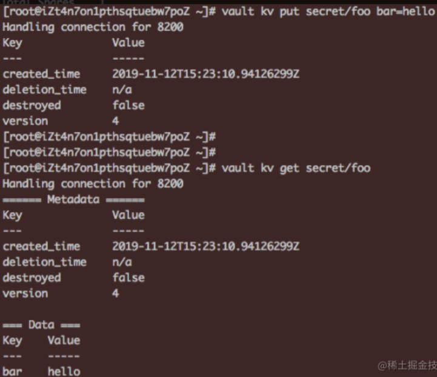
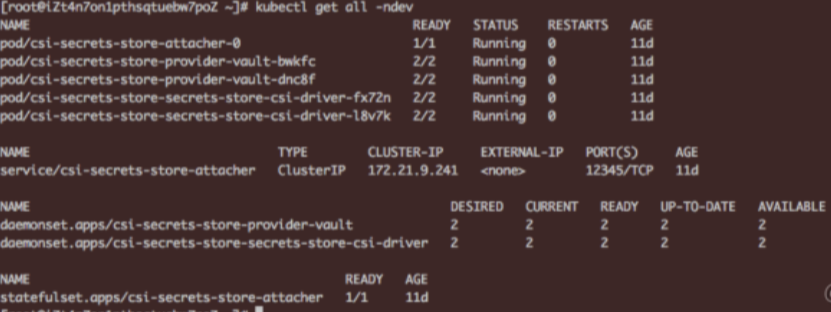
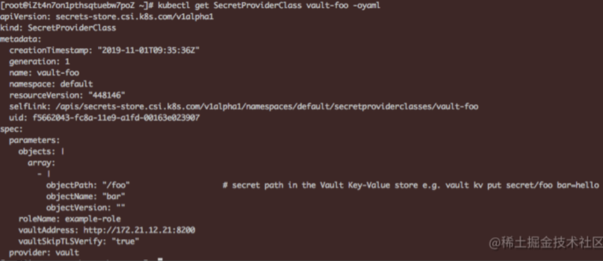

# **11 云原生更安全的密文管理 Vault on ACK**

## Vault是什么？

如何在云上应用中管理和保护用户的敏感信息是一个经常令开发者头疼的问题，用户的密码口令，证书秘钥等私密信息时常未经加密被随意的放置在配置文件，代码仓库或是共享存储里，而对于普通的开发者来说，设计和实现一套完整的秘钥管理系统是一个很大的挑战。

且不论令人生畏的加解密算法，很多的云应用仍然将一些敏感配置信息仅仅经过base64等一些简单的hash运算就放置在某个公共的配置中心上，而很多时候这些敏感信息会从应用的某行异常日志或是某段监控告警中泄露出去；

不仅如此，对于一个集中式的秘钥管理系统，如何面向用户进行更细粒度的访问鉴权也是一个难题。

Vault的出现给了上述问题一个解决方案，它是HashiCorp公司（旗下还有Vagrant，Terraform，Consul等知名产品）维护的开源软件，它的设计思想基于云原生背景下动态基础设施的特点，在云上的不同网络层以及不同的服务之间已经很难找到传统的信任边界，服务之间更加强调以身份（identity）为核心的认证和访问控制，而不是像传统静态基础设施中以IP、主机地址作为信任凭证。为此Vault提供了以下几个功能点：

* Secret存储形式的多样性，任意的kv形式敏感信息（如数据库密码，证书，ssh登录秘钥，openapi身份凭证等）；
* 存储格式的多样性，支持插件式的存储引擎扩展，可对接如AWS，Consul，NoSQL，KV，PKI，SSH等多种插件引擎；
* 支持与各类平台的认证对接，可动态生成认证凭据或配置信息；
* **支持基于Shamir算法的私钥分割完成Vault后端的加封和解封操作**，同时支持高可用的部署形态；
* 支持各类secret的动态生成，续租，撤销和滚动更新；
* 完备的审计日志；
* 完备的CLI和RESTful API

## Vault与k8s的集成

 Vault松耦合的架构使其支持与多种secret引擎和相应的存储后端对接，同时支持与多种认证服务器的交互。

### Vault在Kubernetes中的应用场景

Vault作为企业级的secret管理工具，是一些大客户在业务上云过程中的安全强需求，尤其是国外市场。在Kubernetes集群中主要有以下应用场景：

* 作为部署在Kubernetes集群中的应用对外提供秘钥管理服务，支持与多家主流云厂商秘钥服务以及多种secrets形式的对接，支持多种数据库服务的存储对接，同时支持多种认证形式的对接。
* 作为一个公共的加密服务（Encryption as a Service）而不做后端存储的对接，帮助用户应用剥离繁琐的加密加解密逻辑。面向政府、金融等对数据安全规格有很高要求的客户，**Vault支持基于Two-man原则利用私钥分割算法对后端服务进行加解封，并结合k8s的高可用部署形态为企业提供更加安全可靠的secret管理能力**。
* 当然这里只是列举了一些Vault原生提供的能力，作为一个在Kubernetes集群上直接运行的安全应用，任何一个面向k8s的应用工具都可以利用其安全能力。

### 安装Vault

Vault支持helm化安装，在其官方文档中我们可以找到关于启动参数的详细配置说明，同时在阿里云容器服务的应用目录apphub中我们也可以通过控制台在ACK集群中方便的安装Vault



另外Vault的默认安装也集成了其控制台的安装，通过负载均衡服务或ingress路由的方式我们可以在公网访问其UI，在vault pod的日志中我们可以找到登录使用的root token，在控制台中可以方便的设定与存储引擎和认证方式的对接，同时还可以进行基于策略的访问控制配置。



### 认证方式的集成

当用户希望在k8s pod的业务逻辑中与Vault服务端通讯，获取需要的secrets时，首先Vault会对这个pod中的请求进行认证，那么这个pod中的Vault请求认证凭据应该如何获取呢？

如上所述，Vault后端支持多种认证方式的对接，对于Kubernetes，Vault支持基于K8s Service Account Token的认证。

**使用上，Vault管理员首先需要在后端enable kubernetes的认证方式，生成一个与Vault交互的指定sa，然后通过CLI或API将sa token和集群ca，公网地址等信息写入到Vault后端中，并配置与vault后端的ACL策略绑定**。

当然在pod应用中可以并不局限于一定使用基于sa的kubernetes认证方式。比如[kubernetes-vault](https://github.com/Boostport/kubernetes-vault)。

该项目使用Vault中的[AppRole](https://www.vaultproject.io/docs/auth/approle.html)
认证方式，在该认证模式中，**管理员可以为不同的pod创建不同的Vault原生role模型并绑定到对应的policy上，同时可以基于role创建`secret_id`，`secret_id`对应的token可作为与Vault进行认证的临时凭证**。

`kubernetes-vault`利用了`AppRole`的认证交互模式，

* 首先已经完成安装的`kubernetes-vault controller`会去Watch集群中所有pod的创建，当发现新建pod的部署模板中有指定`annotation`的`init-container`存在时
* controller会根据模板中指定的`vault role id`去`Vault`请求获取其对应的`secret_id`并发送给`init-container`中`kubernetes-vault`的客户端，在应用容器启动前`kubernetes-vault`客户端用controller返回的`secret_id`和`role_id`去Vault请求真正的`login token`并最终写入到与应用pod共享的挂载目录中；
* 同时客户端会根据token过期时间进行定时的轮转，保证其可用性。下图为`kubernetes-vault`工作流程图：



在社区也存在不少基于k8s与Vault进行认证对接的其他方案，其设计思路大同小异，**基本都采用了通过`init-container`或`sidecar`方式引入一个额外的客户端去Vault请求指定认证模式下的短时凭证并共享给业务容器使用**。

在容器服务控制台的应用目录apphub中，我们同样可以找到kubernetes-vault，方便开发者使用helm直接在集群指定命名空间一键部署。Vault也计划在后续自己的官方版本helm chart中增加配置项以支持上述登录认证secret的动态注入。

## Vault与阿里云RAM的集成

当我们在应用中需要访问阿里云资源时，需要使用RAM账号对应的AK或是STS临时credentials作为访问相应资源接口的凭证。

如果使用账号AK，如何使其能够被应用逻辑获取的同时保证AK的安全性一直是一个头疼的问题；

如果使用临时sts token，由于其时效性，我们也需要在考虑安全性的同时思考如何进行临时访问凭证的轮转。

相比较两种方式，使用sts临时凭证的方式肯定在安全上是更为推荐的方式，同时对这种动态secret的安全管理也正是Vault的优势所在。

本节我们来介绍下Vault与阿里云RAM在认证方式和secret管理引擎上的集成。

### **认证方式的集成**

首先在认证方式上，Vault服务端的role模型可以与`RAM role`进行一对一的映射匹配，用户可以使用Vault提供的OpenAPI或是CLI，通过传入扮演`RAM role`返回的临时凭证调用`GetCallerIdentity`接口，然后Vault服务端会根据请求返回的角色`arn id`在其后端存储中查找是否有对应的权限策略配置，如果存在则认证成功并返回一个可用于调用Vault其他后端接口的访问token。

### Vault Secret引擎与RAM的集成

当我们需要在业务应用逻辑中使用阿里云资源时，通常需要通过角色扮演的方式获取一个RAM返回的临时凭证，然后通过这个临时凭证完成与RAM的鉴权过程。由于凭证的时效性，我们在保证其安全性的同时还要维护一个对应的秘钥轮转机制。Vault的secret引擎实现了与阿里云RAM的对接插件，帮助我们安全、动态的管理RAM凭证，其主要步骤 如下:

1. 开启后端引擎
2. 在RAM控制台为Vault服务器创建专属子账号并绑定定制化权限策略
3. 获取Vault子账号对应的AK并通过Vault CLI/API写入到后端指定路径下
4. 在Vault后端写入业务中希望获取的RAM凭证所对应的策略定义或角色，其中策略定义支持inline和remote策略两种形式，所谓inline模式是指直接在api请求中写入策略模板，remote模式指写入RAM中存在的策略类型和名称，比如：

```
$ vault write alicloud/role/policy-based \
    remote_policies='name:AliyunOSSReadOnlyAccess,type:System' \
    remote_policies='name:AliyunRDSReadOnlyAccess,type:System'
```
角色模式需要用户指定希望被扮演的角色arn，另外需要Vault子账号在该角色的受信实体里，一个示例如下：

```
$ vault write alibaba/role/role-based \
role_arn='acs:ram::5138828231865461:role/hastrustedactors'
```

5.在具体的业务应用中，只需要通过调用Vault的creds/policy-based或role-based接口即可动态获取相应的RAM访问凭证，下面是一个角色扮演返回临时token的CLI调用示例：

```
$ vault read alicloud/creds/role-based
Key                Value
---                -----
lease_id           alicloud/creds/role-based/f3e92392-7d9c-09c8-c921-575d62fe80d9
lease_duration     59m59s
lease_renewable    false
access_key         STS.L4aBSCSJVMuKg5U1vFDw
secret_key         wyLTSmsyPGP1ohvvw8xYgB29dlGI8KMiH2pKCNZ9
security_token     CAESrAIIARKAAShQquMnLIlbvEcIxO6wCoqJufs8sWwieUxu45hS9AvKNEte8KRUWiJWJ6Y+YHAPgNwi7yfRecMFydL2uPOgBI7LDio0RkbYLmJfIxHM2nGBPdml7kYEOXmJp2aDhbvvwVYIyt/8iES/R6N208wQh0Pk2bu+/9dvalp6wOHF4gkFGhhTVFMuTDRhQlNDU0pWTXVLZzVVMXZGRHciBTQzMjc0KgVhbGljZTCpnJjwySk6BlJzYU1ENUJuCgExGmkKBUFsbG93Eh8KDEFjdGlvbkVxdWFscxIGQWN0aW9uGgcKBW9zczoqEj8KDlJlc291cmNlRXF1YWxzEghSZXNvdXJjZRojCiFhY3M6b3NzOio6NDMyNzQ6c2FtcGxlYm94L2FsaWNlLyo=
expiration         2018-08-15T21:58:00Z
```

## 如何在k8s应用中使用Vault Secret

在了解了Vault的基本概念以及与Kubernetes的认证交互流程

如何在k8s pod应用中方便地获取Vault服务端管理的secret。社区针对此问题也有激烈的讨论和不少相关解决方案，

方案主要集中在两个方向：**[定时同步进程](https://github.com/hashicorp/vault/issues/7364)**：使用一个同步进程定时地从Vault服务端获取指定范围的秘钥更新并同步到k8s集群中的secret模型，代表的项目有[**vaultingkube**](https://github.com/sunshinekitty/vaultingkube) 和[**secrets-manager**](https://github.com/tuenti/secrets-manager) 。

其主要设计思想也不尽相同，以`secrets-manager`为例，首先用户可以通过CRD定义在`Vault`中关注的secret数据源，然后`secrets-manager`对应的`controller`会在`Reconcile`函数中定时对比指定管理范围内的`k8s secret`和`vault secret`的状态，如果不一致则进行一次调协。而用户在pod应用中可以直接引用原生secret模型中的内容获取远端Vault服务器中的秘钥。

当然社区中也存在一些对这种秘钥同步方案的质疑，比如认为该方案在秘钥同步的传输过程和用户pod使用原生secret的rest交互中会增加攻击面，但是该方案在部署实施上比较友好，也得到了很多用户的支持。

[**CSI插件形式集成**](https://github.com/hashicorp/vault/issues/7365)：该方案基于[`CSI plugin`](https://kubernetes-csi.github.io/docs/)将`Vault`中的秘钥通过volume的形式挂载到pod应用中。[`secrets-store-csi-driver`](https://github.com/deislabs/secrets-store-csi-driver) 通过实现一套基于CSI规范的driver机制可以对接不同厂商的后端存储，而`Vault secret`的`driver(secrets-store.csi.k8s.com)`允许kubelet将各类企业级秘钥存储中的secret通过volume挂载，一旦`attach`动作完成，秘钥数据即挂载到了容器对应的文件系统中。


在`CSI driver`的基础上，不同的秘钥管理后端可以实现定制化的provider去对接`CSI driver`框架中的规定接口。

provider的功能概括如下：

1. 对接后端秘钥管理系统，提供秘钥获取等必须的接口实现
2. 适配当前`CSI driver`的接口定义
3. 通过框架中的回调函数无需调用Kubernetes API即可将从后端获取的秘钥数据挂载到指定路径下

HashiCorp官方也基于此框架实现了一套对接Vault的[Provider](https://github.com/hashicorp/secrets-store-csi-driver-provider-vault/blob/master/docs/vault-setup.md)。 这里我们以此为例具体来看下在一个k8s pod应用中如何通过CSI plugin的方式使用Vault中管理的secret秘钥。

1 首先我们创建一个开启了CSI存储插件的ACK集群，然后参考文档在集群中部署Vault服务端，为了便于验证这里我们使用dev模式省去unseal解封等流程，同时配置provider与Vault交互的认证模式和相应的访问控制策略



然后通过cli向Vault后端写入测试数据



2 通过官方提供的helm方式安装Secret Store CSI Driver，命令如下：

```
helm install . -n csi-secrets-store --namespace dev --set providers.vault.enabled=true
```
安装成功后如下图所示：



3 在集群中创建`secretproviderclasses`实例用于`Secret Store CSI Driver`与Vault的参数对接，一个示例如下，注意这里的vault服务端地址可通过`kubectl get service vault`获取。



4 最后我们来看下如何在应用pod中对接上述provider实例获取对应的Vault秘钥。这里pod对于上述vault provider的使用分为两种方式：


1) **如果pod运行的目标集群版本在v1.15.0以上，且集群`apiserver`和节点`kubelet manifest`配置均开启了 `CSIInlineVolume=true`的`feature-gates`，则我们可以在pod中的volume字段内置声明需要使用的`csi provider`实例**。

```
kind: Pod
apiVersion: v1
metadata:
  name: nginx-secrets-store-inline
spec:
  containers:
  - image: nginx
    name: nginx
    volumeMounts:
    - name: secrets-store-inline
      mountPath: "/mnt/secrets-store"
      readOnly: true
  volumes:
    - name: secrets-store-inline
      csi:
        driver: secrets-store.csi.k8s.com
        readOnly: true
        volumeAttributes:
          secretProviderClass: "vault-foo"
```

2）**如果目标集群不支持CSI的Inline Volume特性，我们需要首先创建使用csi的pv和对应的pvc实例**，一个pv模板示例如下:

```
apiVersion: v1
kind: PersistentVolume
metadata:
  name: pv-vault
spec:
  capacity:
    storage: 1Gi
  accessModes:
    - ReadOnlyMany
  persistentVolumeReclaimPolicy: Retain
  csi:
    driver: secrets-store.csi.k8s.com
    readOnly: true
    volumeHandle: kv
    volumeAttributes:
      providerName: "vault"
      roleName: "example-role"
      vaultAddress: http://172.21.12.21:8200
      vaultSkipTLSVerify: "true"
      objects:  |
        array:
          - |
            objectPath: "/foo"
            objectName: "bar"
            objectVersion: ""
```

在pod实例模板中引用指定pvc即可在pod中获取到vault，这里我们在ACK集群以pv/pvc模式为例创建一个nginx应用容器实例并在其中挂载上文中我们创建的`secretproviderclasses`实例：


相比于secrets-manager等采用secret定时同步的方式，使用CSI对接指定`Vault secret provider`实例的方式虽然在实施步骤上比较复杂，同时在应用中也无法动态获取Vault后端secret的变更，但是该方案避免了secret在同步链路上频繁传输的安全风险，同时也客服了之前`describe po`可能造成的秘钥泄露，在整体安全性上要高出不少。大家可以根据实际应用场景选择适合自己的方式。