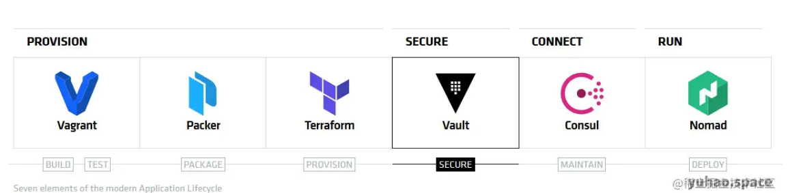
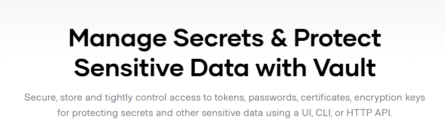
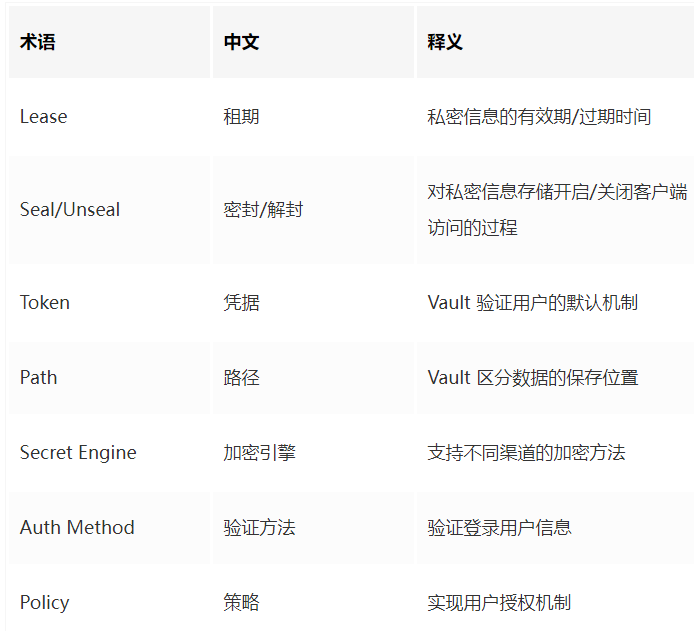

# **1 私密信息管理利器 HashiCorp Vault——简介**

最近，由于项目中需要使用保存和管理的加密配置，并且我相信自己发明加密方法并不是一个合理的选择，所以开始寻找相关的方案。经过选型，确定了 [HashCorp Valut](https://www.vaultproject.io/)。

目前，在网络上除了官方文档之外，能找到的相关资料非常至少。这或许是因为 Vault 尚未得到大规模使用，不过也有可能是因为涉及到私密性的信息，所以不方便公开讲。不论原因为何，本文和后续的文章希望把使用 HashiCorp Vault 的经验和心得记录下来，为后来人提供一点方便。

## 关于 HashiCorp

HashiCorp 是一家专注于基础设施解决方案的公司，业务范围涵盖软件开发中的部署、运维、安全等方面。下图是该公司的主要产品线，其中大部分知名度不算高，但大名鼎鼎的 Vagrant 相信很多人都听说过。

## 什么是 HashiCorp Vault

HashiCorp Vault 的 Slogan 是 A Tool for Managing Secrets，这个口号很好的描述了该产品的定位。

大多数软件项目都会不同程度的用到诸如 **登录密码/Token/证书/API Key 等私密信息**，这些信息用明码保存显然是很不安全的，如果不小心签入到版本控制系统，还会造成重大的安全问题（这方面的事故我们已经听到过很多次了）。

Vault 就是为了解决这一问题而创立的。它提供了这些功能：

* 集中管理各种私密信息；
* **为私密信息设置租期（Lease），到期后自动失效**；
* **密钥的动态生成、注销和滚动更新**；
* 动态创建无需保存的一次性登录密钥；
* **作为数据加密/解密接口**；
* 完整的审计记录；
* **命令行 以及 RESTful API 访问接口**；

此外，Vault 设计为灵活的可插拔架构，允许灵活的设置各种后端引擎和安全策略。例如：

* **可以用内置 Token、用户/密码、LDAP、Amazon IAM、Github 等作为认证授权机制**；
* 可以使用内存/本地文件/Etcd/Consul/ZooKeeper/RDBMS/NoSQL/云平台等作为数据存储；
* **可以为数据库/SSH/Consul/AWS/Nomad/PKI/RabbitMQ 等多种平台生成和管理访问密钥**；
* 可以与 Cousul、Chef、Ansible 等运维工具集成起来共同使用

## 使用场景和比较

由于私密信息的管理是一个带有普遍性的需求，所以业界对该问题也已经有多种处理办法。这里简单描述 Vault 和其他私密管理方案的对比，以便你有一个更好的理解。

* **运维工具(Chef,Puppet，Consul等)** 由于经常需要记录各种连接信息，这些运维工具也有自己的加密机制，例如 Chef data bag/Puppet Hiera。如果重点在于运维，对安全性要求不是很高，那么使用这些工具来处理私密信息也是完全可行的。它们的问题在于安全性不够高，容易发生泄露问题，此外也缺乏像 Vault 那样完整的审核记录。另外，Vault 也能够和这些运维工具结合起来使用。
* **硬件安全模块（Hardware Security Model, HSM）** 按照定义来说是基于硬件的，不过也有 Amazon CloudHSM 这样的服务形式。HSM 的安全等级是足够高的，不过它们通常价格昂贵、管理麻烦，基于硬件的形式对云平台通常不太友好，大多数中小企业一般不会考虑。如果你确实有 HSM 可用的话，那么用它来管理 Vault 的主密钥也是一个合理的选择，不过用 HSM 来管理所有私密信息通常是太过重量级了。
* **DropBox(及其他类似的网盘)** 我们都明白：用这种方法来管理私密信息，在安全性的角度来讲肯定是不合格的，但由于使用方便，事实上还真有很多不太注重安全的用户走了这个路子。Vault 的作者当然是不鼓励这种做法的，并且希望 Vault 相比其他更加重量级的解决方案来说能够在使用上更加简便。
* **Amazon KMS(Key Management Service)** 从名字上就能看出，KMS 注重的是密钥的管理，Vault 则更加灵活。KMS 和 Amazon 自身的云平台集成更佳，并且是一个纯粹的云端解决方案，而 Vault 既可以本地运行，也可以部署到云端（有官方的 Docker 镜像可用）。
* **Square Keywhiz** 我们知道 Square 主要是做网络支付的公司，业务特点决定了他们对于安全也非常重视，Keywhize 就是他们开发的私密信息管理工具。我没有用过 Keywhiz，不好评价。不过从官方介绍来看，Keywhiz 和 Vault 的功能特性非常相似，基本可以互相取代。目前， Vault 似乎受关注度更高一些，未来就看哪一个项目发展的更好了。为了方便比较，我在下面做了一个 Vault 和 Keywhiz 的简单对比表，你可以按照自己的喜好来选择。
* **1Password** 1Password 等工具也是部分用户喜欢的私密信息解决方案。尽管这是一个相当不错的密码管理工具，但它是存粹的客户端程序，管理密码基本靠人工，从专业的 DevOps 观点来说，这种方式是不合理的。此外，它也缺乏密钥生成和期限管理、审核记录等高级功能。
* **商业解决方案** 某些存储平台，例如 SQL Server，提供了自己的列加密机制。如果你的项目大量依赖于这些平台、且迁移到其他平台的可能性很小，那么使用内置的机制也无可厚非。它的（潜在）问题是不开源、不透明，存在供应商锁定的风险。
* **自定义方案** 有些用户和项目可能已经开发了自己的私密信息解决方案，通常是自己编写的代码。按照业界的普遍观点，自己编码处理加密问题是危险的，非安全专家编写的安全代码通常会有大量的潜在漏洞，而且这些漏洞通常比一般的业务 bug 更加难以发现和解决。总之，不要发明自己的密码方案。

### 术语

由于是一个安全工具，HashiCorp Vault 使用中会涉及到不少有一定专业性的术语，如果不理解这些术语的话，在使用该平台和阅读文章时会收到一定影响。以下列出该工具使用中将会用到的一些术语，你可以先粗略浏览一下，有个大概印象，不完全理解也没有关系，后面在使用过程中会结合具体用法详细讲述。

