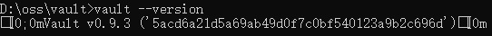

# **2 私密信息管理利器 HashiCorp Vault——启动和读写**

* [Install Vault](https://developer.hashicorp.com/vault/downloads)
* [Vault tutorials](https://developer.hashicorp.com/vault/tutorials)
* [Vault Documentation](https://developer.hashicorp.com/vault/docs)
* [Install Vault](https://developer.hashicorp.com/vault/downloads)
* [Vault Github](https://github.com/hashicorp/vault)

Vault 打包为单个可执行文件，因此运行非常简单，只需要下载并解压即可。你可以从上面的下载地址找到各个平台的下载文件包。

## Windows 平台的特别说明

Vault 也提供了 Windows 平台的版本（X86/X64），但客户端并未特别去兼容 Windows 控制台。因此，如果你在 Windows 下运行 vault 的话，可能会看到这样怪模怪样的输出：



有经验的朋友会明白，这些看似乱码的东西实际上是控制字符，但 Windows 控制台并不能处理它们。因此，Windows 用户要么使用其他控制台程序，比如 ConEmu/Cmder 等（请自行尝试）；要么在 Linux/Mac 平台运行，避免这个辣眼睛的显示效果。

由于上述原因，后续如无特别说明的话，所有命令统一在 Linux 平台上运行

## 运行 Vault

解压文件完毕后，你可以从命令行运行:

```
$ vault --version
Vault v0.9.3 ('5acd6a21d5a69ab49d0f7c0bf540123a9b2c696d')
```

为了方便以后使用，也可以考虑把 vault 路径添加到 PATH 环境变量中。

不带参数运行 vault 会列出客户端支持的各种命令：

```
$ vault
Usage: vault <command> [args]

Common commands:
    read        Read data and retrieves secrets
    write       Write data, configuration, and secrets
    ...
```

Vault 也提供了自动完成功能（目前支持Bash/Zsh）：

```
$ vault -autocomplete-install
```
和多数常规 Linux 命令的规范不同，Vault 命令行的复杂参数是单-开头的，不是--。Shell 重度用户需要适应一下。

## 启动 Vault 服务

Vault 是服务器-客户端的架构，但所有功能都包含在单一的可执行文件中。

为了运行 Vault，我们需要并排开两个终端窗口：**一个运行 服务器，一个运行客户端**。

为了方便本地开发与测试，Vault 服务器提供了开发模式。开发模式下不需要额外的配置，所有数据保存在内存中，从命令行可以直接访问。当然，相应的结果是开发模式下的安全性很差，可以不受限制的访问几乎任何数据，**所以开发模式仅供学习和本地测试使用，生产环境中绝对不要使用**。

使用如下命令，用开发模式启动服务器：

```
$ vault server -dev
==> Vault server configuration:

                     Cgo: disabled
         Cluster Address: https://127.0.0.1:8201
              Listener 1: tcp (addr: "127.0.0.1:8200", cluster address: "127.0.0.1:8201", tls: "disabled")
               Log Level: info
                   Mlock: supported: true, enabled: false
        Redirect Address: http://127.0.0.1:8200
                 Storage: inmem
                 Version: Vault v0.9.3
             Version Sha: 5acd6a21d5a69ab49d0f7c0bf540123a9b2c696d

WARNING! dev mode is enabled! In this mode, Vault runs entirely in-memory
and starts unsealed with a single unseal key. The root token is already
authenticated to the CLI, so you can immediately begin using Vault.

You may need to set the following environment variable:

    $ export VAULT_ADDR='http://127.0.0.1:8200'

The unseal key and root token are displayed below in case you want to
seal/unseal the Vault or re-authenticate.

Unseal Key: ***
Root Token: ***

Development mode should NOT be used in production installations!

==> Vault server started! Log data will stream in below:

2018/02/08 11:36:57.917623 [INFO ] core: security barrier not initialized
...
```

你可以看到服务器输出了相当多的内容。其中，我们重点关注下列信息：

* 服务器侦听地址为 `127.0.0.1:8200` （还有一个端口 8201 用于集群使用，目前我们不关注）；
* **数据存储使用内存引擎（inmem）**。这意味着开发模式下所有数据在关闭服务器后都不会保留；
* 命令行客户端访问服务器，需要首先设置环境变量（`VAULT_ADDR`）；
* <mark>Unseal Key 在生产模式下很重要，但是开发环境下暂时用不到</mark>；

Root Token 值得重点说明一下。

Vault 提供多种验证/授权客户端的机制，其中 Token 是默认的验证手段。无论开发还是生产环境，服务器启动时都会生成一个 `Root Token`，该 Token 相当于 Linux 系统中的 `root use`r，具有最高的访问权限。

使用 `Root Token` 登录系统的用户可以生成另外的 Token，并且为这些 Token 设置特定的访问权限。

这就是 Vault 的认证/授权机制。在开发模式下，用户默认是使用 `Root Token` 登录的，当然也可以在分配新的 Token 之后，使用新 Token 重新登录。

现在，你应该把 Root Token 记录在方便访问的地方，因为日志多了以后，再回头找这个信息就困难了。

```
$ export VAULT_ADDR='http://127.0.0.1:8200'
$ vault status
Key             Value
---             -----
Seal Type       shamir
Sealed          false
Total Shares    1
Threshold       1
Version         0.9.3
Cluster Name    vault-cluster-d71c802b
Cluster ID      36560e34-acd4-141d-c299-9a6d4ba0091b
HA Enabled      false
```
看到上面的信息，说明服务器运行正常。有两点值得一提：

* `Sealed=false`，**说明数据存储没有密封，可以读写（生产模式下需要特定的初始化之后才能解封）**；
* `HA Enabled=false`，**因为开发模式的存储引擎（内存）不支持集群**。

## 读写数据

服务器和客户端均已就位，接下来我们可以往里面读写数据了：

```
$ vault write secret/hello value=world
Success! Data written to: secret/hello
$ vault write secret/hello excited=yes name=user
Success! Data written to: secret/hello
$ vault read secret/hello
Key                 Value
---                 -----
refresh_interval    768h
excited             yes
name                user
```

读写数据使用 read/write 命令。参数 secret/hello这是一个路径（Path）。

Vault 中用 Path 区分不同数据的存放位置。一个 Path 下可以包含多个键值对，**<mark>但需要注意的是 write 命令是覆盖式的而不是追加式的，所以第一条命令写入的值会被后来的所覆盖，因此你必须确保在同一个命令中一次性写入所有的内容</mark>**。

read 命令读出了刚才写入的内容，另外还有一条额外的信息 `refresh_internal`。

这是由系统赋予的一个特殊值，表示该数据的有效时间（768小时=32天），到期后该数据将被清除。我们还可以将数据输出为 Json 格式，以便观察更详细的信息，同时也方便支持 Json 格式的库读取：

```
$ vault read -format=json secret/hello
{
  "request_id": "0893c6ee-e38c-82da-9d75-373c43d4ec98",
  "lease_id": "",
  "lease_duration": 2764800,
  "renewable": false,
  "data": {
    "excited": "yes",
    "name": "user"
  },
  "warnings": null
}
```
我们设置的值在 Json 数据的 data 节点下。还可以看到，刚才输出的 `refresh_interval` 实际上是该数据租期（Lease）的一种表达形式。

租期是 Vault 用来表示私密数据有效期的一个概念。租期的内部时间（`lease_duration`）是用秒来记录的，你可以自己换算一下。由于该数据是不可更新（`Renewable`）的，因此 `lease_id` 为空。后面我们还会讲到如何管理 Lease。

如果我们不再需要该数据，可以用 delete 命令删除它：

```
$ vault delete secret/hello
Success! Data deleted (if it existed) at: secret/hello

$ vault read secret/hello
No value found at secret/hello
```

在上述例子中，我们使用了 secret/hello 路径，这个路径并不是随意指定的。默认情况下，你只能把私密数据保存在以 secret/ 为前缀的路径下，否则会出现下面的错误信息：

```
$ vault write foo/bar a=b
Error writing data to foo/bar: Error making API request.

URL: PUT http://127.0.0.1:8200/v1/foo/bar
Code: 404. Errors:

* no handler for route 'foo/bar'
```

从出错信息可以发现，Vault 服务器/客户端之间实际上是 RESTful 形式的 HTTP 通信。

