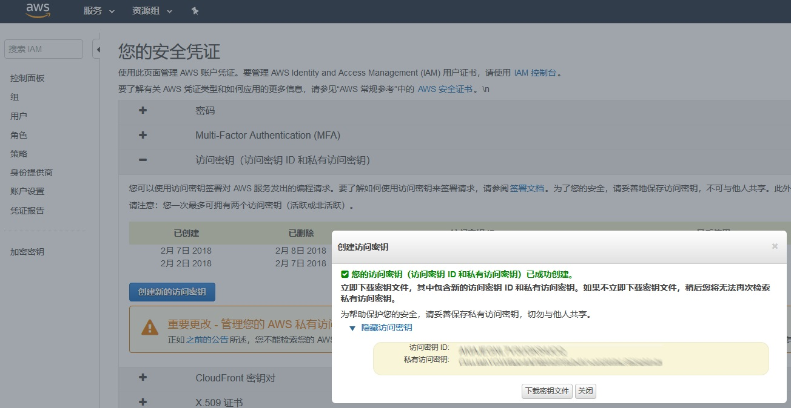
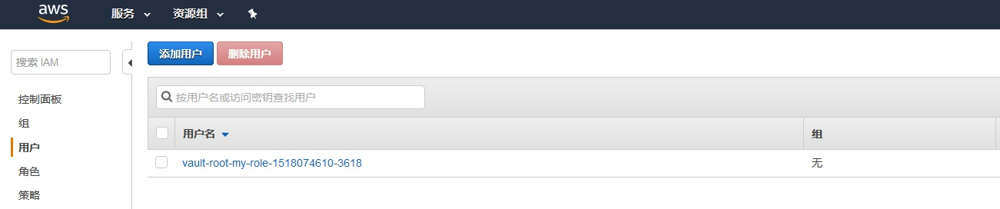

# **3 私密信息管理利器 HashiCorp Vault-Secret Engine **

在介绍部分我们说过，Vault 是一个灵活的、可插拔的架构。

Secret Engine 就是可插拔性的体现之一。**<mark>它允许在保持 Vault 核心稳定的前提下，支持多种不同的加密渠道，每种渠道有各自的优点和适用范围，同时能够通过统一的接口进行管理</mark>**。

现在我们就来检查一下服务器配置了哪些 engine：

```
$ vault secrets list
Path          Type         Description
----          ----         -----------
cubbyhole/    cubbyhole    per-token private secret storage
identity/     identity     identity store
secret/       kv           key/value secret storage
sys/          system       system endpoints used for control, policy and debugging
```
从输出可以清楚地看到：

* 有一个类型为 kv 的引擎，加载到了 secret/ 路径上，其描述为“键值对加密存储”。这样，谜底就揭开了：我们之所以能够向指定的路径进行读写，是因为有 `Secret engine` 的支持，没有加载的路径是不能访问的。（其他几个 engine 是 Vault 内部用于支撑其他用途的，这里我们不讨论）`Secret Engine` 也可以由管理员进行灵活的配置。


kv 是其中最简单的引擎，也是开发模式下默认加载的，它允许在我们内存中以键值对的形式保存私密数据。

接下来我们就尝试一下如何配置 Secret engine。仍然以 kv 为例，我们用 enable 命令，将 kv 加载到另外一个位置

```
$ vault secrets enable -path=kv kv
Success! Enabled the kv secrets engine at: kv/

$ vault secrets list
Path          Type         Description
----          ----         -----------
cubbyhole/    cubbyhole    per-token private secret storage
identity/     identity     identity store
kv/           kv           n/a
secret/       kv           key/value secret storage
sys/          system       system endpoints used for control, policy and debugging
```

我们看到，同一个引擎可以被加载到不同的路径下（<mark>你可以想象为同一个 Engine 类的多个实例</mark>）。

**虽然是相同的引擎，但每个路径下的数据都是彼此独立的，它们之间不会互相干扰**。我们也可以验证这一点：

```
$ vault write kv/hello target=world
Success! Data written to: kv/hello

$ vault read kv/hello
Key                 Value
---                 -----
refresh_interval    768h
target              world

$ vault read secret/hello
No value found at secret/hello
```

当某个引擎不再需要以后，我们也可以将其禁用：

```
$ vault secrets disable kv
Success! Disabled the secrets engine (if it existed) at: kv/

$ vault secrets list
Path          Type         Description
----          ----         -----------
cubbyhole/    cubbyhole    per-token private secret storage
identity/     identity     identity store
secret/       kv           key/value secret storage
sys/          system       system endpoints used for control, policy and debugging
```

## 有哪些引擎可用？

上面的例子使用 kv 作为加密引擎。这是一个简单的键值对存储，好处是使用和配置极其简单，但未必符合项目的具体要求。那么，我们还有哪些引擎可以使用呢？

目前，Vault 支持下列引擎：

* AWS
* Consul
* Cubbyhole
* Database（多种）
* Identity
* Key/Value
* Nomad
* PKI
* RabbitMQ
* SSH
* TOTP
* Transit

其中，Database 按数据库类型又分为多种子类型，MySQL/Postgres/Oracle/MSSQL/MongoDB 等主流数据库都包含在内了。如果还不能满足要求的话，你甚至可以按照 Vault [插件规范](https://www.vaultproject.io/docs/internals/plugins.html) 自己手撸一个。

## AWS 加密引擎
使用该引擎之前，需要进行一定的配置工作，才能访问 AWS 接口。这里的例子只使用最基本的 AWS 安全策略，不会产生任何费用，请安心使用。

首先，我们在 Vault 中启用 aws 引擎：

```
$ vault secrets enable -path=aws aws
Success! Enabled the aws secrets engine at: aws/
```

启用引擎时，如果没有指定 `-path` 参数，那么加载的路径将会使用引擎自身的名字（aws），因此上述命令可以简写为 `vault secrets enable aws`。当然，如果你需要加载到非默认位置，那么还是需要 `-path` 参数

接下来，我们需要去 AWS 的后台创建一个安全凭证（**我的安全凭证 -> 访问密钥**）。

如果你已经生成过凭证的话，那么也可以使用从前的。但请记住， AWS 的凭证只有创建时才能看到访问密钥和私有密钥，以后就再没有机会了，所以请务必找个安全的地方把这些值记录下来。 

当然，如果真的忘了具体值的话，也不是什么大问题，重新再生成一个就是了。



凭证创建后，我们用如下命令配置 AWS 引擎，启用访问账号：

```
$ vault write aws/config/root access_key=[ACCESS KEY] secret_key=[SECRET_KEY]
Success! Data written to: aws/config/root
```

请将上一步记录下来的访问密钥/私有密钥填写到相应的参数位置。

我们是如何知道配置要写入 aws/config/root 呢？后面我们会回头来讲这个问题。

配置访问账号是完成了验证（Authentication）的步骤，但我们还需要授权（Authorization），以控制该用户的访问权限。

由于 AWS 格式的策略数据比较复杂，所以对于对 AWS IAM 不太熟悉的用户，我们建议你直接将下面的内容粘贴到命令行窗口运行：

```
$ vault write aws/roles/my-role policy=-<<EOF
{
  "Version": "2012-10-17",
  "Statement": [
    {
      "Sid": "Stmt1426528957000",
      "Effect": "Allow",
      "Action": [
        "ec2:*"
      ],
      "Resource": [
        "*"
      ]
    }
  ]
}
EOF
Success! Data written to: aws/roles/my-role
```
我们配置了一个名为 my-role 的策略。现在，我们可以要求引擎为我们生成访问凭据，该凭据可以通过 read 命令读取：

```
$ vault read aws/creds/my-role
Key                Value
---                -----
lease_id           aws/creds/my-role/9397859b-62a0-da5e-ad19-d1ee83a4810c
lease_duration     768h
lease_renewable    true
access_key         ***
secret_key         ***
security_token     <nil>
```

你会注意到执行这个命令需要一点时间。这是因为在幕后，AWS 引擎实际上调用了 AWS API 接口来创建凭据。还记得前面的策略文件指定了操作权限为 “ec2:*” 吗？

这意味着使用这里生成的 `access_key/secret_key`，我们可以无限制地访问 AWS EC2 的所有功能。当然，这个权限是非常大的，我们会在后续的步骤把这个测试凭证删掉，以访被恶意使用。

如果你现在到 AWS 的 IAM 控制台去看一下，就能找到 Vault 为我们生成的凭证：



现在，回头看看 Vault 为我们生成的凭据内容。你会发现该凭据有一个有效的租期（`lease_id`），请记住这个 `lease_id`，以后无论读取、更新、续期或删除凭据，都要通过 `lease_id` 来访问。当然，`lease_duration` 告诉我们这个凭据在 768小时 （32天）之后就会过期。

如果我们不再需要此凭据，也可以通过 lease 子命令将其删除：

```
vault lease revoke aws/creds/my-role/9397859b-62a0-da5e-ad19-d1ee83a4810c
Success! Revoked lease: aws/creds/my-role/9397859b-62a0-da5e-ad19-d1ee83a4810c
```
这个命令也需要一些时间来执行，因为它同时也会删除 AWS 后台的凭据。完成后再检查一下 AWS IAM 控制台，你会发现原来的凭据现在已经消失了。

## 帮助系统

在上面的步骤中，我们对 AWS 引擎进行了配置，但并未说明引擎的配置格式是什么样的。比如，你怎么知道 AWS 引擎的配置路径是 aws/config/root？

一个显然易见的回答是看文档。但除此之外，我们还有一个办法，那就是内置的帮助系统。

可以理解的是，每种引擎的配置格式都是不同的，例如 RDBMS 数据库和 AWS 显示需要完全不同的配置。

Vault 的设计者明白这一点，并且为了辅助我们配置不同的引擎，减少记忆负担，为每种内置的引擎都提供了帮助信息。显示帮助信息的命令叫做 path-help。

可能有点不好理解的地方在于，为什么这个命令叫做 path-help， 而不是 secret-help 或者 engine-help？官方文档并没有明确的说明。

<mark>我的理解是，出于性能上的考虑，Vault 并不会在启动时创建所有的引擎，而是在把引擎加载到路径上的时候，才会按照需要生成必要的引擎实例</mark>。

如果某个引擎没有加载到特定的路径上，那么 Vault 不会将其实例化，自然也无法读取它的帮助信息。

**因此，读取的帮助信息总是按照路径（Path）而非引擎来指定的，所以叫做 path-help**。（这当然是我自己的理解，有不对的地方欢迎批评指正。）

理论说的够多了，我们还是来看一下具体的帮助内容。

```
$ vault path-help aws
## DESCRIPTION

The AWS backend dynamically generates AWS access keys for a set of
IAM policies. The AWS access keys have a configurable lease set and
are automatically revoked at the end of the lease.

After mounting this backend, credentials to generate IAM keys must
be configured with the "root" path and policies must be written using
the "roles/" endpoints before any access keys can be generated.

## PATHS

The following paths are supported by this backend. To view help for
any of the paths below, use the help command with any route matching
the path pattern. Note that depending on the policy of your auth token,
you may or may not be able to access certain paths.

    ^config/lease$
        Configure the default lease information for generated credentials.

    ^config/root$
        Configure the root credentials that are used to manage IAM.

    ^creds/(?P<name>\w(([\w-.]+)?\w)?)$
        Generate an access key pair for a specific role.

    ^roles/(?P<name>\w(([\w-.]+)?\w)?)$
        Read, write and reference IAM policies that access keys can be made for.

    ^roles/?$
        List the existing roles in this backend

    ^sts/(?P<name>\w(([\w-.]+)?\w)?)$
        Generate an access key pair + security token for a specific role.
```

帮助内容中最需要注意的是以正则表达式形式指定的各种路径，同时也包含这些路径的含义。对于特定的路径，我们还可以进一步查看其详细的内容信息：

```
$ vault path-help aws/config/root
Request:        config/root
Matching Route: ^config/root$

Configure the root credentials that are used to manage IAM.

## PARAMETERS

    access_key (string)
        Access key with permission to create new keys.

    iam_endpoint (string)
        Endpoint to custom IAM server URL

    region (string)
        Region for API calls.

    secret_key (string)
        Secret key with permission to create new keys.

    sts_endpoint (string)
        Endpoint to custom STS server URL

## DESCRIPTION

Before doing anything, the AWS backend needs credentials that are able
to manage IAM policies, users, access keys, etc. This endpoint is used
to configure those credentials. They don't necessarilly need to be root
keys as long as they have permission to manage IAM.
```

path-help 允许我们检查每个 Path 下所需要的各种参数及其具体含义，这对于我们配置引擎来说是非常有用的信息。我们再看看内置的 kv 引擎的帮助信息：

```
$ vault path-help secret
## DESCRIPTION

The kv backend reads and writes arbitrary secrets to the backend.
The secrets are encrypted/decrypted by Vault: they are never stored
unencrypted in the backend and the backend never has an opportunity to
see the unencrypted value.

TTLs can be set on a per-secret basis. These TTLs will be sent down
when that secret is read, and it is assumed that some outside process will
revoke and/or replace the secret at that path.

## PATHS

The following paths are supported by this backend. To view help for
any of the paths below, use the help command with any route matching
the path pattern. Note that depending on the policy of your auth token,
you may or may not be able to access certain paths.

    ^.*$
        Pass-through secret storage to the storage backend, allowing you to
        read/write arbitrary data into secret storage.
```

KV 引擎非常简单——它不需要任何配置参数，并且可以写入任意路径下的任意参数值。

不过回想一下，对引擎的操作实际上是通过 RESTful 接口进行的，而对特定路径的读写最终会映射到类似这样的 URL：http://127.0.0.1:8200/v1/foo/bar。

考虑到 URL 编码可能引起的潜在问题，我还是建议你不要在路径和参数名中使用任何特殊字符、空白或者中文

