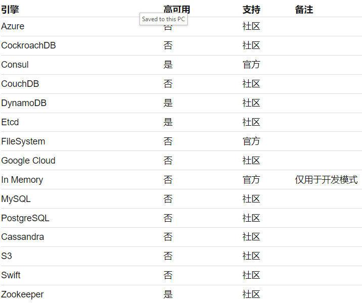

# **5 私密信息管理利器 HashiCorp Vault——部署**

## 1 存储引擎

在部署之前首先要考虑的一个问题是，我们要如何保存 Vault 的数据。

回忆一下，在开发模式下，服务器输出的信息中有这么一条：

```
Storage: inmem
```

这意味着开发模式下，所有信息保存在内存中，服务器关闭数据即消失，这对于生产环境显然是不可接受的。

而 Vault 的灵活性在这里又一次得到体现，inmem 是系统支持的存储引擎之一，其他引擎还包括



## 2 服务器配置

存储引擎已经决定了，现在我们要创建一个服务器配置文件，服务器将根据该配置决定如何启动。和授权策略（Policy）类似，服务器配置也是使用 HCL 语言编写的，目前我们保持简单，只生成必要的信息：存储引擎和侦听地址。

```
storage "file" {
    path = "/var/opt/vault"
}

listener "tcp" {
    address = "127.0.0.1:8200"
    tls_disable = 1
}
```
当然，你需要保证对 path 指定的路径有足够的读写权限。如果担心文件有问题的话，可以运行 `vault policy fmt server.hcl` 检查一下。

网络配置中的 `tls_disable` 指定不使用 TLS，这时数据传输是明文的，安全性不够高。如果需要使用 TLS 以加强安全性的话，那么还需要在这里配置证书，详细的内容请参考 [tcp 配置](https://developer.hashicorp.com/vault/docs/configuration/listener/tcp)。

## 3 启动服务

现在，我们根据上面创建的配置文件启动服务：

```
# vault server -config=server.hcl
==> Vault server configuration:

                     Cgo: disabled
              Listener 1: tcp (addr: "127.0.0.1:8200", cluster address: "127.0.0.1:8201", tls: "disabled")
               Log Level: info
                   Mlock: supported: true, enabled: true
                 Storage: file
                 Version: Vault v0.9.3
             Version Sha: 5acd6a21d5a69ab49d0f7c0bf540123a9b2c696d

==> Vault server started! Log data will stream in below:
```

说明：在某些系统上启动服务器可能会遇到无法使用 mlock 的提示。如果遇到此问题的话，请按如下步骤解决： 

* 如果仅仅是 warning，服务器仍然可以继续运行的话，那么可以忽略这个提示； 
* 如果你是以普通用户运行服务器的话，那么最好是换用 root 身份启动服务； 
* 要是上述方法都不行的话，那么请按照 [这里的配置](https://www.vaultproject.io/docs/configuration/index.html) 禁用 mlock。

现在，服务器已经启动成功，但并没有 Root Token 可用。如果候马上去尝试读写数据的话，会发现这样的错误：

```
vault write secret/hello name=world
Error writing data to secret/hello: Error making API request.
URL: PUT http://127.0.0.1:8200/v1/secret/hello
Code: 503. Errors:
* Vault is sealed
```
错误信息提示我们 Vault 被密封（Sealed）了，这是什么意思呢？

## 解封 Vault

Vault 对于数据保护是非常重视的。

<mark>这体现在服务器启动后，并不能马上访问其数据，而必须经过一个解封（Unseal）的动作</mark>。

为了保证不是任何人都可以解封服务器，Vault 又规定：**对于全新启动的服务，必须经过一个初始化的过程（Initialize），初始化过程中会生成 Unseal Key, 以后必须使用 Unseal Key 来解封服务器**。

为了进一步加强安全性，Vault 甚至还规定，**默认情况下需要至少 3 个 Unseal Key 才能解封服务器**。这有点像民主投票的意思了：如果某个用户是恶意的，那么单凭他自己无法访问服务器，还必须经过其他 2 个人的同意，服务器才能开启。

这个过程的确是设计得相当安全，不过相应的服务器的初始化过程也比较复杂。我们来一步一步完成这个操作。

首先我们需要执行 operator 命令来进行初始化。注意初始化只能对新的服务器执行一次，当服务器上已经有数据以后，就不允许再执行这个动作了。

```
$ vault operator init
Unseal Key 1: /bEBj01yMkDZgYtwzWczC+m8tclpl/7TPoxPBAz5FToE
Unseal Key 2: VDEb4gFwllgSMEOKWx1DZwut9atdY3PyLzM/YCK2Cbo6
Unseal Key 3: WAd8skYyTp8+Iybq/Mp8WDrKb0QhK/xvqcl7u4Rha32e
Unseal Key 4: OZI2i0v1yhf7hF8j1p/AUui0oTQ7cQjDLKF6QnE9cs0U
Unseal Key 5: OoF3fyXH2lkcuu1Si2UQbXaGvZp0gr/cJkUnt6N2O9Yh

Initial Root Token: 444b8cb7-e58d-9e57-076a-fe0763f06248

Vault initialized with 5 key shares an a key threshold of 3. Please securely
distributed the key shares printed above. When the Vault is re-sealed,
restarted, or stopped, you must supply at least 3 of these keys to unseal it
before it can start servicing requests.

Vault does not store the generated master key. Without at least 3 key to
reconstruct the master key, Vault will remain permanently sealed!

It is possible to generate new unseal keys, provided you have a quorum of
existing unseal keys shares. See "vault rekey" for more information.
```

**<mark>强调：这里的信息非常重要！！ 初始化动作为我们生成了 5 个 Unseal key，此外还有默认的 Root Token。请务必马上把这些信息记录到安全的地方，因为以后你就没有机会再看到它们了</mark>**。

按照 Vault 的设计，理想情况下我们应该把 5 个 Key 分配给不同的人，需要超过一半的人以上同意，我们才能解封服务器（集齐7颗龙珠召唤神龙？）很多小企业未必有这么多人可以授权，那么我们把所有 Unseal Key 一起管理也是允许的，当然这样安全等级就没有那么高了。

接下来我们执行解封（Unseal）：

```
$ vault operator unseal
Unseal Key (will be hidden): 
Key                Value
---                -----
Seal Type          shamir
Sealed             true
Total Shares       5
Threshold          3
Unseal Progress    1/3
Unseal Nonce       a8dd07a3-2fd3-19b6-d61d-b7687ffbcdcd
Version            0.9.3
HA Enabled         true
HA Mode            sealed
```
请按照提示粘贴一个 Unseal key 进去。输出信息告诉我们，目前解封进度只执行了1/3，我们还需要另外 2 个 Key 才能完成解封。

继续上述操作，每次选择另一个 Unseal key（已使用的 Key 再次使用无效），3 次以后服务器将被解封：

```
$ vault operator unseal
Unseal Key (will be hidden): 
Key             Value
---             -----
Seal Type       shamir
Sealed          false
Total Shares    5
Threshold       3
Version         0.9.3
Cluster Name    vault-cluster-5e474aa3
Cluster ID      8430f6d7-8176-229f-c6be-5ac06107a427
HA Enabled      false
```

