# **7 密钥管理神器之 Vault 集群搭建**

## 7.1 一 背景

Vault 支持多服务器部署模式以实现高可用性。此模式通过运行多个 Vault 服务器来防止服务中断。使用支持高可用的数据存储时，会自动启用高可用模式。

用户可以通过启动服务器并查看输出数据存储信息之后是否紧跟着输出“(HA available)”来判断数据存储是否支持高可用性模式（“HA”）。如果是的话，则 Vault 将自动使用 HA 模式。

为了获得高可用性，其中某一个 Vault 服务器节点会在数据存储中成功获取锁。获取到锁的服务器节点将成为主节点；所有其他节点成为备用节点。

此时，如果备用节点收到请求，它们将根据集群的当前配置和状态对相关详细信息进行<mark>请求转发或客户端重定向</mark>，请参阅本文下方的部分。由于这种架构，HA 无法提高性能可扩展性。一般来说，Vault 性能的瓶颈在于数据存储本身，而不是 Vault 内核。

**例如：为了增加使用 Consul 作为存储的 Vault 集群的性能可扩展性，我们通常需要扩展 Consul 而不是 Vault。**

某些存储后端可以支持高可用性模式，这使它们可以同时存储 Vault 的信息以及 HA 锁信息。

但是，Vault 也支持分开存储 Vault 数据 和 HA 锁，这可以通过在具有不同后端的配置文件中指定 storage 和 `ha_storage` 节来完成。

**例如，可以将 Vault 集群设置为使用 Consul 作为 `ha_storage` 来管理锁，并使用 Amazon S3 作为所有其他持久数据的存储**。

以下部分更详细地解释了服务器通信模式和每种类型的请求处理。至少要满足重定向模式的

## 二 部署

### 2.1 本地部署

#### 2.1.1 编写vault配置文件

由于是本地测试，使用dev模式，配置存储data，注意data数据为存储vault重要数据，需要配置高可用存储。

```
# 创建配置文件
cat > cat config.hcl <<EOF
ui = true
disable_mlock = true

storage "raft" {
  path    = "./vault/data"
  node_id = "node1"
}

listener "tcp" {
  address     = "0.0.0.0:8200"
  tls_disable = "true"
}

api_addr = "http://127.0.0.1:8200"
cluster_addr = "https://127.0.0.1:8201"
EOF

# 创建data目录
mkdir -pv vault/data
```
### 2.1.2 启动服务

启动指定配置文件启动


```
$ vault server -config=config.hcl
==> Vault server configuration:

             Api Address: http://127.0.0.1:8200
                     Cgo: disabled
         Cluster Address: https://127.0.0.1:8201
              Go Version: go1.17.11
              Listener 1: tcp (addr: "0.0.0.0:8200", cluster address: "0.0.0.0:8201", max_request_duration: "1m30s", max_request_size: "33554432", tls: "disabled")
               Log Level: info
                   Mlock: supported: false, enabled: false
           Recovery Mode: false
                 Storage: raft (HA available)
                 Version: Vault v1.10.4
             Version Sha: 6a1dde56c18c4a1be2756b931ce3c872d8ca5a76

==> Vault server started! Log data will stream in below:

2022-08-29T18:31:18.164+0800 [INFO]  proxy environment: http_proxy="" https_proxy="" no_proxy=""
2022-08-29T18:31:18.308+0800 [INFO]  core: Initializing versionTimestamps for core
2022-08-29T18:32:16.650+0800 [INFO]  core: security barrier not initialized
2022-08-29T18:32:16.741+0800 [INFO]  storage.raft: creating Raft: config="&raft.Config{ProtocolVersion:3, HeartbeatTimeout:5000000000, ElectionTimeout:5000000000, CommitTimeout:50000000, MaxAppendEntries:64, BatchApplyCh:true, ShutdownOnRemove:true, TrailingLogs:0x2800, SnapshotInterval:120000000000, SnapshotThreshold:0x2000, LeaderLeaseTimeout:2500000000, LocalID:\"node1\", NotifyCh:(chan<- bool)(0xc0009be150), LogOutput:io.Writer(nil), LogLevel:\"DEBUG\", Logger:(*hclog.interceptLogger)(0xc0009e2060), NoSnapshotRestoreOnStart:true, skipStartup:false}"
2022-08-29T18:32:16.819+0800 [INFO]  storage.raft: initial configuration: index=1 servers="[{Suffrage:Voter ID:node1 Address:127.0.0.1:8201}]"
2022-08-29T18:32:16.820+0800 [INFO]  storage.raft: entering follower state: follower="Node at node1 [Follower]" leader-address= leader-id=
2022-08-29T18:32:24.532+0800 [WARN]  storage.raft: heartbeat timeout reached, starting election: last-leader-addr= last-leader-id=
2022-08-29T18:32:24.533+0800 [INFO]  storage.raft: entering candidate state: node="Node at node1 [Candidate]" term=2
2022-08-29T18:32:24.663+0800 [INFO]  storage.raft: election won: tally=1
2022-08-29T18:32:24.663+0800 [INFO]  storage.raft: entering leader state: leader="Node at node1 [Leader]"
2022-08-29T18:32:25.064+0800 [INFO]  core: security barrier initialized: stored=1 shares=5 threshold=3
2022-08-29T18:32:25.328+0800 [INFO]  core: post-unseal setup starting
2022-08-29T18:32:25.501+0800 [INFO]  core: loaded wrapping token key
2022-08-29T18:32:25.583+0800 [INFO]  core: Recorded vault version: vault version=1.10.4 upgrade time="2022-08-29 10:32:25.501019 +0000 UTC"
2022-08-29T18:32:25.584+0800 [INFO]  core: successfully setup plugin catalog: plugin-directory=""
2022-08-29T18:32:25.584+0800 [INFO]  core: no mounts; adding default mount table
2022-08-29T18:32:25.803+0800 [INFO]  core: successfully mounted backend: type=cubbyhole path=cubbyhole/
2022-08-29T18:32:25.810+0800 [INFO]  core: successfully mounted backend: type=system path=sys/
2022-08-29T18:32:25.814+0800 [INFO]  core: successfully mounted backend: type=identity path=identity/
2022-08-29T18:32:26.272+0800 [INFO]  core: successfully enabled credential backend: type=token path=token/ namespace="ID: root. Path: "
2022-08-29T18:32:26.364+0800 [INFO]  rollback: starting rollback manager
2022-08-29T18:32:26.367+0800 [INFO]  core: restoring leases
2022-08-29T18:32:26.372+0800 [INFO]  expiration: lease restore complete
2022-08-29T18:32:26.533+0800 [INFO]  identity: entities restored
2022-08-29T18:32:26.533+0800 [INFO]  identity: groups restored
2022-08-29T18:32:26.538+0800 [INFO]  core: usage gauge collection is disabled
2022-08-29T18:32:27.569+0800 [INFO]  core: post-unseal setup complete
2022-08-29T18:32:27.863+0800 [INFO]  core: root token generated
2022-08-29T18:32:27.986+0800 [INFO]  core: pre-seal teardown starting
2022-08-29T18:32:27.987+0800 [INFO]  core: stopping raft active node
2022-08-29T18:32:27.987+0800 [INFO]  rollback: stopping rollback manager
2022-08-29T18:32:27.987+0800 [INFO]  core: pre-seal teardown complete
2022-08-29T18:34:50.838+0800 [INFO]  core.cluster-listener.tcp: starting listener: listener_address=0.0.0.0:8201
2022-08-29T18:34:50.839+0800 [INFO]  core.cluster-listener: serving cluster requests: cluster_listen_address=[::]:8201
2022-08-29T18:34:50.840+0800 [INFO]  storage.raft: creating Raft: config="&raft.Config{ProtocolVersion:3, HeartbeatTimeout:15000000000, ElectionTimeout:15000000000, CommitTimeout:50000000, MaxAppendEntries:64, BatchApplyCh:true, ShutdownOnRemove:true, TrailingLogs:0x2800, SnapshotInterval:120000000000, SnapshotThreshold:0x2000, LeaderLeaseTimeout:2500000000, LocalID:\"node1\", NotifyCh:(chan<- bool)(0xc000e42850), LogOutput:io.Writer(nil), LogLevel:\"DEBUG\", Logger:(*hclog.interceptLogger)(0xc0009e2060), NoSnapshotRestoreOnStart:true, skipStartup:false}"
2022-08-29T18:34:50.885+0800 [INFO]  storage.raft: initial configuration: index=1 servers="[{Suffrage:Voter ID:node1 Address:127.0.0.1:8201}]"
2022-08-29T18:34:50.885+0800 [INFO]  storage.raft: entering follower state: follower="Node at 127.0.0.1:8201 [Follower]" leader-address= leader-id=
2022-08-29T18:34:50.885+0800 [WARN]  storage.raft: heartbeat timeout reached, starting election: last-leader-addr= last-leader-id=
2022-08-29T18:34:50.885+0800 [INFO]  storage.raft: entering candidate state: node="Node at 127.0.0.1:8201 [Candidate]" term=3
2022-08-29T18:34:50.886+0800 [INFO]  core: vault is unsealed
2022-08-29T18:34:50.886+0800 [INFO]  core: entering standby mode
2022-08-29T18:34:51.057+0800 [INFO]  storage.raft: election won: tally=1
2022-08-29T18:34:51.057+0800 [INFO]  storage.raft: entering leader state: leader="Node at 127.0.0.1:8201 [Leader]"
2022-08-29T18:34:51.205+0800 [INFO]  core: acquired lock, enabling active operation
2022-08-29T18:34:51.315+0800 [INFO]  core: post-unseal setup starting
2022-08-29T18:34:51.398+0800 [INFO]  core: loaded wrapping token key
2022-08-29T18:34:51.398+0800 [INFO]  core: successfully setup plugin catalog: plugin-directory=""
2022-08-29T18:34:51.400+0800 [INFO]  core: successfully mounted backend: type=system path=sys/
2022-08-29T18:34:51.401+0800 [INFO]  core: successfully mounted backend: type=identity path=identity/
2022-08-29T18:34:51.401+0800 [INFO]  core: successfully mounted backend: type=cubbyhole path=cubbyhole/
2022-08-29T18:34:51.402+0800 [INFO]  core: successfully enabled credential backend: type=token path=token/ namespace="ID: root. Path: "
2022-08-29T18:34:51.403+0800 [INFO]  rollback: starting rollback manager
2022-08-29T18:34:51.404+0800 [INFO]  core: restoring leases
2022-08-29T18:34:51.404+0800 [INFO]  identity: entities restored
2022-08-29T18:34:51.404+0800 [INFO]  identity: groups restored
2022-08-29T18:34:51.404+0800 [INFO]  core: starting raft active node
2022-08-29T18:34:51.405+0800 [INFO]  expiration: lease restore complete
2022-08-29T18:34:51.405+0800 [INFO]  storage.raft: starting autopilot: config="&{false 0 10s 24h0m0s 1000 0 10s}" reconcile_interval=0s
2022-08-29T18:34:51.410+0800 [INFO]  core: usage gauge collection is disabled
2022-08-29T18:34:51.490+0800 [INFO]  core: post-unseal setup complete
```

在其中可以看到服务监听地址，及`VAULT_ADDR` 环境变量，后续可以使用CLI进行登录。

### 2.1.3 operator init


以生产环境启动的vault是处于unsel状态，需要进行seal，进行operator init会生产五个Unseal key，记录其输入三个可以对vault进行解封，

```
$ export VAULT_ADDR='http://127.0.0.1:8200'

$ vault operator init
Unseal Key 1: YnypGKZR9wfTCORBRjT7dje5rX6OkXOn21XkOFYx2z5x
Unseal Key 2: IgQzIX6Y+J3Txr88zTfaG0VGSlsQLSR5+WKpAGHoys7T
Unseal Key 3: Uw/B2KGnazLCzfZLCNXldJHoKhZjk0v4F52gJ9YlXOuQ
Unseal Key 4: NcVwEDfLh/0mjpE/EzE/rdvVIkMPjzJRHkKE9Q11hlMq
Unseal Key 5: Mzf7grcLoakA7/Ue/z/fhIHFIWRG6hNjmjw03jf/0MZs

Initial Root Token: hvs.8ei4GOhxbwsdvCjfKFqoE3jg

Vault initialized with 5 key shares and a key threshold of 3. Please securely
distribute the key shares printed above. When the Vault is re-sealed,
restarted, or stopped, you must supply at least 3 of these keys to unseal it
before it can start servicing requests.

Vault does not store the generated root key. Without at least 3 keys to
reconstruct the root key, Vault will remain permanently sealed!

It is possible to generate new unseal keys, provided you have a quorum of
existing unseal keys shares. See "vault operator rekey" for more information.
```

### 2.1.4 Seal/Unseal


使用命令行

```
vault operator unseal
```

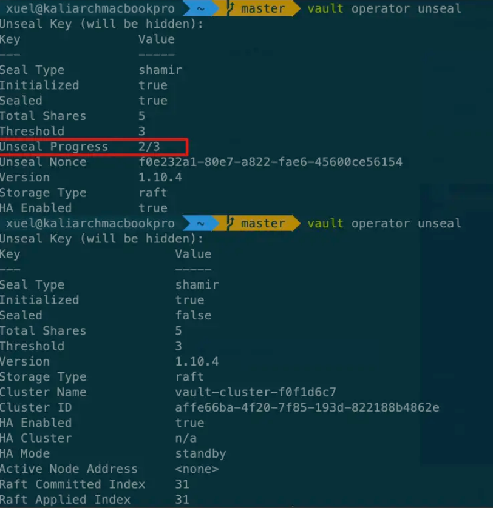

解封完成进行登录

```
$ vault login

```

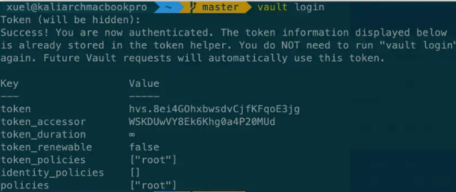

## 3 Kubernets 部署

在Kubernetes上安装和配置Vault的推荐方法是使用Vault helm chart。


除了运行Vault本身之外，Helm chart还是安装和配置Vault以与其他服务（如Consul for High Availability(HA)部署）集成的主要方法。

注意：请使用helm3安装

### 3.1 创建vault namespace


```
kubectl create namespace vault
```

### 3.2 配置HashiCorp helm repo

```
$ helm repo add hashicorp https://helm.releases.hashicorp.com

$ helm repo update

$ helm search repo hashicorp/vault
NAME           	CHART VERSION	APP VERSION	DESCRIPTION
hashicorp/vault	0.21.0       	1.11.2     	Official HashiCorp Vault Chart
```

### 3.3 配置Vault helm chart

```
# 查看版本
$ helm search repo hashicorp/vault --versions
NAME           	CHART VERSION	APP VERSION	DESCRIPTION
hashicorp/vault	0.21.0       	1.11.2     	Official HashiCorp Vault Chart
hashicorp/vault	0.20.1       	1.10.3     	Official HashiCorp Vault Chart
hashicorp/vault	0.20.0       	1.10.3     	Official HashiCorp Vault Chart
hashicorp/vault	0.19.0       	1.9.2      	Official HashiCorp Vault Chart
hashicorp/vault	0.18.0       	1.9.0      	Official HashiCorp Vault Chart
hashicorp/vault	0.17.1       	1.8.4      	Official HashiCorp Vault Chart
hashicorp/vault	0.17.0       	1.8.4      	Official HashiCorp Vault Chart
hashicorp/vault	0.16.1       	1.8.3      	Official HashiCorp Vault Chart
hashicorp/vault	0.16.0       	1.8.2      	Official HashiCorp Vault Chart
hashicorp/vault	0.15.0       	1.8.1      	Official HashiCorp Vault Chart
hashicorp/vault	0.14.0       	1.8.0      	Official HashiCorp Vault Chart
hashicorp/vault	0.13.0       	1.7.3      	Official HashiCorp Vault Chart
hashicorp/vault	0.12.0       	1.7.2      	Official HashiCorp Vault Chart
hashicorp/vault	0.11.0       	1.7.0      	Official HashiCorp Vault Chart
hashicorp/vault	0.10.0       	1.7.0      	Official HashiCorp Vault Chart
hashicorp/vault	0.9.1        	1.6.2      	Official HashiCorp Vault Chart
hashicorp/vault	0.9.0        	1.6.1      	Official HashiCorp Vault Chart
hashicorp/vault	0.8.0        	1.5.4      	Official HashiCorp Vault Chart
hashicorp/vault	0.7.0        	1.5.2      	Official HashiCorp Vault Chart
hashicorp/vault	0.6.0        	1.4.2      	Official HashiCorp Vault Chart
hashicorp/vault	0.5.0        	           	Install and configure Vault on Kubernetes.
hashicorp/vault	0.4.0        	           	Install and configure Vault on Kubernetes.

# 覆盖配置进行安装,如果想存储在本地使用helm fetch下载下来，然后进行修改vault进行安装,helm fetch hashicorp/vault --version=0.21.0
$ helm install vault hashicorp/vault \
    --namespace vault \
    --set "server.ha.enabled=true" \
    --set "server.ha.replicas=5" \
    --dry-run

# 或者编写补丁配置文件，进行覆盖
$ cat << EOF > ./override-values.yml
server:
  ha:
    enabled: true
    replicas: 5

EOF

# 利用补丁配置文件进行安装
$ helm install vault hashicorp/vault \
    --namespace vault \
    -f override-values.yml \
    --dry-run
```

* 生产环境HA模式

注意：`Vault Integrated Storage`实现了Raft存储协议，在HashiCorp Vault文档中通常称为`Raft`。如果使用HA模式与执政官存储后端，我们建议使用`helm chart`进行安装。

```
$ cat << EOF > ./override-values.yml

# Vault Helm Chart Value Overrides
global:
  enabled: true
  tlsDisable: false

injector:
  enabled: true
  # Use the Vault K8s Image https://github.com/hashicorp/vault-k8s/
  image:
    repository: "hashicorp/vault-k8s"
    tag: "latest"

  resources:
      requests:
        memory: 256Mi
        cpu: 250m
      limits:
        memory: 256Mi
        cpu: 250m

server:
  # Use the Enterprise Image
  image:
    repository: "hashicorp/vault-enterprise"
    tag: "1.5.0_ent"

  # These Resource Limits are in line with node requirements in the
  # Vault Reference Architecture for a Small Cluster
  resources:
    requests:
      memory: 8Gi
      cpu: 2000m
    limits:
      memory: 16Gi
      cpu: 2000m

  # For HA configuration and because we need to manually init the vault,
  # we need to define custom readiness/liveness Probe settings
  readinessProbe:
    enabled: true
    path: "/v1/sys/health?standbyok=true&sealedcode=204&uninitcode=204"
  livenessProbe:
    enabled: true
    path: "/v1/sys/health?standbyok=true"
    initialDelaySeconds: 60

  # extraEnvironmentVars is a list of extra environment variables to set with the stateful set. These could be
  # used to include variables required for auto-unseal.
  extraEnvironmentVars:
    VAULT_CACERT: /vault/userconfig/tls-ca/ca.crt

  # extraVolumes is a list of extra volumes to mount. These will be exposed
  # to Vault in the path `/vault/userconfig/<name>/`.
  extraVolumes:
    - type: secret
      name: tls-server
    - type: secret
      name: tls-ca
    - type: secret
      name: kms-creds

  # This configures the Vault Statefulset to create a PVC for audit logs.
  # See https://www.vaultproject.io/docs/audit/index.html to know more
  auditStorage:
    enabled: true

  standalone:
    enabled: false

  # Run Vault in "HA" mode.
  ha:
    enabled: true
    replicas: 5
    raft:
      enabled: true
      setNodeId: true

      config: |
        ui = true
        listener "tcp" {
          address = "[::]:8200"
          cluster_address = "[::]:8201"
          tls_cert_file = "/vault/userconfig/tls-server/fullchain.pem"
          tls_key_file = "/vault/userconfig/tls-server/server.key"
          tls_client_ca_file = "/vault/userconfig/tls-server/client-auth-ca.pem"
        }

        storage "raft" {
          path = "/vault/data"
            retry_join {
            leader_api_addr = "https://vault-0.vault-internal:8200"
            leader_ca_cert_file = "/vault/userconfig/tls-ca/ca.crt"
            leader_client_cert_file = "/vault/userconfig/tls-server/server.crt"
            leader_client_key_file = "/vault/userconfig/tls-server/server.key"
          }
          retry_join {
            leader_api_addr = "https://vault-1.vault-internal:8200"
            leader_ca_cert_file = "/vault/userconfig/tls-ca/ca.crt"
            leader_client_cert_file = "/vault/userconfig/tls-server/server.crt"
            leader_client_key_file = "/vault/userconfig/tls-server/server.key"
          }
          retry_join {
            leader_api_addr = "https://vault-2.vault-internal:8200"
            leader_ca_cert_file = "/vault/userconfig/tls-ca/ca.crt"
            leader_client_cert_file = "/vault/userconfig/tls-server/server.crt"
            leader_client_key_file = "/vault/userconfig/tls-server/server.key"
          }
          retry_join {
              leader_api_addr = "https://vault-3.vault-internal:8200"
              leader_ca_cert_file = "/vault/userconfig/tls-ca/ca.crt"
              leader_client_cert_file = "/vault/userconfig/tls-server/server.crt"
              leader_client_key_file = "/vault/userconfig/tls-server/server.key"
          }
          retry_join {
              leader_api_addr = "https://vault-4.vault-internal:8200"
              leader_ca_cert_file = "/vault/userconfig/tls-ca/ca.crt"
              leader_client_cert_file = "/vault/userconfig/tls-server/server.crt"
              leader_client_key_file = "/vault/userconfig/tls-server/server.key"
          }

          autopilot {
            cleanup_dead_servers = "true"
            last_contact_threshold = "200ms"
            last_contact_failure_threshold = "10m"
            max_trailing_logs = 250000
            min_quorum = 5
            server_stabilization_time = "10s"
          }

        }

        service_registration "kubernetes" {}

# Vault UI
ui:
  enabled: true
  serviceType: "LoadBalancer"
  serviceNodePort: null
  externalPort: 8200

  # For Added Security, edit the below
  #loadBalancerSourceRanges:
  #   - < Your IP RANGE Ex. 10.0.0.0/16 >
  #   - < YOUR SINGLE IP Ex. 1.78.23.3/32 >

EOF
```

### 3.4 安装vault

```
$ helm install vault --namespace vault -f override-values.yml vault/
```

### 3.5 初始化和解封vault

```
$ kubectl get pods --selector='app.kubernetes.io/name=vault' --namespace=' vault'

$ kubectl exec --stdin=true --tty=true vault-0 -- vault operator init
```

### 3.6 标准化安装

安装： 使用storageclass作为存储

```
$ kubectl create ns vault
$ helm repo add hashicorp https://helm.releases.hashicorp.com
$ cat > helm-vault-raft-values.yml <<EOF
server:
  affinity: ""
  ha:
    enabled: true
    raft: 
      enabled: true
EOF

$ helm install vault --namespace vault -f helm-vault-raft-values.yml vault/
```

**登录NFS服务查看数据**

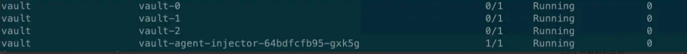

### 3.7 初始化

`operator init`命令生成一个根密钥，将其分解为密钥共享`-key-shares=`1，然后设置解封`vault-key-threshold=1`所需的密钥共享数。


这些密钥共享以JSON格式-format=JSON作为解封密钥写入输出。在这里，输出被重定向到一个名为`cluster-keys.json`的文件。


```
$ kubectl exec vault-0 -n vault -- vault operator init \
    -key-shares=1 \
    -key-threshold=1 \
    -format=json > cluster-keys.json
```

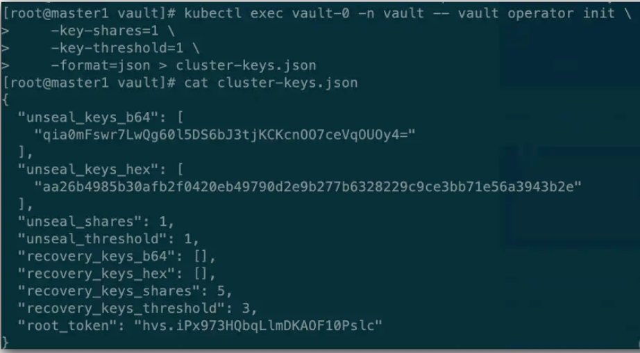

### 3.8 查看解封密钥

显示在`cluster-keys.json`中找到的解封密钥。

```
jq -r ".unseal_keys_b64[]" cluster-keys.json
qia0mFswr7LwQg60l5DS6bJ3tjKCKcnOO7ceVqOUOy4=
```

### 3.9 创建`VAULT_UNSEAL_KEY`

创建一个名为`VAULT_UNSEAL_KEY`的变量来存储解封密钥。

```
VAULT_UNSEAL_KEY=$(jq -r ".unseal_keys_b64[]" cluster-keys.json)
```

初始化后，Vault被配置为知道在何处以及如何访问存储，但不知道如何解密其中任何存储。解封是构建读取解密密钥以解密数据所需的根密钥的过程，允许访问存储库。

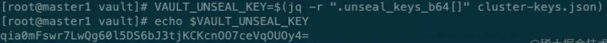

### 3.10 解封

解封在vault-0 pod上运行的Vault。


```
kubectl exec vault-0 -n vault -- vault operator unseal $VAULT_UNSEAL_KEY
```

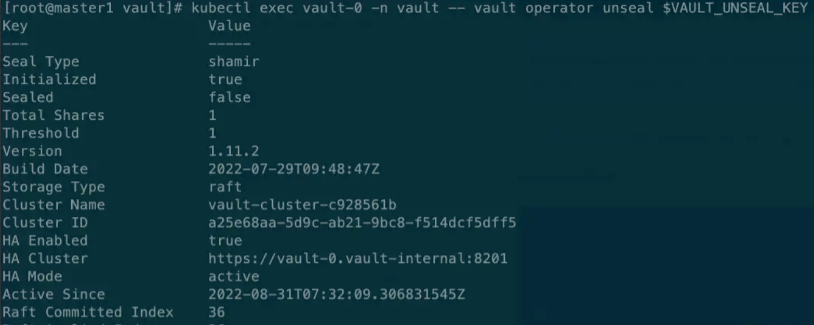

保险库服务器被初始化并解封。

### 3.11 加入raft集群

将vault-1pod 和 vault-2 pod 加入到Raft集群中，

```
kubectl exec -ti vault-1 -n vault -- vault operator raft join http://vault-0.vault-internal:8200

kubectl exec -ti vault-2 -n vault -- vault operator raft join http://vault-0.vault-internal:8200
```

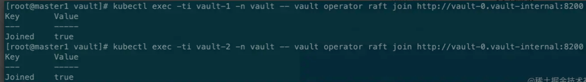

### 3.12 解封vault1/2

```
kubectl exec -ti vault-1 -n vault -- vault operator unseal $VAULT_UNSEAL_KEY

kubectl exec -ti vault-2 -n vault -- vault operator unseal $VAULT_UNSEAL_KEY
```

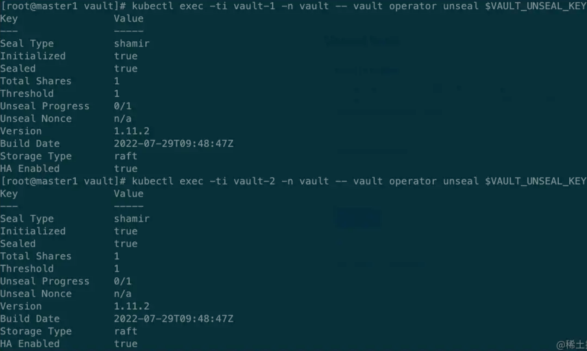


### 3.13 修改SVC 类型

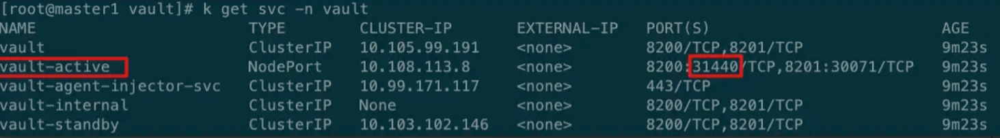

获取roottoken

```
jq -r ".root_token" cluster-keys.json
```

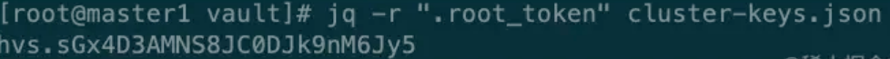

### 3.14 页面访问

使用token验证模式

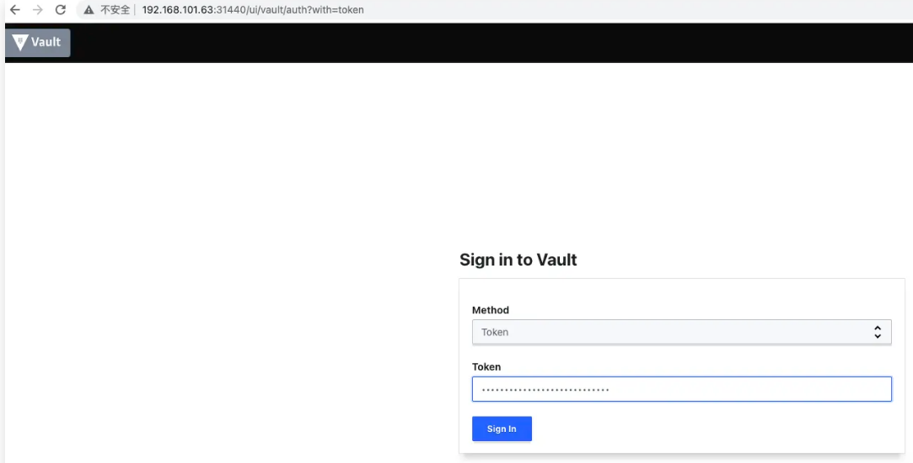

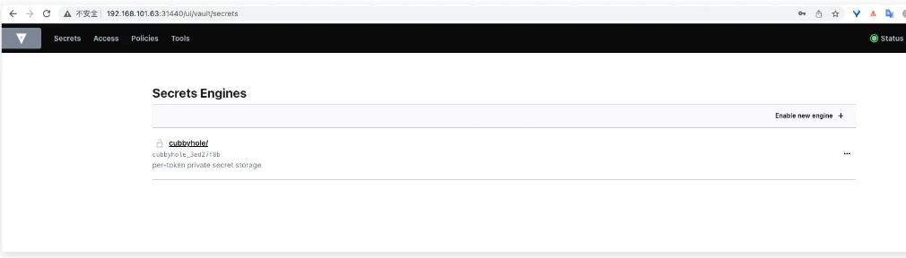

至此生产环境vault部署完成。

一般情况介于便捷性和高可用，采用第三种标准安装较为合适。

