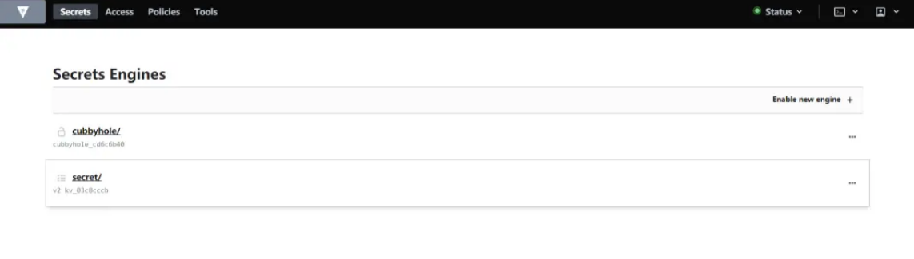
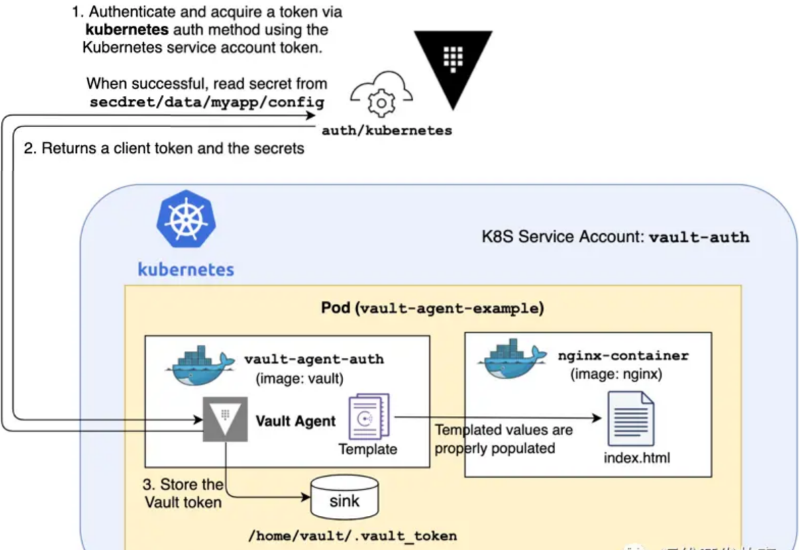

# **8 K8S与Vault集成，进行Secret管理**

Vault 是用于处理和加密整个基础架构秘钥的中心管理服务。Vault 通过 secret 引擎管理所有的秘钥，Vault 有一套 secret 引擎可以使用。

其主要有以下功能：

* **安全密钥存储**：任意的key/value Secret都可以存储到Vault中，Vault会对这些Secret进行加密并持久化存储。后端存储支持本地磁盘、cosul等；
* **动态密钥**：Vault可以动态生成Secret，在租约到期后会自动撤销它们；
* **数据加密**：Vault可以加密和解密数据，安全团队可以自定义加密参数；
* **租赁和续订**：Vault 中的所有机密都有与其关联的租约。在租约结束时，Vault 将自动撤销该机密。客户端可以通过内置续订 API 续订租约；
* **吊销**：Vault具有对秘密吊销的内置支持。Vault 可以撤销单个机密，还可以撤销一个机密树，例如由特定用户读取的所有机密或特定类型的所有机密。在发生入侵时，吊销有助于关键滚动和锁定系统；

## 安装

**在Linux主机上安装**

在Linux主机上安装比较简单，只需要下面三步：

```
# 安装包管理工具
$ sudo yum install -y yum-utils
# 添加源
$ sudo yum-config-manager --add-repo https://rpm.releases.hashicorp.com/RHEL/hashicorp.repo
# 安装vault
$ sudo yum -y install vault
```

**在K8S中安装**

```
# 添加repo仓库
$ helm repo add hashicorp https://helm.releases.hashicorp.com

# 更新本地仓库
$ helm repo update

# 安装vault
$ helm install vault hashicorp/vault
```

## 起服务端

这里已经在主机上安装了vault。

```
$ vault version
Vault v1.6.1 (6d2db3f033e02e70202bef9ec896360062b88b03)
```

然后以开发默认运行一个Vault服务端，正式环境不用开发模式。

```
$ vault server -dev -dev-listen-address=0.0.0.0:8200 &
......
WARNING! dev mode is enabled! In this mode, Vault runs entirely in-memory
and starts unsealed with a single unseal key. The root token is already
authenticated to the CLI, so you can immediately begin using Vault.

You may need to set the following environment variable:

    $ export VAULT_ADDR='http://0.0.0.0:8200'

The unseal key and root token are displayed below in case you want to
seal/unseal the Vault or re-authenticate.

Unseal Key: killR+cPfTR7P7HoYRt5SsMySMDv2w9WD7ljcxpXB+Q=
Root Token: s.pd4FBsC1pamE21nLv3fszdI1

Development mode should NOT be used in production installations
```

然后可以通过 `http://ip:8200/ui` 进行访问。

填入生成的Token，即可登录。



### 配置K8S与Vault通信

要使K8S能正常读取Vault中的Secret，则必须保证K8S和Vault能正常通信。

* 添加环境变量，其中IP地址根据实际情况填写

```
$ export VAULT_ADDR=http://192.168.0.153:8200
```

* 开启K8S认证方式

```
$ vault auth enable kubernetes
Success! Enabled kubernetes auth method at: kubernetes/
```
* 添加K8S集群配置信息

```
$ vault write auth/kubernetes/config \
    kubernetes_host=https://192.168.0.153:6443 \
    kubernetes_ca_cert=@/etc/kubernetes/pki/ca.crt
Success! Data written to: auth/kubernetes/config
```

* 创建权限策略

```
$ cat <<EOF | vault policy write vault-demo-policy -
> path "sys/mounts" { capabilities = ["read"] }
> path "secret/data/demo/*" { capabilities = ["read"] }
> path "secret/metadata/demo/*" { capabilities = ["list"] }
> EOF
Success! Uploaded policy: vault-demo-policy
```
创建一个用于演示的demo策略。

* 创建一个认证角色
    * `bound_service_account_names`
    * `bound_service_account_namespaces`
    * policies
    * ttl


```
$ vault write auth/kubernetes/role/vault-demo-role \
>     bound_service_account_names=vault-serviceaccount \
>     bound_service_account_namespaces=default \
>     policies=vault-demo-policy \
>     ttl=1h
Success! Data written to: auth/kubernetes/role/vault-demo-role
```

角色名是`vault-demo-role`，认证方式是RBAC认证，绑定的用户是`vault-serviceaccount`，策略是`vault-demo-policy`

* 创建密钥

```
$ vault kv put secret/demo/database username="coolops" password=123456
Key              Value
---              -----
created_time     2021-01-25T08:22:35.134166877Z
deletion_time    n/a
destroyed        false
version          1

# 查看
$ vault kv get secret/demo/database
====== Metadata ======
Key              Value
---              -----
created_time     2021-01-25T08:22:35.134166877Z
deletion_time    n/a
destroyed        false
version          1

====== Data ======
Key         Value
---         -----
password    123456
username    coolops
```

* 在K8S集群中创建RBAC权限

```
---
apiVersion: v1
kind: ServiceAccount
metadata:
  name: vault-serviceaccount

---
apiVersion: rbac.authorization.k8s.io/v1beta1
kind: ClusterRoleBinding
metadata:
  name: vault-clusterrolebinding
roleRef:
  apiGroup: rbac.authorization.k8s.io
  kind: ClusterRole
  name: system:auth-delegator
subjects:
  - kind: ServiceAccount
    name: vault-serviceaccount
    namespace: default

---
kind: Role
apiVersion: rbac.authorization.k8s.io/v1
metadata:
  name: vault-secretadmin-role
rules:
- apiGroups: [""]
  resources: ["secrets"]
  verbs: ["*"]

---
kind: RoleBinding
apiVersion: rbac.authorization.k8s.io/v1
metadata:
  name: vault-secretadmin-rolebinding
subjects:
- kind: ServiceAccount
  name: vault-serviceaccount
roleRef:
  kind: Role
  name: vault-secretadmin-role
  apiGroup: rbac.authorization.k8s.io
```

创建RBAC配置文件

```
$ kubectl apply -f rbac.yaml 
serviceaccount/vault-serviceaccount created
clusterrolebinding.rbac.authorization.k8s.io/vault-clusterrolebinding created
role.rbac.authorization.k8s.io/vault-secretadmin-role created
rolebinding.rbac.authorization.k8s.io/vault-secretadmin-rolebinding created
```

## 在K8S中使用Vault中的Secret

要获取到Vault中的Secret，有两种方式：

* 使用vault agent在initContainer中将secret取出来
* 使用vault SDK在程序中获取

### 使用initContainer方式

流程图如下：



创建ConfigMap

```
apiVersion: v1
data:
  vault-agent-config.hcl: |
    # Comment this out if running as sidecar instead of initContainer
    exit_after_auth = true

    pid_file = "/home/vault/pidfile"

    auto_auth {
        method "kubernetes" {
            mount_path = "auth/kubernetes"
            config = {
                role = "vault-demo-role"
            }
        }

        sink "file" {
            config = {
                path = "/home/vault/.vault-token"
            }
        }
    }

    template {
    destination = "/etc/secrets/index.html"
    contents = <<EOT
    <html>
    <body>
    <p>Some secrets:</p>
    {{- with secret "secret/demo/database" }}
    <ul>
    <li><pre>username: {{ .Data.data.username }}</pre></li>
    <li><pre>password: {{ .Data.data.password }}</pre></li>
    </ul>
    {{ end }}
    </body>
    </html>
    EOT
    }
kind: ConfigMap
metadata:
  name: example-vault-agent-config
  namespace: default
```

template允许将Vault里保存的Secret保存到文件。

* 创建pod

```
apiVersion: v1
kind: Pod
metadata:
  name: vault-agent-example
  namespace: default
spec:
  serviceAccountName: vault-serviceaccount 

  volumes:
  - configMap:
      items:
      - key: vault-agent-config.hcl
        path: vault-agent-config.hcl
      name: example-vault-agent-config
    name: config
  - emptyDir: {}
    name: shared-data

  initContainers:
  - args:
    - agent
    - -config=/etc/vault/vault-agent-config.hcl
    - -log-level=debug
    env:
    - name: VAULT_ADDR
      value: http://192.168.0.153:8200
    image: registry.cn-hangzhou.aliyuncs.com/rookieops/vault:1.6.1 
    name: vault-agent
    volumeMounts:
    - mountPath: /etc/vault
      name: config
    - mountPath: /etc/secrets
      name: shared-data

  containers:
  - image: nginx
    name: nginx-container
    ports:
    - containerPort: 80
    volumeMounts:
    - mountPath: /usr/share/nginx/html
      name: shared-data
```

待pod运行后，可以正常获取到vault里的Secret，如下：

```
apiVersion: v1
kind: Pod
metadata:
  name: vault-agent-example
  namespace: default
spec:
  serviceAccountName: vault-serviceaccount 

  volumes:
  - configMap:
      items:
      - key: vault-agent-config.hcl
        path: vault-agent-config.hcl
      name: example-vault-agent-config
    name: config
  - emptyDir: {}
    name: shared-data

  initContainers:
  - args:
    - agent
    - -config=/etc/vault/vault-agent-config.hcl
    - -log-level=debug
    env:
    - name: VAULT_ADDR
      value: http://192.168.0.153:8200
    image: registry.cn-hangzhou.aliyuncs.com/rookieops/vault:1.6.1 
    name: vault-agent
    volumeMounts:
    - mountPath: /etc/vault
      name: config
    - mountPath: /etc/secrets
      name: shared-data

  containers:
  - image: nginx
    name: nginx-container
    ports:
    - containerPort: 80
    volumeMounts:
    - mountPath: /usr/sha
```

> !! 注意serviceAccountName需和之前配置的保持一致

待pod运行后，可以正常获取到vault里的Secret，如下：

```
$ kubectl get po -o wide
NAME                                    READY   STATUS    RESTARTS   AGE    IP               NODE            NOMINATED NODE   READINESS GATES
nfs-client-prosioner-598d477ff6-fmgwf   1/1     Running   8          65d    172.16.7.140     ecs-968f-0005   <none>           <none>
traefik-5b8bb6787-dn96j                 1/1     Running   0          65d    172.16.7.138     ecs-968f-0005   <none>           <none>
vault-agent-example                     1/1     Running   0          106s   172.16.235.231   k8s-master      <none>           <none>

$ curl 172.16.235.231
<html>
<body>
<p>Some secrets:</p>
<ul>
<li><pre>username: coolops</pre></li>
<li><pre>password: 123456</pre></li>
</ul>

</body>
</html>
```

### 使用SDK方式

```
package main

import (
    "fmt"
    "io/ioutil"

    vaultApi "github.com/hashicorp/vault/api"
)

var (
    vaultHost           string
    vaultCAPath         string
    vaultServiceAccount string
    vaultJWTPath        string
)

func main() {
    // K8S的token
    vaultJWTPath = "/var/run/secrets/kubernetes.io/serviceaccount/token"
    // sa名字
    vaultServiceAccount = "vault-serviceaccount"

    tlsConfig := &vaultApi.TLSConfig{
        CACert:   vaultCAPath,
        Insecure: false,
    }

    config := vaultApi.DefaultConfig()
    // vault地址
    config.Address = fmt.Sprintf("https://%s", vaultHost)
    config.ConfigureTLS(tlsConfig)

    client, _ := vaultApi.NewClient(config)
    buf, _ := ioutil.ReadFile(vaultJWTPath)
    jwt := string(buf)

    options := map[string]interface{}{
        "jwt":  jwt,
        "role": vaultServiceAccount,
    }
    loginSecret, _ := client.Logical().Write("auth/kubernetes/login", options)
    client.SetToken(loginSecret.Auth.ClientToken)
    
    // secret地址
    secret, _ := client.Logical().Read("database/creds/tx")
    fmt.Println(secret)
}
```

* https://developer.hashicorp.com/vault/docs/agent/template
* https://developer.hashicorp.com/vault/tutorials/kubernetes/agent-kubernetes
* https://developer.hashicorp.com/vault/docs/agent