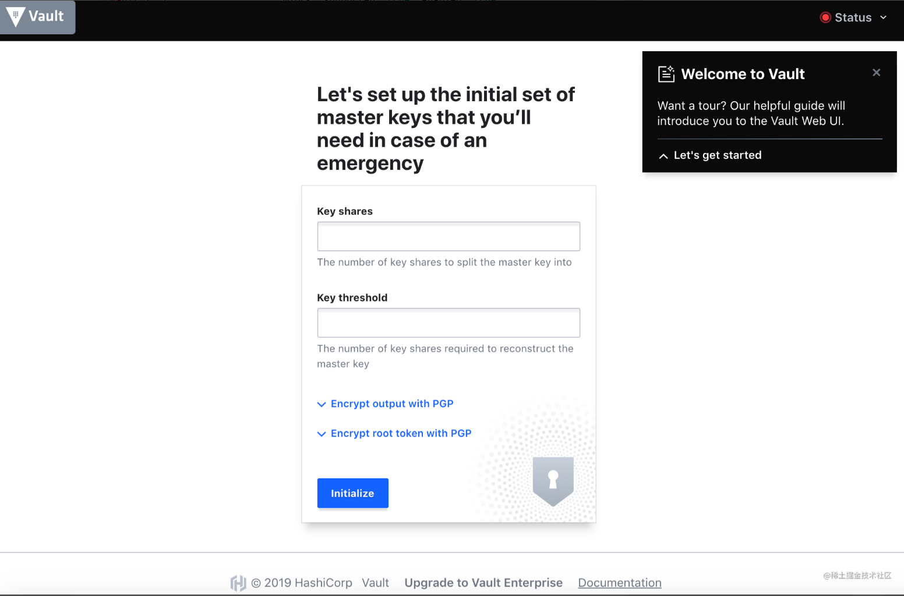
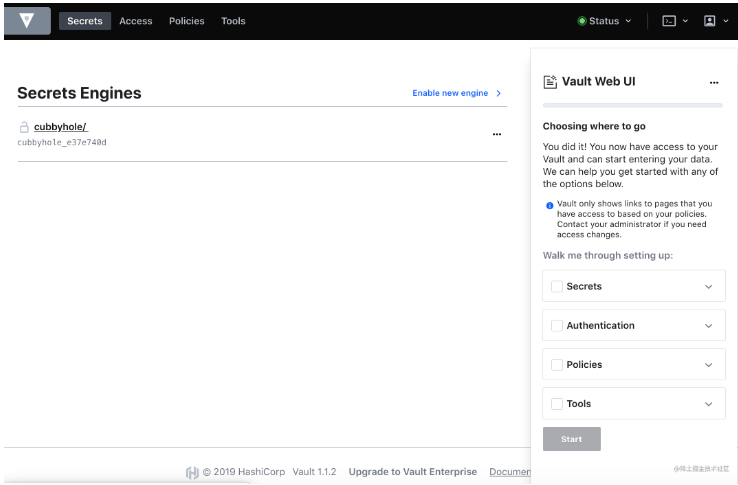
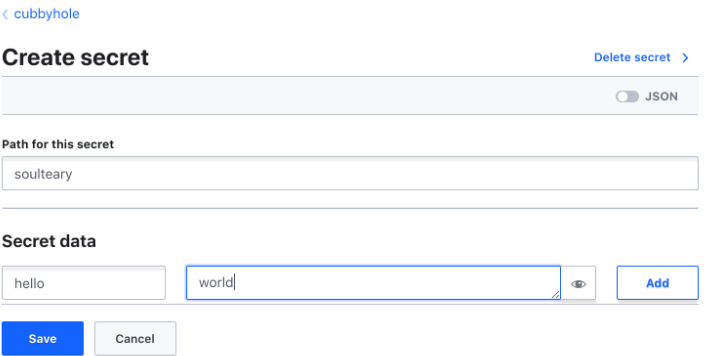

# **9 使用 Docker 和 Traefik 搭建 Vault**

## 编写 Vault 配置文件

在编写 compose 配置启动服务前，我们需要先编写 Vault 的配置。

创建一个名为 `config.json` 的文件

```
{
    "backend": {
        "file": {
            "path": "/vault/file"
        }
    },
    "listener": {
        "tcp": {
            "address": "0.0.0.0:8200",
            "tls_disable": 1
        }
    },
    "default_lease_ttl": "168h",
    "max_lease_ttl": "720h",
    "ui": true
}
```

上面这份配置文件中，我们定义了几个内容：

* 默认数据存储路径
    *  本例为了演示方便使用了文件储存，团队实际使用，建议使用 Etcd 或者数据库、云厂商储存池等方案
* 提供服务的端口地址，以及是否开启 SSL
    * 因为在容器中对外提供服务，需要绑定地址为 0.0.0.0
    * 不开启 SSL 是因为证书挂载这件事，我们交由 Traefik 来处理
* 接口数据的有效期
    * Vault 所有从接口获取的数据，需要身份认证
* 开启 Vault Web UI
    * 如果不使用 UI ，可以不进行配置

## 编写 Compose 配置文件

在合适的目录创建一个名为 docker-compose.yml 的文件，并输入以下内容：


```
version: '3'

services:

  vault:
    image: vault:1.1.2
    volumes:
      - ./config:/vault/config:rw
      - ./file:/vault/file:rw
      - ./logs:/vault/logs
    cap_add:
      - IPC_LOCK
    entrypoint: vault server -config=/vault/config/vault.json
    restart: always
    expose:
      - 8200
    networks:
      - traefik
    labels:
      - "traefik.enable=true"
      - "traefik.port=8200"
      - "traefik.frontend.rule=Host:vault.lab.com"
      - "traefik.frontend.entryPoints=https,http"
      - "traefik.frontend.headers.customResponseHeaders=Access-Control-Allow-Origin:*"

networks:
  traefik:
    external: true
```

使用 docker-compose up 启动服务，会看到类似下面的内容：

```
Creating vaultlabcom_vault_1 ... done
Attaching to vaultlabcom_vault_1
vault_1  | ==> Vault server configuration:
vault_1  |
vault_1  |                      Cgo: disabled
vault_1  |               Listener 1: tcp (addr: "0.0.0.0:8200", cluster address: "0.0.0.0:8201", max_request_duration: "1m30s", max_request_size: "33554432", tls: "disabled")
vault_1  |                Log Level: info
vault_1  |                    Mlock: supported: true, enabled: true
vault_1  |                  Storage: file
vault_1  |                  Version: Vault v1.1.2
vault_1  |              Version Sha: 0082501623c0b704b87b1fbc84c2d725994bac54
vault_1  |
vault_1  | ==> Vault server started! Log data will stream in below:
```

访问我们在 Traefik 中定义的域名：vault.lab.com ，然后会看到下面的界面。

## 配置并开始使用 Vault



这里个人使用的时候，可以都填写“1”，减少使用的“复杂度”。



使用上面的秘钥登录系统后，就能够看到登录界面了，**系统默认会提供一个 名为 `cubbyhole` 的“储存仓库”，我们可以在这里添加任意内容**，比如



接口声明完成之后，我们就可以使用 **curl** 来验证刚刚配置内容啦，比如：

```
curl --header "X-Vault-Token: s.oaLMHNEBsW8KrmtDqxczfriI" \
     http://vault.lab.com/v1/cubbyhole/soulteary
```

得到的响应结果就是我们之前设置的内容：

```
{"request_id":"7e333ef7-60e7-ea5f-a892-d53dae0fd058","lease_id":"","renewable":false,"lease_duration":0,"data":{"hello":"world"},"wrap_info":null,"warnings":null,"auth":null}
```

如果你要添加字段可以从控制台中添加，当然也可以更简单的使用接口请求来完成需求

```
curl -X POST \
    --header "X-Vault-Token: s.oaLMHNEBsW8KrmtDqxczfriI" \
    --data '{"versions": [1, 2]}' \
    http://vault.lab.com/v1/cubbyhole/soulteary
```

比如上面的请求就会在接口内容中添加 version 字段，如果你使用 curl 去验证，得到的结果将会包含我们刚刚添加的内容：

```
curl -X POST \
    --header "X-Vault-Token: s.oaLMHNEBsW8KrmtDqxczfriI" \
    --data '{"versions": [1, 2]}' \
    http://vault.lab.com/v1/cubbyhole/soultear

```

### 去掉请求中的秘钥传输

如果是小团队、个人使用，接口调用过程中的认证要求验证就显得不是很必要了，这个时候我们可以通过反向代理添加额外的验证头的模式，来让验证自动完成，简化调用过程。

使用 Traefik 来解决这个问题会非常简单，在 docker-compose.yml 中填写下面的配置:

```
- "traefik.frontend.headers.customRequestHeaders=X-Vault-Token:s.oaLMHNEBsW8KrmtDqxczfriI"
```

重新启动应用，每当客户端请求接口地址的时候，Traefik 会自动带上验证信息，之前的调用请求可以简化为：

```
curl -X POST \
    --data '{"versions": [1, 2]}' \
    http://vault.lab.com/v1/cubbyhole/soulteary
```

## 使用 KV v2.0 模式

不论是使用默认的  cubbyhole 储存仓库、还是使用最常见的 kv 储存仓库，默认数据是没有版本控制的，换言之，一旦出现错误的更新或者删除，原始数据遭到了复写，问题是不可逆的。

所以 Vault 还提供了 名为 KV v2 的储存仓库，在这个模式之下，数据储存是有版本控制功能的，但是使用起来稍稍麻烦一些，接口文档也不是很清晰，所以这里单独聊一下，如何使用 v2 版本的 KV 进行数据储存。


举个例子，我们在界面中创建一个名为 kv 的“储存仓库”。

### 创建/更新数据

创建数据需要使用 POST 方式，数据需要使用 JSON 格式进行提交：

```
curl -X POST \
    -d '{"data":{"value":"bar"}}' \
    http://vault.lab.com/v1/kv/data/soulteary.json
```

如果执行顺利，你将得到类似下面的结果：

```
{"request_id":"269cd59b-51de-b8cf-1dd9-7b7db30aac37","lease_id":"","renewable":false,"lease_duration":0,"data":{"created_time":"2019-05-02T12:54:24.4109531Z","deletion_time":"","destroyed":false,"version":1},"wrap_info":null,"warnings":null,"auth":null}
```

如果你要创建的数据已经存在，vault 默认会对同样地址的接口创建一个新的版本。

### 获取数据

获取数据使用 GET 方式，之前提到 KV 2.0 支持多个版本，所以请求的时候可以选择性的带上版本参数。

```
curl -X GET http://vault.lab.com/v1/kv/data/soulteary.json
curl -X GET http://vault.lab.com/v1/kv/data/soulteary.json?version=1
```
如果执行顺利，你将得到类似下面的结果：


### 删除/停用数据

删除某个版本的数据可以使用两种方式，第一种方式是请求接口中包含 delete 关键字，像是这样：

```
curl -X POST \
    -d '{"versions": [1, 2]}' \
    http://vault.lab.com/v1/kv/delete/soulteary.json
```


第二种方式则更简洁一些，使用 DELETE 方法进行请求：

```
curl -X DELETE http://vault.lab.com/v1/kv/data/soulteary.json
```

### 恢复数据

恢复数据和删除数据类似，把关键字替换为 `undelete` 就可以了。

```
curl -X POST \
    -d '{"versions": [1, 2]}' \
    http://vault.lab.com/v1/kv/undelete/soulteary.json
```

