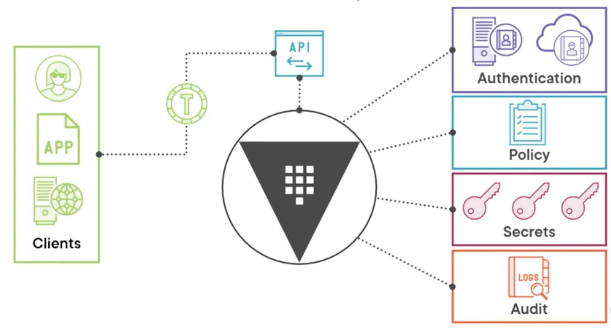
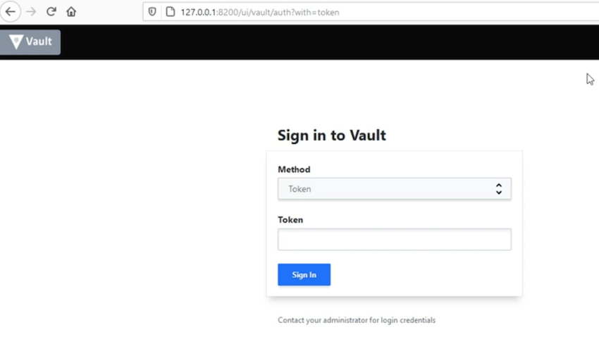

# **L1 Vault Associate: Introduction**

## Ovewview

* Compare authentication methods
* Create Vault policies
* Assess Vault tokens
* Manage Vault leases
* Compare and configure Vault secrets engines
* Utilize Vault CLI
* Utilize Vault UI
* Be aware of the Vault API
* Explain Vault architecture
* Explain encryption as a service

## **HashiCorp Vault**

* **Secrets lifecycle manager**
* Written in Go
* Multiple operating systems
* **Same binary for client/server**

## **Vault Concepts**



### Authentication

It has one or more authentication methods. Those authentication methods could rely on an **internal system like userpass** or an **external system like LDAP**.

### Policy

policies govern what you can do on the Vault system. Once you have successfully authenticated to Vault and received the proper policies,

### Secrets

Those secrets are surfaced through secrets engines also called plugins.

### Audit

Now one thing that's often overlooked in Vault is its audit system. Because you're interacting with secrets, which are extremely important and sensitive, want to audit everything that's going on with your Vault system

### Who is accessing Vault

* A **direct end user** who's interacting with Vault.
* Application that has some Vault code written into it to interact with the API.
* **Virtual machine or a physical machine** that's running some process to talk to Vault.

They all end up interacting with the same thing, which is the **API that sits in front of Vault**. And it is the one and only way to interact with all the things on the back end of Vault.

**To interact with authentication,policy, secrets, all of those things, you have to go through the API**.

All of that interaction is going to **involve a token that is granted by Vault to you**. And you use that token with each of your requests that you send to Vault.

## Interacting with Vault

### Install Binary Vault

[https://developer.hashicorp.com/vault/tutorials/getting-started/getting-started-install](https://developer.hashicorp.com/vault/tutorials/getting-started/getting-started-install)

```
# Windows - use Chocolatey
choco install vault

# Mac - use Homebrew
brew tap hashicorp/tap
brew install hashicorp/tap/vault
$ brew upgrade hashicorp/tap/vault
Warning: hashicorp/tap/vault 1.12.1 already installed


# Linux - use your package manager
curl -fsSL https://apt.releases.hashicorp.com/gpg | sudo apt-key add -

sudo apt-add-repository "deb [arch=amd64] https://apt.releases.hashicorp.com $(lsb_release -cs) main"

sudo apt-get update && sudo apt-get install vault
```

```
$ cat /etc/redhat-release
CentOS Linux release 7.9.2009 (Core)

$ sudo yum install -y yum-utils

$ sudo yum-config-manager --add-repo https://rpm.releases.hashicorp.com/RHEL/hashicorp.repo

$ sudo yum -y install vault
```

```
$ vault version
Vault v1.12.1 (e34f8a14fb7a88af4640b09f3ddbb5646b946d9c), built 2022-10-27T12:32:05Z
```

### **Vault CLI**

```
# Basic vault command structure
vault <command> <subcommand> [options] [ARGUMENTS]

# Getting help with vault
vault «command> -help
vault path-help PATH
```

### Development mode

* Running on localhost without SSL
* In-memory storage
* Starts unsealed
* UI enabled
* Key/Value secrets engine enabled

**Starting the Dev Server**

```
Usage: vault server [options]

  This command starts a Vault server that responds to API requests. By default,
  Vault will start in a "sealed" state. The Vault cluster must be initialized
  before use, usually by the "vault operator init" command. Each Vault server must
  also be unsealed using the "vault operator unseal" command or the API before the
  server can respond to requests.

  Start a server with a configuration file:

      $ vault server -config=/etc/vault/config.hcl

  Run in "dev" mode:

      $ vault server -dev -dev-root-token-id="root"

  For a full list of examples, please see the documentation.
...
```

```
# Launch Vault in development mode
vault server -dev
```

```
 vault server -dev
==> Vault server configuration:

             Api Address: http://127.0.0.1:8200
                     Cgo: disabled
         Cluster Address: https://127.0.0.1:8201
              Go Version: go1.19.2
              Listener 1: tcp (addr: "127.0.0.1:8200", cluster address: "127.0.0.1:8201", max_request_duration: "1m30s", max_request_size: "33554432", tls: "disabled")
               Log Level: info
                   Mlock: supported: true, enabled: false
           Recovery Mode: false
                 Storage: inmem
                 Version: Vault v1.12.1, built 2022-10-27T12:32:05Z
             Version Sha: e34f8a14fb7a88af4640b09f3ddbb5646b946d9c

==> Vault server started! Log data will stream in below:
...
WARNING! dev mode is enabled! In this mode, Vault runs entirely in-memory
and starts unsealed with a single unseal key. The root token is already
authenticated to the CLI, so you can immediately begin using Vault.

You may need to set the following environment variables:

    $ export VAULT_ADDR='http://127.0.0.1:8200'

The unseal key and root token are displayed below in case you want to
seal/unseal the Vault or re-authenticate.

Unseal Key: iHzoi88Bvod09TEfvI+lNYnXEnxb3Ph22oOHMpXKGYg=
Root Token: hvs.v9xurOdtve57iuHBFUbs2f3w

Development mode should NOT be used in production installations!
```

```
Unseal Key: iHzoi88Bvod09TEfvI+lNYnXEnxb3Ph22oOHMpXKGYg=
Root Token: hvs.v9xurOdtve57iuHBFUbs2f3w
```

```
export root_token=hvs.v9xurOdtve57iuHBFUbs2f3w
vault login -address="http://127.0.0.1:8200" $root_token

 vault login -address="http://127.0.0.1:8200" $root_token
Success! You are now authenticated. The token information displayed below
is already stored in the token helper. You do NOT need to run "vault login"
again. Future Vault requests will automatically use this token.

Key                  Value
---                  -----
token                hvs.v9xurOdtve57iuHBFUbs2f3w
token_accessor       DwTOLrYyE2YDIT9Xw10NB7CJ
token_duration       ∞
token_renewable      false
token_policies       ["root"]
identity_policies    []
policies             ["root"]
```

```
# Store Vault server address in environment variable
#Linux and macOS
export VAULT_ADDR=http://127.0.0.1:8200
# Windows PowerShell
Senv:VAULT_ADDR="htto://127.0.0.1:8200'
# Log into Vault
```

```
export VAULT_ADDR='http://127.0.0.1:8200'
```

```
$ curl http://localhost:8200
<a href="/ui/">Temporary Redirect</a>.
```

### **Environment Variables**

* `VAULT_ADDR` - Address of the Vault server
* `VAULT_TOKEN` - Token value for requests
* `VAULT_SKIP_VERIFY` -  No verify TLS cert
* `VAULT_FORMAT` - Specify output format

```
$ vault status
Key             Value
---             -----
Seal Type       shamir
Initialized     true
Sealed          false
Total Shares    1
Threshold       1
Version         1.12.1
Build Date      2022-10-27T12:32:05Z
Storage Type    inmem
Cluster Name    vault-cluster-9f4e0e41
Cluster ID      9a900a0e-9a53-2793-c1c9-8d9c9aed2b16
HA Enabled      false
```

**`http://127.0.0.1:8201/ui`**



### Vault API

* RESTful
* Used by Ul and CLI
* Only way to interact with Vault
* curl with X-Vault-Token header

we are asking for **host-info** about the host running our Vault, server, so this is going to be a GET type request.

```
export VAULT_ADDR='http://127.0.0.1:8200'

export root_token=hvs.VtsTEZn9wbP34P63WybIZMhv

curl --header "X-Vault-Token: $root_token" --request GET  $VAULT_ADDR/v1/sys/host-info | jq


  % Total    % Received % Xferd  Average Speed   Time    Time     Time  Current
                                 Dload  Upload   Total   Spent    Left  Speed
100  3515    0  3515    0     0  74470      0 --:--:-- --:--:-- --:--:-- 92500
{
  "request_id": "809df17b-5d94-e068-3078-cd400a328788",
  "lease_id": "",
  "renewable": false,
  "lease_duration": 0,
  "data": {
    "cpu": [
      {
        "cpu": 0,
        "vendorId": "GenuineIntel",
        "family": "6",
        "model": "70",
        "stepping": 1,
        "physicalId": "",
        "coreId": "",
        "cores": 4,
        "modelName": "Intel(R) Core(TM) i7-4980HQ CPU @ 2.80GHz",
        "mhz": 2800,
        "cacheSize": 256,
        "flags": [
          "fpu",
          "vme",
          "de",
          "pse",
   ...
    },
    "timestamp": "2022-11-04T06:34:38.380146Z"
  },
  "wrap_info": null,
  "warnings": [
    "cpu_times: not implemented yet"
  ],
  "auth": null
}
```

### **Key Takeaways**

* Vault is a single binary for client and server
* Vault can be started in dev mode for local testing
* All Vault communication goes through the API
* You can interact with Vault using the CLI, UI, or API
* **Use `VAULT_ADDR` and `VAULT_TOKEN` with the CLI**
