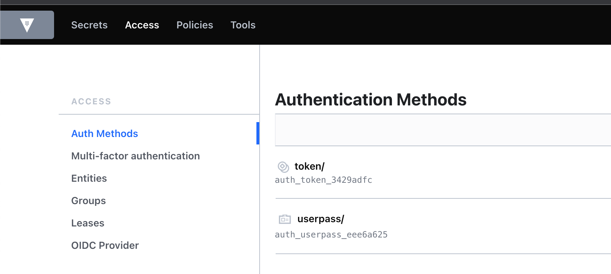
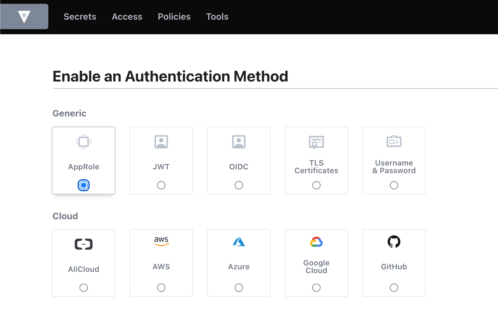
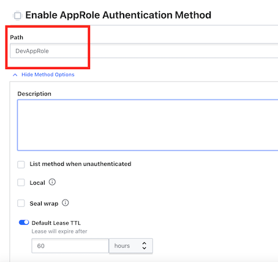
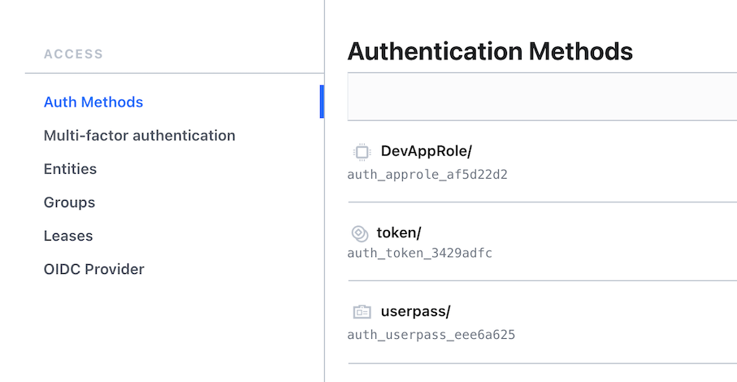
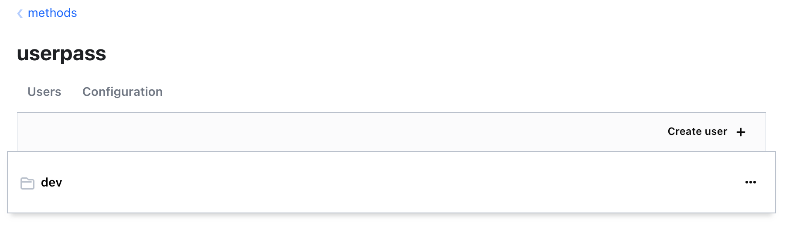
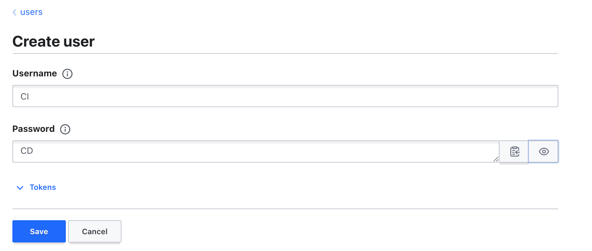
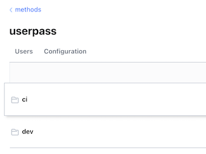
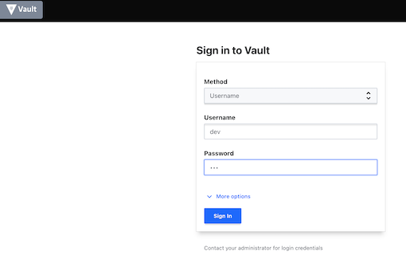
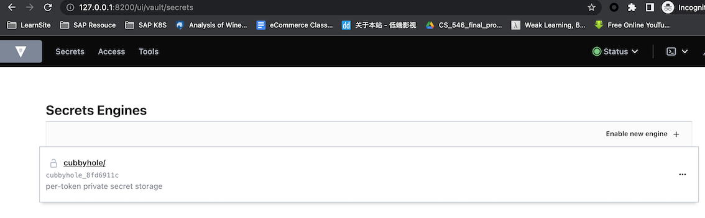
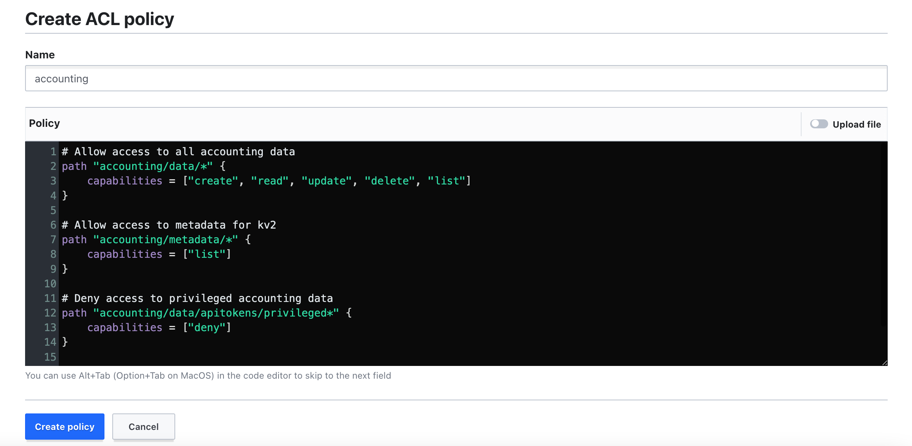

# L2 Authentication and Policies

## **1 Authenticating to Vault**

### **Overview**

* Authentication methods
* Selecting the right method
* Configuring an auth method
* Using an auth method

### **Authentication Methods**


* Provided by plug-ins

There are built-in plugins in Vault for AWS, Azure, GCP, as well as some of the other public cloud providers,so you can use any of those as an authentication target for your identities.


* Multiple methods allowed

There are also cloud native type authentications like Kubernetes,Cloud Foundry, GitHub, or even JSON web tokens.


* Reference external sources
	* **LDAP, GitHub, AWS IAM, etc.** 

There are also traditional methods like LDAP, Radius, or even Kerberos,	
	
* **Userpass** and **AppRole** are internal
* Token **method is enabled by default**
* **Mounted on the path /auth**
* **Used to obtain a token**

### **Username & Password**

* Meant for human operators
* Composed of a username and password

### **AppRole Method**

* Used for machines and applications
* Consists of RolelD and SecretID
* Push or pull for SecretID


It is used primarily for machines and applications. It's more programmatic. can have the client pull that SecretID when it boots up with some information

You can either have Vault server push the SecretID down to the client, or **you can have the client pull that SecretID when it boots up with some information** that's already preconfigured on that client.


### Real-world Sample 

**Use Case**

* Developers need to access secrets for AWS
* Globomantics has Active Directory for all internal users
* All developers have GitHub accounts
* Contract developers do not have AD accounts

**Solution**

* Enable the GitHub authentication method
* Have developers generate a personal authentication token


### **Globomantics Scenario**

**Use Case**

* Servers running on-prem need to access secrets
* Servers are not members of the AD domain
* Authentication must not require prompts
* All servers are on the same IP address subnet


**Solution**

* Enable the AppRole authentication method
* Generate a RolelD for each group of servers
* Constrain the SecretID by CID address

### **Configuring an Auth Method**

* All methods are enabled on `/sys/auth`
* **Methods are enabled on a path**
	* Defaults to method name
* Methods cannot be moved
* Methods can be tuned and configured
	* Tuning settings are common for all methods
	* Configuration settings are specific to a method	


**Auth methods are all using the auth path, but in reality, it's actually the `/sys/auth` path.**

If you want to add a new authentication method, you need access to this path. All authentication methods are enabled on a path.

You don't specify a path for that method. it will use the default path, which defaults to the method name. 

So if you're enabling userpass and you don't specify a path, then it will set the path to auth/userpass methods


You could disable the method and then re-enable it on the new path. But disabling a method also deletes all the information stored about that method

Methods, once they are enabled, can be tuned and configured. So if you are enabling the AWS method,

```
# List existing auth methods
vault auth list
```

```
$ vault auth list
Path      Type     Accessor               Description                Version
----      ----     --------               -----------                -------
token/    token    auth_token_3429adfc    token based credentials    n/a
```

```
# Enable an auth method
vault auth enable [options] TYPE
vault auth enable -path=globopass userpass

# Tune an auth method
vault auth tune [options] PATH

vault auth tune -description="First userpass" alobopass/

# Disable an auth method 
vault auth disable [options] PATH

vault auth disable globopass/
```

### **Enabling the Userpass Method**

**`Root Token: hvs.VtsTEZn9wbP34P63WybIZMhv`**

`hvs.VtsTEZn9wbP34P63WybIZMhv`

```
$ vault login 
Token (will be hidden): 
Success! You are now authenticated. The token information displayed below
is already stored in the token helper. You do NOT need to run "vault login"
again. Future Vault requests will automatically use this token.

Key                  Value
---                  -----
token                hvs.VtsTEZn9wbP34P63WybIZMhv
token_accessor       aONrVciIIfKgvuvbeSrcXV4u
token_duration       ∞
token_renewable      false
token_policies       ["root"]
identity_policies    []
policies             ["root"]
```

```
$ vault auth list
Path      Type     Accessor               Description                Version
----      ----     --------               -----------                -------
token/    token    auth_token_3429adfc    token based credentials    n/a
```

Enable our auth method using userpass

```
$ vault auth enable userpass
Success! Enabled userpass auth method at: userpass/


$ vault auth list
Path         Type        Accessor                  Description                Version
----         ----        --------                  -----------                -------
token/       token       auth_token_3429adfc       token based credentials    n/a
userpass/    userpass    auth_userpass_eee6a625    n/a                        n/a
```

```
vault auth tune -description="DevTest UserPass" userpass/
```

```
$ vault auth tune -description="DevTest UserPass" userpass/
Success! Tuned the auth method at: userpass/
```




### **Enabling the AppRole Method**







```
$ vault auth tune -description="DevTest AppRole" DevAppRole/

Success! Tuned the auth method at: DevAppRole/
```

```
 vault auth list
Path           Type        Accessor                  Description                Version
----           ----        --------                  -----------                -------
DevAppRole/    approle     auth_approle_af5d22d2     DevTest AppRole            n/a
token/         token       auth_token_3429adfc       token based credentials    n/a
userpass/      userpass    auth_userpass_eee6a625    DevTest UserPass           n/a
```


### **Configuring the Userpass Method**

```
$ vault path-help auth/userpass/
## DESCRIPTION

The "userpass" credential provider allows authentication using
a combination of a username and password. No additional factors
are supported.

The username/password combination is configured using the "users/"
endpoints by a user with root access. Authentication is then done
by supplying the two fields for "login".

## PATHS
...
```

```
# Looks like we do that through the users path

vault path-help auth/userpass/users

vault path-help auth/userpass/users/something
```

Let's write some data to create a new user

```
vault write auth/userpass/users/dev password=ops
```

We can also add a user through the UI







### **Configuring the AppRole Method**

```
vault path-help auth/DevAppRole

# Looks like we need to configure a role

vault path-help auth/DevAppRole/role/something
```

```
 vault path-help auth/DevAppRole
## DESCRIPTION

Any registered Role can authenticate itself with Vault. The credentials
depends on the constraints that are set on the Role. One common required
credential is the 'role_id' which is a unique identifier of the Role.
It can be retrieved from the 'role/<appname>/role-id' endpoint.
...
```

**Example**

```
vault write auth/DevAppRole/role/webapp role_name="webapp" secret_id_num_uses=1 secret_id_ttl=2h
```

* The role can be used once
* the time to live is 2 hours

```
Success! Data written to: auth/DevAppRole/role/webapp
```

### **Using an auth method**

```
# Login using a token
vault login

# Login with an auth method
vault login [options] [AUTH K= V...]
vault login -method=userpass username=dev

# Write with an auth method
vault write [options] PATH [DATA K=V.]
vault write auth/userpass/login/dev password=ops
```

```
$ vault login -method=userpass username=dev
Password (will be hidden): 
Success! You are now authenticated. The token information displayed below
is already stored in the token helper. You do NOT need to run "vault login"
again. Future Vault requests will automatically use this token.

Key                    Value
---                    -----
token                  hvs.CAESIL76Rb9RDZknoWrjncige50zoIV_gEGOvmqe6e7U8ks6Gh4KHGh2cy5ObjUxSE5vVFdOUHUzZFRzb1J1cE45WjI
token_accessor         zvliJU3rkXeZOZCqv8xcjZ27
token_duration         768h
token_renewable        true
token_policies         ["default"]
identity_policies      []
policies               ["default"]
token_meta_username    dev
```





### Using the AppRole Method

```
vault path-help auth/DevAppRole/login 
```

```
$ vault path-help auth/DevAppRole/login 
Request:        login
Matching Route: ^login$

Issue a token based on the credentials supplied

## PARAMETERS

    role_id (string)

        Unique identifier of the Role. Required to be supplied when the 'bind_secret_id' constraint is set.

    secret_id (string)

        SecretID belong to the App role
```

### Using AppRole with the API

```
$ vault login 
Token (will be hidden):   hvs.VtsTEZn9wbP34P63WybIZMhv`
```

**so we need the `role_id` and `secret_id`**

```
vault read auth/DevAppRole/role/webapp/role-id
```

```
$ vault read auth/DevAppRole/role/webapp/role-id
Key        Value
---        -----
role_id    aa8f2859-0c4a-ecf3-6243-78220b448896

export roleId=aa8f2859-0c4a-ecf3-6243-78220b448896
```


**Get the `secret_id`, since we're generating data we need to use the write command instead**

```
vault write -force auth/DevAppRole/role/webapp/secret-id
```

```
$ vault write -force auth/DevAppRole/role/webapp/secret-id
Key                   Value
---                   -----
secret_id             30ceb130-fe1b-1c49-c057-42ddcba94900
secret_id_accessor    080d17c4-6a1f-f65e-0544-0a83eaee91b3
secret_id_num_uses    1
secret_id_ttl         2h
```

```
export secretId=30ceb130-fe1b-1c49-c057-42ddcba94900
```

now we can log in! This also uses the write command

```
vault write auth/DevAppRole/login role_id=$roleId secret_id=$secretId

$ vault write auth/DevAppRole/login role_id=$roleId secret_id=$secretId
Key                     Value
---                     -----
token                   hvs.CAESIHteId3d4H7T6eaARDKYfTk_0Lh4Hcb05id6VuWmnTmcGh4KHGh2cy5veHRjUnJPMzdSYzc5eHBDNG9nZTk3UWk
token_accessor          U52iST6zSKQtnbZtUREZlfkh
token_duration          60h
token_renewable         true
token_policies          ["default"]
identity_policies       []
policies                ["default"]
token_meta_role_name    webapp
```

**Let's try logging in using the API with AppRole instead**

```
$ curl --request POST \
>   --data "{\"role_id\": \"$roleId\",\"secret_id\": \"$secretId\"}" \
>   $VAULT_ADDR/v1/auth/DevAppRole/login | jq
  % Total    % Received % Xferd  Average Speed   Time    Time     Time  Current
                                 Dload  Upload   Total   Spent    Left  Speed
100   136  100    33  100   103   3112   9715 --:--:-- --:--:-- --:--:--  132k
{
  "errors": [
    "invalid secret id"
  ]
}
```


### Dsiabling an Auth Method

we are going to retire the AppRole for the moment

```
vault auth disable DevAppRole/

vault auth list
```

### **Key Takeaways**

* Auth methods use internal or external sources for authentication to Vault
* Multiple instances of the same method can be enabled on different
* paths, and the default path is the method's name
* Pick an authentication method that suits the client and environment
* **Auth methods are managed using the `vault auth` command**
* Auth methods are used with the `vault login` or `vault write` commands

## **Vault Policy**

### **Vault Policy Overview**

* Policies define permissions in Vault

* Multiple options for assignment
	* **Token, identity, auth methods**

* Most specific wins
* No versioning
* Default policy
* Root policy

So if you have two different policy statements.  You can edit the default policy, but you cannot delete the default policy. The other special policy is the root policy.

This is the policy that's automatically associated with **root tokens**, The root policy has full control over everything in the Vault server,

### **`default.hcl`**

```
# Allow tokens to look up their own properties
path "auth/token/lookup-self" { ...

# Allow tokens to renew themselves
path "auth/token/renew-self" { ...

# Allow tokens to revoke themselves
path "auth/token/revoke-self" { ...

# Allow a token to look up its own capabilities on a path
path "sys/capabilities-self" { ...

# Allow a token to look up its own entitv bv id or name
path "identity/entity/id/({identity.entity.id}}"  { ...
```

### **Policy Syntax**

 * HCL or JSON
 * Path
 * Capabilities

The prefered format is HCI just because it's easier for humans to read and understand. There are two basic elements of a policy rule.
 
### **Exploring Path Examples**
 
```
# Basic path expression
path "somepath/in/vault"

# Using the glob '*'
# Match "secrets/globo/web1/" and "secrets/globo/webapp/apikeys"

path "secrets/globo/web*"

# Using the path segment match '+'
# Match "secrets/globo/webapp1/apikeys" and "secrets/globo/webapp2/apikeys"

path "secrets/globo/+/apikeys"

# Using a parameter
# Resolve to the name of the entity
path "identity/entity/id/{{identitv.entitv.id}}" { ...

path "identity/entity/name/((identity.entity.name}}" { ...
```

### **Capabilities Overview**

Standard CRUD capabilities

* Create - create a new key
* Read - read data from a key
* Update - alter data for a key
* Delete - remove a key

* **List - enumerate keys**
	* No access to key data
	* Not implied by the read

* **Sudo - special permissions**
	* **Root-protected paths**
	* **Do not imply other actions**

* **Deny - disable access**
	* Overrides all other actions
	* Denies the full path

```
# Allow read access to an apikey
path "secrets/globo/webapp/apikey" {
	capabilities = ["read"]
}

# Allow read and list access to webapp path
path "secrets/globo/webapp/*" {
	capabilities = ["read","list"]
}

# Allow full access to apikey in dev paths
path "secrets/dev/+/apikey" {
	capabilities = ["create","read","update","delete"]
}

# Deny access to the dev privileged path
path "secrets/dev/webapp/*" {
	capabilities = ["create","read","list","update","delete"]
}

path "secrets/globo/webapp/privileged*" {
	capabilities = ["deny"]
}
```
	
### Dev Scenario

**Use Case 1**

* Junior administrators need to manage secrets engines
* Follow the principle of least privileged access
* No access to contents of secrets engines

**Solution 1**

* Create a secrets engine management policy
* Assign the policy to junior administrators

**Use Case 2**

* Grant access to the accounting secrets engine
* Deny access to privileged information for regular accountants
* Allow management of metadata

**Solution 2**

* Create an accounting policy
* Add a deny rule for privileged path
* Add access to the metadata path

### **Policy Creation and Assignment**

**Policy Assignment**

* Directly on token when created
* **Applied through an authentication method**
* Assigned to an entity through the identity secrets engine

**Assigned to an entity through the identity secrets engine**

```
# List existing policies
vault policy list

# Read the contents of a policy
vault policy read [options] NAME
vault policy read secrets-mgmt

# Write a new policy or update an existing policy
vault policy write [options] NAME PATH | <stdin>
vault policy write secrets-mgmt secrets-mgmt.hcl

# Delete a policy
vault policy delete [options] NAME
vault policy delete secrets-mgmt

# Format a policy per HCL guideline
vault policy fmt [options] PATH
vault policy fmt secrets-mgmt.hcl
```

### **Create a policy with THE CLI**

```
# First of all we are going to start Vault in development mode
vault server -dev


# Now set your Vault address environment variable
export VAULT_ADDR=http://127.0.0.1:8200

# And log into Vault using the root token
vault login 

hvs.VtsTEZn9wbP34P63WybIZMhv
```

```
# Now we can check and see what policies exist right now
vault policy list 

default
root

# Before we create the policies, let's get a few things set up
# You can skip this if you still have it running from last time

# Enable userpass auth method
vault auth enable userpass

# Add a user
vault write auth/userpass/users/ned password=tacos
```

**Tasks:**

* Create two policies
* Generate a token with a policy
* Update a policy
* Delete a policy

```
vault policy list 

# Now we'll create a policy for secrets management
vault policy write secrets-mgmt secrets-mgmt.hcl
```

**`secrets-mgmt.hcl`**

```
# Manage secrets engines
path "sys/mounts/*"
{
  capabilities = ["create", "read", "update", "delete", "list", "sudo"]
}

# List existing secrets engines.
path "sys/mounts"
{
  capabilities = ["read"]
}
```

* The first is for the path `sys/mounts/*`. `Sys/mounts` is the path that Vault uses to mount any secrets engines. 
* For capabilities, I've got **create, read, update, delete, list, and sudo** because it's important to write understand that this is a root protected path.

```
# Now we'll create a policy for secrets management
vault policy write secrets-mgmt secrets-mgmt.hcl

$ vault policy write secrets-mgmt secrets-mgmt.hcl
Success! Uploaded policy: secrets-mgmt
```

```
$ vault policy list
default
secrets-mgmt
root
```


```
$ vault policy read secrets-mgmt
# Manage secrets engines
path "sys/mounts/*"
{
  capabilities = ["create", "read", "update", "delete", "list", "sudo"]
}

# List existing secrets engines.
path "sys/mounts"
{
  capabilities = ["read"]
}
```

### Creating a policy with UI

**we'll create a policy for the accounting secrets engine**


```
# First we'll enable the secrets engine
vault secrets enable -path=accounting -version=2 kv

Success! Enabled the kv secrets engine at: accounting/
```

we'll add some secrets to the engine

```
$ vault kv put accounting/apitokens/d101 token=1234567890


========= Secret Path =========
accounting/data/apitokens/d101

======= Metadata =======
Key                Value
---                -----
created_time       2022-11-08T13:53:23.286196Z
custom_metadata    <nil>
deletion_time      n/a
destroyed          false
version            1


$ vault kv put accounting/apitokens/d102 token=1234567890

========= Secret Path =========
accounting/data/apitokens/d102

======= Metadata =======
Key                Value
---                -----
created_time       2022-11-08T13:53:41.906207Z
custom_metadata    <nil>
deletion_time      n/a
destroyed          false
version            1

vault kv put accounting/apitokens/d103 token=1234567890

========= Secret Path =========
accounting/data/apitokens/d103

======= Metadata =======
Key                Value
---                -----
created_time       2022-11-08T13:54:51.674633Z
custom_metadata    <nil>
deletion_time      n/a
destroyed          false
version            1
```

* Now we can craft a policy allowing access to the regular tokens
* And denying access to the priveleged tokens
* We will add the policy through the UI

`hvs.VtsTEZn9wbP34P63WybIZMhv`

**Create ACL policies**

* Name: accounting
* accounting-fixed.hcl

```
# Allow access to all accounting data
path "accounting/data/*" {
    capabilities = ["create", "read", "update", "delete", "list"]
}

# Allow access to metadata for kv2
path "accounting/metadata/*" {
    capabilities = ["list"]
}

# Deny access to privileged accounting data
path "accounting/data/apitokens/privleged*" {
    capabilities = ["deny"]
}

path "accounting/metadata/apitokens/privileged*" {
    capabilities = ["deny"]
}
```



### Policy assignment commands

```
# Associate directly with a token
vault token create -policy="secrets-mgmt"

# Assign to a user in userpass
vault write auth/userpass/users/dev token_policies="secrets-mgmt"

# Assign to an entity in identity
vault write identity/entity/name/dev policies-"secrets-mgmt"
```

Let's try out our accounting policy be associating a policy directly with a token

```
vault token create -policy=accounting
```

```
Key                  Value
---                  -----
token                hvs.CAESIFyMWuqsnuU2a1OCBIvl2dpAf9oufW7ZFcIwOiAtmTD5Gh4KHGh2cy5UYkpJMGZZU2NVWnc5MXJhQjVENGtMVnE
token_accessor       QKH5VA18riW7rGZHqYojZU72
token_duration       768h
token_renewable      true
token_policies       ["accounting" "default"]
identity_policies    []
policies             ["accounting" "default"]
```

Now log in with that token

`hvs.CAESIFyMWuqsnuU2a1OCBIvl2dpAf9oufW7ZFcIwOiAtmTD5Gh4KHGh2cy5UYkpJMGZZU2NVWnc5MXJhQjVENGtMVnE`

```
vault login

Token (will be hidden): 
Success! You are now authenticated. The token information displayed below
is already stored in the token helper. You do NOT need to run "vault login"
again. Future Vault requests will automatically use this token.

Key                  Value
---                  -----
token                hvs.CAESIFyMWuqsnuU2a1OCBIvl2dpAf9oufW7ZFcIwOiAtmTD5Gh4KHGh2cy5UYkpJMGZZU2NVWnc5MXJhQjVENGtMVnE
token_accessor       QKH5VA18riW7rGZHqYojZU72
token_duration       767h57m52s
token_renewable      true
token_policies       ["accounting" "default"]
identity_policies    []
policies             ["accounting" "default"]
```

**listing out info in the accounting secrets engine**

```
$ vault kv list accounting/

Keys
----
apitokens/

$ vault kv list accounting/apitokens/

Keys
----
d101
d102
d103


$ vault kv list accounting/apitokens/privileged

Error listing accounting/metadata/apitokens/privileged: Error making API request.

URL: GET http://127.0.0.1:8200/v1/accounting/metadata/apitokens/privileged?list=true
Code: 403. Errors:

* 1 error occurred:
        * permission denied
```

 Seems to work for listing, let's try reading some secrets
 
 ```
 $ vault kv get accounting/apitokens/d101
========= Secret Path =========
accounting/data/apitokens/d101

======= Metadata =======
Key                Value
---                -----
created_time       2022-11-08T13:53:23.286196Z
custom_metadata    <nil>
deletion_time      n/a
destroyed          false
version            1

==== Data ====
Key      Value
---      -----
token    1234567890
 ```
 
```
 $ vault kv get accounting/apitokens/privileged/p101
Error reading accounting/data/apitokens/privileged/p101: Error making API request.

URL: GET http://127.0.0.1:8200/v1/accounting/data/apitokens/privileged/p101
Code: 403. Errors:

* 1 error occurred:
        * permission denied
```

### Updating the policy with 

We can do that through the UI or with this command (You'll need to log back in as root)

```
$ vault login
Token (will be hidden): 
Success! You are now authenticated. The token information displayed below
is already stored in the token helper. You do NOT need to run "vault login"
again. Future Vault requests will automatically use this token.

Key                  Value
---                  -----
token                hvs.VtsTEZn9wbP34P63WybIZMhv
token_accessor       aONrVciIIfKgvuvbeSrcXV4u
token_duration       ∞
token_renewable      false
token_policies       ["root"]
identity_policies    []
policies             ["root"]
```

**`accounting-fixed.hcl`**

```
vault policy write accounting accounting-fixed.hcl
```

```
$ vault policy write accounting accounting-fixed.hcl
Success! Uploaded policy: accounting
```

```
$ vault token create -policy=accounting
Key                  Value
---                  -----
token                hvs.CAESIKxpTBRO4lcRlX0nYU4eRTH8y19HdrXefmuwMbzmmGjvGh4KHGh2cy42b2RuYlFRMjVJYkJMbjZhOTBFb0M4RHU
token_accessor       bbYdbUDIaKqF7bSi6a2ral4a
token_duration       768h
token_renewable      true
token_policies       ["accounting" "default"]
identity_policies    []
policies             ["accounting" "default"]
```

```
$ vault login
Token (will be hidden): 
Success! You are now authenticated. The token information displayed below
is already stored in the token helper. You do NOT need to run "vault login"
again. Future Vault requests will automatically use this token.

Key                  Value
---                  -----
token                hvs.CAESIKxpTBRO4lcRlX0nYU4eRTH8y19HdrXefmuwMbzmmGjvGh4KHGh2cy42b2RuYlFRMjVJYkJMbjZhOTBFb0M4RHU
token_accessor       bbYdbUDIaKqF7bSi6a2ral4a
token_duration       767h59m6s
token_renewable      true
token_policies       ["accounting" "default"]
identity_policies    []
policies             ["accounting" "default"]
```

```
$ vault kv get accounting/apitokens/privileged/p101
Error reading accounting/data/apitokens/privileged/p101: Error making API request.

URL: GET http://127.0.0.1:8200/v1/accounting/data/apitokens/privileged/p101
Code: 403. Errors:

* 1 error occurred:
        * permission denied
```

### Assign policy withg auth method


**Log back as root**

```
$ vault login
Token (will be hidden): 
Success! You are now authenticated. The token information displayed below
is already stored in the token helper. You do NOT need to run "vault login"
again. Future Vault requests will automatically use this token.

Key                  Value
---                  -----
token                hvs.VtsTEZn9wbP34P63WybIZMhv
token_accessor       aONrVciIIfKgvuvbeSrcXV4u
token_duration       ∞
token_renewable      false
token_policies       ["root"]
identity_policies    []
policies             ["root"]
```

```
$ vault path-help auth/userpass/users/dev

# Looks like token_policies should do it
vault write auth/userpass/users/dev token_policies="secrets-mgmt"

Success! Data written to: auth/userpass/users/dev

vault token create -policy=accounting

```

```
# Now we can log in as Dev and try to mount a new secrets engine
vault login -method=userpass username=dev
# ops

$ vault login -method=userpass username=dev
Password (will be hidden): 
Success! You are now authenticated. The token information displayed below
is already stored in the token helper. You do NOT need to run "vault login"
again. Future Vault requests will automatically use this token.

Key                    Value
---                    -----
token                  hvs.CAESIFKJNpKv3QLtY745Le6nmyX_Q8GoD65AHIdpWfaoXKTZGh4KHGh2cy5vYWpHYmJXeG1Ja0Nmb0tlTnBMalJYSUg
token_accessor         HRAQL1MJN7DbvTr5gzeMaTM6
token_duration         768h
token_renewable        true
token_policies         ["default" "secrets-mgmt"]
identity_policies      []
policies               ["default" "secrets-mgmt"]
token_meta_username    dev
```

```
$ vault secrets enable -path=testing -version=1 kv
Success! Enabled the kv secrets engine at: testing/


$ vault secrets list
Path           Type         Accessor              Description
----           ----         --------              -----------
accounting/    kv           kv_2df6c2c6           n/a
cubbyhole/     cubbyhole    cubbyhole_8fd6911c    per-token private secret storage
identity/      identity     identity_c2caa7df     identity store
secret/        kv           kv_83efb8aa           key/value secret storage
sys/           system       system_27051655       system endpoints used for control, policy and debugging
testing/       kv           kv_eb4ddf6e           n/a

$ vault secrets disable testing
Success! Disabled the secrets engine (if it existed) at: testing/

$ vault secrets disable accounting
Success! Disabled the secrets engine (if it existed) at: accounting/

$ vault policy delete accounting
Error deleting accounting: Error making API request.

URL: DELETE http://127.0.0.1:8200/v1/sys/policies/acl/accounting
Code: 403. Errors:

* 1 error occurred:
        * permission denied
```

```
$ vault login
Token (will be hidden): 
Success! You are now authenticated. The token information displayed below
is already stored in the token helper. You do NOT need to run "vault login"
again. Future Vault requests will automatically use this token.

Key                  Value
---                  -----
token                hvs.VtsTEZn9wbP34P63WybIZMhv
token_accessor       aONrVciIIfKgvuvbeSrcXV4u
token_duration       ∞
token_renewable      false
token_policies       ["root"]
identity_policies    []
policies             ["root"]

$ vault policy delete accounting
Success! Deleted policy: accounting


$ vault policy list
default
secrets-mgmt
root
```

### Key takeways

* Policies are associated with tokens directly or indirectly, defining the actions allowed by the token
* **The root policy can do ANYTHING. It cannot be modified or deleted.**
* The default policy is assigned to new tokens by default. It can be modified, but not deleted.
* **Paths define where actions can be taken; capabilities define what
actions can be taken**.
* Policies can be assigned directly to a token, **through an auth method,
or through the identity secrets engine**.
