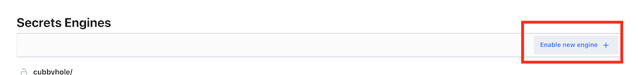
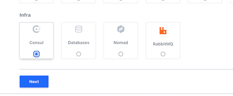
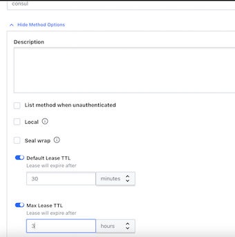
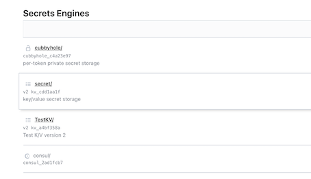
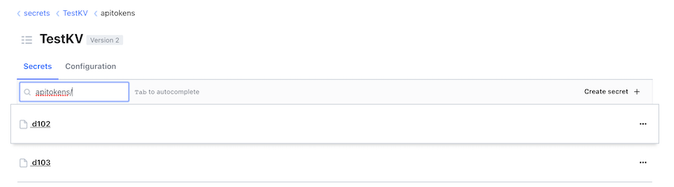
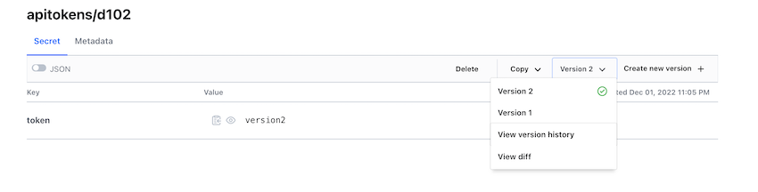
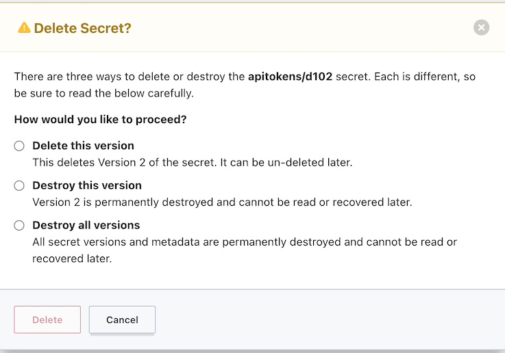
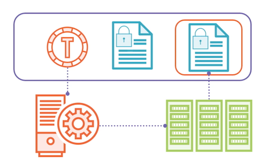

# **L4 Using Secrets Engines**

```
$ vault server -dev
$ export VAULT_ADDR='http://127.0.0.1:8200'
$ root_token=hvs.xdqJDIY7fbqrz9oj2hs63nEq

$ vault login $root_token
Success! You are now authenticated. The token information displayed below
is already stored in the token helper. You do NOT need to run "vault login"
again. Future Vault requests will automatically use this token.

Key                  Value
---                  -----
token                hvs.xdqJDIY7fbqrz9oj2hs63nEq
token_accessor       zCpAz878fjNacWJjveqTVj2R
token_duration       ∞
token_renewable      false
token_policies       ["root"]
identity_policies    []
policies             ["root"]
```


## **Overview**

* Secrets engine overview
* Selecting an engine
* Enabling an engine
* Using secrets engines

## **Secrets Engines**

**Secrets engines are plugins used by Vault to handle sensitive data**

Vault can provide encryption services. This would be data that exists outside of Vault, and all you want Vault to do is provide **some level of encryption services for that data.**

* **Store**

Sensitive data is stored securely by Vault

* **Generate**

Vault generates and manages sensitive data

* **Encrypt**

Vault provides encryption services for existing data


**Secrets Engine Categories**

* **Cloud** AWS, Azure, GCP
* **Database** MSSQL, PostreSQL. MondoDB
* **Internal** Key/Value, Identity, Transit
* **Identity** Active Directory, OpenLDAP
* **Certificate** SSH, PKI, Venafi
* **Tokens** Consul, Nomad


### **Identity Engine**

* Maintains clients for Vault
* Enabled by default
* Cannot be disabled
* Cannot enable multiple

### Entities

Entities are those clients. It's an entry within the Identity engine that represents those clients.


### **Aliases**

Aliases come from authentication methods and they're how you map an identity in an authentication method to one of these entities.

### **Groups**

You can also place entities in groups to manage policy assignment to entities.

### **Cubbyhole**

The Cubbyhole is a special type of secrets engine, and it's meant to **provide per token access to a reserved area in Vault**.


**Cubbyhole**

* Enabled by default
* Cannot be disabled or moved
* Created per service token
* Only accessible by token


### Dynamic vs. Static Secrets

**Static secrets**

* Store existing data securely
* Manual lifecycle management
* Key/Value engine

**Dynamic secrets**

* Generate data on demand
* **Lease issued for each secret**
	* The least could be indefinite, but it could also be for 30 minutes or 5 seconds. It all depends on what the purpose of that secret data is.
* Automatic lifecycle management
* Majority of secrets engines
* Consul engine

### Exp Scenario

**Use Case**

* Database administrators want to provideapplications and developer access to a MySQL database
* Credentials should be dynamically generated and short-lived
* TTL should be based on client type

**Solution**

* Enable Database secrets engine with MySQL plugin
* Configure roles and policies for applications and developers

## **2 Transit Engine**

### **Introudcing the Transit Engine**

**Key Value Engine**

* Store key/value pairs at a path
* Version 1 and 2 available
* Versioning and metadata

### Key Value Engine Versions

**Version 1**

* **No versioning, last key wins**

> For version 1, there is no versioning of keys within the engine. Every time you update a key, **it will overwrite the existing key and you can't get the previous version back**.  

* **Faster with fewer storage calls**

> Version 1, because it doesn't have all this metadata and versioning behind it, could potentially be faster with fewer calls to the storage back-end,

* **Deleted items are gone**

> Another key thing is when you delete a secret on version 1, it's gone. You can't get that back unless you took a backup of your vault server.

* **Can be upgraded to version 2**

> V1 can can be upgraded to version 2.

* **Default version on creation**

**Version 2**

* **Versioning of past secrets**

> Version 2 offers versioning of past secrets. So if you write a new version of a key, it maintains the previous versions up to a configured amount.

* **Possibly less performant**

> version 2 might possibly be a little less performant.

* **Deleted items and metadata retained**

> On version 2, if you delete an item, it retains that information, as well as the metadata, and allows you to recover an item. It's in a soft deleted state, you could say. 

* **Cannot be downgraded**
* **Can be specified at creation**

### Pratical Scenario

**Use Case**

* Application developer needs to store API keys in secure location
* API keys should be versioned with previous versions available
* Developers will generate the API keys

**Solution**

* Enable an instance of the Key Value engine version 2
* Create a policy granting developers access

### **Transit Engine**

* **Encryption as a service**

> it's not storing data, it's not generating data, it's purely providing encryption services. It does not store any of the data that submitted to it internally in Vault.

* **Does not store data**

> It does not store any of the data that submitted to it internally in Vault.

* **Supported actions:**

	* Encrypt/decrypt
	* Sign and verify
	* Generate hashes
	* Create random bytes

* **Engine manages ke ys**

### **Desmonstrating  Secret Engine**

**Use Case**

* Application developer needs to encrypt data written to object storage
* Data will be generated by application
* Vault does not need to store data

**Solution**

* Enable an instance of the Transit engine
* Create policies granting developers and application access

### **Enabling Secrets Engines**

**Secrets Engine Lifecycle**

* **Enable / Tune / Configure /  Move / Disable**

### **Configuring Secrets Engines**

* **All engines are enabled on `/sys/mounts`**
* Engines are enabled on a path
	* Defaults to engine name
* **Engines can be moved**
	* Revokes all existing leases
	* May impact policies
* Engines can be tuned and configured
	* Tuning settings are common for all engines
	* **Configuration settings are specific to an engines**

**Example Secrets Engines**

* Key Value
* Consul

**Tasks**

* Enable secrets engines
* Configure secrets engines
* Access secrets engines

### **Enabling secrets engines with transit engines**

First see which secrets engines are enabled

```
$ vault secrets list

Path          Type         Accessor              Description
----          ----         --------              -----------
cubbyhole/    cubbyhole    cubbyhole_c4a23e97    per-token private secret storage
identity/     identity     identity_20b0ef66     identity store
secret/       kv           kv_cdd1aa1f           key/value secret storage
sys/          system       system_75379b69       system endpoints used for control, policy and debugging
```

let's get our secrets engines enabled We'll start with the enabling the K/V engine

```
vault secrets enable -path=TestKV -version=2 kv

Success! Enabled the kv secrets engine at: TestKV/
```

```
$ vault secrets list | grep TestKV
TestKV/       kv           kv_a4bf358a           n/a

# Maybe we want to configure some settings for TestKV

$ vault path-help /sys/mounts/TestKV
Request:        mounts/TestKV
Matching Route: ^mounts/(?P<path>.+?)$

Mount a new backend at a new path.

## PARAMETERS
...

$ vault secrets tune -description="Test K/V version 2" TestKV
Success! Tuned the secrets engine at: TestKV/

$ vault secrets list | grep TestKV
TestKV/       kv           kv_a4bf358a           Test K/V version 2
```

### Configuring key value Engine the UI

let's go enable Consul through the UI










```
$ vault secrets list | grep consul
consul/       consul       consul_2ad1fcb7       n/a
```

### Configuring the Key Value Engine

```
vault path-help TestKV/

...
 ^config$
        Configures settings for the KV store

    ^data/(?P<path>.*)$
        Write, Patch, Read, and Delete data in the Key-Value Store.

    ^delete/(?P<path>.*)$
        Marks one or more versions as deleted in the KV store.

    ^destroy/(?P<path>.*)$
        Permanently removes one or more versions in the KV store

    ^metadata/(?P<path>.*)$
        Configures settings for the KV store

    ^subkeys/(?P<path>.*)$
        Read the structure of a secret entry from the Key-Value store with the values removed.

    ^undelete/(?P<path>.*)$
        Undeletes one or more versions from the KV store.
        


$ vault path-help TestKV/

This path configures backend level settings that are applied to every key in the
key-value store. This parameter accetps:

        * max_versions (int) - The number of versions to keep for each key. Defaults
          to 10

        * cas_required (bool) - If true, the backend will require the cas parameter
          to be set for each write

        * delete_version_after (duration) - If set, the length of time before a
          version is deleted. A negative duration disables the use of
          delete_version_after on all keys. A zero duration clears the current
          setting. Accepts a Go duration format string.

$ vault path-help TestKV/config

# Why don't we check the current settings?
$ vault read TestKV/config
Key                     Value
---                     -----
cas_required            false
delete_version_after    0s
max_versions            0

# Why don't we check the current settings?
vault read TestKV/config

# Let's set the max_versions to 5
vault write TestKV/config max_versions=5

$ vault write TestKV/config max_versions=5
Success! Data written to: TestKV/config

$ vault read TestKV/config
Key                     Value
---                     -----
cas_required            false
delete_version_after    0s
max_versions            5
```

### Configuring the Consul Engine

You are going to need the consul binary to follow along here. You can get it by going to https://www.consul.io/downloads. 


```
brew tap hashicorp/tap
brew install hashicorp/tap/consul
```


We are going to start up a basic instance of Consul and get a token with permissions to generate new token. 

**`consul-config.hcl`**

```
## server.hcl

ui = true
server = true
bootstrap_expect = 1
datacenter = "dc1"
data_dir = "./data"

acl = {
    enabled = true
    default_policy = "deny"
    enable_token_persistence = true
}
```

You don't need to know much about Consul aside from the fact it uses tokens for authentication and authorization just like Vault.
  
```
$ mkdir data 
$ pwd
k8s_test/valut/


# Launch consul server instance
consul agent -bootstrap -config-file="consul-config.hcl" -bind="127.0.0.1"

# From a separate terminal window run the following
consul acl bootstrap

$ consul acl bootstrap
AccessorID:       81155224-8cab-cd35-bc69-dac4ebcdac17
SecretID:         1ded8acc-9baf-04e0-1bdd-076a99a514a0
Description:      Bootstrap Token (Global Management)
Local:            false
Create Time:      2022-12-01 21:46:59.048599 +0800 CST
Policies:
   00000000-0000-0000-0000-000000000001 - global-management
   
```

**`web-policy.hcl`**

```
service "web" {
    policy = "read"
}
```

```
# Set CONSUL_HTTP_TOKEN to SecretID
# Linux and MacOS
export CONSUL_HTTP_TOKEN=SECRETID_VALUE

export CONSUL_HTTP_TOKEN=1ded8acc-9baf-04e0-1bdd-076a99a514a0


# Next we have to create a policy and role for new tokens
# that Vault will generate on Consul

consul acl policy create -name=web -rules @web-policy.hcl

$ consul acl policy create -name=web -rules @web-policy.hcl
ID:           94bceb75-56c3-b225-520f-1089d7b8f33c
Name:         web
Description:  
Datacenters:  
Rules:
service "web" {
    policy = "read"
}

# Now we'll configure out Consul secrets engine
vault path-help consul/


$ vault path-help consul/
## DESCRIPTION


$ export VAULT_ADDR='http://127.0.0.1:8200'
$ root_token=hvs.xdqJDIY7fbqrz9oj2hs63nEq
## PATHS

The following paths are supported by this backend. To view help for
any of the paths below, use the help command with any route matching
the path pattern. Note that depending on the policy of your auth token,
you may or may not be able to access certain paths.

    ^config/access$


    ^creds/(?P<role>\w(([\w-.]+)?\w)?)$


    ^roles/(?P<name>\w(([\w-.]+)?\w)?)$


    ^roles/?$
    
vault path-help consul/config/access

 vault path-help consul/config/access
Request:        config/access
Matching Route: ^config/access$

<no synopsis>

## PARAMETERS

    address (string)

        Consul server address

    ca_cert (string)

        CA certificate to use when verifying Consul server certificate,
        must be x509 PEM encoded.

    client_cert (string)

        Client certificate used for Consul's TLS communication,
        must be x509 PEM encoded and if this is set you need to also set client_key.

    client_key (string)

        Client key used for Consul's TLS communication,
        must be x509 PEM encoded and if this is set you need to also set client_cert.

    scheme (string)

        URI scheme for the Consul address

    token (string)

        Token for API calls

## DESCRIPTION

<no description>
```
```
vault write consul/config/access address="http://127.0.0.1:8500" token=$CONSUL_HTTP_TOKEN

$ vault write consul/config/access address="http://127.0.0.1:8500" token=$CONSUL_HTTP_TOKEN
Success! Data written to: consul/config/access

# And add a role to provision tokens with a ttl of 1 hour and a max of 2 hours

vault path-help consul/roles/web

vault write consul/roles/web name=web policies=web ttl=3600 max_ttl=7200

# Now how do we use this role to get a token? By using the creds path

$ vault path-help consul/creds/web
Request:        creds/web
Matching Route: ^creds/(?P<role>\w(([\w-.]+)?\w)?)$

<no synopsis>

## PARAMETERS

    role (string)

        Name of the role.

## DESCRIPTION

<no description>

$ vault read consul/creds/web
Key                 Value
---                 -----
lease_id            consul/creds/web/2RReZdwbrT8OgeUxdF4xNzLP
lease_duration      1h
lease_renewable     true
accessor            e8d9ba98-acd4-f1f0-88a6-f642bc30505f
consul_namespace    n/a
local               false
partition           n/a
token               367f1f34-dcae-daa2-c3ae-8b2a3c29bbb1

# Check on the consul side and we can see the token created

$ consul acl token list -format=json | jq .[].AccessorID
"81155224-8cab-cd35-bc69-dac4ebcdac17"
"e8d9ba98-acd4-f1f0-88a6-f642bc30505f"
"00000000-0000-0000-0000-000000000002"
```

### Using Secrets Engines

**Interacting with Secrets Engine**

* **Authenticate with policy**
* Access through CLI, UI, or API
* Most engines use standard commands
	* `read, list, write, and delete`
* **Key Value uses `vault kv` commands**
	* K/V version 1 can use standard commands

```
# Use vault write to configure roles
vault write ROLE_PATH [SETTINGS K=V]
vault write consul/roles/my-role name=my-role policies=consul-policy


# Use vault read to retrieve credentials
vault read CRED_PATH
vault read consul/creds/my-role
```

### Interacting with the Key Value Engine

```
# Writing a secret value
vault write ROLE_PATH [SETTINGS K=V]
vault write consul/roles/my-role name=my-role policies=consul-policy


# Use vault read to retrieve credentials
vault read CRED_PATH
vault read consul/creds/my-role

# Writing a secret value
vault kv put [options] KEY [DATA K=V]
vault kv put TestKV/apikeys/d101 token=1234567890

# Listing secret keys
vault kv list [options] PATH
vault kv list TestKV/apikeys

# Reading a secret value
vault kv get [options] KEY
vault kv get –version=1 TestKV/apikeys/d101


# Deleting a value
vault kv delete [options] KEY
vault kv delete –versions=1 TestKV/apikeys/d101

# Destroying a value  (Delete Key permantely)
vault kv destroy [options] KEY
vault kv destroy –versions=1 TestKV/apikeys/d101
```

```
# Let's try adding some values to our kv engine
vault kv put TestKV/apitokens/d101 token=version1
vault kv put TestKV/apitokens/d102 token=version1
vault kv put TestKV/apitokens/d103 token=version1
```

```
$ vault kv put TestKV/apitokens/d101 token=version1
======= Secret Path =======
TestKV/data/apitokens/d101

======= Metadata =======
Key                Value
---                -----
created_time       2022-12-01T14:58:46.669736Z
custom_metadata    <nil>
deletion_time      n/a
destroyed          false
version            1

$ vault kv put TestKV/apitokens/d102 token=version1
======= Secret Path =======
TestKV/data/apitokens/d102

======= Metadata =======
Key                Value
---                -----
created_time       2022-12-01T14:58:58.557175Z
custom_metadata    <nil>
deletion_time      n/a
destroyed          false
version            1

$ vault kv put TestKV/apitokens/d103 token=version1
======= Secret Path =======
TestKV/data/apitokens/d103

======= Metadata =======
Key                Value
---                -----
created_time       2022-12-01T15:01:42.594581Z
custom_metadata    <nil>
deletion_time      n/a
destroyed          false
version            1
```

```
# Now let's try and list the keys
vault kv list TestKV/apitokens

 vault kv list TestKV/apitokens
Keys
----
d101
d102
d103
```

```
# Nice, let's read one of the values
vault kv get TestKV/apitokens/d101

 vault kv get TestKV/apitokens/d101
======= Secret Path =======
TestKV/data/apitokens/d101

======= Metadata =======
Key                Value
---                -----
created_time       2022-12-01T14:58:46.669736Z
custom_metadata    <nil>
deletion_time      n/a
destroyed          false
version            1

==== Data ====
Key      Value
---      -----
token    version1
```

```
# What if we update the value?
vault kv put TestKV/apitokens/d101 token=version2
vault kv put TestKV/apitokens/d102 token=version2
vault kv put TestKV/apitokens/d103 token=version2


**Response Wrapping**

￥ vault kv put TestKV/apitokens/d101 token=version2
======= Secret Path =======
TestKV/data/apitokens/d101

======= Metadata =======
Key                Value
---                -----
created_time       2022-12-01T15:05:30.103783Z
custom_metadata    <nil>
deletion_time      n/a
destroyed          false
version            2

$ vault kv put TestKV/apitokens/d102 token=version2
======= Secret Path =======
TestKV/data/apitokens/d102

======= Metadata =======
Key                Value
---                -----
created_time       2022-12-01T15:05:44.697181Z
custom_metadata    <nil>
deletion_time      n/a
destroyed          false
version            2

$ vault kv put TestKV/apitokens/d103 token=version2
======= Secret Path =======
TestKV/data/apitokens/d103

======= Metadata =======
Key                Value
---                -----
created_time       2022-12-01T15:05:53.844138Z
custom_metadata    <nil>
deletion_time      n/a
destroyed          false
version            2
```


```
Can we still get version 1? Sure can.
vault kv get -version=1 TestKV/apitokens/d101

$ vault kv get -version=1 TestKV/apitokens/d101
======= Secret Path =======
TestKV/data/apitokens/d101

======= Metadata =======
Key                Value
---                -----
created_time       2022-12-01T14:58:46.669736Z
custom_metadata    <nil>
deletion_time      n/a
destroyed          false
version            1

==== Data ====
Key      Value
---      -----
token    version1

# How do we go about deleting an older version?
vault kv delete -versions=1 TestKV/apitokens/d101

$ vault kv delete -versions=1 TestKV/apitokens/d101
Success! Data deleted (if it existed) at: TestKV/data/apitokens/d101


# Don't worry it's not really gone
vault kv metadata get TestKV/apitokens/d101

$ vault kv metadata get TestKV/apitokens/d101
======== Metadata Path ========
TestKV/metadata/apitokens/d101

========== Metadata ==========
Key                     Value
---                     -----
cas_required            false
created_time            2022-12-01T14:58:46.669736Z
current_version         2
custom_metadata         <nil>
delete_version_after    0s
max_versions            0
oldest_version          0
updated_time            2022-12-01T15:05:30.103783Z

====== Version 1 ======
Key              Value
---              -----
created_time     2022-12-01T14:58:46.669736Z
deletion_time    2022-12-01T15:07:36.41118Z
destroyed        false

====== Version 2 ======
Key              Value
---              -----
created_time     2022-12-01T15:05:30.103783Z
deletion_time    n/a
destroyed        false

# We can recover it by doing the following
vault kv undelete -versions=1 TestKV/apitokens/d101

$ vault kv undelete -versions=1 TestKV/apitokens/d101
Success! Data written to: TestKV/undelete/apitokens/d101

vault kv get -version=1 TestKV/apitokens/d101

$ vault kv get -version=1 TestKV/apitokens/d101
======= Secret Path =======
TestKV/data/apitokens/d101

======= Metadata =======
Key                Value
---                -----
created_time       2022-12-01T14:58:46.669736Z
custom_metadata    <nil>
deletion_time      n/a
destroyed          false
version            1

==== Data ====
Key      Value
---      -----
token    version1

# Destroy is what actually removes it
vault kv destroy -versions=1 TestKV/apitokens/d101

$ vault kv destroy -versions=1 TestKV/apitokens/d101
Success! Data written to: TestKV/destroy/apitokens/d101

vault kv metadata get TestKV/apitokens/d101

 vault kv metadata get TestKV/apitokens/d101
======== Metadata Path ========
TestKV/metadata/apitokens/d101

========== Metadata ==========
Key                     Value
---                     -----
cas_required            false
created_time            2022-12-01T14:58:46.669736Z
current_version         2
custom_metadata         <nil>
delete_version_after    0s
max_versions            0
oldest_version          0
updated_time            2022-12-01T15:05:30.103783Z

====== Version 1 ======
Key              Value
---              -----
created_time     2022-12-01T14:58:46.669736Z
deletion_time    n/a
destroyed        true

====== Version 2 ======
Key              Value
---              -----
created_time     2022-12-01T15:05:30.103783Z
deletion_time    n/a
destroyed        false

# The reference is still there, but the value is gone!
# We can delete everything by deleting the metadate too

vault kv metadata delete TestKV/apitokens/d101


$ vault kv metadata delete TestKV/apitokens/d101
Success! Data deleted (if it existed) at: TestKV/metadata/apitokens/d101

$ vault kv list TestKV/apitokens
Keys
----
d102
d103
```

### Interacting with the Key Value Engine using the API?

```
# What about using the API?

# Make sure you have the root token stored in `$root_token`
curl --header "X-Vault-Token: $root_token" \
  $VAULT_ADDR/v1/TestKV/data/apitokens/d102 | jq


 curl --header "X-Vault-Token: $root_token" \
>   $VAULT_ADDR/v1/TestKV/data/apitokens/d102 | jq
  % Total    % Received % Xferd  Average Speed   Time    Time     Time  Current
                                 Dload  Upload   Total   Spent    Left  Speed
100   317  100   317    0     0  25626      0 --:--:-- --:--:-- --:--:--  309k
{
  "request_id": "351fb272-b7ee-5f45-beb7-02bd2acc02f3",
  "lease_id": "",
  "renewable": false,
  "lease_duration": 0,
  "data": {
    "data": {
      "token": "version2"
    },
    "metadata": {
      "created_time": "2022-12-01T15:05:44.697181Z",
      "custom_metadata": null,
      "deletion_time": "",
      "destroyed": false,
      "version": 2
    }
  },
  "wrap_info": null,
  "warnings": null,
  "auth": null
}


# If we want a specific version, we can add a query string
curl --header "X-Vault-Token: $root_token" \
  $VAULT_ADDR/v1/TestKV/data/apitokens/d102?version=1 | jq
  
 curl --header "X-Vault-Token: $root_token" \
>   $VAULT_ADDR/v1/TestKV/data/apitokens/d102?version=1 | jq
  % Total    % Received % Xferd  Average Speed   Time    Time     Time  Current
                                 Dload  Upload   Total   Spent    Left  Speed
100   317  100   317    0     0  29581      0 --:--:-- --:--:-- --:--:--  309k
{
  "request_id": "4a60a60f-8f99-3c6c-2716-3d0c371564a0",
  "lease_id": "",
  "renewable": false,
  "lease_duration": 0,
  "data": {
    "data": {
      "token": "version1"
    },
    "metadata": {
      "created_time": "2022-12-01T14:58:58.557175Z",
      "custom_metadata": null,
      "deletion_time": "",
      "destroyed": false,
      "version": 1
    }
  },
  "wrap_info": null,
  "warnings": null,
  "auth": null
}

# We can also get at these secrets using the UI  
```









## Response Wrapping



```
# Let's say we want to retrieve a secret and response wrap it
# First we'll do it using a secret in the GloboKV store

vault kv get -wrap-ttl=30m TestKV/apitokens/d102

$ vault kv get -wrap-ttl=30m TestKV/apitokens/d102
Key                              Value
---                              -----
wrapping_token:                  hvs.CAESIADNNOMpCQDuo4OyhrAvgsAbDw2hGnZPT42_POANa2t_Gh4KHGh2cy5tcGxWemFCWE9aWE1RS2ZOdDlDTXhJMFI
wrapping_accessor:               17LHSLrH4BYeCQwmffsu4WxY
wrapping_token_ttl:              30m
wrapping_token_creation_time:    2022-12-01 23:51:52.482776 +0800 CST
wrapping_token_creation_path:    TestKV/data/apitokens/d102

# Now we can use the wrapping token value to read the value
vault unwrap hvs.CAESIADNNOMpCQDuo4OyhrAvgsAbDw2hGnZPT42_POANa2t_Gh4KHGh2cy5tcGxWemFCWE9aWE1RS2ZOdDlDTXhJMFI

$ vault unwrap hvs.CAESIADNNOMpCQDuo4OyhrAvgsAbDw2hGnZPT42_POANa2t_Gh4KHGh2cy5tcGxWemFCWE9aWE1RS2ZOdDlDTXhJMFI
Key         Value
---         -----
data        map[token:version2]
metadata    map[created_time:2022-12-01T15:05:44.697181Z custom_metadata:<nil> deletion_time: destroyed:false version:2]

# If we lookup the token after using it, it's gone!
vault token lookup hvs.CAESIADNNOMpCQDuo4OyhrAvgsAbDw2hGnZPT42_POANa2t_Gh4KHGh2cy5tcGxWemFCWE9aWE1RS2ZOdDlDTXhJMFI

$ vault token lookup hvs.CAESIADNNOMpCQDuo4OyhrAvgsAbDw2hGnZPT42_POANa2t_Gh4KHGh2cy5tcGxWemFCWE9aWE1RS2ZOdDlDTXhJMFI
Error looking up token: Error making API request.

URL: POST http://127.0.0.1:8200/v1/auth/token/lookup
Code: 403. Errors:

* bad token

# What if we wanted to generate credentials for Consul and pass
# those securely to someone else? Let's try that now

vault read -wrap-ttl=30m consul/creds/web

$ vault read -wrap-ttl=30m consul/creds/web
Key                              Value
---                              -----
wrapping_token:                  hvs.CAESIPIDrFTjtugK8BSZRNOoDkrL379Rtt-ai3fGeTHm5RRlGh4KHGh2cy5NZDEwd1Iwd211RTNzd09lRUJsMTFZSUM
wrapping_accessor:               g927QUD1jfzysJM5e5BZZo0z
wrapping_token_ttl:              30m
wrapping_token_creation_time:    2022-12-01 23:57:58.976596 +0800 CST
wrapping_token_creation_path:    consul/creds/web

# Let's check on the token this time

vault token lookup WRAPPING_TOKEN_ID

$ vault token lookup hvs.CAESIPIDrFTjtugK8BSZRNOoDkrL379Rtt-ai3fGeTHm5RRlGh4KHGh2cy5NZDEwd1Iwd211RTNzd09lRUJsMTFZSUM
Key                 Value
---                 -----
accessor            g927QUD1jfzysJM5e5BZZo0z
creation_time       1669910278
creation_ttl        30m
display_name        n/a
entity_id           n/a
expire_time         2022-12-02T00:27:58.976819+08:00
explicit_max_ttl    30m
id                  hvs.CAESIPIDrFTjtugK8BSZRNOoDkrL379Rtt-ai3fGeTHm5RRlGh4KHGh2cy5NZDEwd1Iwd211RTNzd09lRUJsMTFZSUM
issue_time          2022-12-01T23:57:58.976823+08:00
meta                <nil>
num_uses            1
orphan              true
path                consul/creds/web
policies            [response-wrapping]
renewable           false
ttl                 29m10s
type                service

# And now let's retrieve the Consul token created for us

vault unwrap WRAPPING_TOKEN_ID

vault unwrap hvs.CAESIPIDrFTjtugK8BSZRNOoDkrL379Rtt-ai3fGeTHm5RRlGh4KHGh2cy5NZDEwd1Iwd211RTNzd09lRUJsMTFZSUM

$ vault unwrap hvs.CAESIPIDrFTjtugK8BSZRNOoDkrL379Rtt-ai3fGeTHm5RRlGh4KHGh2cy5NZDEwd1Iwd211RTNzd09lRUJsMTFZSUM
Key                 Value
---                 -----
lease_id            consul/creds/web/o4AT0MtgswjaSBNzYqgNGpxe
lease_duration      1h
lease_renewable     true
accessor            33935936-4a6d-d3f6-0d16-674b2bb864a0
consul_namespace    n/a
local               false
partition           n/a
token               3f21d7ef-9893-63e4-4139-f319b828adcd
```

### Key takeways

* Secrets engines are Vault plug-in that can store, generate, and encrypt data.
* **Static secrets engines store external data in Vault. Dynamic secrets engines generate credentials or data and managed the lifecycle**.
* **The Transit engine provides encryption as a service for encypt/decrypt, sign/verify, and hashing or random data**.
* Secrets engines must be enabled, tuned, and configured. They can be moved, but will lose all lease data
* **The Key Value engine** has two versions and its own command set:  **vault kv**
* **Interacting with secrets engines** at the command line uses read, write, list, and delete.
	* **Response wrapping creates a cubbyhole to store data and a single-use token to retrieve it**.