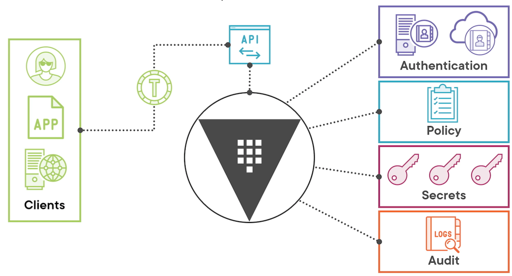
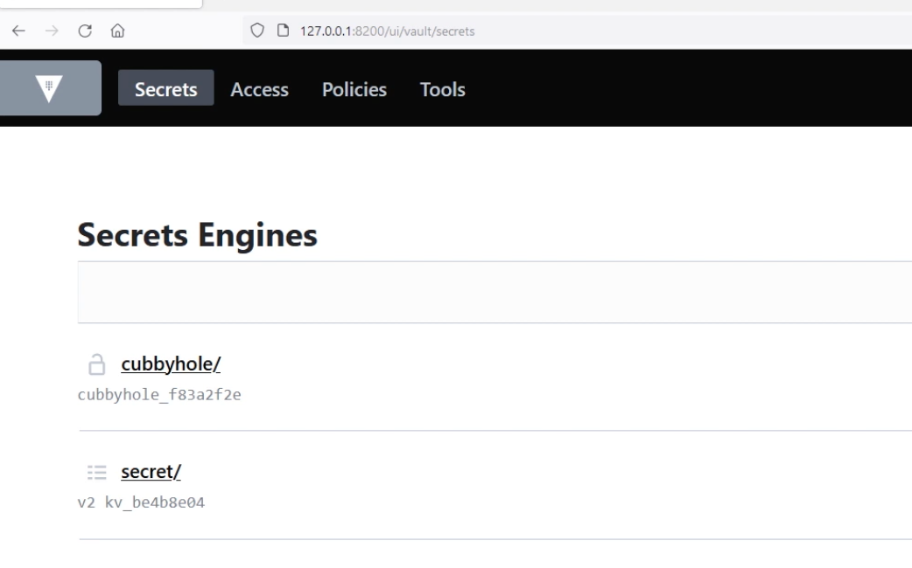

# **L1 HashiCorp Vault Overview and Installation**

## **1 Course Overview**

**Learning Path**

* Installing and Configuring Hashicorp Vault
* Managing HashiCorp Vault Server
* Managing Accessand soretsinHashicorp Vault
* Integrating HashiCorp Vault in CI/CD Pipelines

---

**Dev Path**

* Running the development instance
* Designing a deployment
* Deploying Vault server
* Configuring high availability
* Managing encryption and seal keys
* Configuring authentication and secrets
* Setting up auditing and monitoring

### **HashiCorp Vault**

* Secrets lifecycle manager
* Written in Go
* Multiple operating systems
* Same binary for client/server


### **Vault Conceptual Architecture**



## **2 Running the Development Instance**

### **Installing Vault**

```
# First we will install Vault, pick the steps for your OS
# If you're using a different flavor of Linux, check out
# the directions available here: https://learn.hashicorp.com/tutorials/vault/getting-started-install?in=vault/getting-started#install-vault

# MacOS

brew tap hashicorp/tap
brew install hashicorp/tap/vault

# Ubuntu

curl -fsSL https://apt.releases.hashicorp.com/gpg | sudo apt-key add –
sudo apt-add-repository "deb [arch=amd64] https://apt.releases.hashicorp.com $(lsb_release -cs) main"
sudo apt-get update && sudo apt-get install vault


# Now let's verify it installed successfully and is in the PATH 
# environment variable
vault version 
```

```
$ vault version 
Vault v1.12.1 (e34f8a14fb7a88af4640b09f3ddbb5646b946d9c), built 2022-10-27T12:32:05Z
```

### Running Vault in Development Mode

* Running on localhost without SSL
* In-memory storage
* Starts unsealed with token cached
* UI enabled
* Key/Value secrets engine enabled

### Dev Server

**`vault server -dev -dev-root-token-id=86753098675309`**

```
# Launch Vault in development mode
vault server –dev

# Store Vault server address in environment variable
# Linux and macOS
export VAULT_ADDR=http://127.0.0.1:8200

# Windows PowerShell
$env:VAULT_ADDR="http://127.0.0.1:8200"

# Log into Vault
vault login
```


### Vault CLI

```
# Basic vault command structure
vault <command> <subcommand> [options] [ARGUMENTS]


# Getting help with vault
vault <command> -help
vault path-help PATH
```

**Environment**


* `VAULT_ADR` - Address of the Vault server
* `VAULT_TOKEN` - Token value for requests
* `VAULT_SKIP_VERIFY` - No verify TLS cert
* `VAULT_FORMAT` - Specify output format

```
# Try the CLI
# Check for the root token
vault token lookup
```

```
$ vault token lookup
Key                 Value
---                 -----
accessor            zCpAz878fjNacWJjveqTVj2R
creation_time       1669855234
creation_ttl        0s
display_name        root
entity_id           n/a
expire_time         <nil>
explicit_max_ttl    0s
id                  hvs.xdqJDIY7fbqrz9oj2hs63nEq
meta                <nil>
num_uses            0
orphan              true
path                auth/token/root
policies            [root]
ttl                 0s
type                service
```

```
# List out the secrets engines
vault secrets list


$ vault secrets list
Path          Type         Accessor              Description
----          ----         --------              -----------
TestKV/       kv           kv_a4bf358a           Test K/V version 2
consul/       consul       consul_2ad1fcb7       n/a
cubbyhole/    cubbyhole    cubbyhole_c4a23e97    per-token private secret storage
identity/     identity     identity_20b0ef66     identity store
secret/       kv           kv_cdd1aa1f           key/value secret storage
sys/          system       system_75379b69       system endpoints used for control, policy and debugging
```

```

# Write a secret
vault kv put secret/hg2g life=42


$ vault kv put secret/hg2g life=42
== Secret Path ==
secret/data/hg2g

======= Metadata =======
Key                Value
---                -----
created_time       2022-12-04T13:24:10.534958Z
custom_metadata    <nil>
deletion_time      n/a
destroyed          false
version            1
```

**List out the auth methods**

```
$ vault auth list
Path      Type     Accessor               Description                Version
----      ----     --------               -----------                -------
token/    token    auth_token_47fd36e5    token based credentials    n/a
```



we have four different categories, 

* secrets for secrets engines, 
* access for **authentication methods**, 
* policies for dealing with **access policies**, 
* Some general tools that are available within vault.

### Using the Vault API


* RESTful
* Used by Ul and CLI
* Only way to interact with Vault
* **curl** with `X-Vault-Token` header

```
export VAULT_TOKEN=hvs.xdqJDIY7fbqrz9oj2hs63nEq


$ curl -H "X-Vault-Token: $VAULT_TOKEN" \
>   -X GET \
>   $VAULT_ADDR/v1/secret/data/hg2g | jq
  % Total    % Received % Xferd  Average Speed   Time    Time     Time  Current
                                 Dload  Upload   Total   Spent    Left  Speed
100   310  100   310    0     0  31003      0 --:--:-- --:--:-- --:--:--  302k
{
  "request_id": "8d45e8b1-8c8c-c4e2-cc1f-a25d4e00f596",
  "lease_id": "",
  "renewable": false,
  "lease_duration": 0,
  "data": {
    "data": {
      "life": "42"
    },
    "metadata": {
      "created_time": "2022-12-04T13:24:10.534958Z",
      "custom_metadata": null,
      "deletion_time": "",
      "destroyed": false,
      "version": 1
    }
  },
  "wrap_info": null,
  "warnings": null,
  "auth": null
}
```

### Module Summary

* Vault installation process
* Vault development instance
* Interaction options

