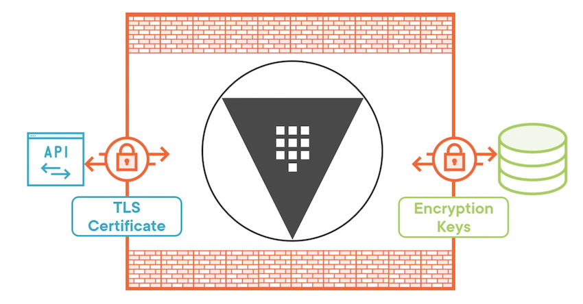
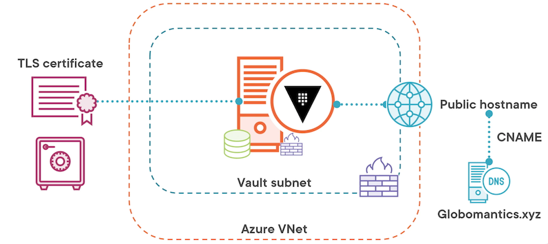
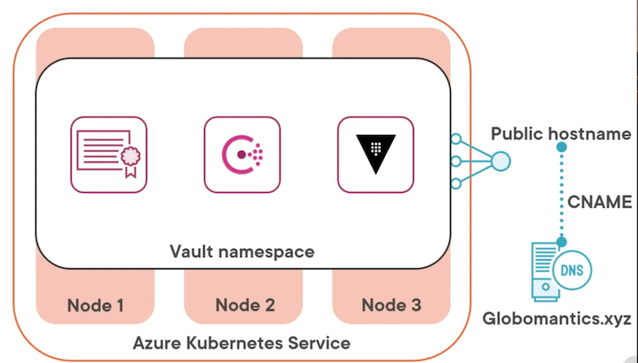

# **L2 Vault a Deployment Model**

## **1 Vault Logical Architecture**

**Vault Logical Architecture**



At the center we've got Vault, and the Vault executable running. **It's surrounded by what's called the barrier**.

**Everything inside the barrier is unencrypted, but anything that leaves the barrier has to be protected and encrypted**, and that is for both the front end and the back end.

The barrier is just the terminology that HashiCorp uses to describe where things are encrypted and protected and where they are not.

On the front end, the way that you talk to the Vault server is **through the API, which is going to be an HTTPS listener sitting on the front of the Vault deployment**. It is secured by using TLS, which requires some sort of certificate, a TLS certificate.

That will encrypt the traffic between the Vault server and the client that's asking for information from that Vault server.

Now the requests themselves coming from the client also have to have a valid Vault token in order to have permissions to perform actions on Vault, **but the actual encryption of the traffic happens via that TLS certificate**.

On the back end we have some type of storage that's supporting the Vault server, and Vault writes data to that storage in an encrypted format.

**Any information leaving Vault destined for that storage is going to leave the barrier encrypted, and the way that Vault encrypts it is by using encryption keys**.

**Those encryption keys are secured by a master key, and that master key is secured by an unsealed key which is never stored inside of Vault**.

**All you need to understand here is data leaving Vault through the barrier for the storage subsystem will always be encrypted,** so it doesn't really matter if your storage system itself supports encryption because the data's already encrypted when it leaves Vault.

### **2 Deployment Components**

**compute**

* Bare Metal / VM / Container
* Multiple Operating Systems

Could be a bare metal server where you're running Vault, it could be a virtual machine, or it could be a container that's running on Docker or through an orchestrator like Kubernetes.

Written in Go, it's compiled for multiple operating systems, so you don't just have to run on Linux; you also have the option to run Vault server on windows or OpenBSD.

**Networking aspect**

* Client and storage communication
* Load balancer or DNS

You can also achieve the same end using round‑robin DNS, but it's going to depend on what kind of endpoints you want to expose for the Vault service

**Storage type**

* HashiCorp or community support
* High availability support

**TLS certificates**

* API TLS certificate
* Storage backend traffic

### 3 Deployment Considerations

**SLA and uptime**

* Service level agreement and uptime
* Component failure

**monitor your Vault service**

* Health monitoring
* Capacity monitoring

**protect your Vault server**

* Key shares
* Server configuration
* Storage backend

The first one is key shares. **Key shares are assembled to create the unseal key for your Vault deployment**. Those need to be protected, but they shouldn't all reside in the same place. In fact, they should be distributed amongst multiple people

 And then the last component is the storage back end. This is where the data actually lives. **If you have a backup of the storage back end and you have the key shares and the server configuration, everything else can go away and you can rebuild your Vault deployment from scratch**

 **key shares and the unseal key**

* Distributed key shares
* Auto unseal

**Option 1:**

get PGP public keys from those who will have the key shares and use those public keys to encrypt the key shares and send that encrypted key share to them.

**Option 2**

considering is whether or not you want to enable Auto Unseal.

**Auto Unseal** allows the Vault to unseal itself at bootup, provided it can access a key in a remote location.

**That remote location could be something like Azure Key Vault, or it could be an on‑premises HSM**

### **Vault Server Configuration**

* **Defined in HCL(HashiCorp Configuration Language) or JSON**
* Supports multiple files
* Passed using config flag
  * The config flag can be used multiple times. If you point it at a directory, it will load all the configuration files it finds in the directory, or if you get a file, it will load just that file
  * **You can use the config flag multiple times to point it at multiple directories or files**.
* **Loaded when service starts**

### **Parameter Categories**

**Various options within those HCL or JSON files parameters**

* **Single value**
* **Listener**
  * The listener parameter category **holds all of the information of how Vault should listen to and respond to requests from clients**
* **Storage**
  * The storage block is there to define what type of storage back end you're going to use.
  * HA storage block you can specify separately if you want to use one type of storage for general data and another type of storage for the HA functionality in Vault server.
* **Seal**
  * You use this to define an Auto Unseal configuration for your Vault server
  * If you're not using Auto Unseal, you don't have to put a seal block in your configuration.
* **Telemetry**
  * defines how Vault will send information to external monitoring services.
* **Service registration**
  * This allows Vault server to register itself either with Kubernetes or with Consul and make its services available to applications that are running in those environments

### **Single value Parameter**

General Settings

* `ui = true | false`
* `disable_mlock = [true | false]`
* `log_level = "level"`
* `log_format = ["standard" | "json" ]`
* `max_lease_ttl = "768h"`
* `default_lease_ttl = "768h"`
* `cluster_addr = "https://address:port"`
* `api_addr = "https://address:port"`
* ui, and this can be set to true or false. This defines whether or not the UI, or graphical user interface, will be enabled for the Vault server.
* `disable_mlock`. This determines whether or not mlock will be disabled. The general guidance is that **`disable_mlock` should be set to false, which means that mlock is enabled.** However, in very specific cases, like if you're using the integrated storage option, it should be set to true.
* `log_level`, and this defines what level of logging that Vault server will write out. The level could be something like **info** or **warn** or **error** or even **debug**. It really depends on how much information you want in your logs.
* `log_format`. This lets you define how you want the logging written out. **generally go with JSON**, but the format you select will depend on how you ingest those logs.
* `lease TTL` that's defined for all of Vault server. You can define a `max_lease_ttl` for all of Vault server, and then you can apply a more specific `max_lease_ttl` in the configuration of secrets engines or authentication methods.
* `default_lease_ttl` for all of Vault server, which means if an explicit `default_lease_ttl` is not defined for a secrets engine or an authentication method, it will use this value instead.
* `cluster_addr` defines the address where cluster communications should be sent for this particular Vault server.
* `api_addr` defines where communications from clients should be sent for this particular Vault server.
* Both `cluster_addr` and `api_addr` are part of high availability

### **Listener Parameters and Syntax**

**Listener Parameters**

**The listener parameters define how Vault server listens for client communications and requests.**

* Address information

This defines the address on which the Vault server will listen for incoming communications, and you can do it by a specific IP address, or you can do it for all IP addresses.

* HTTP timeouts

The next category is HTTP timeouts, and this defines the timeouts for different HTTP actions that will be taken by the clients or by Vault.

* Request control

The next group of settings is all about request control, and this defines things **like the maximum request size you'll allow from the client or the maximum request duration you'll allow from a client**.

* Proxy behavior

**proxy behavior**, and this defines how Vault will behave when it gets something using the proxy protocol

Will it allow the traffic, will it deny the traffic, and what address ranges will you authorize to use the proxy protocol

* TLS settings

This is your opportunity to enable TLS, which you almost certainly want to do, and also define where the certificate is that you're going to be using for TLS.

* X-Forwarded-For

If there's an X‑Forwarded‑For header in the request, this group of settings defines how Vault will interpret and allow requests when they have that header

**`Vault-Config.hcl`**

```
# Listener Settings
listener "tcp" {

# Listener address
address = "0.0.0.0:8200"
cluster_address = "0.0.0.0:8201

# TLS settings
tls_disable = 0
tls_cert_file = "/opt/vault/tls/vault-full.pem"
tls_key_file = "/opt/vault/tls/vault-key.pem"
tls_min_version = "tls12" 
}
```

Now, let's take a look at the TLS settings that you might configure for your listener.

The first one is tls_disable = 0, and it's a little confusing the way it's worded, **but basically, if you set it to 0, that means false, which means TLS is not disabled. It's enabled**. by setting it to 0, you're enabling TLS.

### **Storage Backend**

The storage back end defines where data is persisted for Vault server. **Vault is going to encrypt all data before it leaves the barrier and gets written to that storage back end**

**Storage types**

* Object

Object‑based storage is supported for Vault server, so if you're using something like AWS S3, that's an available storage type.

* Database

It also supports database as a storage back end, so you can use something like MySQL as your storage back end.

* Key/Value

It also supports key value stores, so you can use something like HashiCorp Console, which is actually a HashiCorp‑supported storage type.

* File

And it supports file‑based storage, so you can just use the **local file system and disks on the Vault server** as your storage back end.

* Memory

Finally, **there is the memory storage type, which doesn't actually persist the data anywhere,** it's what's used for the development instance, so you're really not going to select memory unless you don't care about persisting data

* **Integrated Storage (Raft)**
  * Local storage
    * And what's interesting about Integrated Storage is it actually uses local storage on each Vault server.
  * Highly available
  * Replicated

The last storage type I want to call out explicitly, and that's Integrated Storage, also called Raft because it uses the Raft consensus.

It's also highly available because each Vault server in the cluster has a copy of the data on its local storage, and **Raft takes care of replication between all of the Vault servers by electing a leader and then replicating the data from that leader to the other Vault servers**.

### **Deployment Design**

* Deploy in Azure
* Publicly available endpoint
* Use third-party certificates
* SLA of 99.99% for Vault
* Auto unseal of Vault

### **Azure VMs Deployment**



In our Azure VM deployment, it all starts with an Azure Virtual Network, or VNet, and then within that VNet we'll have a subnet dedicated for our Vault servers. In that subnet we'll deploy an Azure virtual machine that has the Vault binary already installed, and we will load a configuration onto it.

Now we're going to need a TLS certificate to secure our client communication, and we could directly upload that certificate to our Vault server, but why not take advantage of Azure Key Vault and store our certificate in there, and **then any additional Vault servers that we spin up can simply grab the certificate from Azure Key Vault instead of uploading it during the deployment**.

So when our Vault server comes up, as part of its configuration, it's going to grab that certificate from the Key Vault and use it to secure its client connections.

Speaking of those client connections, since we need a publicly available endpoint, we're going to add a public IP address to this Azure VM.

In a later iteration, we'll move that to a load balancer, but for right now we'll just attach that public IP address directly to the Azure virtual machine. Now because we're using a publicly available endpoint and a third‑party TLS certificate, we're going to need a domain to associate that with.

We're going to be using the Globomantics.xyz domain for our Vault deployment. So for instance, our public endpoint could be vault‑vms.Globomantics.xyz. Once we set up a public IP address, we can also associate a public host name with that public IP address, and then we can create a CNAME record in our public DNS that maps to the desired subject name that we've used in our TLS certificate.

Next up, we want to secure network traffic that's coming to our Vault server and make sure it's only using the ports that are actually needed. That's port 8200 and possibly 8201 for cluster communication, so we can add network security groups to both the virtual machine itself and the Vault subnet as a whole.

And then lastly, for storage, **we're going to go with Integrated Storage for our Azure VM so it's not reliant on any external storage services for that storage back end**.

### Azure Kubernetes Service Deployment



HashiCorp recommends that when you're deploying Vault on Kubernetes that it has its own dedicated cluster due to the sensitive nature of what's being stored by Vault.

**You can use Azure Kubernetes Service to spin up a small three‑node cluster that meets those needs. Within the cluster we'll create a namespace called Vault,** and then within that namespace **we'll first create a secret that holds our TLS certificate we'll use to secure client communication**.

**For our storage back end, we can take advantage of Consul**, which is available as a Helm chart, so we can easily deploy Consul to our Kubernetes environment.

And then we can deploy Vault also using a Helm chart to the same namespace and have it take advantage of the Consul deployment for storage and automatically load the TLS certificate that's stored in the secret in the same namespace.

Now of course, we need that public endpoint again, so we can configure the Vault service to be of type load balancer, which exposes a public IP address, and, once again, we're going to be using the Globomantics.xyz domain for our certificates and our public endpoint The exposed public IP address will get a public hostname that we can define through annotations for the service, and then **we can again use a CNAME record to point the desired subject name to the public hostname that's associated with our Vault service**.

### Module Summary

* Vault deployment depends on requirements
* Vault configuration is defined by HCL or JSON files
* Listener controls how Vault receives requests
* Storage determines where data is stored
