# **L3 Deploying Vault Server**

* Procuring TLS certificates
* Deploying Azure VM
* Deploying Azure Kubernetes Service

### **TLS Certificates**

**Certificate Provisioning**

* Third party certificate from public CA
* Using ACME protocol and Let's Encrypt
* Can be automated for renewal

**Prerequisites**

* Registered public domain
* OpenSSL installed

**Tasks**

* Prepare requests
* Validate with DNS
* Generate PFX files

### **Provisioning the Azure VM Certificate**

We are going to use certbot to create a 3rd party certificate for our Vault server instances. You will need to have a registered domain to do this.

Before you run the commands, log into your domain hosting service and be ready to add a TXT record to your domain

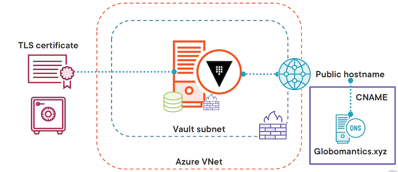

**First set the domain name you are going to create a certificate for**

```
domain_name=YOUR_DOMAIN_NAME
```

We are going to create two certificates: **one for Azure VMs and one for AKS**

```
vm_request_name=vault-vms.${domain_name}

aks_request_name=vault-aks.${domain_name}
```

Next we will install certbot if you don't already have it

```
sudo apt install certbot -y
```

Now we are going to request a certificate from Let's Encrypt using the manual verification process for the Azure VMs

```
sudo certbot certonly --manual -d $vm_request_name --agree-tos -m noone@${domain_name} --no-eff-email --preferred-challenges dns
```

Agree to your IP being logged

**Create a TXT record on your domain and then hit enter**

**Copy your pem files to the cert-gen folder**

```
sudo cp /etc/letsencrypt/live/${vm_request_name}/fullchain.pem vm_fullchain.pem
sudo cp /etc/letsencrypt/live/${vm_request_name}/privkey.pem vm_privkey.pem
```

Now we'll create our PFX file that we can upload to Key Vault for the Azure VMs

```
openssl pkcs12 -export -out vm-certificate-to-import.pfx -inkey vm_privkey.pem -in vm_fullchain.pem -passout pass:
```

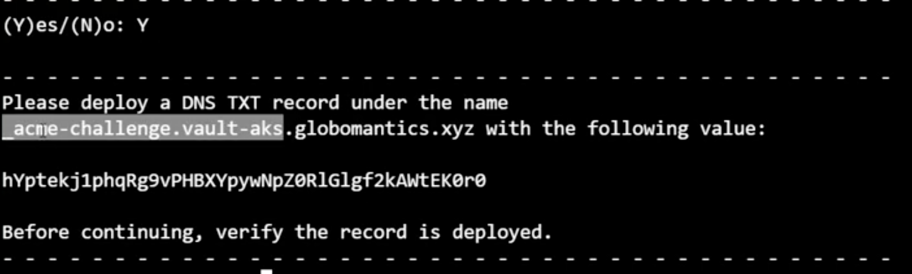

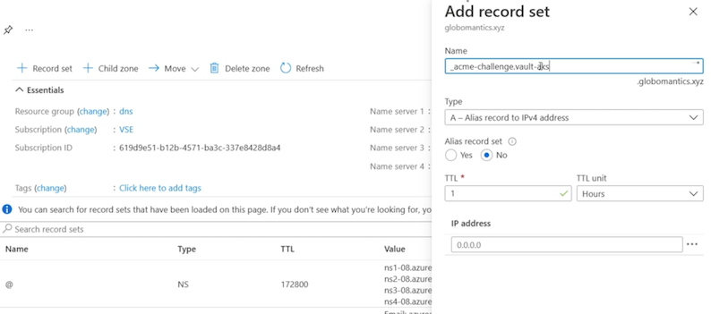

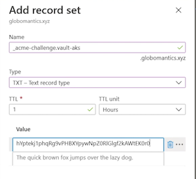

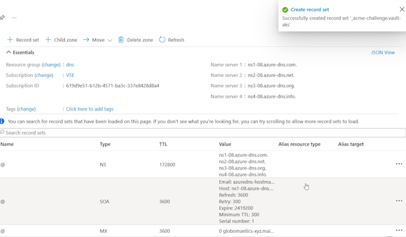

### **Provisioning the AKS Certificate**

```
# Repeat the process for the AKS certificate
sudo certbot certonly --manual -d $aks_request_name --agree-tos -m noone@${domain_name} --no-eff-email --preferred-challenges dns

# Copy your pem files to the cert-gen folder
sudo cp /etc/letsencrypt/live/${aks_request_name}/fullchain.pem aks_fullchain.pem
sudo cp /etc/letsencrypt/live/${aks_request_name}/privkey.pem aks_privkey.pem

# Create the PFX file
openssl pkcs12 -export -out aks-certificate-to-import.pfx -inkey aks_privkey.pem -in aks_fullchain.pem -passout pass:
```

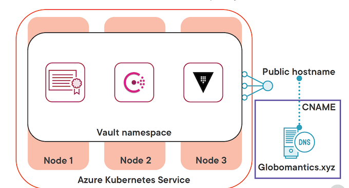

We have our two certificates, one for the Azure VMs and one for AKS.

### **Deploying the Azure VM Infrastructure**

Terraform can use your login credentials from the Azure CLI

Make sure you are logged into Azure with the CLI and have the

correct subscription selected.

```
az login
az account set -s SUBSCRIPTION_NAME
```

First we are going to initialize the Terraform config

```
terraform init
```

* **`vnet.tf`**

```
resource "azurerm_resource_group" "vault" {
  name     = local.resource_group_name
  location = var.location
}

# Virtual network with a Vault subnet
module "vnet" {
  source              = "Azure/vnet/azurerm"
  version             = "~> 2.0"
  resource_group_name = azurerm_resource_group.vault.name
  vnet_name           = azurerm_resource_group.vault.name
  address_space       = var.address_space
  subnet_prefixes     = var.subnet_prefixes
  subnet_names        = var.subnet_names

  subnet_service_endpoints = {
    (var.subnet_names[0]) = ["Microsoft.KeyVault"]
  }

}

resource "azurerm_nat_gateway" "vault" {
  location            = var.location
  name                = local.nat_gateway_name
  resource_group_name = azurerm_resource_group.vault.name
  sku_name            = "Standard"
}

resource "azurerm_public_ip" "vault_nat" {
  allocation_method   = "Static"
  location            = var.location
  name                = "${local.nat_gateway_name}-vault-nat"
  resource_group_name = azurerm_resource_group.vault.name
  sku                 = "Standard"
}

resource "azurerm_nat_gateway_public_ip_association" "vault" {
  nat_gateway_id       = azurerm_nat_gateway.vault.id
  public_ip_address_id = azurerm_public_ip.vault_nat.id
}

resource "azurerm_subnet_nat_gateway_association" "vault" {
  nat_gateway_id = azurerm_nat_gateway_public_ip_association.vault.nat_gateway_id
  subnet_id      = module.vnet.vnet_subnets[0]
}
```

* **`vms.tf`**

```
# Generate key pair for all VMs
resource "tls_private_key" "vault" {
  algorithm = "RSA"
  rsa_bits  = "2048"
}

# Write private key out to a file
resource "local_file" "private_key" {
  content  = tls_private_key.vault.private_key_pem
  filename = "${path.root}/azure_vms_private_key.pem"
}

# Create User Identities for Vault VMs
resource "azurerm_user_assigned_identity" "vault" {
  resource_group_name = azurerm_resource_group.vault.name
  location            = var.location

  name = local.vault_user_id
}

##################### Vault VM RESOURCES ###################################

resource "azurerm_availability_set" "vault" {
  name                         = local.vault_vm
  location                     = var.location
  resource_group_name          = azurerm_resource_group.vault.name
  platform_fault_domain_count  = 3
  platform_update_domain_count = 2
  managed                      = true
}

resource "azurerm_public_ip" "vault" {
  count               = var.vault_vm_count
  name                = "${local.pip_name}-${count.index}"
  resource_group_name = azurerm_resource_group.vault.name
  location            = azurerm_resource_group.vault.location
  allocation_method   = "Static"
  domain_name_label   = "${lower(azurerm_resource_group.vault.name)}-${count.index}"
  sku                 = "Standard"
}

resource "azurerm_network_interface" "vault" {
  count               = var.vault_vm_count
  name                = "${local.vault_vm}-${count.index}"
  location            = var.location
  resource_group_name = azurerm_resource_group.vault.name

  ip_configuration {
    name                          = "internal"
    subnet_id                     = module.vnet.vnet_subnets[0]
    private_ip_address_allocation = "Dynamic"
    public_ip_address_id          = azurerm_public_ip.vault[count.index].id
  }
}

# Associate the network interfaces from the Vault VMs with the Vault NSG
resource "azurerm_network_interface_security_group_association" "vault" {
  count                     = var.vault_vm_count
  network_interface_id      = azurerm_network_interface.vault[count.index].id
  network_security_group_id = azurerm_network_security_group.vault_nics.id
}

# Associate the network interfaces from the Vault VMs with the Vault ASG for NSG rules
resource "azurerm_network_interface_application_security_group_association" "vault" {
  count                         = var.vault_vm_count
  network_interface_id          = azurerm_network_interface.vault[count.index].id
  application_security_group_id = azurerm_application_security_group.vault_asg.id
}

resource "azurerm_linux_virtual_machine" "vault" {
  count               = var.vault_vm_count
  name                = "${local.vault_vm}-${count.index}"
  location            = var.location
  resource_group_name = azurerm_resource_group.vault.name
  size                = var.vault_vm_size
  admin_username      = "azureuser"
  computer_name       = "vault-${count.index}"
  availability_set_id = azurerm_availability_set.vault.id
  network_interface_ids = [
    azurerm_network_interface.vault[count.index].id,
  ]

  admin_ssh_key {
    username   = "azureuser"
    public_key = tls_private_key.vault.public_key_openssh
  }

  # Using Standard SSD tier storage
  # Accepting the standard disk size from image
  # No data disk is being used
  os_disk {
    caching              = "ReadWrite"
    storage_account_type = "StandardSSD_LRS"
  }

  #Source image is hardcoded b/c I said so
  source_image_reference {
    publisher = "Canonical"
    offer     = "UbuntuServer"
    sku       = "18.04-LTS"
    version   = "latest"
  }

  identity {
    type         = "UserAssigned"
    identity_ids = [azurerm_user_assigned_identity.vault.id]
  }

  #Custom data from the vault.tmpl file
  custom_data = base64encode(
    templatefile("${path.module}/vault.tpl", {
      vault_version       = var.vault_version
      key_vault_secret_id = azurerm_key_vault_certificate.vault.secret_id
    })
  )
}
```

* **`nsg.tf`**

```
# Create Network Security Groups for subnets
resource "azurerm_network_security_group" "vault_net" {
  name                = local.vault_net_nsg
  location            = var.location
  resource_group_name = azurerm_resource_group.vault.name
}

resource "azurerm_subnet_network_security_group_association" "vault" {
  subnet_id                 = module.vnet.vnet_subnets[0]
  network_security_group_id = azurerm_network_security_group.vault_net.id
}

# Create Network Security Groups for NICs

resource "azurerm_network_security_group" "vault_nics" {
  name                = local.vault_nic_nsg
  location            = var.location
  resource_group_name = azurerm_resource_group.vault.name
}

# Create application security groups for Vault VMs

resource "azurerm_application_security_group" "vault_asg" {
  name                = local.vault_asg
  location            = var.location
  resource_group_name = azurerm_resource_group.vault.name
}

# Inbound rules for vault subnet nsg

resource "azurerm_network_security_rule" "vault_8200" {
  name                                       = "allow_8200"
  priority                                   = 100
  direction                                  = "Inbound"
  access                                     = "Allow"
  protocol                                   = "Tcp"
  source_port_range                          = "*"
  destination_port_range                     = "8200"
  source_address_prefix                      = "*"
  destination_application_security_group_ids = [azurerm_application_security_group.vault_asg.id]
  resource_group_name                        = azurerm_resource_group.vault.name
  network_security_group_name                = azurerm_network_security_group.vault_net.name
}

resource "azurerm_network_security_rule" "vault_8201" {
  name                                       = "allow_8201"
  priority                                   = 110
  direction                                  = "Inbound"
  access                                     = "Allow"
  protocol                                   = "Tcp"
  source_port_range                          = "*"
  destination_port_range                     = "8201"
  source_application_security_group_ids      = [azurerm_application_security_group.vault_asg.id]
  destination_application_security_group_ids = [azurerm_application_security_group.vault_asg.id]
  resource_group_name                        = azurerm_resource_group.vault.name
  network_security_group_name                = azurerm_network_security_group.vault_net.name
}

resource "azurerm_network_security_rule" "vault_ssh" {
  name                                       = "allow_ssh"
  priority                                   = 120
  direction                                  = "Inbound"
  access                                     = "Allow"
  protocol                                   = "Tcp"
  source_port_range                          = "*"
  destination_port_range                     = "22"
  source_address_prefix                      = "${data.http.my_ip.body}/32" # Restrict to your public IP address
  destination_application_security_group_ids = [azurerm_application_security_group.vault_asg.id]
  resource_group_name                        = azurerm_resource_group.vault.name
  network_security_group_name                = azurerm_network_security_group.vault_net.name
}

# Inbound rules for vault nic nsg

resource "azurerm_network_security_rule" "vault_nic_8200" {
  name                                       = "allow_8200"
  priority                                   = 100
  direction                                  = "Inbound"
  access                                     = "Allow"
  protocol                                   = "Tcp"
  source_port_range                          = "*"
  destination_port_range                     = "8200"
  source_address_prefix                      = "*"
  destination_application_security_group_ids = [azurerm_application_security_group.vault_asg.id]
  resource_group_name                        = azurerm_resource_group.vault.name
  network_security_group_name                = azurerm_network_security_group.vault_nics.name
}

resource "azurerm_network_security_rule" "vault_nic_8201" {
  name                                       = "allow_8201"
  priority                                   = 110
  direction                                  = "Inbound"
  access                                     = "Allow"
  protocol                                   = "Tcp"
  source_port_range                          = "*"
  destination_port_range                     = "8201"
  source_application_security_group_ids      = [azurerm_application_security_group.vault_asg.id]
  destination_application_security_group_ids = [azurerm_application_security_group.vault_asg.id]
  resource_group_name                        = azurerm_resource_group.vault.name
  network_security_group_name                = azurerm_network_security_group.vault_nics.name
}

resource "azurerm_network_security_rule" "vault_nic_ssh" {
  name                                       = "allow_ssh"
  priority                                   = 120
  direction                                  = "Inbound"
  access                                     = "Allow"
  protocol                                   = "Tcp"
  source_port_range                          = "*"
  destination_port_range                     = "22"
  source_address_prefix                      = "${data.http.my_ip.body}/32" # Restrict to your public IP address
  destination_application_security_group_ids = [azurerm_application_security_group.vault_asg.id]
  resource_group_name                        = azurerm_resource_group.vault.name
  network_security_group_name                = azurerm_network_security_group.vault_nics.name
}
```

* **`terraform.tf`**

```
# This configuration spins up three Azure VMs that will form
# the Vault cluster. The virtual machines will be placed behind
# a public facing load balancer to expose the UI and API port

terraform {
  required_providers {
    azurerm = {
      source  = "hashicorp/azurerm"
      version = "~> 2.0"
    }
  }
}

provider "azurerm" {
  features {}
}

# Used to get tenant ID as needed
data "azurerm_client_config" "current" {}
```

* **`keyvault.tf`**

```

# Get your current IP address to provide access to Key Vault in the network acls
data "http" "my_ip" {
  url = "http://ifconfig.me"
}

# Create key vault and access policies
resource "azurerm_key_vault" "vault" {
  name                       = local.key_vault_name
  location                   = var.location
  resource_group_name        = azurerm_resource_group.vault.name
  tenant_id                  = data.azurerm_client_config.current.tenant_id
  enabled_for_deployment     = true
  soft_delete_retention_days = 7
  purge_protection_enabled   = false

  sku_name = "standard"

  # Only allow access to the Key Vault from your public IP address and the vault 
  # subnet.
  network_acls {
    default_action             = "Deny"
    bypass                     = "AzureServices"
    ip_rules                   = ["${data.http.my_ip.body}/32"]
    virtual_network_subnet_ids = [module.vnet.vnet_subnets[0]]

  }

}

# Access policy for vault VMs
# Uses the vault user assigned identity
resource "azurerm_key_vault_access_policy" "vault" {
  key_vault_id = azurerm_key_vault.vault.id

  tenant_id = data.azurerm_client_config.current.tenant_id
  object_id = azurerm_user_assigned_identity.vault.principal_id

  key_permissions = [
    "get", "list", "update", "create", "decrypt", "encrypt", "unwrapKey", "wrapKey", "verify", "sign",
  ]

  secret_permissions = [
    "get", "list",
  ]

  certificate_permissions = [
    "get", "list",
  ]
}

# Access policy allowing your credentials full access to Key Vault
resource "azurerm_key_vault_access_policy" "you" {
  key_vault_id = azurerm_key_vault.vault.id

  tenant_id = data.azurerm_client_config.current.tenant_id
  object_id = data.azurerm_client_config.current.object_id

  key_permissions = [
    "get", "list", "update", "create", "decrypt", "encrypt", "unwrapKey", "wrapKey", "verify", "sign", "delete", "purge",
  ]

  secret_permissions = [
    "get", "list", "set", "delete", "purge",
  ]

  certificate_permissions = [
    "get", "list", "create", "import", "delete", "update", "purge",
  ]
}

# Create a certificate in Key Vault for the Vault server
resource "azurerm_key_vault_certificate" "vault" {
  depends_on   = [azurerm_key_vault_access_policy.you]
  name         = "${local.resource_group_name}-cert"
  key_vault_id = azurerm_key_vault.vault.id

  certificate {
    contents = filebase64(var.cert_pfx_file_path)
    password = ""
  }

  certificate_policy {
    issuer_parameters {
      name = "Self"
    }

    key_properties {
      exportable = true
      key_size   = 2048
      key_type   = "RSA"
      reuse_key  = false
    }

    secret_properties {
      content_type = "application/x-pkcs12"
    }
  }
}
```

* **`variables.tf`**

```
variable "location" {
  type    = string
  default = "East US"
}

variable "address_space" {
  type    = list(string)
  default = ["10.0.0.0/16"]
}

variable "subnet_prefixes" {
  type = list(string)
  default = [
    "10.0.0.0/24",
  ]
}

variable "subnet_names" {
  type = list(string)
  default = [
    "vault-servers",
  ]
}

variable "vault_vm_size" {
  type    = string
  default = "Standard_B2ms"
}

variable "vault_vm_count" {
  type    = number
  default = 1
}

variable "cert_pfx_file_path" {
  type        = string
  description = "The full path to the pfx file to be used for Vault"
  default     = "../1-cert-gen/vm-certificate-to-import.pfx"
}

variable "leader_tls_servername" {
  type        = string
  description = "The fqdn used to generate the certificate."
}

variable "vault_version" {
  type        = string
  description = "The version of the Vault binary to download."
  default     = "1.8.0"
}
resource "random_id" "id" {
  byte_length = 4
}

locals {
  resource_group_name = "vault-${random_id.id.hex}"

  vault_net_nsg = "vault-net-${random_id.id.hex}"

  vault_nic_nsg = "vault-nic-${random_id.id.hex}"

  vault_asg = "vault-asg-${random_id.id.hex}"

  vault_vm = "vault-${random_id.id.hex}"

  vault_user_id = "vault-userid-${random_id.id.hex}"

  pip_name = "vault-${random_id.id.hex}"

  key_vault_name = "vault-${random_id.id.hex}"

  nat_gateway_name = "vault-${random_id.id.hex}"

}
```

**`outputs.tf`**

```
# The dns label from the load balancer
output "public_dns_name" {
  value = azurerm_public_ip.vault[*].fqdn
}

# The public IP address of the load balancer
output "public_ip_address" {
  value = azurerm_public_ip.vault[*].ip_address
}
```

**Next we are going to plan our deployment**

Make sure to change the `YOUR_CERTIFICATE_CN` to the fqdn onyour TLS certificate. Ex. `vault-vms.globomantics.xyz`

**`certificate_cn=YOUR_CERTIFICATE_CN`**

```
terraform plan -var leader_tls_servername=$certificate_cn -out azurevm.tfplan

# Now we'll apply the plan to create the resources
terraform apply azurevm.tfplan
```

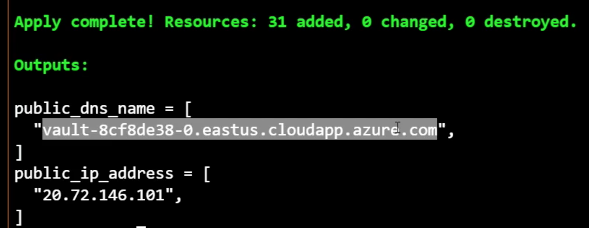

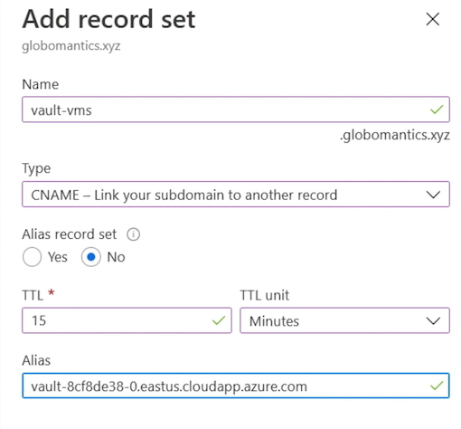

### Reviewing the Vault Deployment Script

Now we'll connect to the Vault server using SSH to install Vault

```
ssh -i ~/.ssh/azure_vms_private_key.pem azureuser@PUBLIC_IP_ADDRESS
```

**Here's the script that ran when the virtual machine came up. Now the important stuff to note here is that we install the Vault binary along with some other things, we install the Azure CLI**.

`vault.tpl`

```
#!/usr/bin/env bash
set -e -o pipefail

# Terraform variables used: 
# vault_version - version of the Vault binary to download
# key_vault_secret_id - Id of the Key Vault secret holding the certificates

# Get the instance name and local ipv4 address
export instance_name="$(curl -sH Metadata:true --noproxy '*' 'http://169.254.169.254/metadata/instance/compute/name?api-version=2020-09-01&format=text')"
export local_ipv4="$(curl -sH Metadata:true --noproxy '*' 'http://169.254.169.254/metadata/instance/network/interface/0/ipv4/ipAddress/0/privateIpAddress?api-version=2020-09-01&format=text')"

# Get the Vault binary
curl -fsSL https://apt.releases.hashicorp.com/gpg | sudo apt-key add -
sudo apt-add-repository "deb [arch=amd64] https://apt.releases.hashicorp.com $(lsb_release -cs) main"
sudo apt-get update
sudo apt-get install python3-pip vault=${vault_version} -y

# Install Azure CLI
pip3 install --user 'azure-cli~=2.26.0' 'azure-mgmt-core~=1.2.0' 'cryptography~=3.3.2' 'urllib3[secure]~=1.26.5' 'requests~=2.25.1'

# configuring Azure CLI for use with VM managed identity
~/.local/bin/az login --identity --allow-no-subscriptions

# removing any default installation files from /opt/vault/tls/
rm -rf /opt/vault/tls/*

# set up the certificates
touch /opt/vault/tls/{vault-cert.pem,vault-ca.pem,vault-key.pem,vault-full.pem}
chown vault:vault /opt/vault/tls/{vault-cert.pem,vault-ca.pem,vault-key.pem,vault-full.pem}
chmod 0640 /opt/vault/tls/{vault-cert.pem,vault-ca.pem,vault-key.pem,vault-full.pem}

secret_result=$(~/.local/bin/az keyvault secret show --id "${key_vault_secret_id}" --query "value" --output tsv)

echo $secret_result | base64 -d | openssl pkcs12 -clcerts -nokeys -passin pass: | openssl x509 -out /opt/vault/tls/vault-cert.pem

echo $secret_result | base64 -d | openssl pkcs12 -cacerts -nokeys -chain -passin pass: | openssl x509 -out /opt/vault/tls/vault-ca.pem

echo $secret_result | base64 -d | openssl pkcs12 -nocerts -nodes -passin pass: | openssl pkcs8 -nocrypt -out /opt/vault/tls/vault-key.pem

echo $secret_result | base64 -d | openssl pkcs12 -nokeys -passin pass: -out /opt/vault/tls/vault-full.pem

chown -R vault:vault /etc/vault.d/*
chmod -R 640 /etc/vault.d/*
```

There is a managed identity associated with that virtual machine, and what this managed identity does is provide access to the Key Vault that we created as well.

The initialization script can take up to 5 minutes to complete. If you don't see the expected files wait a few minutes and check again.

Once it uses az login to login with its managed identity, we'll remove the existing certificates that are put in place by the default Vault installation, and set up our new certificates that we get from Azure Key Vault.

We'll go ahead and grab the certificate from Azure Key Vault using az keyvault secret show, and then we're going to parse that certificate in a number of different ways to get four different files.

**We're going to get vault‑cert, vault‑ca, vault‑key, and vault‑full, and we can use all of these different certificates in our Vault configuration**

```
# Once you're connected we'll walk through the process of installing Vault server and raft cluster
# First let's check out what the installation created

ls /etc/vault.d
ls /opt/vault
cat /etc/passwd | grep vault
```

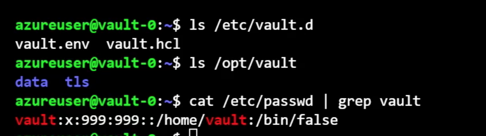

```
# The script also copied the pfx file from Key Vault and placed the contents 
# where we need them for Raft and Vault
sudo cat /opt/vault/tls/vault-ca.pem | openssl x509 -text -nocert
```

So I'm going to go ahead and delete the existing hcl file, and we're going to create a new instance of it. So I'll go ahead and run the removal command first.

```
# The next step is to overwrite the existing HCL file with our actual config
sudo rm /etc/vault.d/vault.hcl
```

```
# Get local IPv4 address
ip a show eth0
```

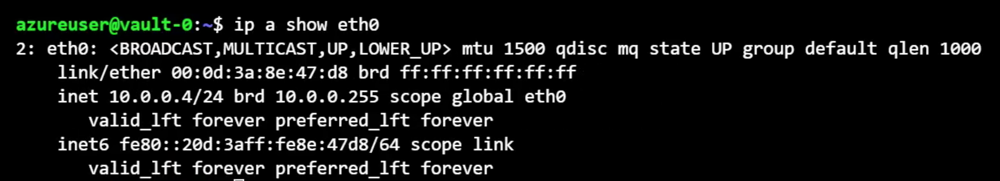

### Loading the Vault Configuration

```
sudo vi /etc/vault.d/vault.hcl
```

**`vault.hcl`**

```
# General parameters
cluster_name = "vault-vms"
log_level = "Info"
ui = true

# HA parameters
cluster_addr = "https://LOCAL_IPV4:8201"
api_addr = "https://LOCAL_IPV4:8200"

# Listener configuration
listener "tcp" {
 # Listener address
 address     = "0.0.0.0:8200"

 # TLS settings
 tls_disable = 0
 tls_cert_file      = "/opt/vault/tls/vault-full.pem"
 tls_key_file       = "/opt/vault/tls/vault-key.pem"
 tls_client_ca_file = "/opt/vault/tls/vault-ca.pem"
 tls_min_version = "tls12"
}

# Storage configuration
storage "raft" {
  path    = "/opt/vault/data"
  node_id = "vault-0"
  retry_join {
    leader_tls_servername = "LEADER_TLS_SERVERNAME"
    leader_api_addr = "https://LEADER_TLS_SERVERNAME:8200"
    leader_ca_cert_file = "/opt/vault/tls/vault-ca.pem"
    leader_client_cert_file = "/opt/vault/tls/vault-cert.pem"
    leader_client_key_file = "/opt/vault/tls/vault-key.pem"
  }
}
```

The `leader_tls_servername `is actually going to be the public endpoint for our Vault `vault‑vms.globomantics.xyz`.

**The reason we set `tls_servername` to the same as what's on our certificate is because we're going to use that same certificate to secure communications within the cluster. **

By pointing it at the public endpoint, it's going to go to the active Vault server, which is this VM.

* For the `leader_ca_cert`, we're pointing it at the `vault‑ca.pem`.
* For the client certificate file, we're using `vault‑cert.pem`.
* For the `client_key_file`, we're pointing it at `vault‑key.pem`. Remember, the subject name on the certificate is `vault‑vms.globomantics.xyz.`

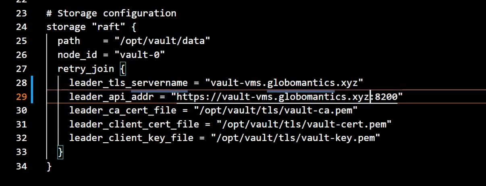

```
sudo vi /etc/vault.d/vault.hcl

# Now we can enable the vault service and start it
sudo systemctl enable vault
sudo systemctl start vault
```

### **Starting up the Vault Service**

```
# Now we'll check the vault service status with journalctl
journalctl -u vault
```

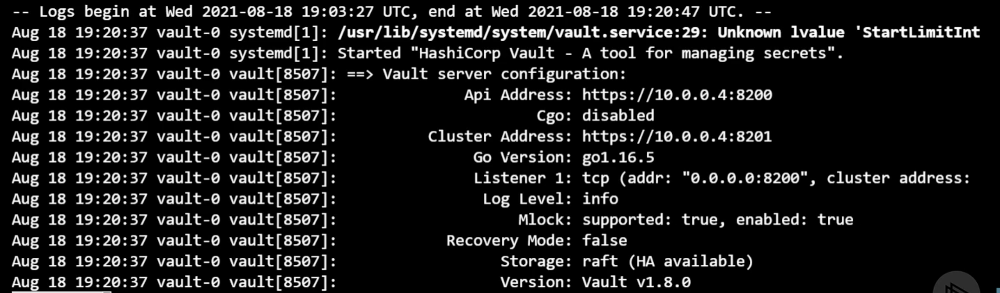

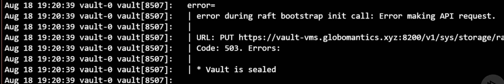

```
# Assuming the Vault service is running, let's check the status
export VAULT_ADDR="https://YOUR_VAULT_FQDN:8200"

vault status

# Cool, the next step is to initialize the Vault server
# We will do that in the next module
# Do not destroy this Vault deployment!
```

```
# Assuming the Vault service is running, let's check the status
export VAULT_ADDR="https://YOUR_VAULT_FQDN:8200"

vault status
```

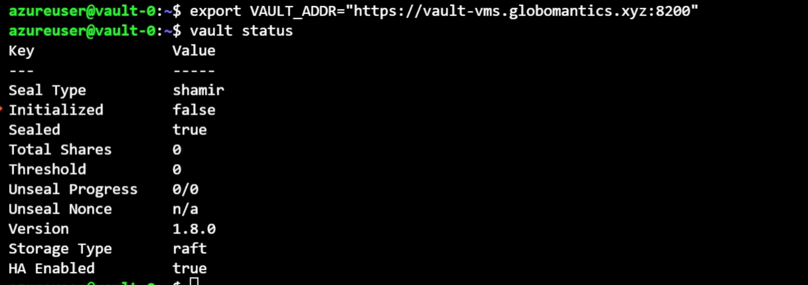

And now we can run vault status to get the status of our Vault server.

**And we can see that it is not initialized**.

**That's set to false. We can see that the vault is currently sealed and that the Storage Type is raft**.

This Vault server is all ready to go. We just need to initialize it and unseal it.

## Azure Kubernetes Service Deployment

we're going to deploy a three‑node cluster of Azure Kubernetes Service and create a Vault namespace where we're going to deploy all of our components, **including the secret, HashiCorp Consul, and HashiCorp Vault**.

At the end of it all, **we're going to have a public hostname, and we're going to, once again, need to create a CNAME record in our DNS zone that points to that public hostname**.

### **Deploying the AKS Cluster**

**`aks.tf`**

```
# Resource group for the AKS cluster
resource "azurerm_resource_group" "aks" {
  name = local.resource_group_name
  location = var.location
}

resource "azurerm_kubernetes_cluster" "aks" {
  name = local.aks_cluster_name
  location = azurerm_resource_group.aks.location
  resource_group_name = azurerm_resource_group.aks.name
  dns_prefix = local.aks_dns_prefix

  kubernetes_version = var.aks_kubernetes_version

  default_node_pool {
    name = "default"
    node_count = var.node_count
    vm_size = var.node_size
  }

  identity {
    type = "SystemAssigned"
  }
}
```

**`terraform.tf`**

```
# This configuration spins up an AKS cluster with a single node pool
# composed of three nodes. The deployment creates a standalone Vnet
# and uses the default networking options.

terraform {
  required_providers {
    azurerm = {
      source  = "hashicorp/azurerm"
      version = "~> 2.0"
    }
  }
}

provider "azurerm" {
  features {}
}

# Used to get tenant ID as needed
data "azurerm_client_config" "current" {}
```

**`variables.tf`**

```
variable "location" {
  type    = string
  default = "East US"
}

variable "aks_kubernetes_version" {
  type = string
  default = "1.20.7"
}

variable "node_count" {
  type = number
  default = 3
}

variable "node_size" {
  type = string
  default = "Standard_B2ms"
}
resource "random_id" "id" {
  byte_length = 4
}


locals {
  resource_group_name = "vault-${random_id.id.hex}"

  aks_cluster_name = "vault-${random_id.id.hex}"

  aks_dns_prefix = lower(local.aks_cluster_name)

}
```

**`outputs.tf`**

```
output "resource_group_name" {
  value = azurerm_resource_group.aks.name
}

output "cluster_name" {
  value = local.aks_cluster_name
}
```

We are going to use the Terraform to spin up an AKS cluster

> NOTE: You do not have to use AKS for the demo. You could use another hosted option like EKS or GKE, or run this locally using KinD.
>
> These rest of the demo will assume AKS, but feel free to map it to your preferred K8s environment.

```
# Log into Azure
az login

# Select the proper subscription
az account set -s SUBSCRIPTION_NAME

# Initialize terraform and run a plan
terraform init

terraform plan -out aks.tfplan


# Create the AKS cluster
terraform apply aks.tfplan

# Set the resource group name and cluster name
rg_name=
c_name=
```

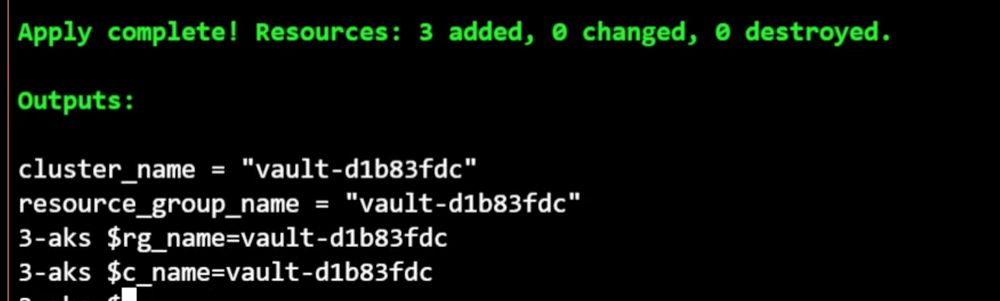

```
# Retrieve the credentials
az aks get-credentials --resource-group $rg_name --name $c_name
```

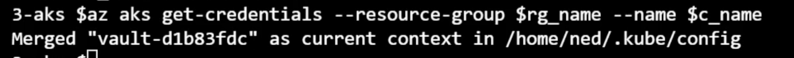

```
# Verify kubectl credentials
kubectl get nodes
```

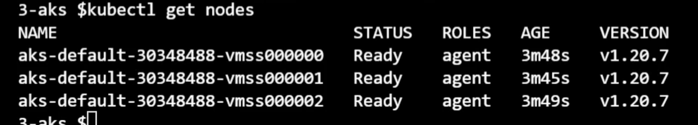

### **Creating the TLS Secret**

```
# Now that we have a K8s cluster to work with, let's get Vault deployed with Helm
SECRET_NAME=vault-tls
NAMESPACE=vault
certificate_cn=YOUR_CERTIFICATE_CN
```

First we will add the Helm repo for Vault

```
helm repo add hashicorp https://helm.releases.hashicorp.com
helm repo update

# Add a namespace for the Vault cluster
kubectl create namespace ${NAMESPACE}
```

Create a secret with the Vault certificate info

Extract the crt, key, and ca info from the PFX file

```
openssl pkcs12 -cacerts -nokeys -in ../1-cert-gen/aks-certificate-to-import.pfx -passin pass: | openssl x509 -out vault.ca
openssl pkcs12 -nokeys -in ../1-cert-gen/aks-certificate-to-import.pfx -passin pass: -out vault.crt
openssl pkcs12 -nocerts -nodes -in ../1-cert-gen/aks-certificate-to-import.pfx -passin pass: | openssl pkcs8 -nocrypt -out vault.key
```

```
kubectl create secret generic ${SECRET_NAME} \
  --namespace ${NAMESPACE} \
  --from-file=vault.key=vault.key \
  --from-file=vault.crt=vault.crt \
  --from-file=vault.ca=vault.ca
```

### **Deploying the Consul Storage**

```
# Clean up
rm vault.*
```

```
# Deploy Consul to provide storage for Vault
helm install consul hashicorp/consul --namespace vault
```

```
# We can monitor the install by doing a watch on the namespace
kubectl get pods -n vault -w

```

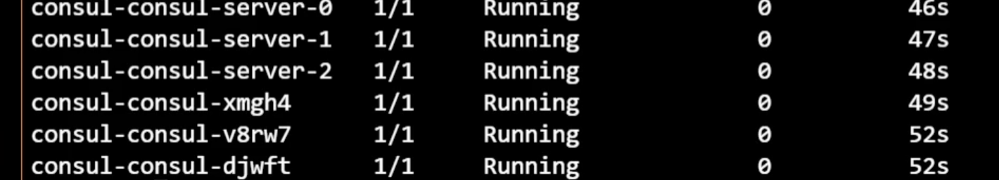

**`overrides.yaml`**

```
# Vault Helm Chart Value Overrides
global:  
  enabled: true  
  tlsDisable: false

server:

  readinessProbe:
    enabled: true
    path: "/v1/sys/health?standbyok=true&sealedcode=204&uninitcode=204"
  livenessProbe:
    enabled: true
    path: "/v1/sys/health?standbyok=true"
    initialDelaySeconds: 60

  extraEnvironmentVars:
    VAULT_CACERT: /vault/userconfig/vault-tls/vault.ca
    VAULT_SKIP_VERIFY: true

  extraVolumes:
    - type: secret
      name: vault-tls

  ha:
    enabled: true
    replicas: 3
    config: |
      listener "tcp" {
        address = "[::]:8200"
        cluster_address = "[::]:8201"
        tls_cert_file = "/vault/userconfig/vault-tls/vault.crt"
        tls_key_file  = "/vault/userconfig/vault-tls/vault.key"
        tls_client_ca_file = "/vault/userconfig/vault-tls/vault.ca"
      }

      storage "consul" {
        path = "vault"
        address = "HOST_IP:8500"
      }

      service_registration "kubernetes" {}

  service:
    type: LoadBalancer
    annotations: |
      "service.beta.kubernetes.io/azure-dns-label-name": "CLUSTER_NAME"
```

Once they are all Running, we're in good shape

Now get the LoadBalancer IP address for the server

```
$kubectl get service vault -n vault
NAME   TYPE        CLUSTER-TP     EXTERNAL-IP  PORT (S)   AGE
vault  LoadBalancer 10.0.172.112  52.142.18.228 8200:32113/TCP,8201:31067/TCP  68s
```

The address for the Vault server will be the dns label plus the Azure region cloudapp.azure.com

> Ex. vaultf-9f8a7a6.eastus.cloudapp.azure.com

**You'll need to add a CNAME entry for this to your public DNS Ex. `vault-aks.globomantics.xyz`**

```
$ terraform output
cluster_name = "vault-d1b83fdc"
resource_group_name = "vault-d1b83fdc"
```

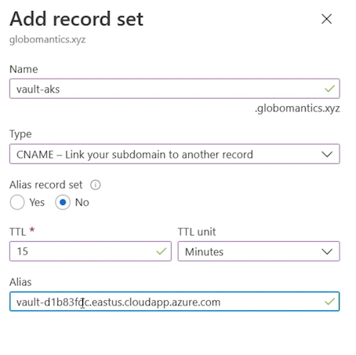

```
export VAULT_ADDR="https://${certificate_cn}:8200"
```

**`vault status`**

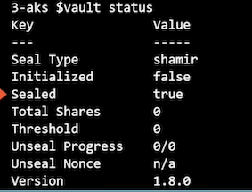

