# **L4 Managing Encryption and Seal Keys**

### **1 Vault Encryption Keys**

**Vault Logical Architecture**

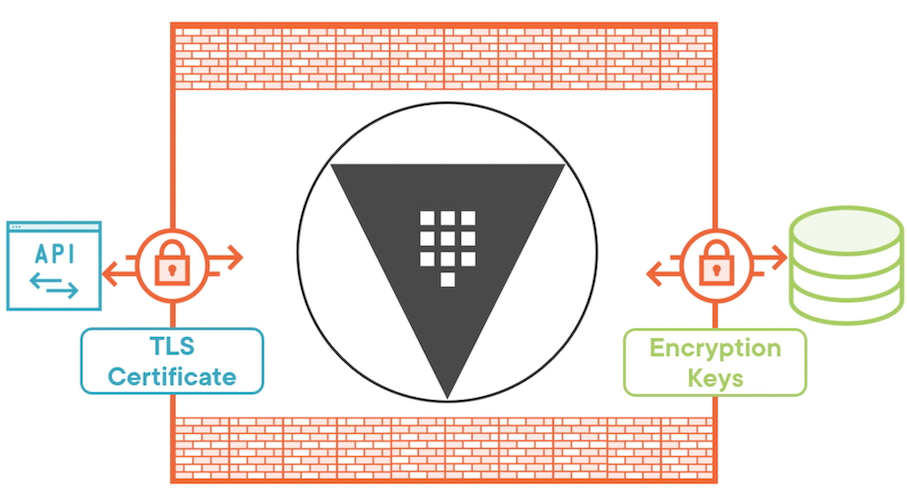

**Encryption Keys**

The data stored by Vault server is important and sensitive, which means you need to protect it in some way.

We're going to be focusing on the storage back end of the Vault logical architecture and the encryption keys that are used to encrypt data that leaves the barrier on its way to the storage back end.

**Anything that gets written to persistent storage needs to be encrypted**

**1 - Encryption keys**

* Protect data written to storage
* Stored on disk

The first one is the encryption keys themselves that are used to protect data that's been written to persistent storage.

Before that data leaves the barrier that's running in memory, it gets encrypted by the encryption keys and then written out to persistent storage.

they live is on disk. They are written to the same persistent storage that **the regular Vault data is, which means you need a way to encrypt the encryption keys.**

**2 - Master key**

* Protects encryption keys
* Stored on disk

The key that encrypts the encryption keys is the master key.

**The master key's job is to protect the encryption keys. When Vault loads up, it will load the encryption keys and decrypt them with the master key.**

And when the encryption keys are updated, they will be encrypted with the master key before they're written out to persistent storage.

The master key is also stored on disk, which means you need to be able to encrypt that master key.

**3 - Unseal key**

* Protects master key
* Stored as shares or externally

And the key that protects the master key is the unseal key.

**When you unseal Vault, you're using the unseal key to decrypt the master key**.

You can either store it as shares or you can store it on some sort of external service.

**3 Seal Options**

### **3 Seal Options**

**1 Shamir secret sharing**

Shamir Secret Sharing. **This is an algorithm that Vault uses, and what it does is take a single key, the unseal key, and break it into one or more key shares** and then those shares can be combined back together to recreate the unseal key.

* Key shares
* Required threshold

So you could break it into five shares and only require three of those shares to reassemble the key

If you're going to use Shamir Secret Sharing for your seal, **that is something that is configured during the initialization process for Vault**.

It can also be updated with a **rekey option** if you want to change the threshold or the number of key shares.

* Configured at initialization
* Used for sensitive operations

In addition to being used to unseal the vault, these key shares are also used for sensitive operations

**Something like creating a new root token where you don't want a single individual responsible for that operation, you want to have a threshold of people involved in that operation**

**2 Auto unseal**

This could be a cloud key management **service like Azure Key Vault or AWS KMS, or it could be a hardware security module that exists in your data center**.

The point is it's not stored within Vault

* External service
* Recovery key shares

**The key shares actually still play a role because you'll need them for sensitive operations.** So the key shares that you may have had for Shamir Secret Sharing get converted to recovery key shares instead.

* Set by Vault server configuration

**If you want to use auto unseal for your Vault configuration**, that's actually defined in the Vault server configuration files.

**3 Seal Migration**

**You can migrate the seal from Shamir Secret Sharing to auto unseal. You can migrate it back, or you can migrate to different services within the auto unseal family**.

There's a lot of options when it comes to seal migration. It does require some downtime to make that migration happen, but it is possible to migrate from one type of seal to another without any data loss.

### **4 Vault Initialization Commands**

```
# Get Vault server status
vault status
```

```
# Initialize Vault server
vault operator init [options]
vault operator init-key-shares=5-key-threshold=3
vault operator init-recovery-shares=5-recovery-threshold=3
```

```
$ vault status
Key             Value
---             -----
Seal Type       shamir
Initialized     true
Sealed          false
Total Shares    1
Threshold       1
Version         1.12.1
Build Date      2022-10-27T12:32:05Z
Storage Type    inmem
Cluster Name    vault-cluster-5c0ec65d
Cluster ID      128570e3-5c75-fb9c-23fb-12582d9be108
HA Enabled      false
```

### **Securing Key Shares**

**When you initialize Vault, the output is going to include the unsealed keys And if you don't specify some type of encryption, they will be printed out in cleartext.**

**It would be better if you could encrypt each of the unsealed keys using an administrator's public key.**

Let's say you have three administrators that you want to be responsible for elevated operations and unsealing Vault.

Each of those administrators can create a public/private key pair and give you the public key to use for encryption.

When you as the operator run the initialization process, you'll feed in those three public keys to encrypt the unsealed keys that are part of the output.

The initialization process will create the unsealed keys

**Once those unsealed keys have been created, they'll go back through the initialization process, be encrypted using the public keys that you supplied, and then you can give those encrypted unsealed keys back to your administrators**.

They have the private key pair, so they'll be able to decrypt the encrypted unsealed key and use it when they need to

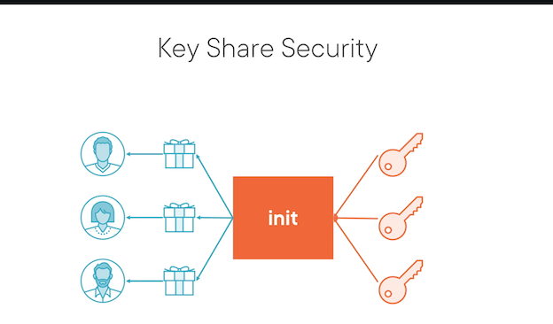

### **Unseal Vault Process and Commands**

**Unsealing Vault**

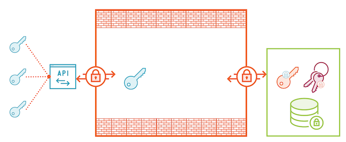

When you start up Vault server, it forms a barrier within memory, and that's where data can live unencrypted.

The data is living in persistent storage, and that includes things like **`<mark>`the master key, which has been encrypted using the unseal key`</mark>`**, and **`<mark>`the encryption keys, which have been encrypted using the master key`</mark>`**

**The persistent data itself, which has been encrypted with the encryption keys**

**When you want to unseal the vault, each stakeholder will submit their unseal key until you've reached the threshold.**

They'll send those to the API, either through the CLI, the UI or the API directly. And then Vault will assemble those keys into the unseal key that lives only in memory.

**The unseal key is never written out to persistent storage.**

**And then Vault will load the master key and use the unseal key to decrypt it, and then it will load the encryption keys and use the master key to decrypt those**

Now Vault is ready to start servicing requests because it has all the necessary ingredients to decrypt persistent data that is on the storage back end.

### **Unseal Vault**

```
# Start unseal process
vault operator unseal [options] [KEY]

# Seal an unsealed Vault server
vault operator seal [options]
```

Now this command needs to be run multiple times until you hit the threshold for key shares so Vault can reassemble the unseal key

Once it has hit that threshold, Vault will assemble the unseal key, and it will unseal the vault.

### **Initializing Vault Server**

* Initialize Vault with GPG keys
* Unseal Vault and verify
* Log into Vault with root token

We are going to initialize and unseal the Vault server using PGP keys from our admins!

```
#Install GnuPG and rng-tools
sudo apt install gnupg rng-tools -y
sudo rngd -r /dev/urandom
```

**Configure `GPG_TTY`**

```
GPG_TTY=$(tty)
export GPG_TTY
```

First we have to generate our pgp keys using gpg

```
gpg --batch --gen-key vaultadmin1
gpg --batch --gen-key vaultadmin2
gpg --batch --gen-key vaultadmin3
```

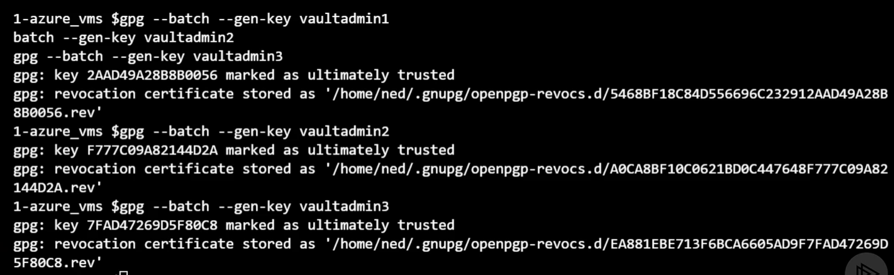

Now we need the base64 encoded public keys to use with Vault

```
gpg --export vaultadmin1 | base64 > vaultadmin1.asc
gpg --export vaultadmin2 | base64 > vaultadmin2.asc
gpg --export vaultadmin3 | base64 > vaultadmin3.asc
```

Now we can initialize the seal with our gpg keys

**`vaultadmin1`**

```
Key-Type: 1
Key-Length: 2048
Subkey-Type: 1
Subkey-Length: 2048
Name-Real: vaultadmin1
Passphrase: vaultpassphrase
Expire-Date: 0
```

**`vaultadmin2`**

```
Key-Type: 1
Key-Length: 2048
Subkey-Type: 1
Subkey-Length: 2048
Name-Real: vaultadmin2
Passphrase: vaultpassphrase
Expire-Date: 0
```

**`vaultadmin3`**

```
Key-Type: 1
Key-Length: 2048
Subkey-Type: 1
Subkey-Length: 2048
Name-Real: vaultadmin3
Passphrase: vaultpassphrase
Expire-Date: 0
```

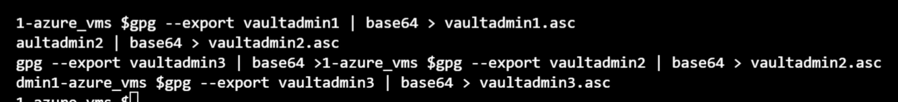

```
export VAULT_ADDR="https://YOUR_VAULT_FQDN:8200"
vault operator init -key-shares=3 -key-threshold=2 -pgp-keys="vaultadmin1.asc,vaultadmin2.asc,vaultadmin3.asc"
```

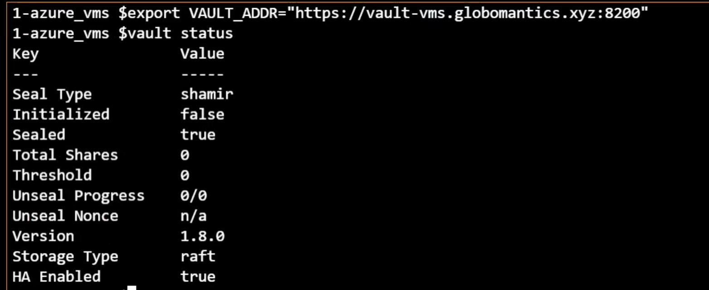

```
$vault operator init
-key-shares=3 -key-threshold=2 -pgp-keys="vaultadmin1.asc, vaultadmin2. asc, vaultadmin3.asc"
```

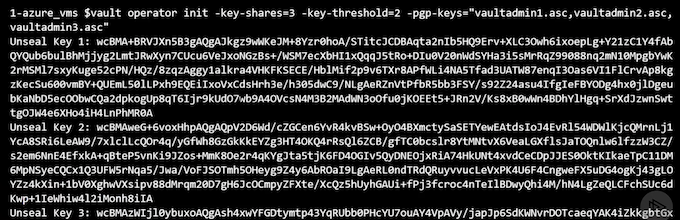

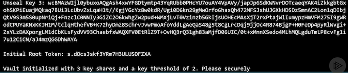

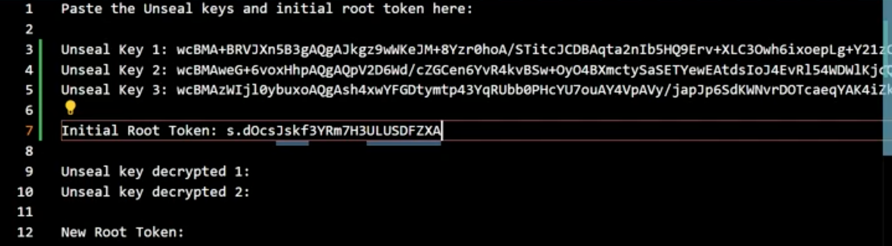

**Copy out the key values to `seal_keys.txt`**

Next up, we are going to unseal our Vault server

```
#Decrypt the first two keys
echo "UNSEAL_KEY_1" | base64 --decode | gpg -u vaultadmin1 -dq
echo "UNSEAL_KEY_2" | base64 --decode | gpg -u vaultadmin2 -dq
```

* `UNSEAL_KEY_1 = wcBMA......`
* `UNSEAL_KEY_2 = wcBMA......`

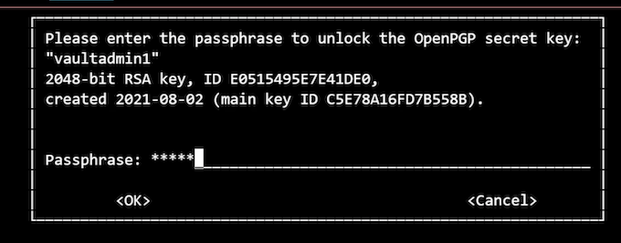

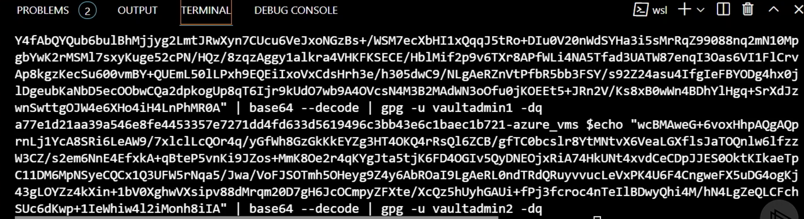

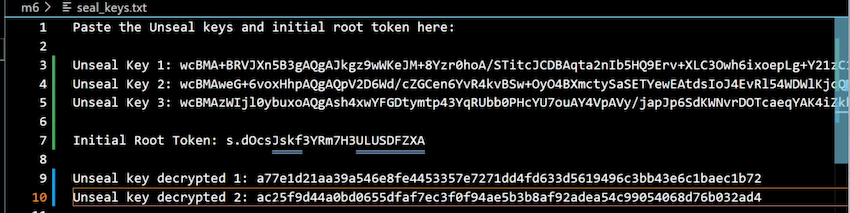

### **Unsealing Vault Server**

```
#Unseal the vault
vault operator unseal  
...
(Unseal key decrypted 1)


vault operator unseal  
...
(Unseal key decrypted 2)
```

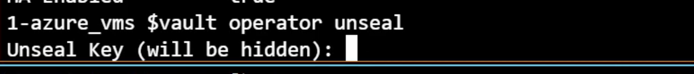

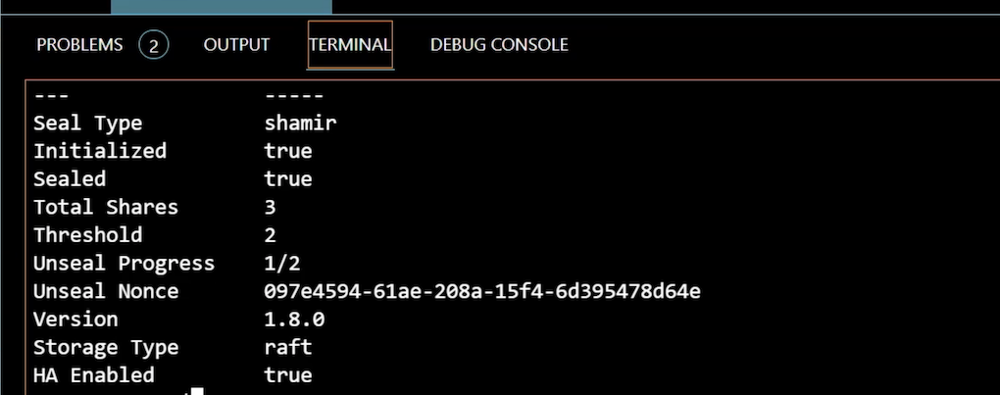

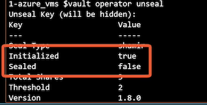

```
# Login into Vault
vault login
```

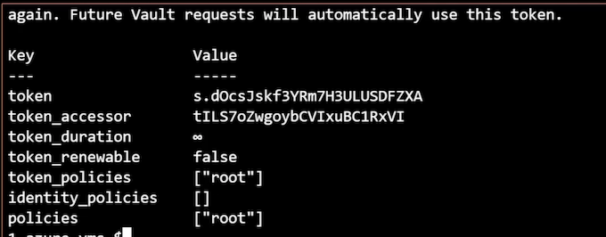

* Enable auto unseal with Azure Key Vault
* Revoke the current root token
* Rotate the current encryption keys

### **Auto Unseal Overview**

* Unseal key stored in secure location

The big idea behind auto unseal is when the Vault server comes up, it can automatically unseal itself, **assuming it has access to the external location where the unseal key is stored.**

It could be stored in a cloud service **like Azure Key Vault. It could be stored in an on‑premises HSM, or you can actually use the Vault transit engine on a different instance of Vault**

Now the way that keys are typically stored in cloud services and HSMs is that the private key cannot leave that secured location, **which means what Vault needs to do is take the encrypted master key, which has been encrypted using the unseal key, submit that master key to the service, and ask it to decrypt the master key and send the decrypted master key back.**

* Cloud services, HSM, Vault transit engine
* Master key submitted to secure location
* Key shares become recovery keys

Once you've selected auto unseal, **the key shares that you would normally have from an unsealed key become recovery keys**, and they **can be used for sensitive operations like rekeying the vault or creating a new root token**.

* Key shares still required

**We associated an Azure AD Managed Service Identity with that Azure VM, which is how it accesses Azure Key Vault to get the certificate it's using for the Vault configuration.**

We can also use that same identity to store a key in Azure Key Vault for auto unseal, and the Azure VM will be able to use that identity to perform the necessary operations to decrypt the master key.

**Auto Unseal Architecture**

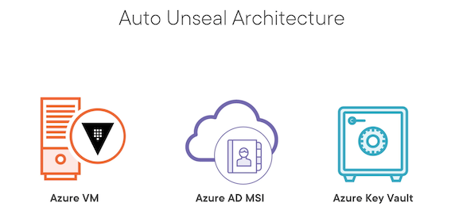

### Auto Unseal Configuration and Migration

**`Vault-Config.hcl`**

```
seal "azurekeyvault" {
	tenant_id = "00000-00000-00000-00000"
	vault_name = "key-vault-name"
	key_name = "key-name-in-key-vault" 
}
```

**Seal Migration Process**

* Update the Vault configuration
* Restart Vault to seal and update configuration
* Unseal Vault with the migrate flag

It starts with the seal keyword and then the type of seal you want to implement. In our case, we're implementing azurekeyvault.

For Azure Key Vault, we need to specify the `tenant_id`, we need to specify the name of the key vault where we're going to be storing the key, and we also need to specify the name of the key that's stored in Key Vault that will be used for the auto unseal operation.

If we were not using managed security identities, we would also have to specify a client ID and client secret in this configuration, but fortunately, Vault can just take advantage of that managed security identity associated with the Azure virtual machine

```
#Log into Azure with CLI
az login
az account set --subscription "SUB_NAME"
```

```
cp auto_unseal_key.txt auto_unseal_key.tf
```

**`auto_unseal_key.txt`**

```
locals {
  unseal_key_name = "vault-${random_id.id.hex}"
}

resource "azurerm_key_vault_key" "unseal_key" {
  name         = local.unseal_key_name
  key_vault_id = azurerm_key_vault.vault.id
  key_type     = "RSA"
  key_size     = 2048

  key_opts = [
    "decrypt",
    "encrypt",
    "sign",
    "unwrapKey",
    "verify",
    "wrapKey",
  ]
}

resource "local_file" "seal_config" {
  filename = "${path.module}/seal.hcl"
  content = <<EOF
seal "azurekeyvault" {
  tenant_id      = "${data.azurerm_client_config.current.tenant_id}"
  vault_name     = "${azurerm_key_vault.vault.name}"
  key_name       = "${azurerm_key_vault_key.unseal_key.name}"
}
  EOF
}
```

```
# Now we can run a Terraform plan and apply with the same values as before
certificate_cn=YOUR_CERTIFICATE_CN

$ certificate_cn=vault-vms.globomantics.xyz
```

```
terraform plan -var leader_tls_servername=$certificate_cn -out azurevm.tfplan

# Now we'll apply the plan to create the resources
terraform apply azurevm.tfplan
```

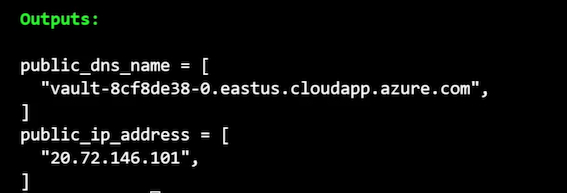

**New file created `seal.hcl`**

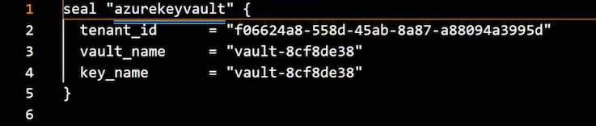

Next step is to update the Vault server configuration to use Key Vault for the seal Connect to the Azure VM via SSH to update the HCL file

```
ssh -i ~/.ssh/azure_vms_private_key.pem azureuser@PUBLIC_IP_ADDRESS

ssh -i ~/.ssh/azure vms private key.pem azureuser@20.72.146.101
```

```
# Edit the vault.hcl file
sudo vi /etc/vault.d/vault.hcl
```

Paste seal key part

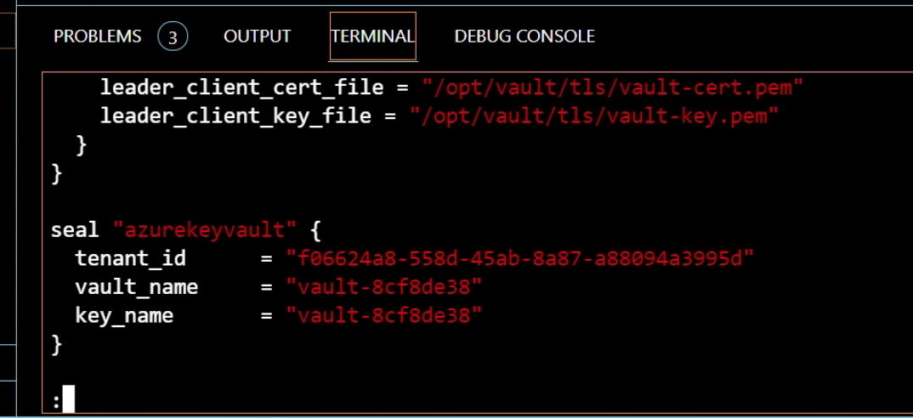

```
# Now we will restart Vault to seal it and update the loaded config
# then unseal with the migrate flag
sudo systemctl restart vault

exit
```

### **Migrating the Vault Seal**

```
# We're going to need our GPG keys to complete the operation
# Decrypt the first two keys if you don't have them anymore
echo "FIRST_KEY" | base64 --decode | gpg -u vaultadmin1 -dq
echo "SECOND_KEY" | base64 --decode | gpg -u vaultadmin2 -dq
```


```
vault operator unseal -migrate

# FIRST_KEY
# SECOND_KEY
```

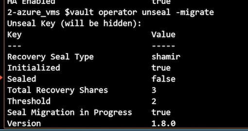

**Our keys become recovery keys**

### **Managing Encryption Keys**

**Rekey**

* Update Unseal and Master keys
* Change seal settings Rotate

What the rekey process does is update both the **unseal key and the master keys**. Now this is only done if you're using Shamir Secret Sharing and not if you've migrated to auto unseal.

You can also use the **rekey operation to change the seal settings, including the number of key shares and the threshold for those key shares.**

And that's something you can do whether you're using auto unseal or if you're using Shamir Secret Sharing.

**Rotate**

* Update Encryption keyring
* Previous versions saved

It creates a new version of your encryption keys.

**It also saves the previous version of those encryption keys because it doesn't go out and decrypt all of the data and reencrypt it with the new version of the encryption keys**.

Manage Keys

```
# Rekey unseal and master keys
vault operator rekey [options] [KEY]
vault operator rekey –init –key-shares=7 –key-threshold=5

# Check the encryption key status
vault operator key-status [options]

# Rotate the encryption key
vault operator rotate [options]
```

### Managing Root Tokens

* Root token can do ANYTHING

**The root token can do anything involved. It has full permissions to do anything involved that it wants to do, which makes it pretty dangerous**

doesn't have an expiration time on it, so it just lasts forever.

* Encrypt with PGP
* Non-persistent root tokens

Now one of the recommendations is when you generate a root token, **you use PGP encryption to protect the output** so only the administrator that's requesting it sees the actual value of that root token. When you're creating a root token, **you should set it to expire or make it non‑persistent**.

* Generate using key shares

The other thing about non‑persistent root tokens is although they can create new root tokens, **those new root tokens are still beholden to the expiration of the original root token**. The process by which you generate a new root token requires the use of key shares because this is also a sensitive and privileged operation.

**Manage Root Token**

```
# Revoke root token
vault token revoke [options]
vault operator revoke –self
vault operator revoke –accessor=1234567890


# Create new root token
vault operator generate-root [options]
vault operator generate-root –init
vault operator generate-root –nonce=NONCE_VALUE
```

```
#Revoke the existing root token
vault login
vault token revoke -self
vault token lookup
```

```
$vault token revoke"-self
Success! Revoked token (if it existed)

$vault token lookup
Error looking up token: Error making API request.
```

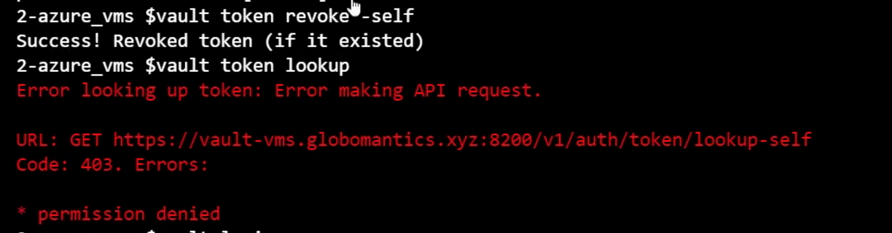

```
$vault login
Token (will be hidden):
Error authenticating: error looking
```

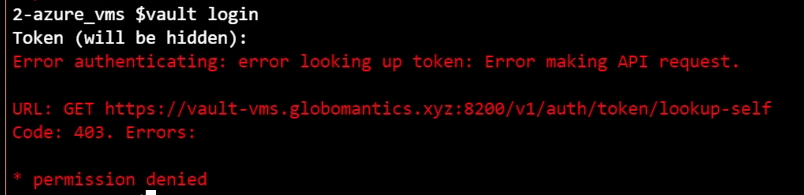

```
#Start the root token generation process
vault operator generate-root -init -pgp-key="vaultadmin1.asc"
```

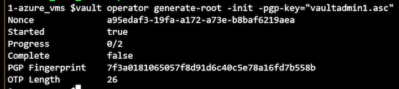

```
vault operator generate-root -nonce=NONCE_VALUE
```

```
$vault operator generate-root
-nonce=a95edaf3-19fa-a172-a73e-b8baf6219aea
```

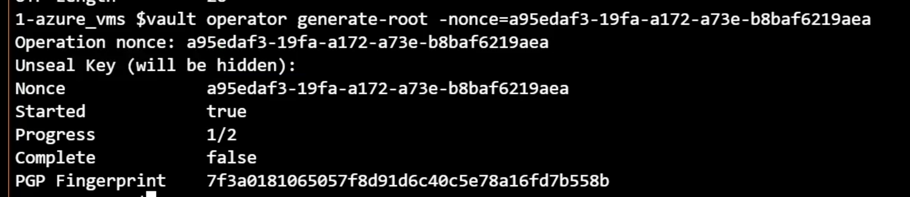

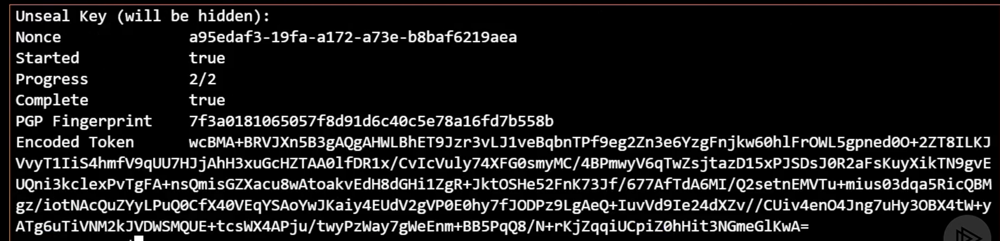

```
echo "ENCODED_TOKEN" | base64 --decode | gpg -u vaultadmin1 -dq
```

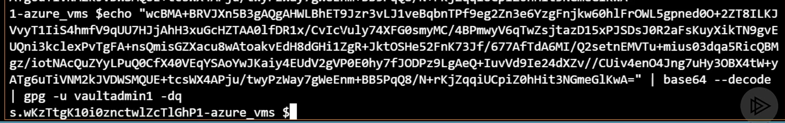

**`New Root Token: s.wKzTtgK10ioznctwlZcT1Ghp`**

```
# Try to log in with the new token
vault login
```

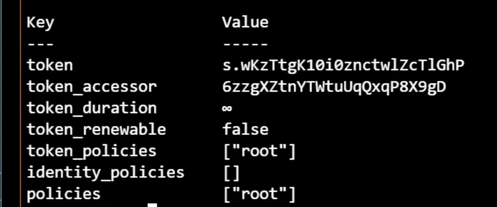

**Tasks**

* Rotate encryption key
* Revoke root token and create new one

### **Rotating the Encryption Keys**

```
# Rotate the encryption key
vault operator key-status

vault operator rotate
```

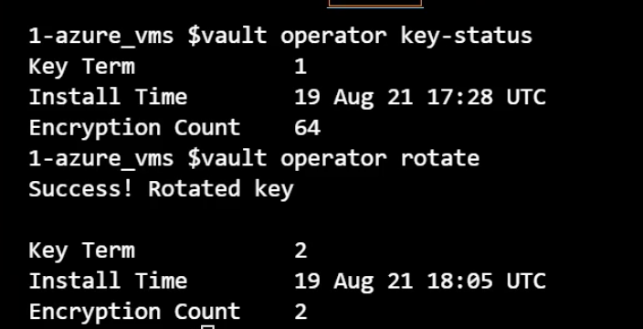

```
terraform destroy -var leader_tls_servername=$certificate_cn -auto-approve
```

### **Module Summary**

* Vault seal protects the master key that protects the encryption keys
* Vault must be initialized and unsealed prior to use
* Seal configuration can be migrated
* Unseal, master, and encryptions keys should be periodically updated
* Root tokens can do anything and should be revoked quickly
