# **L5 onfiguring High Availability**

* Vault server clustering
* Cluster communications
* Scenario review
* Vault replication options

### **1 Vault Server Clustering**

**High Availability Components**

* Compute

The first component to talk about is the compute component, and this could be a set of bare‑metal servers, it could be virtual machines, it could be containers or pods. 

* Network
* Storage

There's a storage component to high availability. The storage you're using needs to be highly available, but it also needs to support the high‑availability feature of Vault

### **2 Vault Cluster Compute**

* Active and standby

Vault clustering follows an active standby model, so you'll have one active node and one or more standby nodes

General recommendation is to have an odd number of nodes in your cluster to help with leader election and those types of things. **So, a three‑node cluster or a five‑node cluster is recommended in general**. 


* Forward or redirect

All requests that come in from clients have to be answered by the active node, which means that the standby nodes can take one of two approaches when they get a request from a client. 


They can either forward that request to the active node and **then send the response back to the client, or they can redirect the client to the active node**

* Read-only for Enterprise

**Enterprise license, your standby nodes in your compute cluster can be enabled for read‑only access to the data in Vault.**

Means they can't write anything new to Vault, but they can respond to read‑only requests. 

* Lock based in datastore
* Different storage for HA


Once it becomes the active node, it writes some data to the shared data store that the standby nodes can use. 

Because not all storage types support this HA functionality, you can have one storage type for your general data storage and a separate storage type defined just for HA.


### **3 Vault Cluster Communications**

**Network Components**

* Listener `cluster_address`

The value that you set for `cluster_address` will be the IP address that you want **the node to listen on for all cluster‑specific communications.**

**These would be communications from other nodes within the cluster.**

* Node  `cluster_addr`

The `cluster_addr` tells other nodes in the cluster how to reach this specific node in the cluster for cluster communications,and **it is going to be a URL as opposed to an IP address.** 

* Node  `api_addr`

The other node level setting is `api_addr`, and this tells other nodes in the cluster where to redirect clients if they want to talk to the active node using the API. This also is going to be a full URL as opposed to an IP address.

* Direct access
* Load balancer

**Cluster Communications**

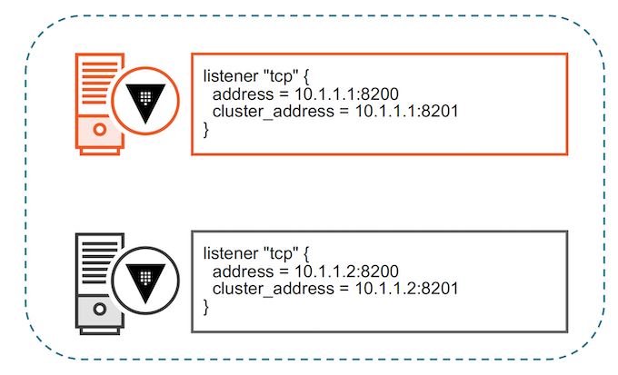


Let's say this is node one and node two. 

For the listener communication for node one, I'll specify the address. This is the IP address that it listens on for client requests. These are requests using the API, typically using port 8200. I will also specify a cluster address, and this is the IP address that this node will listen on for cluster communications, typically using port 8201. 

Likewise, on the second node, I will also set the address and cluster address to the local IPv4 address for this particular node. 

For my first node, I'm going to set the `cluster_addr` and the `api_addr`. The `cluster_addr` is going to be a URL, and **this is the URL that other nodes in the cluster should use to communicate with this node**. 


In this case, my node one is server1 listening on port 8201, and that server1 should be resolvable by other nodes in the cluster. The api_addr is also a URL, and this is the URL that clients should use if they've been redirected from a standby node to an active node. 

### **4 Client Request Handling**


**Network Traffic - Request Forwarding**


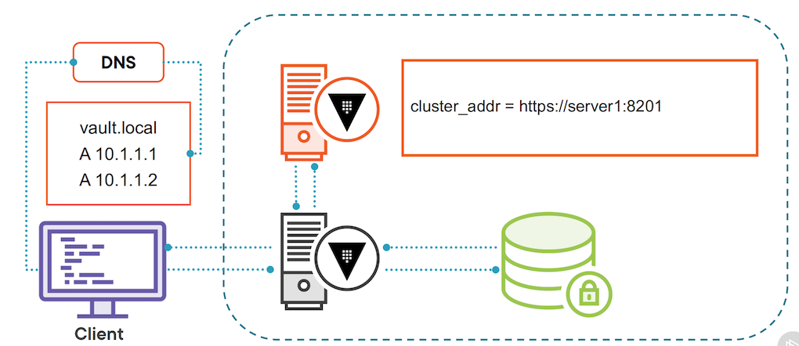

* We've got our client, and in this case we're making each of the nodes directly accessible. 
* **They're not sitting behind a load balancer.**
* So when the client wants to go talk to the Vault cluster, it's going to look up the Vault cluster's IP addresses via DNS, and there's going to be an entry for each Vault server in the DNS. DNS will use round robin to give the client one of those addresses. 
* Now, let's assume in this case the client gets the standby server, which is the gray server in this case. 
* Let's assume in this case the client gets the standby server, which is the gray server in this case. **The client sends its request to the standby server**.
* The standby server knows it's in standby mode, so what it does is reach out to **the HA storage backend and ask for information about the active node in the cluster**. 
* The HA storage backend will respond with information about the active node.
* In this case, because we're using request forwarding, the standby node is going to use the value stored in `cluster_addr`. 
* **It's going to use that URL and forward the request from the client to the active server**. 
* The active server in turn will respond to the request, and then the standby server will send that response back to the client. 
* **The client has no idea it wasn't talking to the active server, because the standby server took care of the request forwarding.**
* This assumes that every node in the cluster is able to talk to every other node at its `cluster_addr` setting. 


**might work with a load balancer**

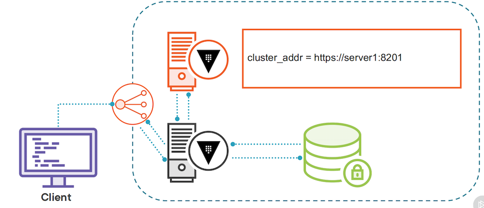

* With a load balancer, the client will still look up the IP address for the Vault service, but that's going to resolve to the front end of the load balancer, **and then the load balancer has to decide where to send the traffic**. 
* Now it is possible to configure the health check on a load balancer to only **send traffic to the active node, and that is the recommendation**, 
* But let's assume for a second you haven't gone with that recommendation, and the load balancer sends traffic to the standby node. 
* **The standby node will query the HA storage backend and get the setting for the `cluster_addr`**. 
* And once it has that information, it will forward the request to the active node, the active node will respond, and then the **standby node will send that response back to the client**. 

**client redirection**

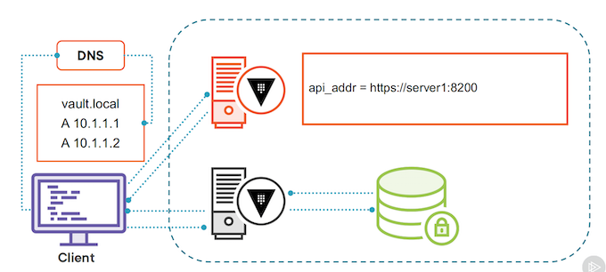

* Client redirection is different in the sense that the standby server is not going to forward the request, **it's actually going to redirect the client.**
* Once again, the client looks up the IP addresses for the nodes in the Vault cluster via DNS. 
*  let's assume in this case, once again it gets back the IP address of the standby node.


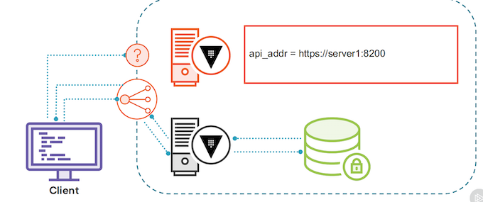

* The client will reach out to the standby node, and because the standby node is running in **client redirection mode**, it will query the HA storage backend, and the setting that it's **looking for here is the `api_addr` of the active node, in this case it's server1**. 
* The standby node will send a 302 Redirect response back to the client with the `api_addr` value of where it should send its requests. 
* At that point, the client will respect that redirect, and **instead send its request to the active Vault server, which should respond in kind**. T


**client redirection interacts with a load balancer**

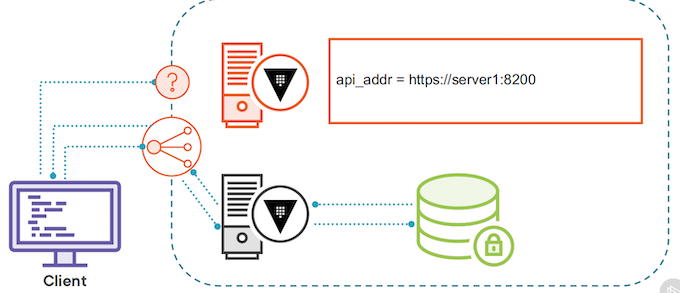

* The standby server in turn will look up the settings in the HA storage backend and get the `api_addr` and send that redirect message back to the client. 
* The client will get the redirect message, and it will try to directly talk to the Vault server at the address server1 port 8200. 
* And if that **Vault server is not directly accessible at that API address**, we have a big problem. 
* It can't actually fulfill its requests. The alternative is to set the `api_addr` to the load balancer frontend, and hope that the load balancer sends it to the active Vault server and you don't end up in a client redirection loop. 


### **5 Dev Requirement**

* Deploy in Azure
* Publicly available endpoint
* Use third-party certificates
* SLA of 99.99% for Vault
* Auto unseal of Vault

### **6 Cluster Architecture Update**

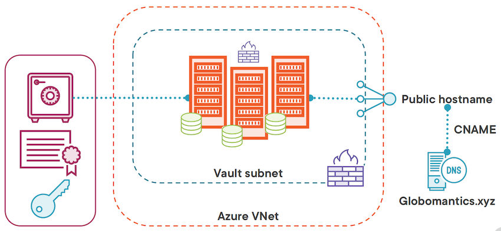


Now we're going to spin up three Azure VMs in our Vault subnet to form the Vault cluster. 


And the **back‑end storage we're going to use for these virtual machines is the integrated storage using the Raft consensus protocol**. This means that **each virtual machine can just use it's local storage for Vault data**. 


We're going to protect all of our Vault servers with both a network security group and an application security group so only cluster members can talk to each other. 


For the auto unseal of the Vault, we're going to create a **key in Azure Key Vault that will be used to auto unseal each of these nodes as it comes up**, so we don't have to worry about logging into each Azure VM and unsealing the Vault on each Azure VM. 

And then lastly for the front end, we are going to replace our public IP address with a load balancer, and we will ensure that load balancer is properly configured with health checks so that it will always send traffic to the active Vault node in the cluster. 


**`Vault-Config.hcl`**

```
#HA parameters
cluster_addr = "https://LOCAL_IPV4:8201"
api_addr = "https://SERVER_HOSTNAME:8200"


# Listener parameters
listener "tcp" {
address = "0.0.0.0:8200"
cluster_address = "0.0.0.0:8201" 
}
```


For cluster communications, we can continue to use the local IP address, and Vault will automatically generate a TLS certificate for intra‑cluster communications. 

**For the `api_addr`, we could use the server hostname, but that is not on the certificate, and it's also not exposed for direct access. We've got our servers behind a load balancer**. 

### **Vault Cluster Demo Overview**

* Deploy new infrastructure
* Initialize and validate cluster


### **Reviewing the Vault Template**

**`vault.tpl`**

That's the template file that is going to run when each node starts up.

```
#!/usr/bin/env bash
set -e -o pipefail

# Terraform variables used: 
# vault_version - version of the Vault binary to download
# key_vault_secret_id - Id of the Key Vault secret holding the certificates
# leader_tls_servername - The servername used for the certificate and front end
# tenant_id - Azure tenant ID for autounseal
# key_vault_name - Name of Key Vault for autounseal
# key_vault_key_name - Name of Key in Key Vault for autounseal

# Get the instance name and local ipv4 address
export instance_name="$(curl -sH Metadata:true --noproxy '*' 'http://169.254.169.254/metadata/instance/compute/name?api-version=2020-09-01&format=text')"
export local_ipv4="$(curl -sH Metadata:true --noproxy '*' 'http://169.254.169.254/metadata/instance/network/interface/0/ipv4/ipAddress/0/privateIpAddress?api-version=2020-09-01&format=text')"

# Get the Vault binary
curl -fsSL https://apt.releases.hashicorp.com/gpg | sudo apt-key add -
sudo apt-add-repository "deb [arch=amd64] https://apt.releases.hashicorp.com $(lsb_release -cs) main"
sudo apt-get update
sudo apt-get install python3-pip vault=${vault_version} -y

# Install Azure CLI
pip3 install --user 'azure-cli~=2.26.0' 'azure-mgmt-core~=1.2.0' 'cryptography~=3.3.2' 'urllib3[secure]~=1.26.5' 'requests~=2.25.1'

# configuring Azure CLI for use with VM managed identity
~/.local/bin/az login --identity --allow-no-subscriptions

# removing any default installation files from /opt/vault/tls/
rm -rf /opt/vault/tls/*

# set up the certificates
touch /opt/vault/tls/{vault-cert.pem,vault-ca.pem,vault-key.pem,vault-full.pem}
chown vault:vault /opt/vault/tls/{vault-cert.pem,vault-ca.pem,vault-key.pem,vault-full.pem}
chmod 0640 /opt/vault/tls/{vault-cert.pem,vault-ca.pem,vault-key.pem,vault-full.pem}

secret_result=$(~/.local/bin/az keyvault secret show --id "${key_vault_secret_id}" --query "value" --output tsv)

echo $secret_result | base64 -d | openssl pkcs12 -clcerts -nokeys -passin pass: | openssl x509 -out /opt/vault/tls/vault-cert.pem

echo $secret_result | base64 -d | openssl pkcs12 -cacerts -nokeys -chain -passin pass: | openssl x509 -out /opt/vault/tls/vault-ca.pem

echo $secret_result | base64 -d | openssl pkcs12 -nocerts -nodes -passin pass: | openssl pkcs8 -nocrypt -out /opt/vault/tls/vault-key.pem

echo $secret_result | base64 -d | openssl pkcs12 -nokeys -passin pass: -out /opt/vault/tls/vault-full.pem

# Create config file

cat <<EOF > /etc/vault.d/vault.hcl
# General parameters
cluster_name = "vault-vms"
log_level = "Info"
ui = true

# HA parameters
cluster_addr = "https://$local_ipv4:8201"
api_addr = "https://${leader_tls_servername}:8200"

listener "tcp" {
 address     = "0.0.0.0:8200"
 cluster_address = "0.0.0.0:8201"

 tls_disable = 0
 tls_cert_file      = "/opt/vault/tls/vault-full.pem"
 tls_key_file       = "/opt/vault/tls/vault-key.pem"
 tls_client_ca_file = "/opt/vault/tls/vault-ca.pem"
 tls_min_version = "tls12"
}

storage "raft" {
  path    = "/opt/vault/data"
  node_id = "$instance_name"
  retry_join {
    leader_tls_servername = "${leader_tls_servername}"
    leader_api_addr = "https://${leader_tls_servername}:8200"
    leader_ca_cert_file = "/opt/vault/tls/vault-ca.pem"
    leader_client_cert_file = "/opt/vault/tls/vault-cert.pem"
    leader_client_key_file = "/opt/vault/tls/vault-key.pem"
  }
}

seal "azurekeyvault" {
  tenant_id = "${tenant_id}"
  vault_name = "${key_vault_name}"
  key_name = "${key_vault_key_name}"
}

EOF

chown -R vault:vault /etc/vault.d/*
chmod -R 640 /etc/vault.d/*

systemctl enable vault
systemctl start vault
```

**seal component to our vault configuration so that auto unseal will work properly with our Azure Key Vault**


### **Deploying the Vault Cluster**


* **`terraform.tf`**

```
# This configuration spins up three Azure VMs that will form
# the Vault cluster. The virtual machines will be placed behind
# a public facing load balancer to expose the UI and API port

terraform {
  required_providers {
    azurerm = {
      source  = "hashicorp/azurerm"
      version = "~> 2.0"
    }
  }
}

provider "azurerm" {
  features {}
}

# Used to get tenant ID as needed
data "azurerm_client_config" "current" {}
```

* **`vnet.tf`**

```
resource "azurerm_resource_group" "vault" {
  name     = local.resource_group_name
  location = var.location
}

# Virtual network with a Vault subnet
module "vnet" {
  source              = "Azure/vnet/azurerm"
  version             = "~> 2.0"
  resource_group_name = azurerm_resource_group.vault.name
  vnet_name           = azurerm_resource_group.vault.name
  address_space       = var.address_space
  subnet_prefixes     = var.subnet_prefixes
  subnet_names        = var.subnet_names

  subnet_service_endpoints = {
    (var.subnet_names[0]) = ["Microsoft.KeyVault"]
  }

}

resource "azurerm_nat_gateway" "vault" {
  location            = var.location
  name                = local.nat_gateway_name
  resource_group_name = azurerm_resource_group.vault.name
  sku_name            = "Standard"
}

resource "azurerm_public_ip" "vault_nat" {
  allocation_method   = "Static"
  location            = var.location
  name                = "${local.nat_gateway_name}-vault-nat"
  resource_group_name = azurerm_resource_group.vault.name
  sku                 = "Standard"
}

resource "azurerm_nat_gateway_public_ip_association" "vault" {
  nat_gateway_id       = azurerm_nat_gateway.vault.id
  public_ip_address_id = azurerm_public_ip.vault_nat.id
}

resource "azurerm_subnet_nat_gateway_association" "vault" {
  nat_gateway_id = azurerm_nat_gateway_public_ip_association.vault.nat_gateway_id
  subnet_id      = module.vnet.vnet_subnets[0]
}
```

* **`vms.tf`**

```
# Generate key pair for all VMs
resource "tls_private_key" "vault" {
  algorithm = "RSA"
  rsa_bits  = "2048"
}

# Write private key out to a file
resource "local_file" "private_key" {
  content  = tls_private_key.vault.private_key_pem
  filename = "${path.root}/azure_vms_private_key.pem"
}

# Create User Identities for Vault VMs
resource "azurerm_user_assigned_identity" "vault" {
  resource_group_name = azurerm_resource_group.vault.name
  location            = var.location

  name = local.vault_user_id
}

##################### vault VM RESOURCES ###################################
resource "azurerm_availability_set" "vault" {
  name                         = local.vault_vm
  location                     = var.location
  resource_group_name          = azurerm_resource_group.vault.name
  platform_fault_domain_count  = 3
  platform_update_domain_count = 2
  managed                      = true
}


resource "azurerm_network_interface" "vault" {
  count               = var.vault_vm_count
  name                = "${local.vault_vm}-${count.index}"
  location            = var.location
  resource_group_name = azurerm_resource_group.vault.name

  ip_configuration {
    name                          = "internal"
    subnet_id                     = module.vnet.vnet_subnets[0]
    private_ip_address_allocation = "Dynamic"
  }
}

# Associate the network interfaces from the vaults with the vault NSG
resource "azurerm_network_interface_security_group_association" "vault" {
  count                     = var.vault_vm_count
  network_interface_id      = azurerm_network_interface.vault[count.index].id
  network_security_group_id = azurerm_network_security_group.vault_nics.id
}

# Associate the network interfaces from the vaults with the vault ASG for NSG rules
resource "azurerm_network_interface_application_security_group_association" "vault" {
  count                         = var.vault_vm_count
  network_interface_id          = azurerm_network_interface.vault[count.index].id
  application_security_group_id = azurerm_application_security_group.vault_asg.id
}

resource "azurerm_linux_virtual_machine" "vault" {
  count               = var.vault_vm_count
  name                = "${local.vault_vm}-${count.index}"
  location            = var.location
  resource_group_name = azurerm_resource_group.vault.name
  size                = var.vault_vm_size
  admin_username      = "azureuser"
  computer_name       = "vault-${count.index}"
  availability_set_id = azurerm_availability_set.vault.id
  network_interface_ids = [
    azurerm_network_interface.vault[count.index].id,
  ]

  admin_ssh_key {
    username   = "azureuser"
    public_key = tls_private_key.vault.public_key_openssh
  }

  # Using Standard SSD tier storage
  # Accepting the standard disk size from image
  # No data disk is being used
  os_disk {
    caching              = "ReadWrite"
    storage_account_type = "StandardSSD_LRS"
  }

  #Source image is hardcoded b/c I said so
  source_image_reference {
    publisher = "Canonical"
    offer     = "UbuntuServer"
    sku       = "18.04-LTS"
    version   = "latest"
  }

  identity {
    type         = "UserAssigned"
    identity_ids = [azurerm_user_assigned_identity.vault.id]
  }

  #Custom data from the vault.tmpl file
  custom_data = base64encode(
    templatefile("${path.module}/vault.tpl", {
      vault_version         = var.vault_version
      tenant_id             = data.azurerm_client_config.current.tenant_id
      leader_tls_servername = var.leader_tls_servername
      key_vault_name        = local.key_vault_name
      key_vault_key_name    = azurerm_key_vault_key.autounseal.name
      key_vault_secret_id   = azurerm_key_vault_certificate.vault.secret_id
    })
  )
}
```

* **`nsg.tf`**

```
# Create Network Security Groups for subnets
resource "azurerm_network_security_group" "vault_net" {
  name                = local.vault_net_nsg
  location            = var.location
  resource_group_name = azurerm_resource_group.vault.name
}

resource "azurerm_subnet_network_security_group_association" "vault" {
  subnet_id                 = module.vnet.vnet_subnets[0]
  network_security_group_id = azurerm_network_security_group.vault_net.id
}

# Create Network Security Groups for NICs

resource "azurerm_network_security_group" "vault_nics" {
  name                = local.vault_nic_nsg
  location            = var.location
  resource_group_name = azurerm_resource_group.vault.name
}

# Create application security groups for Vault VMs

resource "azurerm_application_security_group" "vault_asg" {
  name                = local.vault_asg
  location            = var.location
  resource_group_name = azurerm_resource_group.vault.name
}

# Inbound rules for vault subnet nsg

resource "azurerm_network_security_rule" "vault_8200" {
  name                                       = "allow_8200"
  priority                                   = 100
  direction                                  = "Inbound"
  access                                     = "Allow"
  protocol                                   = "Tcp"
  source_port_range                          = "*"
  destination_port_range                     = "8200"
  source_address_prefix                      = "*"
  destination_application_security_group_ids = [azurerm_application_security_group.vault_asg.id]
  resource_group_name                        = azurerm_resource_group.vault.name
  network_security_group_name                = azurerm_network_security_group.vault_net.name
}

resource "azurerm_network_security_rule" "vault_8201" {
  name                                       = "allow_8201"
  priority                                   = 110
  direction                                  = "Inbound"
  access                                     = "Allow"
  protocol                                   = "Tcp"
  source_port_range                          = "*"
  destination_port_range                     = "8201"
  source_application_security_group_ids      = [azurerm_application_security_group.vault_asg.id]
  destination_application_security_group_ids = [azurerm_application_security_group.vault_asg.id]
  resource_group_name                        = azurerm_resource_group.vault.name
  network_security_group_name                = azurerm_network_security_group.vault_net.name
}

resource "azurerm_network_security_rule" "vault_ssh" {
  name                                       = "allow_ssh"
  priority                                   = 120
  direction                                  = "Inbound"
  access                                     = "Allow"
  protocol                                   = "Tcp"
  source_port_range                          = "*"
  destination_port_range                     = "22"
  source_address_prefix                      = "${data.http.my_ip.body}/32" # Restrict to your public IP address
  destination_application_security_group_ids = [azurerm_application_security_group.vault_asg.id]
  resource_group_name                        = azurerm_resource_group.vault.name
  network_security_group_name                = azurerm_network_security_group.vault_net.name
}

# Inbound rules for vault nic nsg

resource "azurerm_network_security_rule" "vault_nic_8200" {
  name                                       = "allow_8200"
  priority                                   = 100
  direction                                  = "Inbound"
  access                                     = "Allow"
  protocol                                   = "Tcp"
  source_port_range                          = "*"
  destination_port_range                     = "8200"
  source_address_prefix                      = "*"
  destination_application_security_group_ids = [azurerm_application_security_group.vault_asg.id]
  resource_group_name                        = azurerm_resource_group.vault.name
  network_security_group_name                = azurerm_network_security_group.vault_nics.name
}

resource "azurerm_network_security_rule" "vault_nic_8201" {
  name                                       = "allow_8201"
  priority                                   = 110
  direction                                  = "Inbound"
  access                                     = "Allow"
  protocol                                   = "Tcp"
  source_port_range                          = "*"
  destination_port_range                     = "8201"
  source_application_security_group_ids      = [azurerm_application_security_group.vault_asg.id]
  destination_application_security_group_ids = [azurerm_application_security_group.vault_asg.id]
  resource_group_name                        = azurerm_resource_group.vault.name
  network_security_group_name                = azurerm_network_security_group.vault_nics.name
}

resource "azurerm_network_security_rule" "vault_nic_ssh" {
  name                                       = "allow_ssh"
  priority                                   = 120
  direction                                  = "Inbound"
  access                                     = "Allow"
  protocol                                   = "Tcp"
  source_port_range                          = "*"
  destination_port_range                     = "22"
  source_address_prefix                      = "${data.http.my_ip.body}/32" # Restrict to your public IP address
  destination_application_security_group_ids = [azurerm_application_security_group.vault_asg.id]
  resource_group_name                        = azurerm_resource_group.vault.name
  network_security_group_name                = azurerm_network_security_group.vault_nics.name
}
```

* **`keyvault.tf`**

```

# Get your current IP address to provide access to Key Vault in the network acls
data "http" "my_ip" {
  url = "http://ifconfig.me"
}

# Create key vault and access policies
resource "azurerm_key_vault" "vault" {
  name                       = local.key_vault_name
  location                   = var.location
  resource_group_name        = azurerm_resource_group.vault.name
  tenant_id                  = data.azurerm_client_config.current.tenant_id
  enabled_for_deployment     = true
  soft_delete_retention_days = 7
  purge_protection_enabled   = false

  sku_name = "standard"

  # Only allow access to the Key Vault from your public IP address and the vault 
  # subnet.
  network_acls {
    default_action             = "Deny"
    bypass                     = "AzureServices"
    ip_rules                   = ["${data.http.my_ip.body}/32"]
    virtual_network_subnet_ids = [module.vnet.vnet_subnets[0]]

  }

}

# Access policy for vault VMs
# Uses the vault user assigned identity
resource "azurerm_key_vault_access_policy" "vault" {
  key_vault_id = azurerm_key_vault.vault.id

  tenant_id = data.azurerm_client_config.current.tenant_id
  object_id = azurerm_user_assigned_identity.vault.principal_id

  key_permissions = [
    "get", "list", "update", "create", "decrypt", "encrypt", "unwrapKey", "wrapKey", "verify", "sign",
  ]

  secret_permissions = [
    "get", "list",
  ]

  certificate_permissions = [
    "get", "list",
  ]
}

# Access policy allowing your credentials full access to Key Vault
resource "azurerm_key_vault_access_policy" "you" {
  key_vault_id = azurerm_key_vault.vault.id

  tenant_id = data.azurerm_client_config.current.tenant_id
  object_id = data.azurerm_client_config.current.object_id

  key_permissions = [
    "get", "list", "update", "create", "decrypt", "encrypt", "unwrapKey", "wrapKey", "verify", "sign", "delete", "purge",
  ]

  secret_permissions = [
    "get", "list", "set", "delete", "purge",
  ]

  certificate_permissions = [
    "get", "list", "create", "import", "delete", "update", "purge",
  ]
}

# Create a key for Vault autounseal
resource "azurerm_key_vault_key" "autounseal" {
  depends_on   = [azurerm_key_vault_access_policy.you]
  name         = "${local.resource_group_name}-autounseal"
  key_vault_id = azurerm_key_vault.vault.id
  key_type     = "RSA"
  key_size     = 2048

  key_opts = [
    "decrypt",
    "encrypt",
    "sign",
    "unwrapKey",
    "verify",
    "wrapKey",
  ]
}

# Create a certificate in Key Vault for the Vault server
resource "azurerm_key_vault_certificate" "vault" {
  depends_on   = [azurerm_key_vault_access_policy.you]
  name         = "${local.resource_group_name}-cert"
  key_vault_id = azurerm_key_vault.vault.id

  certificate {
    contents = filebase64(var.cert_pfx_file_path)
    password = ""
  }

  certificate_policy {
    issuer_parameters {
      name = "Self"
    }

    key_properties {
      exportable = true
      key_size   = 2048
      key_type   = "RSA"
      reuse_key  = false
    }

    secret_properties {
      content_type = "application/x-pkcs12"
    }
  }
}
```

* **`lb.tf`**

```
# Create a public IP address for the load balancer
# The domain label is based on the resource group name
resource "azurerm_public_ip" "vault" {
  name                = local.pip_name
  resource_group_name = azurerm_resource_group.vault.name
  location            = azurerm_resource_group.vault.location
  allocation_method   = "Static"
  domain_name_label   = lower(azurerm_resource_group.vault.name)
  sku                 = "Standard"
}

# Create a load balancer for vault to use
resource "azurerm_lb" "vault" {
  name                = local.lb_name
  location            = azurerm_resource_group.vault.location
  resource_group_name = azurerm_resource_group.vault.name
  sku                 = "Standard"

  frontend_ip_configuration {
    name                 = "PublicIPAddress"
    public_ip_address_id = azurerm_public_ip.vault.id
  }
}

# Create an address pool for the Vault servers
resource "azurerm_lb_backend_address_pool" "pool" {
  loadbalancer_id = azurerm_lb.vault.id
  name            = "vault-servers"
}

# Associate all vault NICs with the backend pool
resource "azurerm_network_interface_backend_address_pool_association" "vault" {
  count                   = var.vault_vm_count
  backend_address_pool_id = azurerm_lb_backend_address_pool.pool.id
  ip_configuration_name   = "internal"
  network_interface_id    = azurerm_network_interface.vault[count.index].id
}

# All health probe for vault nodes
resource "azurerm_lb_probe" "vault_8200" {
  resource_group_name = azurerm_resource_group.vault.name
  loadbalancer_id     = azurerm_lb.vault.id
  name                = "port-8200"
  protocol            = "Https"
  port                = 8200
  request_path        = "/v1/sys/health?activecode=200&standbycode=429&sealedcode=200&uninitcode=200"
}

# Add LB rule for vault
resource "azurerm_lb_rule" "vault" {
  resource_group_name            = azurerm_resource_group.vault.name
  loadbalancer_id                = azurerm_lb.vault.id
  name                           = "vault"
  protocol                       = "Tcp"
  frontend_port                  = 8200
  backend_port                   = 8200
  frontend_ip_configuration_name = "PublicIPAddress"
  probe_id                       = azurerm_lb_probe.vault_8200.id
  backend_address_pool_id        = azurerm_lb_backend_address_pool.pool.id
}

# Add an NAT rule for the vault node using port 2022 
# This is so you can SSH into the vault to troubleshoot 
# deployment issues.
resource "azurerm_lb_nat_rule" "vault" {
  resource_group_name            = azurerm_resource_group.vault.name
  loadbalancer_id                = azurerm_lb.vault.id
  name                           = "ssh-vault"
  protocol                       = "Tcp"
  frontend_port                  = 2022
  backend_port                   = 22
  frontend_ip_configuration_name = "PublicIPAddress"
}

# Associate the NAT rule with the first vault VM
resource "azurerm_network_interface_nat_rule_association" "vault" {
  network_interface_id  = azurerm_network_interface.vault[0].id
  ip_configuration_name = "internal"
  nat_rule_id           = azurerm_lb_nat_rule.vault.id
}
```

* `variables.tf`

```
variable "location" {
  type    = string
  default = "East US"
}

variable "address_space" {
  type    = list(string)
  default = ["10.0.0.0/16"]
}

variable "subnet_prefixes" {
  type = list(string)
  default = [
    "10.0.0.0/24",
  ]
}

variable "subnet_names" {
  type = list(string)
  default = [
    "vault-servers",
  ]
}

variable "vault_vm_size" {
  type    = string
  default = "Standard_B2ms"
}

variable "vault_vm_count" {
  type    = number
  default = 3
}

variable "cert_pfx_file_path" {
  type        = string
  description = "The full path to the pfx file to be used for Vault"
  default     = "vm-certificate-to-import.pfx"
}

variable "leader_tls_servername" {
  type        = string
  description = "The fqdn used to generate the certificate."
}

variable "vault_version" {
  type        = string
  description = "The version of the Vault binary to download."
  default     = "1.8.0"
}
resource "random_id" "id" {
  byte_length = 4
}

locals {
  resource_group_name = "vault-${random_id.id.hex}"

  vault_net_nsg = "vault-net-${random_id.id.hex}"

  vault_nic_nsg = "vault-nic-${random_id.id.hex}"

  vault_asg = "vault-asg-${random_id.id.hex}"

  vault_vm = "vault-${random_id.id.hex}"

  vault_user_id = "vault-userid-${random_id.id.hex}"

  pip_name = "vault-${random_id.id.hex}"
  lb_name  = "vault-${random_id.id.hex}"

  key_vault_name = "vault-${random_id.id.hex}"

  nat_gateway_name = "vault-${random_id.id.hex}"

}
```

* **`outputs.tf`**

```
# The dns label from the load balancer
output "public_dns_name" {
  value = azurerm_public_ip.vault.fqdn
}

# The public IP address of the load balancer
output "public_ip_address" {
  value = azurerm_public_ip.vault.ip_address
}
```

### deploy infrastructure

```
# First we are going to initialize the Terraform config
terraform init
```

we'll copy over the certificate file we'll use for the deployment


**`vm-certificate-to-import.pfx`**

**Provisioning the AKS Certificate（3deploy_vault.md)**

```
# Next we are going to plan our deployment
# Make sure to change the YOUR_CERTIFICATE_CN to the fqdn on
# your TLS certificate. Ex. vault-vms.globomantics.xyz
certificate_cn=YOUR_CERTIFICATE_CN

terraform plan -var leader_tls_servername=$certificate_cn -out azurevm.tfplan

# Now we'll apply the plan to create the resources
terraform apply azurevm.tfplan
```

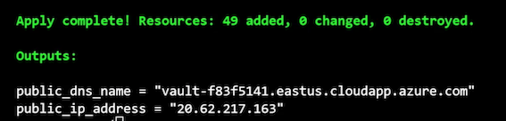

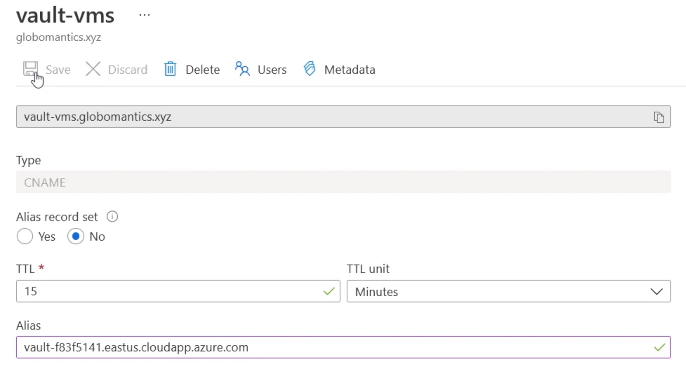

### **Initializing and Validating the Vault Cluster**


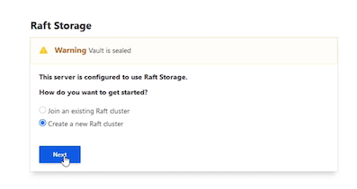

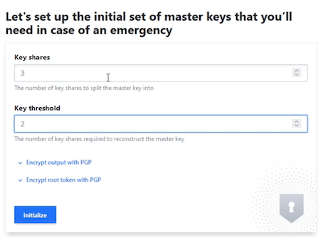

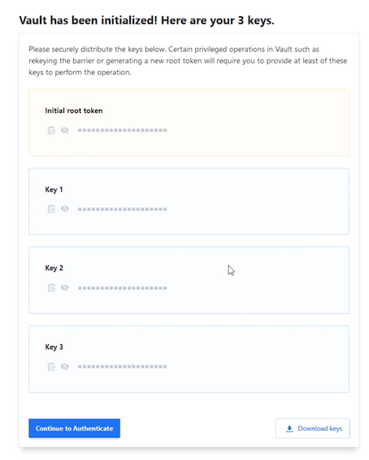

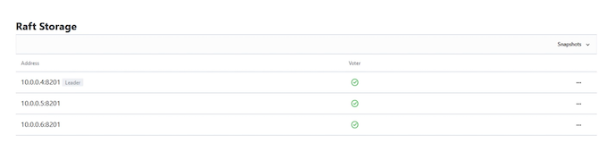

**`lb.tf`**

here is the load balancer health probe that's used to test the health of the nodes in the Vault cluster. 

```
azurerm_lb_probe
...
request_path = "/v1/sys/health?activecode=200&standbycode=429&sealedcode=200&uninitcode=200"
```

it's looking at `v1/sys/health`, and it's passing some parameters to the request. 

The first setting, activecode, says if you're the active Vault server, I want you to respond with a 200, also known as an httpok. 

**If you are a standby server, the second setting, standbycode, says respond with the code 429, which means you're no good, don't send requests to that node**. 

And that's how the health probe in the load balancer knows which node to send traffic to. There's two more settings in here, sealedcode and uninitcode. 

**If the Vault is sealed or uninitialized, then it should respond with a 200, meaning that you haven't initialized the cluster yet, so there is no active node, so just send it to any node and then persist that session.** 


### **Vault Replication**


* Enterprise only

**Vault replication is actually replication between clusters**

* Cluster is unit of replication

**we're not talking about intra‑cluster replication; we're talking about inter‑cluster replication**

* Replication is one-to-many

	* The model for replication is one to many, so a single Vault cluster, that's the primary, can replicate to multiple secondary clusters.(replication process is that it is asynchronous)
	* Committed and completed on the primary Vault cluster before it is replicated to the secondary Vault clusters
	* That could lead to **some small amount of data loss if the primary cluster goes down and clients switch over to a secondary cluster**.	


* Replication is asynchronous

### **Replication Options**

* **replication is disaster recovery.**
* **For that reason, disaster recovery replication replicates not just the Vault data but also the active tokens and leases.** 
* **No requests to secondaries**

So if a client is redirected from the primary cluster to the secondary cluster, all of their tokens and leases will continue to work. 

### **Performance**


**You could set up a secondary cluster and enable it for performance**. 

It will replicate the Vault data from the primary cluster and make it available in a read‑only format for requests coming from clients. 

Any requests that make changes to the Vault data will need to be forwarded along to the primary cluster. 


**Performance clusters** do not replicate tokens and leases, so **if a client is using a secondary performance cluster and needs to switch over to the primary or vice versa, it's going to need to renew its lease or token**.


### Module Summary

* Vault clusters run in an active/standby model
* Vault clusters require HA storage
* Vault client communication can be forwarded or redirected
* Replication is between Vault clusters supporting DR or performance