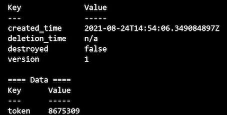

# **L7 Using Secrets Engines**

## **1 Overview**

The whole purpose behind setting up Vault is to manage your sensitive data.

We've set up our Vault cluster, we've configured access to that Vault cluster, now **it's time to set up a couple secrets engines to manage sensitive data**.

## **2 Vault Secrets Engines Review**

Secrets engines are plugins used by Vault to handle sensitive data

### **Store**

* Sensitive data is stored
* securely by Vault

The sensitive data is stored securely by Vault by one of the secrets engines.

### **Generate**

* Vault generates and
* manages sensitive data

> You can also use Vault to generate and manage secret data.
>
> In this case, Vault doesn't just store the data, it actually generates it through one of these plugins.

A good example of this would be the Azure identity secrets engine that has the capability to generate Azure credentials that you can use, and it also manages the lifecycle of those credentials.

### **Encrypt**

Vault provides encryption services for existing data

It is simply providing encryption services for data you submit to Vault, and that actual data is never stored by Vault itself.

## **2 Key Value Engine**

**Store key/value pairs at a path**

**Version 1 and 2  available**

In particular, you can now version the key‑value pairs that are stored at a path. When you write a new key‑value pair to that path, it holds previous versions so you can revert to those.

**Versioning and metadata**

## **3 Transit Engine**

* Encryption as a service
* Does not store data
* Supported actions:

  * Encrypt/decrypt
  * Sign and verify
  * Generate hashes
  * Create random bytes
* Engine manages keys

### Exp Requirements

* Enable a K/V secrets engine for developers
* Enable a Transit secrets engine for DBAs

## Enabling Secrets Engines

### Configuring Secrets Engines

**Engines are enabled on a path**

Defaults to engine name

**All engines are enabled on `/sys/mounts`**

### **Engines can be moved**

* Revokes all existing leases
* May impact policies

This is a disruptive action. It's going to revoke all existing leases associated with that secrets engine, and it may also impact your ACL policies because those are defined by paths, and since the path is changing, the policies you have may no longer apply to the updated path for the secrets engine.

### **Engines can be tuned and configured**

* Tuning settings are common for all engines
* Configuration settings are specific to an engines

tuning refers to settings that are common for all secrets engines, whereas configuration settings are specific to an engine.

For instance, if you're using the AWS secrets engine, the configuration settings are going to be a little bit different than if you're using a MySQL secrets engine.

### **Working with Secrets Engines**

```
# List existing secrets engines
vault secrets list

# Enable a new secrets engine
vault secrets enable [options] TYPE
vault secrets enable –path=GloboKV kv


# Tune a secrets engine setting
vault secrets tune [options] PATH
vault secrets tune –description="Globomantics Default KV" GloboKV

# Move an existing secrets engine
vault secrets move [options] SOURCE DEST
vault secrets move GloboKV GloboKV1


# Disable a secrets engine
vault secrets disable [options] PATH
vault secrets disable GloboKV1
```

## Secrets Engines Demo

- Enable the K/V engine
- Enable Transit engine
- Create policies for both engines
- Verify functionality

```
# Set your Vault address environment variable
# Ex. vault-vms.globomantics.xyz
export VAULT_ADDR=https://VAULT_SERVER_FQDN:8200

# And log into Vault using the globoadmin user
vault login -method=userpass username=globoadmin

# We are going to enable a v2 KV secrets engine called website

# Let's first see which secrets engines are enabled

vault secrets list

# Now let's get our secrets engines enabled

vault secrets enable -path=website -version=2 kv

vault secrets enable -path=dbas transit

# And verify they exist
vault secrets list
```


### **Enabling the Secrets Engines**

```
# Now we'll create a policy for the two secrets engines

# First up we'll create a policy for the devs to do whatever
# they want in the website KV engine
vault policy write website-devs kv-policy.hcl

# Now we'll create one for the transit engine
# Except we'll only allow encrypt and decrypt operations
vault policy write transit-dbas transit-policy.hcl
```

### **`kv-policy.hcl`**

```
# Allow access to all website secrets
path "website/data/*" {
    capabilities = ["create", "read", "update", "delete", "list"]
}

# Allow access to metadata for kv2
path "website/metadata/*" {
    capabilities = ["create", "read", "update", "delete", "list"]
}
```

### `transit-policy.hcl`

```
# Allow access to list keys
path "dbas/keys" {
    capabilities = ["list"]
}

# Allow access to encrypt and decrypt data
path "dbas/encrypt/*" {
    capabilities = ["create","update"]
}

path "dbas/decrypt/*" {
    capabilities = ["update"]
}
```

## Creating Policies for the Secrets Engines

```
# Generate a token for the website k/v engine
vault token create -policy="website-devs"
```


```
# Log in with the token
vault login

# Try to add a secret
vault kv put website/apitokens/d101 token=8675309

# Nice, let's read one of the values
vault kv get website/apitokens/d101
```



```
# Finally we can delete it and let the devs do their thing
vault kv delete website/apitokens/d101

# Now let's generate a token to test the transit engine

# Log back in as globoadmin
vault login -method=userpass username=globoadmin
```

```
# Create the token 
vault token create -policy="transit-dbas"

# Log in with the token
vault login
```


```
# First we'll encrypt some data
vault write dbas/encrypt/key1 plaintext=$(base64 <<< "solongandthanks")
```


```
# And now we'll try to decrypt the ciphertext
ciphertext=CIPHERTEXT

vault write dbas/decrypt/key1 ciphertext=$ciphertext

echo PLAINTEXT | base64 -d
```


### Module Summary

* Secrets engines are Vault plug-ins that can store, generate, and encrypt data.
* The K/V engine stores static values as key value pairs
* The Transit engine provides encryption as a service
