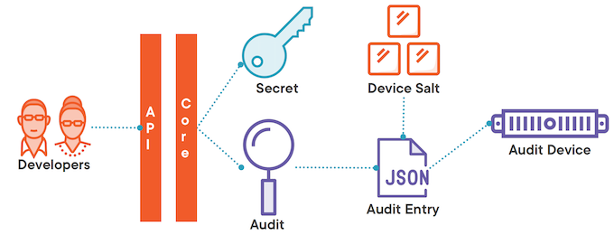
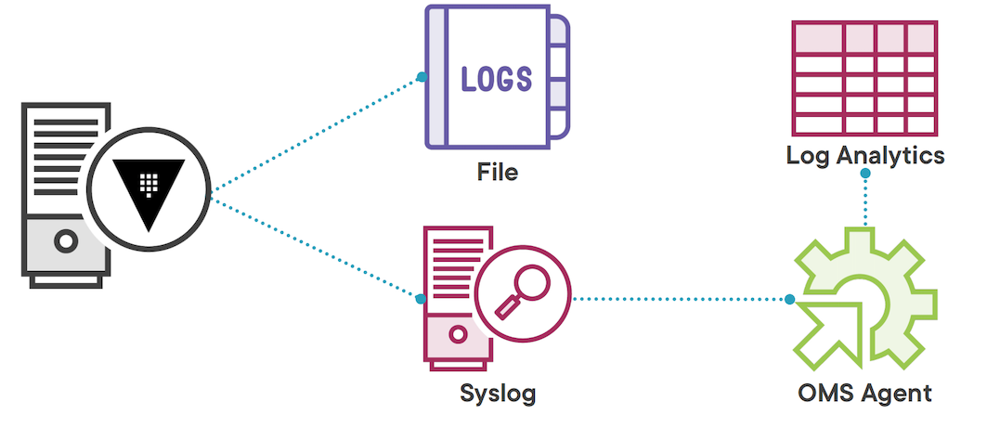
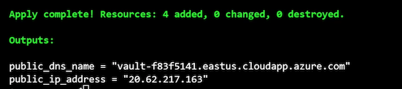
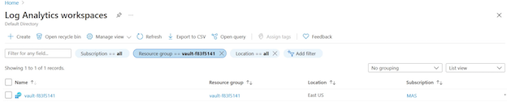
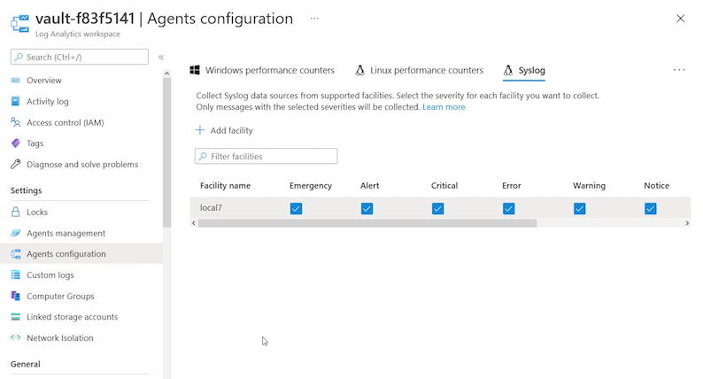
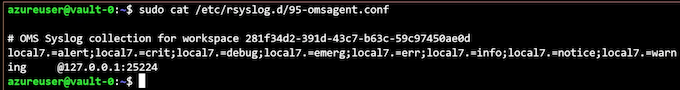
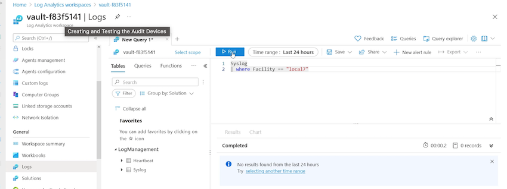
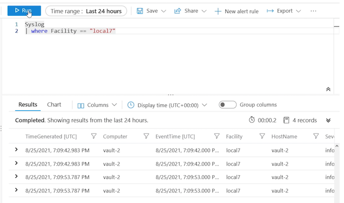

# **L8 Configuring Auditing and Monitoring**

* Vault server logging
* Auditing activity
* Hardening Vault server

## **Monitoring Disambiguation**

**Monitoring**

### Telemetry

These are metrics that you collect about your system, how many IOPS your disk system is using, **how much memory is being utilized, how many transactions you can process per minute**. It's about health, and performance, and metrics

### Logging

Then there's logging, and logging is just writing down in a file or in some sort of collection utility what is happening with the system

And the logging can come from the operating system itself, or it could come from the applications that are running on the system.

**It is specific to what's happening with those services and that system.**

### **Auditing**

Auditing likes to take a look at how users are utilizing the system, what actions they're performing on the system

## Vault Server Logs

* Configuration file, environment variables, or CLI
* Writes to standard log locations
* Captures Vault server events

What is captured in those logs is Vault server events, things like **initializing, unsealing, the generation of root tokens, all things that are happening with the Vault service and its underlying components**.

* Real time view with monitor command

If you want to get a real‑time view of what's going on with the Vault logging, you can run vault monitor and that will pull up a real‑time feed of the Vault logs for whatever you have `VAULT_ADDR` set to.

## Auditing on Vault

* **Captures all requests and responses through the API**

Vault auditing is there to capture all the requests and responses that go through the API, and since we know that all interaction with Vault has to happen through the API, that means any clients that want to interact with the Vault service are going to go through that API in the form of requests, and then they will get responses back from the Vault server.

* **Implemented through device types**
  * File, socket, syslog

The auditing data is captured by audit devices, and there's a few different device types available to you.

**There's the file device type, which writes data to a local file that you indicate.**

There's the socket, which will write to a UNIX socket.

**And then there's syslog, which will write to syslog, and you can specify options for each of these to customize how the device is handled**.

* **One device MUST be available**
* **Sensitive data hashed**
  * Verified with `/sys/audit-hash`

## **Audit Data Capture and Commands**



1. And that API is going to send that **request to Vault Core**, which is behind the barrier.
2. Behind that barrier, it's going to validate that the developers have access to that secret, and then go to retrieve that secret.
3. At the same time, **it's going to write that request data to an audit device**.
4. It's first going to create an audit entry, which is in JSON, and then it's going to **apply a device salt to any sensitive data that's in that entry**, and then finally, write that entry out to the audit device.
5. Once the audit entry has been successfully written, **Vault will now return that secret data to the developers** and write the response to the audit device as well.

In this way, the entire interaction has been captured by the audit device.

### **Audit Commands**

```
# Enable audit device
vault audit enable [options] TYPE [settings]
vault audit enable –path=file-audit file file_path=/opt/vault/logs/auditlog

# Disable audit device
vault audit disable PATH
vault audit disable file-audit

# List audit devices
vault audit list [options]
```

* Capture audit logs with Azure Log Analytics
* Ensure at least one audit device is available
* Sensitive values should not be in clear text

## **Audit Device Demo Overview**



We're going to set up a file type audit device to capture the logs on the local systems that are part of our vault cluster.

Because the local file system should always be available, we can be relatively certain that we're not going to start dropping requests because the audit device is not available, but Globomantics also wants us to capture our audit data with log analytics.

We can do that by setting up a second audit device writing to syslog and then we can use the OMS agent, which is an agent that runs on each Azure VM, to collect the syslog data and send that up to a workspace in log analytics.

## **Deploying the Workbook and Extensions**

**`log_analytics.tf`**

```
variable "oms_agent_version" {
  type = string
  description = "Version of OMS Linux Agent to install"
  default = "1.13"
}

resource "azurerm_log_analytics_workspace" "vault" {
  name                = local.vault_vm
  location            = azurerm_resource_group.vault.location
  resource_group_name = azurerm_resource_group.vault.name
  sku                 = "PerGB2018"
  retention_in_days   = 30
}

resource "azurerm_virtual_machine_extension" "tfazmon_ext" {
  count = var.vault_vm_count
  name                 = "OmsAgentForLinux-${count.index}"
  virtual_machine_id   = azurerm_linux_virtual_machine.vault[count.index].id
  publisher            = "Microsoft.EnterpriseCloud.Monitoring"
  type                 = "OmsAgentForLinux"
  type_handler_version = var.oms_agent_version
  auto_upgrade_minor_version = true

  settings = <<SETTINGS
    {
        "workspaceId": "${azurerm_log_analytics_workspace.vault.workspace_id}"
    }
SETTINGS

    protected_settings = <<PROTECTEDSETTINGS
    {
        "workspaceKey": "${azurerm_log_analytics_workspace.vault.primary_shared_key}"
    }
PROTECTEDSETTINGS
}
```

```


# Now we'll update our deployment
# Make sure to change the YOUR_CERTIFICATE_CN to the fqdn on
# your TLS certificate. Ex. vault-vms.globomantics.xyz
certificate_cn=YOUR_CERTIFICATE_CN
```

```
terraform plan -var leader_tls_servername=$certificate_cn -out azurevm.tfplan

# Now we'll apply the plan to create the resources
terraform apply azurevm.tfplan
```



The next step has to be done in the UI or by altering the syslog config files.

**It's easier to go to the UI and update the agent settings to include facility LOCAL7**





```
ssh -i ~/.ssh/azure_vms_private_key2.pem -p 2022 azureuser@20.62.217.163
```

```
ssh -i ~/.ssh/azure vms private kev2.pem -p 2022 azureuser@20.62.217.163
```

```
# Check on the config file
sudo cat /etc/rsyslog.d/95-omsagent.conf
```



```
# Restart agent if desired
sudo /opt/microsoft/omsagent/bin/service_control restart

# And the wa-agent as well
sudo systemctl restart walinuxagent
```

## Deploying the Workbook and Extensions

### **Configuring local file auditing**

Head back to this folder

```
# Set your Vault address environment variable
# Ex. vault-vms.globomantics.xyz
export VAULT_ADDR=https://VAULT_SERVER_FQDN:8200


# And log into Vault using the globoadmin user
vault login -method=userpass username=testadmin

# First we need to update our admin policy!
vault policy write vault-admins vault-admins.hcl
```

**`vault-admins.hcl`**

```
# Allow managing leases
path "sys/leases/*"
{
  capabilities = ["create", "read", "update", "delete", "list", "sudo"]
}

# Manage auth backends broadly across Vault
path "auth/*"
{
  capabilities = ["create", "read", "update", "delete", "list", "sudo"]
}

# List, create, update, and delete auth backends
path "sys/auth/*"
{
  capabilities = ["create", "read", "update", "delete", "sudo"]
}

# List existing policies
path "sys/policies"
{
  capabilities = ["read"]
}

# Create and manage ACL policies broadly across Vault
path "sys/policies/*"
{
  capabilities = ["create", "read", "update", "delete", "list", "sudo"]
}

# List, create, update, and delete key/value secrets
path "secret/*"
{
  capabilities = ["create", "read", "update", "delete", "list", "sudo"]
}

# Manage and manage secret backends broadly across Vault.
path "sys/mounts/*"
{
  capabilities = ["create", "read", "update", "delete", "list", "sudo"]
}

# List existing secret engines.
path "sys/mounts"
{
  capabilities = ["read"]
}

# Read health checks
path "sys/health"
{
  capabilities = ["read", "sudo"]
}

# Configure auditing
path "sys/audit"
{
  capabilities = ["list", "sudo"]
}

path "sys/audit/*"
{
  capabilities = ["create", "read", "update", "delete", "list", "sudo"]
}
```

```
# Enable a file location for an audit device
vault audit enable file file_path=/opt/vault/audit.log
```

Now go back to the Azure portal and the log analytics workspace we created earlier.

You can query the logs capture and verify that event have started to show up



```
# Run the following query on Logs
Syslog
| where Facility == "local7" 
```

```
# Add some entries to the audit log by issuing
# Vault requests
vault secrets list

vault policy list

vault secrets enable -path=audittest kv
```



## Vault Hardening

### System level

* Run unprivileged
  * **That means not running as root**.
  * When we installed Vault on our Azure Virtual Machines, it already created a Vault user for us, and that is the user that we've used to run the service.
* Run single tenant
* Disable swap and command history
  * In the configuration of your operating system, you should try to disable swap and command history.
  * **Swap typically writes memory to some sort of persistent data when it needs to swap out pages of memory**.
* **Disable core dumps**
* **Protect storage**
* **Use SELinux or AppArmor**

### **Networking**

* Disable remote access
* Restrict network traffic
* End-to-end TLS

### **Vault configuration**

* Enable auditing
* Avoid root tokens
* Immutable and frequent upgrades

## **Module Summary**

* Vault logging can be set in multiple places and captures server activity.
* **Auditing captures all requests and responses from the API**.
* Sensitive data is hashed by default and can be confirmed with the **audit-hash API endpoint**
* **Apply proper hardening to your Vault servers per HashiCorp and your organization.**
