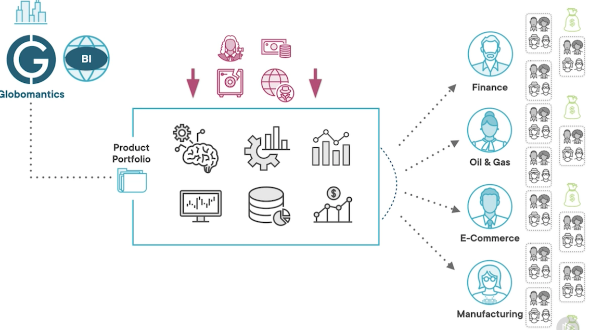

# **L1 Secrets in HashiCorp Vault Introduction**

## **1 Why Encryption as a Service?**



The company has created a number of successful digital products and services, and continues to expand its portfolio as demand surges higher and higher year over year.


### **Secrets Examples**

* Usernames & Passwords
* Database Credentials
* API Tokens
* TLS Certificates

 
Some common examples of credentials can be usernames and passwords, **database credentials, API tokens, or Transport Layer Security, or TLS certificates**. 


###  Secrets Management

* **Access List - who is granted access**
* **Audit Trail - previous usage**
* **Secrets Rotation - change them regularly**


When it comes to managing these secrets, 

* we usually want to know who has access to them,
* who's been using them, 
* when, and how to periodically rotate them, or change them on a regular basis


### **Secrets Sprawl**

When it comes to secrets management, companies and organizations usually experience something called a **secret sprawl**. 


**Source Code - in headers**

* Secrets end up in plain text in our source code, usually hardcoded inside headers like username and password. In places like Configuration Management. 


**Software Configuration Management Files - Chef, Puppet, Ansible**

* These are plain text files for tools like Chef, Puppet, or Ansible, where anyone with a login can see what these credentials are. 

**Version Control - GitHun, BitBucket, Sub-Version**

And finally, in version control systems like GitHub, BitBucket, Sub‑version, etc. So this is the actual secrets sprawl, they are all over your IT infrastructure. 


### **Centralized Secrets Management**


**Centralized Secrets Management**

Enter Encryption as a Service with Vault, which is a way to centralize secrets management and standardize the usage of an ever‑growing array of security systems and mechanisms. 

**Vault handles both encryption at rest ‑ when the secrets are persisted in some sort of storage**

**In transit ‑ when secrets are transmitted over the network to remote locations.** 

## **2 Vault Architecture Explained**

### **Vault Architecture**


We see that Vault can be accessed by applications and users, usually via web clients such as web browsers or operators via the Vault CLI.


**Vault relies on the Transport Layer Security protocol, or TLS,** to ensure your secrets are safe in transit, that is, they're sent and received securely.

Once secrets arrive securely over the wire, they reach the Vault's HTTP RESTful API. **The API helps users interact with Vault and carry the secrets through the barrier**.

The secrets are then passed to the core components for encryption and decryption.

An encrypted data never enters or leaves the barrier through the HTTP API or between Vault and the storage back ends.


**The internal back‑end components talk to the storage back ends.** Vault provides several mechanisms to store secrets. It handles different types of secrets by offering a pluggable architecture **where a set of secrets engines provides storage and interaction implementations for specific types of secrets.**

### **Vault Backend**

Please note that except for its own operational data that includes tokens, policies, and system data, **vault does not itself store secrets.** 

**It delegates that responsibility to a wide array of back ends.** 

This is how Vault handles secrets at rest. At the bottom of this diagram, we have depicted the main types of secrets back ends, file system; key‑value pair type, such as console and etcd; cloud solutions by major hyperscalers like AWS, Azure, and GCP; and databases, for example, Postgres, MySQL, Oracle, and many more. 

Storage back ends see only encrypted data. 

If a Vault backend is compromised, the data stored there is unreadable without the Vault server to decrypt it.


Vault uses the AES‑256 standard to encrypt and decrypt secrets internally. 

Symmetric algorithms are considerably faster than asymmetric ones. 

Vault encrypts data in 256 blocks. 

Secrets are then stored durably or transmitted securely. 

Once encryption operations are complete, **Vault handles further processing by performing security policy application, auditing, token generation, and path routing to manage and store secrets.**


## Quick Install with Package Managers


### Install on Windows

```
choco install vault
vault version
vault -h
```

### Install on Linux

```
# Install on Linux - Ubuntu
# For other Linux distributions, check out this link: 
# https://www.hashicorp.com/blog/announcing-the-hashicorp-linux-repository#curl-fssl-https-apt-releases-hashicorp-com-gpg-sudo-apt-key-add

curl -fsSL https://apt.releases.hashicorp.com/gpg | sudo apt-key add -
sudo apt-add-repository "deb [arch=amd64] https://apt.releases.hashicorp.com $(lsb_release -cs) main"
sudo apt-get update && sudo apt-get install vault
```

```
# Verify installation
ls -l /etc/apt/sources.list.d/ | grep hashi
vault -v
```

```
# Create a SystemD unit file called vault.service
sudo vim /etc/system/system/vault.service
```

**`vault.service`**

```
[Unit]
Description=Vault-DEV-Instance
Documentation=https://www.vaultproject.io/docs

[Service]
ExecStart=/usr/bin/vault server -dev
ExecReload=/bin/kill -HUP $MAINPID
LimitNOFILE=65536

[Install]
WantedBy=mult-.user.target
```

**In the future, change the value ExecStart to work with the -config flag, and point to Vaults configuration file, when you want to run a Production instance of Vault**


Vault as a Service on Linux With SystemD

```
# Reload SystemD configuration 
systemctl daemon-reload

# Start Vault service
systemctl start vault 

# Enable Vault service to run on system boot
systemctl enable vault 

# Check Vault service status - active (running | waiting | exited), inactive 
# (stopped), enabled | disabled …, see citation below
systemctl status vault
```

### Install on Mac OS

```
# If you don't have Homebrew installed, use this command first
/bin/bash -c "$(curl -fsSL https://raw.githubusercontent.com/Homebrew/install/HEAD/install.sh)"

brew install hashicorp/tap/vault
vault version
```

### Install Consul on Other Linux Distributions

```
# Install Consul as well
brew install consul
```

```
# Ubuntu 
sudo apt-get install -y consul

# Open SUSE
sudo snap install consul

# RedHat
sudo yum install -y consul

# Debian - official repository added in 2020
sudo yum install -y consul

# Download module resources for full details and references
```

## Vault CLI

```
$ vault -h
Usage: vault <command> [args]
...
```

```
# List first level commands 
vault -h

# Get help on first level commands
vault <command> -h

# Get help on subcommands
vault <command> <subcommand> -h

# Sample subcommand
vault lease renew -h
```

```
$ vault renew -h
Usage: vault <command> [args]

Common commands:
    read        Read data and retrieves secrets
    write       Write data, configuration, and secrets
    delete      Delete secrets and configuration
    list        List data or secrets
    login       Authenticate locally
    agent       Start a Vault agent
    server      Start a Vault server
    status      Print seal and HA status
    unwrap      Unwrap a wrapped secret

...
```

### **Vault General Commands**

```
# General command format 
vault <command> [options] [path] [args]


# Sample command
vault write -address=“http://127.0.0.1:8200” auth/userpass/users/gsmith password=“pwd123”


# Sample command with multiple options and args
vault write -address=“http://127.0.0.1:8200” -namespace=“my-organization” \
auth/userpass/users/gsmith password=“pwd123” policies=“admin”

# Auto complete installation
vault -autocomplete-install


# After that execute Ctrl+C to stop Vault, then restart the dev server
vault server -dev
# Now vault read + tab will show you the autocomplete options for the "read" command
```

### Features

* **Exit Codes**

The Vault CLI aims to be consistent and well-behaved unless documented otherwise.

* Local errors such as incorrect flags, failed validations, or wrong numbers of arguments return an exit code of 1.
* Any remote errors such as API failures, bad TLS, or incorrect API parameters return an exit status of 2

Some commands override this default where it makes sense. These commands document this anomaly.

**When you get an exit code of 2, this is usually related to remote errors such as API failures, bad TLS, or incorrect API parameters.** 

Another very useful feature is the token helper. This is a mechanism to cache a Vault token after authentication

* **Token Helper**

By default, the Vault CLI uses a "token helper" to cache the token after authentication. This is conceptually similar to how a website securely stores your session information as a cookie in the browser. Token helpers are customizable, and you can even build your own.

The default token helper stores the token in `~/.vault-token` . You can delete this file at any time to "logout" of Vault.

**Different Ways to Authenticate a Web Application**

* The token helper is very similar to a cookie that stores user‑session information in the browser. 
* Token helpers are customizable and you can build your own if needed.
* Take a look at the `vault‑token` hidden file under your home directory. 
* This is where the default token helper stores its token. 
* Deleting this file is equivalent to logging out. 


* **Environment Variables**

The CLI reads the following environment variables to set behavioral defaults. This can alleviate the need to repetitively type a flag. 

Flags always take precedence over the environment variables.

**They are very useful for sending behavioral defaults such as the `VAULT_ADDR`, `VAULT_TOKEN`, `VAULT_CACERT`, `VAULT_CLIENT_KEY`, `VAULT_CLUSTER_ADDR`, and `VAULT_FORMAT`, and many more.** 


