# **2 Installing and Configuring Authentication Methods**

> `vault login hvs.HOd7xIuvGVsiIhDYeOHO5BsV`

## **1 Authentication for Entities and identities**

### **Legal Entities - Corporate Structure**

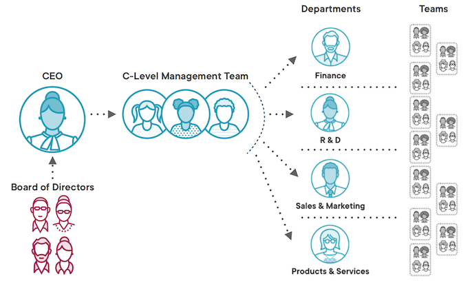


Legal entities behave like individuals. 

They purchase products, consume services, and perform work, but they differ in that they have a corporate structure, **like divisions, departments, teams, and so on, and internal rules**. 


Organizations also have members who play different roles, **system administrators, developers, and project managers**. 


### **Users & Groups**

**File System Permissions Analogy**

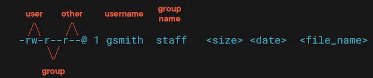


Both individuals and members of organizations can assume one or more identities. 

Each identity consists of or can be described with one or more attributes, again, a one‑to‑many relationship.


### **Vault & Authentication Integrations**

Vault can integrate with authentication platforms 

* **LDAP**: Business directory services
* **Active Directory**: For Microsoft workloads
* **GitHub**: Version control authentication
* **AWS**: One of the cloud methods
* **AppRole**: For business systems and 
CI/CD tools

This includes business systems that require secrets access and continuous integration tools that build and deploy software. 

### **Authentication Flow**

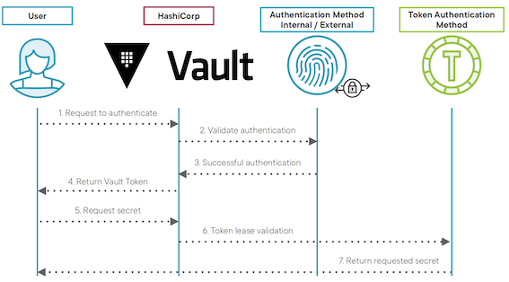

There are many authentication methods that Vault supports, but regardless of the one being used, a successful authentication request always produces and **returns a token**. 

Token authentication is the default method, and it allows read and write access to secrets. 


* 1, the client, which can be an individual or an application, sends an authentication request to Vault. Vault calls LDAP to authenticate the request. 
* 2, Vault extracts the necessary information from the request and submits it to the identity provider for authentication, in this case, LDAP. 
* 3, **If the credentials are valid, LDAP confirms them. Then on success**
* 4, Vault returns a newly minted token to the client. 
* 5 Using that token, **the client can request access to the secrets covered by the permissions granted by the token**. We will discuss permissions shortly after we talk about policies.
* 6 **Vault validates the lease of the token, or it's time to live, commonly referred to as TTL**. And if the lease is still good, Vault returns the requested secret in step 
* 7 Vault provides a number of authentication methods. 


### **Authentication Methods**

**Human Users**

* Userpass 
	* built‑in authentication system to Vault that supports username and password combinations
* LDAP and Active Directory 
* Cloud providers - AWS, GCP, Azure
	* AWS
	* Azure
	* Google Cloud
* GitHub

> Userpass is suitable for testing. Not the best option for Production
> 
> Active Directory and GitHub are suitable for Production environments


**Non-human Users**

* AppRole 
* Kubernetes

The tokens returned by these methods are keys of **limited use.** 

These keys are associated with the user, possibly with the group, and with a policy which determines the secrets that are readable and/or writable by the token. 


In Vault parlance, the actions allowed by a policy are called capabilities. 

**Common capabilities are create, read, update, delete, and list.**

### **Vault Built-in Authentication Methods**

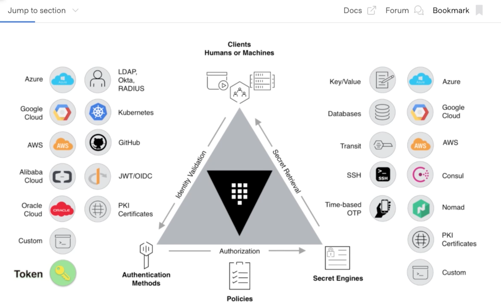

On this diagram, you can see the supported authentication methods on the left. Token is the default authentication method, followed by the different cloud identity providers, GitHub, JWT, Kubernetes, Okta, RADIUS, and so on. 


### **Vault Built-in Authentication Methods**

**Token**

The default authentication method in Vault


**Userpass**

Built-in method using usernames and passwords,stored in Vault

## Demo: Authentication for Entities and Identities

```
$ vault server -dev
==> Vault server configuration:

             Api Address: http://127.0.0.1:8200
                     Cgo: disabled
         Cluster Address: https://127.0.0.1:8201
              Go Version: go1.19.3
              Listener 1: tcp (addr: "127.0.0.1:8200", cluster address: "127.0.0.1:8201", max_request_duration: "1m30s", max_request_size: "33554432", tls: "disabled")
               Log Level: info
                   Mlock: supported: false, enabled: false
           Recovery Mode: false
                 Storage: inmem
                 Version: Vault v1.12.2, built 2022-11-23T12:53:46Z
             Version Sha: 415e1fe3118eebd5df6cb60d13defdc01aa17b03
...
You may need to set the following environment variables:

    $ export VAULT_ADDR='http://127.0.0.1:8200'

The unseal key and root token are displayed below in case you want to
seal/unseal the Vault or re-authenticate.

Unseal Key: 80fhgSyxE0PrDrkr6yVcUV1HmjW+1uKX8sLv2lGpCn4=
Root Token: hvs.HOd7xIuvGVsiIhDYeOHO5BsV

Development mode should NOT be used in production installations!
```

```
export VAULT_ADDR='http://127.0.0.1:8200'
```

### `vault status`

```
$ vault status
Key             Value
---             -----
Seal Type       shamir
Initialized     true
Sealed          false
Total Shares    1
Threshold       1
Version         1.12.2
Build Date      2022-11-23T12:53:46Z
Storage Type    inmem
Cluster Name    vault-cluster-bbbb4ade
Cluster ID      f8d55404-3393-f04d-da5e-7b9ee659ea22
HA Enabled      false
```

```
$ vault auth list
Path      Type     Accessor               Description                Version
----      ----     --------               -----------                -------
token/    token    auth_token_eff89ca7    token based credentials    n/a
```

```
$ vault login hvs.HOd7xIuvGVsiIhDYeOHO5BsV
Success! You are now authenticated. The token information displayed below
is already stored in the token helper. You do NOT need to run "vault login"
again. Future Vault requests will automatically use this token.

Key                  Value
---                  -----
token                hvs.HOd7xIuvGVsiIhDYeOHO5BsV
token_accessor       hB9GYswMqIDKgocQx9TQKtTF
token_duration       ∞
token_renewable      false
token_policies       ["root"]
identity_policies    []
policies             ["root"]
```

### `enable userpass`


```
# Enable on path auth/userpass
$ vault auth enable userpass

Success! Enabled userpass auth method at: userpass/

$ vault auth list
Path         Type        Accessor                  Description                Version
----         ----        --------                  -----------                -------
token/       token       auth_token_eff89ca7       token based credentials    n/a
userpass/    userpass    auth_userpass_75046b90    n/a                        n/a

# Enable on path auth/userpass

vault auth enable -description='UID/PWD Authentication Method' -max-lease-ttl=2m userpass/


$ vault write auth/userpass/users/vuser password=vpwd123
Success! Data written to: auth/userpass/users/vuser
```

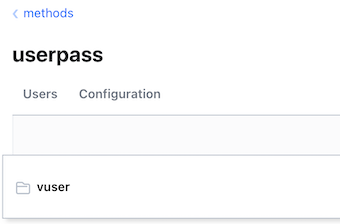

```
$ vault login -method=userpass username=vuser password=vpwd123

$ vault login -method=userpass username=vuser password=vpwd123
Success! You are now authenticated. The token information displayed below
is already stored in the token helper. You do NOT need to run "vault login"
again. Future Vault requests will automatically use this token.

Key                    Value
---                    -----
token                  hvs.CAESIBJgn8bBIIby7AvO60o8oVX4mCfW7gve6JLO92N0f5G1Gh4KHGh2cy5QdUdDRlpDT1hyUHJQdkw4RTZBTHJWWVA
token_accessor         SUxhDQRTklekYriVIIBfX5xf
token_duration         768h
token_renewable        true
token_policies         ["default"]
identity_policies      []
policies               ["default"]
token_meta_username    vuser

$ vault login  hvs.CAESIBJgn8bBIIby7AvO60o8oVX4mCfW7gve6JLO92N0f5G1Gh4KHGh2cy5QdUdDRlpDT1hyUHJQdkw4RTZBTHJWWVA
Success! You are now authenticated. The token information displayed below
is already stored in the token helper. You do NOT need to run "vault login"
again. Future Vault requests will automatically use this token.

Key                    Value
---                    -----
token                  hvs.CAESIBJgn8bBIIby7AvO60o8oVX4mCfW7gve6JLO92N0f5G1Gh4KHGh2cy5QdUdDRlpDT1hyUHJQdkw4RTZBTHJWWVA
token_accessor         SUxhDQRTklekYriVIIBfX5xf
token_duration         767h57m30s
token_renewable        true
token_policies         ["default"]
identity_policies      []
policies               ["default"]
token_meta_username    vuser
```

**Enable the Vault Ul in Production by
creating a configuration file**

```
sudp vim /etc/hashicorp/vault/vault_config.hcl
```

```
storage "consul" {
	address = "127.0.0.1:8500"
	path = "vault"
}

listener "tcp" {
	address = "127.0.0.1:8200"
	tls_disable = 1
}


telemetry {
	statsite_address = "127.0.0.1:8125"
	disable hostname = true
}

ui = true
```

## **3 Enabling and Configuring Authentication Methods**

```
vault auth tune -description='UID/PWD Authentication Method' -max-lease-ttl=2m userpass/

$ vault auth tune -description='UID/PWD Authentication Method' -max-lease-ttl=2m userpass/
Success! Tuned the auth method at: userpass/
```

### **Enable LDAP auth method**

```
vault auth enable ldap

$ vault auth enable ldap
Success! Enabled ldap auth method at: ldap/

# Configure LDAP auth method - basic parameters
vault write auth/ldap/config \
    url="ldap://ldap.testvault.com" \
    userdn="ou=Users,dc=testvault,dc=com" \
    groupdn="ou=Groups,dc=testvault,dc=com" \
    groupfilter="(&(objectClass=group)(member:1.2.840.113556.1.4.1941:={{.UserDN}}))" \
    groupattr="cn" \
    upndomain="testvault.com"

Success! Data written to: auth/ldap/config  
```

Configure LDAP auth method - with CA cert enabled 

```
vault write auth/ldap/config \
    url="ldap://ldap.testvault.com" \
    userdn="ou=Users,dc=testvault,dc=com" \
    groupdn="ou=Groups,dc=testvault,dc=com" \
    groupfilter="(&(objectClass=group)(member:1.2.840.113556.1.4.1941:={{.UserDN}}))" \
    groupattr="cn" \
    upndomain="testvault.com" \
    ertificate=@ldap_ca_cert.pem \
    insecure_tls=false \
    starttls=true
``` 

### Enable AWS auth method

```
# Set env variables for AWS
export AWS_ACCESS_KEY="my_aws_account_access_key128h*Y73#12<jd";
export AWS_SECRET_KEY="my_aws_account_secret_key93jkd&3)s>sds1";

# Configure AWS auth method with the access and secret keys
vault write auth/aws/config/client \
	secret_key=$AWS_SECRET_KEY \
	access_key=$AWS_ACCESS_KEY
	
# Create a policy that gives db-role list and read capabilities
vault policy write db-policy - << EOF
path "database/creds/app-role" {
	capabilities = ["list", "read"]
}
EOF

success! Uploaded policy: db-policy

```
 
### Create and configure app-db-role

```
vault write \
    auth/aws/role/app-db-role \
    auth_type=ec2 \
    policies=db-policy \
    max_ttl=1h \
    disallow_reauthentication=false \
    bound_ami_id=ami-<hash>
    
# Read the policy to verify it is correctly configured
vault read auth/aws/role/app-db-role
```

```
vault write \
	auth/aws/role/app-db-role\
	auth_type=ec2\
	policies=db-policy\
	max ttl=1h \
	disallow reauthentication=false\
	bound amiid=ami-asdf0139kfkw93ks53
```

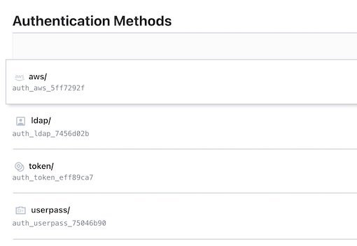


## **Policy Types**

### **Policy Types**

**ACL Policies**

- Defined in HCL 
- Assigned to tokens by name


The first and most common policy type is ACL, or **Access Control List** policies. These are written in HCL, the HashiCorp's JSON‑like configuration language.

 They apply to a path or paths and are linked to tokens by name.
 
```
vault policy write my-policy my-policy.hcl

Success! Uploaded policy: my-policy

vault policy write other-policy other-policy.hcl

Success! Uploaded policy: other-policy
```

**`my-policy.hcl`**

```
### My Policy ###
# Write any secret to these sub-paths secret/data/*
path "secret/data/*" {
  capabilities = ["create", "update"]
}

# Only read from this path
path "secret/data/globomantics" {
  capabilities = ["read"]
}
```

**`other-policy.hcl`**

```
### My Policy ###
# Write any secret to these sub-paths secret/data/*
path "secret/data/*" {
  capabilities = ["create", "update"]
}

# Read from and update secrets under this path
path "secret/data/globomantics/accounting" {
  capabilities = ["read", "update"]
}
```


```
vault token create -policy-my-policy-policy=other-policy
```

```
$ vault token create -policy=my-policy -policy=other-policy
Key                  Value
---                  -----
token                hvs.CAESIE6IZcV9vkIsQ3YfPrPKBC8z24-R_40SOksX4CDvDy3GGh4KHGh2cy50cWNhUm9LdjREckZBekttRXg3S2dFMWw
token_accessor       DSwrEQIzxUbb6hgFgJPDsXs1
token_duration       768h
token_renewable      true
token_policies       ["default" "my-policy" "other-policy"]
identity_policies    []
policies             ["default" "my-policy" "other-policy"]
```

<mark>logging into Vault with a particular identity, certain aspects of it, like your LDAP group membership or your IAM role will be linked to such policies, as the policies will be assigned to your token by name<mark>

**Endpoint Governing Policies**

- Defined in Sentinel
- Assigned to API endpoints irrespective of identity

The second type are endpoint governing policies. They're written in Sentinel, which is available only in the enterprise commercial version of Vault

Governing policies is that they apply to API endpoints regardless of identity or regardless of who is trying to access the endpoint.


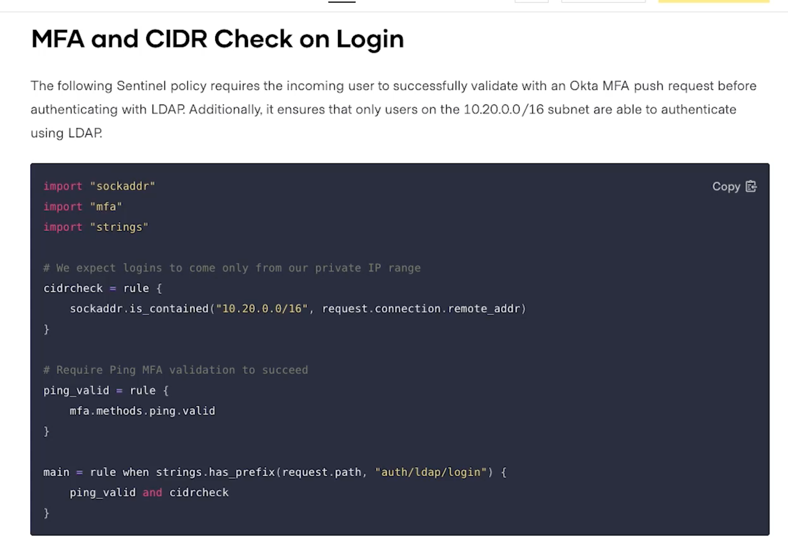

To understand this better, here's a quick example  The cidrcheck rule ensures login requests originate only from a specific IP range. 

The `ping_valid` rule enforces ping multi‑factor authentication. Finally, the main rule combines the first to rules and applies a logical AND, but only when the request path starts with auth/ldap/login or for LDAP login attempts only

Every Sentinel policy has a main rule, which is evaluated to determine the result of the policy.

**Role Governing Policies**

- Defined in Sentinel
- Assigned to tokens by name

**Root Policies**

- **Apply to root tokens only** 
- Used in an emergency or when no other policies are available

```
 vault token lookup
Key                 Value
---                 -----
accessor            hB9GYswMqIDKgocQx9TQKtTF
creation_time       1671289536
creation_ttl        0s
display_name        root
entity_id           n/a
expire_time         <nil>
explicit_max_ttl    0s
id                  hvs.HOd7xIuvGVsiIhDYeOHO5BsV
meta                <nil>
num_uses            0
orphan              true
path                auth/token/root
policies            [root]
ttl                 0s
type                service
```

## Advanced Policies Explained

**Policies determine**

* Which secrets a token can access
* Whether the token can be used to Read/Write secrets to a path

### **Tokens & Policies**

The relationship between tokens and policies, a single token can be linked to one or more policies. Policies determine which secrets a token is allowed to access and whether that token can be used to **read or write secrets to a path in Vault**

**Vault treats paths in a way similar to how a file system treats files**

It assigns a set of permissions. 

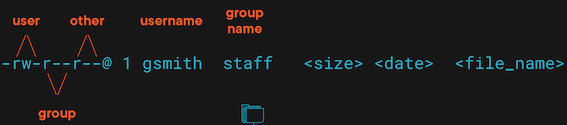

Vault exposes paths and manages control to the resources behind those paths via policies, the equivalent of file system permissions

### Vault Paths 

Structure & Samples

```
# Auth method: userpass
auth/userpass/users/:username/password 
auth/userpass/users/:username
auth/userpass/login/:username 
auth/userpass/mfa_config 
auth/userpass/policies


# Auth method: aws
auth/aws/config/client 
auth/aws/config/rotate-root
auth/aws/config/identity
auth/aws/config/certificate 
auth/aws/config/certificate/:cert_name 
auth/aws/config/certificates # Plural 
auth/aws/config/sts 
auth/aws/config/sts/:account_id
```


### **Vault REST-ful HTTP API Call**


```
# Call with curl
curl \ 
    --header "X-Vault-Token: $VAULT_TOKEN" \ 
    --request POST \ 
    --data '{"policies": ["my-policy"]}' \ 
    http://127.0.0.1:8200/v1/auth/approle/role/my-role
```


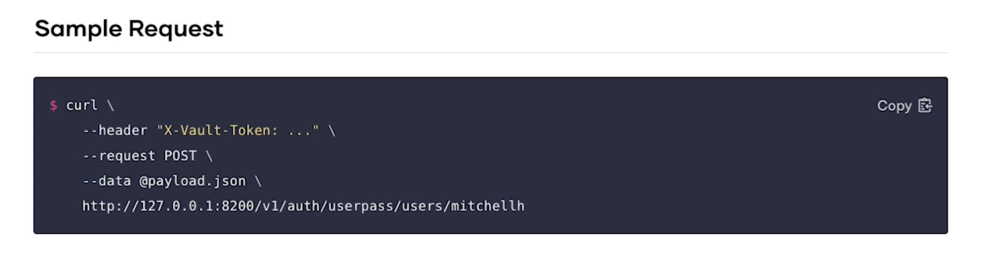

### **Issuing Tokens**

**Vault uses policies to govern the behavior of clients and instrument Role-Based Access Control (RBAC) by specifying access privileges (authorization)**


**Policies are associated with tokens when those tokens are minted**. 

And tokens are issued to users or groups The precise mechanism for this depends on the authentication method being used: userpass, GitHub, database, AWS, Okta, and so on. Here is an HCL policy file that defines capabilities for a path.


### **Policies**

**Capabilities**


* Create - HTTP [PUT or POST] 
* Read - HTTP [GET] 
* Update - HTTP [PUT or POST] 
* Delete - HTTP [DELETE] 
* List - HTTP [LIST] 
* SUDO - access to root-protected paths 
* Deny - explicitly denies a capability


Vault comes with two built‑in policies, **root and default.** 

* Root can access all paths, including the ones that begin with sys, **otherwise known as Vault's internal paths**. 

> The only exception to that is a path to a cubbyhole. 

**The only secret the root token cannot acmes is the one stored in a cubbyhole**

* **The default policy includes capabilities that allow tokens to read their own metadata**. This policy can be modified, if needed. 

**`ecommdev-policy.hcl`**

```
# The "data" path semement is required by KVv2
path "secret/data/ecommdev" {
    capabilities = ["create", "update", "read", "list"]
}
```

The one can be used to generate tokens for E‑commerce developers or for Vault admins.

```
vault policy write profileapp-policy profileapp-policy.hcl 
vault policy write ecommdev-policy ecommdev-policy.hcl
```

**`profileapp-policy.hcl`**

```
# The "data" path semement is required by KVv2
path "secret/data/profileapp" {
    capabilities = ["read"]
}
```

### Complexity


* Glob - aka `*` asterisk
* Wild card - aka `+` sign
* Templating

**`templated_policy1.hcl`**

```
path "secret/data/{{identity.entity.id}}/*" {
  capabilities = ["create", "update", "read", "delete"]
}

path "secret/metadata/{{identity.entity.id}}/*" {
  capabilities = ["list"]
}
```

**Fine-Grained Control with Parameter Constraints**

* Required parameters
* Allowed parameters
* Denied parameters

## Configuring and Testing Advanced Policies

### Advanced Policies Features

**Glob / Wild Card (segment) / Templating / Allowed Parameters / Denied Parameters (disallowed) / Required Parameters**


Focus on the top three advanced features: **glob, segment, and templating**. 


And we will also cover advanced parameter constraints: allowed, disallowed, and required. Glob is specified with an asterisk at the end of a path in an ACL policy rule

* **`demo_glob_myorg_ops_policy.hcl`**

```
# Glob - prefix match
path "secret/data/myorg/*" {
    capabilities = ["read", "create", "list"]
}

# Restrict a specific subpath to only org-level admins
path "secret/data/myorg/admin-secret" {
	capabilities  = ["deny"]
}

```

* **`demo_glob_myorg_admins_policy1.hcl`**

```
# Allow admin users to create org-level secrets
path "secret/data/myorg/admin-secret" {
	capabilities  = ["create", "update", "delete", "list"]
}
```

> **Glob ( * ) is not equivalent to a its RegEx counterpart**


```
vault policy write demo_glob_myorg_ops_policy demo_glob_myorg_ops_policy.hcl

vault policy write demo_glob_myorg_admins_policy1 demo_glob_myorg_admins_policy1.hcl
```

```
$ vault policy write demo_glob_myorg_ops_policy demo_glob_myorg_ops_policy.hclSuccess! Uploaded policy: demo_glob_myorg_ops_policy

$ vault policy write demo_glob_myorg_admins_policy1 demo_glob_myorg_admins_policy1.hcl
Success! Uploaded policy: demo_glob_myorg_admins_policy1
```

we define a separate policy that will allow an admin user to create admin secrets on the path we denied in the previous policy

```
$ vault policy list
default
demo_glob_myorg_admins_policy1
demo_glob_myorg_ops_policy
my-policy
other-policy
root
```


### Create orgops user and assign a policy

```
vault write auth/userpass/users/orgops password=orgops policies=demo_glob_myorg_ops_policy

$ vault write auth/userpass/users/orgops password=orgops policies=demo_glob_myorg_ops_policy
Success! Data written to: auth/userpass/users/orgops
```


```
$ vault list auth/userpass/users
Keys
----
orgops
vuser
```

```
# Login with orgops user
vault login -method=userpass username=orgops password=orgops

 vault login -method=userpass username=orgops password=orgops
Success! You are now authenticated. The token information displayed below
is already stored in the token helper. You do NOT need to run "vault login"
again. Future Vault requests will automatically use this token.

WARNING! The following warnings were returned from Vault:

  * TTL of "768h" exceeded the effective max_ttl of "2m"; TTL value is capped
  accordingly

Key                    Value
---                    -----
token                  hvs.CAESIC1UzNx8fvZcPo9wZWbDLA9hIVUf8ouxx7CBlcoUtucUGh4KHGh2cy5oS3dDUXVCdktUUUpIaHRwaWV1T1FUSWI
token_accessor         DjnOpVxFWkMEgnpak0sulX2r
token_duration         2m
token_renewable        true
token_policies         ["default" "demo_glob_myorg_ops_policy"]
identity_policies      []
policies               ["default" "demo_glob_myorg_ops_policy"]
token_meta_username    orgops

# policies               ["default" "demo_glob_myorg_ops_policy"]

# Write to myorg
$ vault kv put secret/myorg/opsorgsecret1 key=opsbadge2371 value=super13secret45pwd

$ vault kv put secret/myorg/opsorgsecret1 key=opsbadge2371 value=super13secret45pwd

========= Secret Path =========
secret/data/myorg/opsorgsecret1

======= Metadata =======
Key                Value
---                -----
created_time       2022-12-19T07:49:03.794412Z
custom_metadata    <nil>
deletion_time      n/a
destroyed          false
version            1


# Write to myorg/mydepartment


vault kv put secret/myorg/mydepartment/opsdeptsecret1 key=opsbadge2371 value=super13secret45pwd


$ vault kv put secret/myorg/mydepartment/opsdeptsecret1 key=opsbadge2371 value=super13secret45pwd
================ Secret Path ================
secret/data/myorg/mydepartment/opsdeptsecret1

======= Metadata =======
Key                Value
---                -----
created_time       2022-12-19T07:49:40.48448Z
custom_metadata    <nil>
deletion_time      n/a
destroyed          false
version            1


# Expected error - permission denied - when attempting to write to myorg/admin-secert
vault kv put secret/myorg/admin-secret key=opsbadge2371 value=super13secret45pwd

$ vault kv put secret/myorg/admin-secret key=opsbadge2371 value=super13secret45pwd
Error making API request.

URL: GET http://127.0.0.1:8200/v1/sys/internal/ui/mounts/secret/myorg/admin-secret
Code: 403. Errors:

* permission denied
```

### Login with orgadmin user

```
$ vault login hvs.HOd7xIuvGVsiIhDYeOHO5BsV (root)

# Create orgadmin user and assign a policy
vault write auth/userpass/users/orgadmin password=orgadmin policies=demo_glob_myorg_admins_policy,demo_glob_myorg_ops_policy

Success! Data written to: auth/userpass/users/orgadmin

$ vault list auth/userpass/users
Keys
----
orgadmin
orgops
vuser


# demo_glob_myorg_admins_policy1

# Write to myorg
vault kv put secret/myorg/adminorgsecret1 key=adminsbadge007 value=doubleO13secret45pwd

$ vault list auth/userpass/users
Keys
----
orgadmin
orgops
vuser


# Login with orgops user
vault login -method=userpass username=orgadmin password=orgadmin

 vault login -method=userpass username=orgadmin password=orgadmin
Success! You are now authenticated. The token information displayed below
is already stored in the token helper. You do NOT need to run "vault login"
again. Future Vault requests will automatically use this token.

WARNING! The following warnings were returned from Vault:

  * TTL of "768h" exceeded the effective max_ttl of "2m"; TTL value is capped
  accordingly

Key                    Value
---                    -----
token                  hvs.CAESICsA44fDvC-zOkfk4J0E4Ss61vMH-Zq5kmpqwPvO_ptDGh4KHGh2cy43TnltcVV2RUtBSUhKM1U1Z2g4UWJQY2E
token_accessor         9aCLtVOR8Ie5QMyU8xx8fulk
token_duration         2m
token_renewable        true
token_policies         ["default" "demo_glob_myorg_admins_policy" "demo_glob_myorg_ops_policy"]
identity_policies      []
policies               ["default" "demo_glob_myorg_admins_policy" "demo_glob_myorg_ops_policy"]
token_meta_username    orgadmin


# Write to myorg
vault kv put secret/myorg/adminorgsecret1 key=adminsbadge007 value=doubleO13secret45pwd


$ vault kv put secret/myorg/mydepartment/admindeptsecret1 key=adminsbadge007 value=doubleO13secret45pwd
================= Secret Path =================
secret/data/myorg/mydepartment/admindeptsecret1

======= Metadata =======
Key                Value
---                -----
created_time       2022-12-19T08:06:07.124181Z
custom_metadata    <nil>
deletion_time      n/a
destroyed          false
version            1
```

### Vault REST-ful HTTP API Call

```
# Everything under:

secret/data/myorg/mydepartment

secret/data/myorg/mydepartment/myteam

secret/data/org2/technology/unit2/team1

secret/data/org2/procurement/unit1/team2
```


### Create orgrep user and assign a wildcard policy


* `demo_wildcard_policy.hcl`


```
# Handle multiple paths with wildcards
path "secret/data/org2/+/+/team*" {
    capabilities = ["create", "read"]
}
```


```
$ vault login hvs.HOd7xIuvGVsiIhDYeOHO5BsV (root)

vault policy write demo_wildcard_policy demo_wildcard_policy.hcl

Success! Uploaded policy: demo_wildcard_policy

$ vault write auth/userpass/users/orgrep password=orgrep policies=demo_wildcard_policy

Success! Data written to: auth/userpass/users/orgrep

vault kv put secret/org2/unit1/accounting/team1 key=orgrepbadge1010 value=010734
vault kv put secret/org2/unit2/finance/team3 key=orgrepbadge1111 value=050501


$ vault kv put secret/org2/unit1/accounting/team1 key=orgrepbadge1010 value=010734
============= Secret Path =============
secret/data/org2/unit1/accounting/team1

======= Metadata =======
Key                Value
---                -----
created_time       2022-12-19T08:19:28.240573Z
custom_metadata    <nil>
deletion_time      n/a
destroyed          false
version            1

$ vault kv put secret/org2/unit2/finance/team3 key=orgrepbadge1111 value=050501
============ Secret Path ============
secret/data/org2/unit2/finance/team3

======= Metadata =======
Key                Value
---                -----
created_time       2022-12-19T08:19:37.927417Z
custom_metadata    <nil>
deletion_time      n/a
destroyed          false
version            1

vault kv get secret/org2/unit1/accounting/team1
vault kv get secret/org2/unit2/finance/team3


$ vault kv get secret/org2/unit1/accounting/team1
============= Secret Path =============
secret/data/org2/unit1/accounting/team1

======= Metadata =======
Key                Value
---                -----
created_time       2022-12-19T08:19:28.240573Z
custom_metadata    <nil>
deletion_time      n/a
destroyed          false
version            1

==== Data ====
Key      Value
---      -----
key      orgrepbadge1010
value    010734


$ vault kv get secret/org2/unit2/finance/team3
============ Secret Path ============
secret/data/org2/unit2/finance/team3

======= Metadata =======
Key                Value
---                -----
created_time       2022-12-19T08:19:37.927417Z
custom_metadata    <nil>
deletion_time      n/a
destroyed          false
version            1

==== Data ====
Key      Value
---      -----
key      orgrepbadge1111
value    050501

vault kv put secret/org2/unit3/finance/loans/team4 key=orgrepbadge2222 value=060606
vault kv get secret/org2/unit3/finance/loans/team4


]$ vault kv put secret/org2/unit3/finance/loans/team4 key=orgrepbadge2222 value=060606
=============== Secret Path ===============
secret/data/org2/unit3/finance/loans/team4

======= Metadata =======
Key                Value
---                -----
created_time       2022-12-19T08:20:30.829915Z
custom_metadata    <nil>
deletion_time      n/a
destroyed          false
version            1


$ vault kv get secret/org2/unit3/finance/loans/team4
=============== Secret Path ===============
secret/data/org2/unit3/finance/loans/team4

======= Metadata =======
Key                Value
---                -----
created_time       2022-12-19T08:20:30.829915Z
custom_metadata    <nil>
deletion_time      n/a
destroyed          false
version            1

==== Data ====
Key      Value
---      -----
key      orgrepbadge2222
value    060606

#  User for testing policy with parameters
vault write auth/userpass/users/paramtester password=paramtester policies=demo_policy_with_parameters

Success! Data written to: auth/userpass/users/paramtester
```

## Configuring and Testing Advanced Policies: parameters

**vault login root**

```
vault login hvs.HOd7xIuvGVsiIhDYeOHO5BsV

Success! You are now authenticated. The token information displayed below
is already stored in the token helper. You do NOT need to run "vault login"
again. Future Vault requests will automatically use this token.

Key                  Value
---                  -----
token                hvs.HOd7xIuvGVsiIhDYeOHO5BsV
token_accessor       hB9GYswMqIDKgocQx9TQKtTF
token_duration       ∞
token_renewable      false
token_policies       ["root"]
identity_policies    []
policies             ["root"]


vault auth enable userpass # If not yet enabled

vault secrets enable -version=1 -path=secretv1 -description="KVv1 for Policy Parameter Testing" kv

Success! Enabled the kv secrets engine at: secretv1/
```

```
 vault secrets list
Path          Type         Accessor              Description
----          ----         --------              -----------
cubbyhole/    cubbyhole    cubbyhole_018ad743    per-token private secret storage
identity/     identity     identity_7ab8d5df     identity store
secret/       kv           kv_7f3f9a79           key/value secret storage
secretv1/     kv           kv_5c801065           KVv1 for Policy Parameter Testing
sys/          system       system_e49aa9b9       system endpoints used for control, policy and debugging
```


**Policy Parameters Limitations**

* Parameters NOT supported in KVv2
* HashiCorp documentation NOT complete

### **Allowed Parameters**

* **Only** the allowed keys are white-listed
* **Must** specify at least one of those keys

* **`demo_policy_with_parameters_allowed.hcl`**

```
# The user that was assigned this policy can only create secrets
# under the specified path(s)
path "secretv1/constrained-allowed/*" {
    capabilities = ["create"]
    allowed_parameters = {
        "uid" = []
        "title_name" = ["King-*","Queen-*"]
    }
}
```


```
# 1) Allowed
# Upload the  with allowed parameters - contains only "create" capability (important)
# This policy is for a user who can only create secrets
vault policy write demo_policy_with_parameters_allowed demo_policy_with_parameters_allowed.hcl

Success! Uploaded policy: demo_policy_with_parameters_allowed
```

* **`demo_policy_with_parameters_allowed_readonly.hcl`**

```
# Read-only policy that allows a user to only read secrets
# created by another user who only had "create" capability in a policy with constraining parameters
path "secretv1/constrained-allowed/*" {
    capabilities = ["read"]
}
```

```
# Create two users - one to create (write) secrets and the other to read those secrets

vault write auth/userpass/users/aptester password=aptester policies=demo_policy_with_parameters_allowed

$ vault write auth/userpass/users/aptester password=aptester policies=demo_policy_with_parameters_allowed
Success! Data written to: auth/userpass/users/aptester

vault write auth/userpass/users/aptesterro password=aptesterro policies=demo_policy_with_parameters_allowed_readonly


$ vault write auth/userpass/users/aptesterro password=aptesterro policies=demo_policy_with_parameters_allowed_readonly
Success! Data written to: auth/userpass/users/aptesterro
```

```
vault login -method=userpass username=aptester password=aptester

$ vault login -method=userpass username=aptester password=aptester
Success! You are now authenticated. The token information displayed below
is already stored in the token helper. You do NOT need to run "vault login"
again. Future Vault requests will automatically use this token.

WARNING! The following warnings were returned from Vault:

  * TTL of "768h" exceeded the effective max_ttl of "2m"; TTL value is capped
  accordingly

Key                    Value
---                    -----
token                  hvs.CAESIHVZ8ZWlYBQg6ZXGO3LZ1yq2yp-Apr9IjKK4p_fySpTRGh4KHGh2cy5STzFEOXdUdERIMDBhODdzOXlpM0pIUVY
token_accessor         nkdUEyfiwbQBFcMRQvnUcCPz
token_duration         2m
token_renewable        true
token_policies         ["default" "demo_policy_with_parameters_allowed"]
identity_policies      []
policies               ["default" "demo_policy_with_parameters_allowed"]
token_meta_username    aptester


$ vault kv put secretv1/constrained-allowed/secret1 # Fails with "Must supply data" error message

Must supply data


vault kv put secretv1/constrained-allowed/secret1 uid=1 # Works

 vault kv put secretv1/constrained-allowed/secret1 uid=1
Success! Data written to: secretv1/constrained-allowed/secret1
```

```
vault kv put secretv1/constrained-allowed/secret2 title_name=Prince-Harry # Fails with 403: permission denied

 vault kv put secretv1/constrained-allowed/secret2 title_name=Prince-Harry
Error writing data to secretv1/constrained-allowed/secret2: Error making API request.

URL: PUT http://127.0.0.1:8200/v1/secretv1/constrained-allowed/secret2
Code: 403. Errors:

* 1 error occurred:
        * permission denied
Denied Parameters


$ vault kv put secretv1/constrained-allowed/secret2 title_name=Queen-Latifah
Success! Data written to: secretv1/constrained-allowed/secret2

vault kv put secretv1/constrained-allowed/secret3 uid=3 title_name=King-George # Works

$ vault kv put secretv1/constrained-allowed/secret3 uid=3 title_name=King-George
Success! Data written to: secretv1/constrained-allowed/secret3

t]$ vault kv put secretv1/constrained-allowed/secret4 status=ruling 
Error writing data to secretv1/constrained-allowed/secret4: Error making API request.

URL: PUT http://127.0.0.1:8200/v1/secretv1/constrained-allowed/secret4
Code: 403. Errors:

* 1 error occurred:
        * permission denied
```

### Readonly user

```
$ vault login -method=userpass username=aptesterro password=aptesterro
Success! You are now authenticated. The token information displayed below
is already stored in the token helper. You do NOT need to run "vault login"
again. Future Vault requests will automatically use this token.

WARNING! The following warnings were returned from Vault:

  * TTL of "768h" exceeded the effective max_ttl of "2m"; TTL value is capped
  accordingly

Key                    Value
---                    -----
token                  hvs.CAESIDzk--GR7yht6B2k9n_JDjD-Bbu0JVvaCClekEv4Gt7PGh4KHGh2cy5DSnE1NmRNWllWelEzQ21YRzBpSDJzNGQ
token_accessor         9IsSCfH6XNjeS0YdkMIsFWDm
token_duration         2m
token_renewable        true
token_policies         ["default" "demo_policy_with_parameters_allowed_readonly"]
identity_policies      []
policies               ["default" "demo_policy_with_parameters_allowed_readonly"]
token_meta_username    aptesterro


$ vault kv put secretv1/constrained-allowed/secret2 title_name=Prince-Harry
Error making API request.

URL: GET http://127.0.0.1:8200/v1/sys/internal/ui/mounts/secretv1/constrained-allowed/secret2
Code: 403. Errors:

* preflight capability check returned 403, please ensure client's policies grant access to path "secretv1/constrained-allowed/secret2/"

$ vault kv put secretv1/constrained-allowed/secret2 title_name=Queen-Latifah
Error making API request.

URL: GET http://127.0.0.1:8200/v1/sys/internal/ui/mounts/secretv1/constrained-allowed/secret2
Code: 403. Errors:

* permission denied
```

```
vault kv get secretv1/constrained-allowed/secret1


vault kv get secretv1/constrained-allowed/secret2
```

### Deny Policy

```
$ vault server -dev 

hvs.EiYGguIh98HdbF3NkfrzQhM6


```


```
export VAULT_ADDR='http://127.0.0.1:8200'
<!--export root=hvs.EiYGguIh98HdbF3NkfrzQhM6-->
vault login hvs.EiYGguIh98HdbF3NkfrzQhM6


$ vault login hvs.EiYGguIh98HdbF3NkfrzQhM6


Key                  Value
---                  -----
token                hvs.EiYGguIh98HdbF3NkfrzQhM6
token_accessor       TrsQs8oybr7vyHRuJOJGGohH
token_duration       ∞
token_renewable      false
token_policies       ["root"]
identity_policies    []
policies             ["root"]


vault auth enable userpass # If not yet enabled

vault secrets enable -version=1 -path=secretv1 -description="KVv1 for Policy Parameter Testing" kv
```

* `demo_policy_with_parameter_required_readonly.hcl`


```
# Read-only policy that allows a user to only read secrets
# created by another user who only had "create" capability in a policy with constraining parameters
path "secretv1/constrained-required/*" {
    capabilities = ["read"]
}
```


```
vault policy write demo_policy_with_parameters_required_readonly demo_policy_with_parameters_required_readonly.hcl 

Success! Uploaded policy: demo_policy_with_parameters_required_readonly


vault policy write demo_policy_with_parameters_required_readonly demo_policy_with_parameters_required_readonly.hcl 

$ vault auth enable userpass

vault write auth/userpass/users/rptester password=rptester policies=demo_policy_with_parameters_denied_readonly

Success! Data written to: auth/userpass/users/rptester

vault write auth/userpass/users/rptesterro password=rptestero policies= demo_policy_with_parameters_required_readonly.hcl
```


### Denied Parameters

* Specified keys are **black-listed**
* **All other keys are allowed**


* `demo_policy_with_parameters_denied_readonly.hcl`

```
# Read-only policy that allows a user to only read secrets
# created by another user who only had "create" capability in a policy with constraining parameters
path "secretv1/constrained-denied/*" {
    capabilities = ["read"]
}
```

* `demo_policy_with_parameters_denied.hcl`

```
# The user that was assigned this policy can only create secrets
# under the specified path(s)
path "secretv1/constrained-denied/*" {
    capabilities = ["create"]
    denied_parameters = {
        "account_id" = []
        "auditor_name" = ["Starsky", "Hutch"]
    }
}
```


```
vault policy write demo_policy_with_parameters_denied demo_policy_with_parameters_denied.hcl

Success! Uploaded policy: demo_policy_with_parameters_denied


vault policy write demo_policy_with_parameters_denied_readonly demo_policy_with_parameters_denied_readonly.hcl

Success! Uploaded policy: demo_policy_with_parameters_denied_readonly
```

```
vault write auth/userpass/users/dptester password=dptester policies=demo_policy_with_parameters_denied

Success! Data written to: auth/userpass/users/dptester

vault write auth/userpass/users/dptesterro password=dptesterro policies=demo_policy_with_parameters_denied_readonly

Success! Data written to: auth/userpass/users/dptesterro
```

```
vault login -method=userpass username=dptester password=dptester

$ vault login -method=userpass username=dptester password=dptester

Success! You are now authenticated. The token information displayed below
is already stored in the token helper. You do NOT need to run "vault login"
again. Future Vault requests will automatically use this token.

Key                    Value
---                    -----
token                  hvs.CAESIDa7YzUO0xLj4TwbkCDtXLOjyBm8kHKRvAulsNoqcI3fGh4KHGh2cy5vWkZ2R1JYak1HOXdUQlRZb0gyV0d0S1A
token_accessor         HOera9vmLFhItRdJ951K7Jpi
token_duration         768h
token_renewable        true
token_policies         ["default" "demo_policy_with_parameters_denied"]
identity_policies      []
policies               ["default" "demo_policy_with_parameters_denied"]
token_meta_username    dptester

# Works
$ vault kv put secretv1/constrained-denied/secret1 status=ready
Success! Data written to: secretv1/constrained-denied/secret1  


# Fails
$ vault kv put secretv1/constrained-denied/secret2 auditor_name="Hutch"
Error writing data to secretv1/constrained-denied/secret2: Error making API request.

URL: PUT http://127.0.0.1:8200/v1/secretv1/constrained-denied/secret2
Code: 403. Errors:

* 1 error occurred:
        * permission denied


# Fails
$ vault kv put secretv1/constrained-denied/secret1 account_id=6
Error writing data to secretv1/constrained-denied/secret1: Error making API request.

URL: PUT http://127.0.0.1:8200/v1/secretv1/constrained-denied/secret1
Code: 403. Errors:

* 1 error occurred:
        * permission denied

# Works
$ vault kv put secretv1/constrained-denied/secret2 auditor_name="Smith"
Success! Data written to: secretv1/constrained-denied/secret2
```

### Denied readonly 

```
$ vault login -method=userpass username=dptesterro password=dptesterro

Key                    Value
---                    -----
token                  hvs.CAESIH83GP4KeicPiUTB6KqZSxZNKp7zgzk3FeGPXwRguIXsGh4KHGh2cy5rRW9SUXREbHpicmNlaXduaTRQbEJiYnU
token_accessor         Akq5kgkrbPaMcBg59OM4d167
token_duration         768h
token_renewable        true
token_policies         ["default" "demo_policy_with_parameters_denied_readonly"]
identity_policies      []
policies               ["default" "demo_policy_with_parameters_denied_readonly"]

$ vault kv get secretv1/constrained-denied/secret1
===== Data =====
Key       Value
---       -----
status    ready
 vault kv get secretv1/constrained-denied/secret2
======== Data ========
Key             Value
---             -----
auditor_name    Smith
```

### Required


* Required parameters must be specified 
* with every secret creation


```
$ vault login hvs.EiYGguIh98HdbF3NkfrzQhM6
```

* `demo_policy_with_parameters_required.hcl`

```
# The user that was assigned this policy can only create secrets
# under the specified path(s)
path "secretv1/constrained-required/*" {
    capabilities = ["create"]
    required_parameters = ["date", "purpose"]
}
```

* `demo_policy_with_parameters_required_readonly.hcl`

```
# Read-only policy that allows a user to only read secrets
# created by another user who only had "create" capability in a policy with constraining parameters
path "secretv1/constrained-required/*" {
    capabilities = ["read"]
}

```

```
$ vault policy write demo_policy_with_parameters_required demo_policy_with_parameters_required.hcl
Success! Uploaded policy: demo_policy_with_parameters_required

$ vault policy write demo_policy_with_parameters_required_readonly demo_policy_with_parameters_required_readonly.hcl
Success! Uploaded policy: demo_policy_with_parameters_required_readonly
```

```
$ vault write auth/userpass/users/rptester password=rptester policies=demo_policy_with_parameters_required

$ vault write auth/userpass/users/rptesterro password=rptesterro policies=demo_policy_with_parameters_required_readonly
```


```
$ vault login -method=userpass username=rptester password=rptester
Success! You are now authenticated. The token information displayed below
is already stored in the token helper. You do NOT need to run "vault login"
again. Future Vault requests will automatically use this token.

Key                    Value
---                    -----
token                  hvs.CAESIE6Vi1YsJae7d8RP1XSFUd8u_253Fn3M6o2yBwoElaWRGh4KHGh2cy5pa1I2bG4zY2twY2FBQmptUkgzU1JiYW4
token_accessor         nj1ckyrOr7Dj7RwCQumLFcka
token_duration         768h
token_renewable        true
token_policies         ["default" "demo_policy_with_parameters_required"]
identity_policies      []
policies               ["default" "demo_policy_with_parameters_required"]
token_meta_username    rptester
```

```
vault kv put secretv1/constrained-required/secret1 
Must supply data

vault kv put secretv1/constrained-required/secret1 date=20221221

$ vault kv put secretv1/constrained-required/secret1 date=20221221
Error writing data to secretv1/constrained-required/secret1: Error making API request.

URL: PUT http://127.0.0.1:8200/v1/secretv1/constrained-required/secret1
Code: 403. Errors:

* 1 error occurred:
        * permission denied
```


```
$ vault kv put secretv1/constrained-required/secret1 date=20221221 purpose=test
Success! Data written to: secretv1/constrained-required/secret1
```

```
$ vault login -method=userpass username=rptesterro password=rptesterro
Success! You are now authenticated. The token information displayed below
is already stored in the token helper. You do NOT need to run "vault login"
again. Future Vault requests will automatically use this token.

Key                    Value
---                    -----
token                  hvs.CAESIJHUnAY8-GBzkmfbxIe-JznzHlFXCU4x423Xz7oB0RQgGh4KHGh2cy5yQ0loSlplNTMxejBpSjhqSDExbUw3VnM
token_accessor         xLJwQlA0A5Jbf1r90jltzXc9
token_duration         768h
token_renewable        true
token_policies         ["default" "demo_policy_with_parameters_required_readonly"]
identity_policies      []
policies               ["default" "demo_policy_with_parameters_required_readonly"]
token_meta_username    rptesterro
```

```
vault kv get secretv1/constrained-required/secret1

 vault kv get secretv1/constrained-required/secret1
===== Data =====
Key        Value
---        -----
date       20221221
purpose    test
```

### Observe Policy Syntax Rules

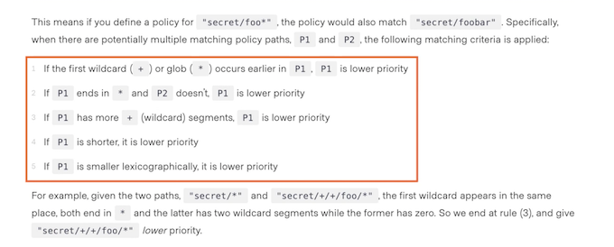

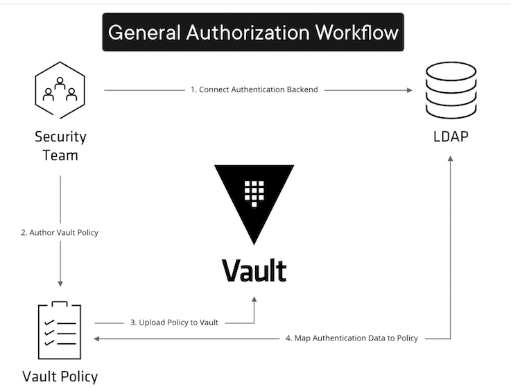

## Identity Revisited

External group serves as a mapping to a group that is outside of the identity store. **External groups can have one (and only one) alias**. This alias should map to a notion of group that is outside of the identity store.

`$ vault login hvs.EiYGguIh98HdbF3NkfrzQhM6`

```
vault auth enable userpass
```

* **`base_policy.hcl`**

```
# Applies to all accounts - entity level
path "secret/data/base_*" {
   capabilities = ["create", "read"]
}
```

* **`devteam_policy.hcl`**

```
# Dev Team policy that allows members to do anythig with secrets related to this path
path "secret/data/devteam" {
   capabilities = [ "create", "read", "update", "delete" ]
}
```


* **`training_policy.hcl`**

```
# Training policy
path "secret/data/training" {
   capabilities = [ "create", "read", "update", "delete" ]
}
```


```
vault policy write base_policy base_policy.hcl

vault policy write devteam_policy devteam_policy.hcl

vault policy write training_policy training_policy.hcl

$ vault policy list
base_policy
default
...
devteam_policy
training_policy
root
```

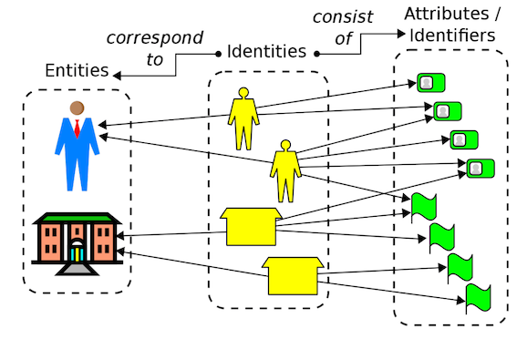

### Create users, aka identities

```
vault write auth/userpass/users/developer password="devpwd" policies="devteam"

vault write auth/userpass/users/trainer password="trainpwd" policies="training"
```

```
# Find the mount accessor for the userpass authentication - Path Column = userpass/, Accessor Column = auth_userpass_<id_string>
vault auth list -detailed


$ vault auth list -detailed
Path         Plugin      Accessor                  Default TTL    Max TTL    Token Type         Replication    Seal Wrap    External Entropy Access    Options    Description                UUID                                    Version    Running Version          Running SHA256    Deprecation Status
----         ------      --------                  -----------    -------    ----------         -----------    ---------    -----------------------    -------    -----------                ----                                    -------    ---------------          --------------    ------------------
token/       token       auth_token_2117498c       system         system     default-service    replicated     false        false                      map[]      token based credentials    34ce2682-187e-6ea2-5373-0773700663d2    n/a        v1.12.2+builtin.vault    n/a               n/a
userpass/    userpass    auth_userpass_c82872e5    system         system     default-service    replicated     false        false                      map[]      n/a                        c17a4dc4-db8d-26c6-b1bf-f8d2d3fa41a4    n/a        v1.12.2+builtin.vault    n/a               supported
```


```
$ vault auth list -format=json | jq -r '.["userpass/"].accessor' > userpass_accessor.txt

```


```
# Create entity; generated ID: ff013036-eb35-9096-ff54-a7a2e822a3c9

vault write identity/entity name="george-smith" policies="base" \
        metadata=organization="SAPUBS Inc." \
        metadata=devteam="The A Team" \
        metadata=secondrole="trainer"
       
Key        Value
---        -----
aliases    <nil>
id         ff013036-eb35-9096-ff54-a7a2e822a3c9
name       george-smith


# Add users to entity as aliases
vault write identity/entity-alias name="developer" \
        canonical_id="ff013036-eb35-9096-ff54-a7a2e822a3c9" \
        mount_accessor=$(cat userpass_accessor.txt)
        
Key             Value
---             -----
canonical_id    ff013036-eb35-9096-ff54-a7a2e822a3c9
id              f81bca34-818d-ba9a-1dd6-c30d797e316e       
```       


```
vault write identity/entity-alias name="trainer" \
        canonical_id="ff013036-eb35-9096-ff54-a7a2e822a3c9" \
        mount_accessor=$(cat userpass_accessor.txt)
```

```
# Verify users are present as aliases within the entity
vault read identity/entity/id/ff013036-eb35-9096-ff54-a7a2e822a3c9      


 vault read identity/entity/id/ff013036-eb35-9096-ff54-a7a2e822a3c9     
Key                    Value
---                    -----
aliases                [map[canonical_id:ff013036-eb35-9096-ff54-a7a2e822a3c9 creation_time:2022-12-21T03:35:13.385434Z custom_metadata:map[] id:f81bca34-818d-ba9a-1dd6-c30d797e316e last_update_time:2022-12-21T03:35:13.385434Z local:false merged_from_canonical_ids:<nil> metadata:<nil> mount_accessor:auth_userpass_c82872e5 mount_path:auth/userpass/ mount_type:userpass name:developer]]
creation_time          2022-12-21T03:31:20.107359Z
direct_group_ids       []
disabled               false
group_ids              []
id                     ff013036-eb35-9096-ff54-a7a2e822a3c9
inherited_group_ids    []
last_update_time       2022-12-21T03:31:20.107359Z
merged_entity_ids      <nil>
metadata               map[devteam:The A Team organization:SAPUBS Inc. secondrole:trainer]
name                   george-smith
namespace_id           root
policies               [base]
```


```
# Log in as "trainer" and write a secret
vault login -method=userpass username=trainer password=trainpwd

Key                    Value
---                    -----
token                  hvs.CAESIGJ-P9SriYmGYr3LMPL8Bn7OvsRSCU8GxhhIdzmJnEiQGh4KHGh2cy4xQnc1YmhHMGpxWmZrd2d1N3JIWGtQUUk
token_accessor         EZcYnIxrda03BU38yyHoovNo
token_duration         768h
token_renewable        true
token_policies         ["default" "training"]
identity_policies      []
policies               ["default" "training"]
token_meta_username    trainer


vault kv put secret/training created_by="trainer"

==== Secret Path ====
secret/data/training

======= Metadata =======
Key                Value
---                -----
created_time       2022-12-21T03:51:59.472203Z
custom_metadata    <nil>
deletion_time      n/a
destroyed          false
version            1


vault token capabilities secret/data/devteam # Fails with "deny" error message; we need to login as "developer"
```

```
# Log in as "developer" and write a secret
vault login -method=userpass username=developer password=devpwd


Key                    Value
---                    -----
token                  hvs.CAESIASeuQPWHvZt4T49z9b8f8v4c7wmiYDepEgJEm_NLOlDGh4KHGh2cy54TXBVSldXMjFyZzlyTXdxbVV2RTg0ZXk
token_accessor         l27v79pKeELYUppPKXsM09We
token_duration         768h
token_renewable        true
token_policies         ["default" "devteam"]
identity_policies      ["base"]
policies               ["base" "default" "devteam"]
token_meta_username    developer


vault kv put secret/devteam created_by="developer"
```

## Auditing Devices Explained


**Auditing**

* 1. Log
* 2. Audit (search) 
* 3. Diagnose

Common security requirement is auditing access to secrets, and Vault fulfills this requirement perfectly by offering capabilities to create an audit record of every usage of every token in the system. 


Every operation with vault is an API request with a corresponding response, and the audit log contains every authenticated interaction with Vault, which includes errors

### **Audit Device** 

An audit device is responsible for managing audit logs. 

**Every request to Vault and response from Vault
goes through the configured audit devices**. 

This provides a simple way to **integrate Vault with multiple audit logging destinations of different types**.

### High-Level Overview


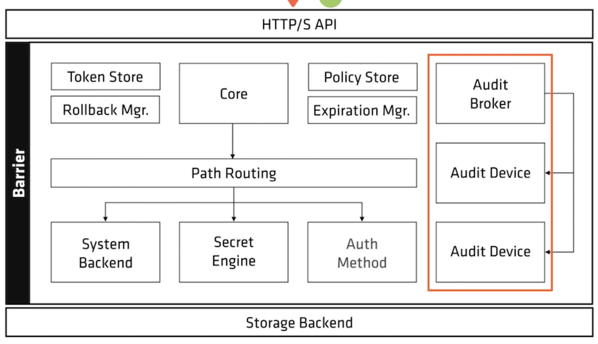

**Two Types of Devices**

* Blocked: Device may stop working
* Non-Blocked

### Blocked Audit Devices

If there are any audit devices enabled, **Vault requires that at least one be able to persist the log before completing a Vault request.**

> If you have only one audit device enabled, and it is blocking (network block, etc.), then Vault will be unresponsive.
> 
> Vault will not complete any requests until the audit device can write.

If you have more than one audit device, then Vault will complete the request as long as one audit device persists the log.

Vault will not respond to requests if audit devices are blocked because audit logs are critically important and ignoring blocked requests opens an avenue for attack. Be absolutely certain that your audit devices cannot block.

### Back blocking devices with other ones

Blocked audit device behavior


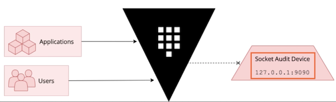

### Blocked file audit device

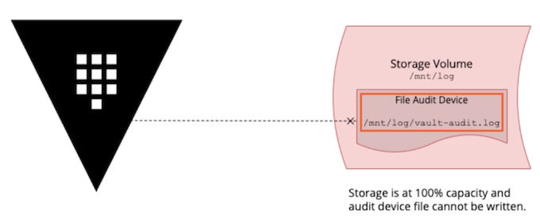

A common condition that can **arise to block a file audit device is lack of capacity on the storage device containing the audit device log file**. 


If the storage capacity is exhausted, the audit device will effectively be blocked and Vault will stop servicing requests until sufficient storage capacity is made available.

### **Audit Device Demos**

**File Audit Device**

* Local logging 
* NFS Logging

**Socket Audit Device**


* Log streaming 
* Log management

```
$ vault login hvs.EiYGguIh98HdbF3NkfrzQhM6
Success! You are now authenticated. The token information displayed below
is already stored in the token helper. You do NOT need to run "vault login"
again. Future Vault requests will automatically use this token.

Key                  Value
---                  -----
token                hvs.EiYGguIh98HdbF3NkfrzQhM6
token_accessor       TrsQs8oybr7vyHRuJOJGGohH
token_duration       ∞
token_renewable      false
token_policies       ["root"]
identity_policies    []
policies             ["root"]
```

```
# Create log file and change its permissions to make it writable by Vault
sudo touch /var/log/vault_audit.log && sudo chown gsyyl:staff /var/log/vault_audit.log


# Log in as root and enable the file audit device
vault login root && vault audit enable file file_path=/var/log/vault_audit.log

# Enable socket audit device
vault audit enable socket address=127.0.0.1:9090 socket_type=tcp log_raw=true
```

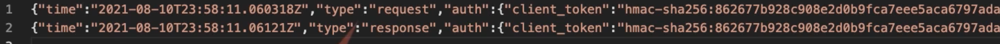


### Log Message Transformations

* JSON
* Filter
* Enrich
* Split
* Combine
* Generate Reports


**Log Message Storage**

* Database - times series, relational, NoSQL, etc.
* XML files - for legacy applications
* JSON format - e.g. to analyze the behavior of micro services


