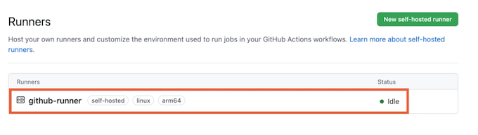
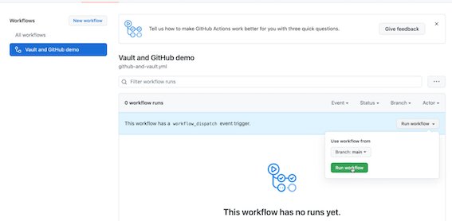
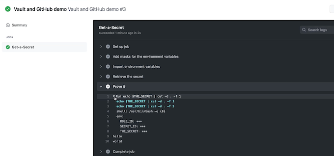
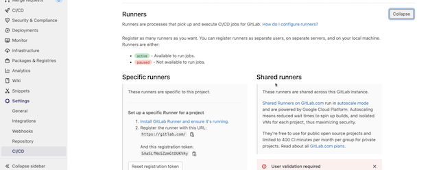
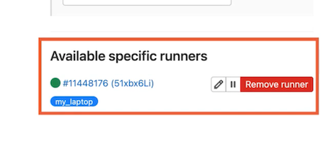
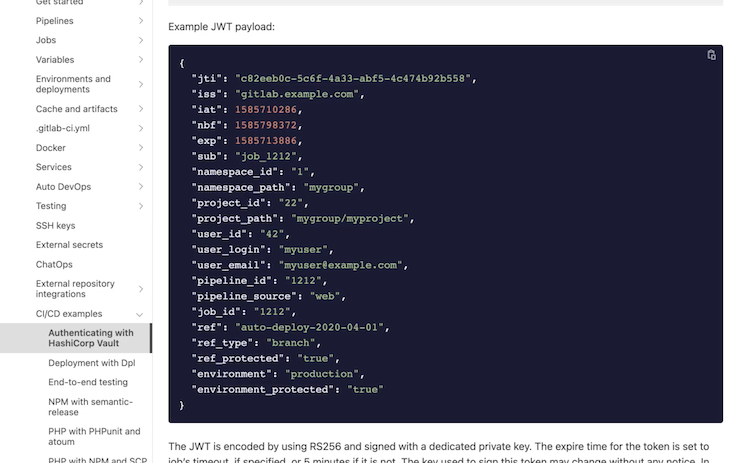
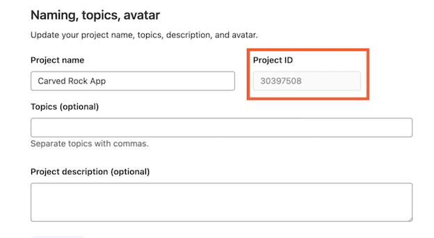
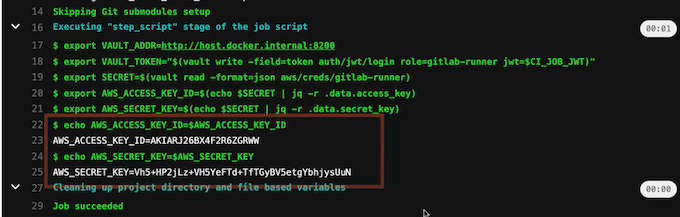

# **L1 Accessing Secrets in CI/CD Pipelines**

## **CI/CD Pipelines**

**Continuous Integration (CI)**

* Ensure changes work with codebase
* Automated unit tests run ASAP
* Continuously produce release candidates

**Continuous Deployment (CD)**

* Unit & integration tests
* Acceptance environment
* Human triggers automated deployment

**Changes deployed many times per day**

### CI/CD Security Issues

Automation is often a challenge

Pipeline code or configuration with

* Hardcoded secrets
* Long-lived identitiy

**Cascading failures from personal tokens**

**Issues compounded when bridging platforms**

### CI/CD Security with Vault

**Wide array of authentication mechanisms**

* Avoid secrets in pipeline code
* Use a central platform, not another engine

**Dynamic secrets**

* Push, deploy or alert with a short TTL
* Remove risky long-lived pipeline secrets


## **2 Demo: GitHub Runner**

GitHub Actions is a platform for automating workflows based on events occurring in a GitHub repo, meaning it's a good choice for running CI/CD pipelines if your source code is also hosted on the site. 

The workflow is executed on a runner instance, which can be hosted by GitHub or self‑hosted. 


In general, when you're working with Vault in CI/CD pipelines, it's best to use a self‑hosted runner inside your network that can have access to Vault, rather than using a runner in someone else's network and opening up your Vault instance to the internet.

### Install GitHub Runner on Linux

```
# Create a folder
$ mkdir actions-runner && cd actions-runner

# Download the latest runner package
$ curl -o actions-runner-linux-arm64-2.283.2.tar.gz
httos://aithub.com/actions/runner/releases/download/v2.283.2/actions-runner-linux-arm64-2.283.2.tar.az

# Optional: Validate the hash
$ echo "990646bdced99679e752c1af9d26fdd8a93d319ce0e24c9a30c1c6b25e505ced
actions-runner-linux-arm64-2.283.2.tar.az
shasum -a 256

# Extract the installer
$ tar xzf./actions-runner-linux-arm64-2.283.2.tar.az
```

**Configure**

```
# Create the runner and start the configuration exoerience
$./config.sh -url https://github.com/DirectRoot/carved-rock-app --token AIJNZ6TFCJIIUKDVNPGGXH3BNICNG


# Last step, run 1t!
$ . /run.sh
```



```
vagrant@github-runner:~$ vault auth enable approle
Success! Enabled approle auth method at: approle/

vault policy write github-runner -<<EOF
	path "secret/data/github-runner" {
		capabilities = ["read"]
}
EOF
Success! Uploaded policy: github-runner

vault write auth/approle/role/github-runner \
> token_policies='github-runner' \
> token_ttl=5m token_max_ttl=20m
Success! Data written to: auth/approle/role/github-runner

vagrant@github-runner:~$ vault read auth/approle/role/github-runner/role-id
Key  Value
---   ---
role_id  b6eba080-8a30-329e-aecc-cf8340f4e9f9

$ vault write -force auth/approle/role/github-runner/secret-id
Key  Value
---   ---
secret_id  8134678-0867-065c-e138-00585f5bada7
secret_id_accessor  a0e017c5-a926-3265-e8f5-34f7088d0fdf
secret_id_ttl  Os
```

```
read -s ROLE_ID
export -s ROLE_ID
read -s SECRET_ID
export SECRET_ID

echo $ROLE_ID && echo $SECRET_ID
b6eba080-8a30-329e-aecc-cf8340f4e9f9
8b134678-0867-065c-e138-00585f5bada7
```

### 启动github runnner

```
vagrant@github-runner:~/actions-runner$./run.sh
V 	Connected to GitHub
2021-10-15 21:56:33Z: Listening for Jobs

vagrant@github-runner:~$ vault kv put secret/github-runner the_secret=hello.world
Key  Value
---   ---
created_time   2021-10-15T21:57:38.374689776Z
deletion_time   n/a
destroyed      false
version       1
```

### Run github pippeline 

**`REPO-NAME/.github/workflows/github-and-vault.yml`**

```
name: Vault and GitHub demo
on: [workflow_dispatch]
jobs:
  Get-a-Secret:
    runs-on: self-hosted
    steps:
      - name: Add masks for the environment variables
        run: |
          echo "::add-mask::$ROLE_ID"
          echo "::add-mask::$SECRET_ID"
      
      - name: Import environment variables
        run: |
          echo ROLE_ID="$ROLE_ID" >> $GITHUB_ENV
          echo SECRET_ID="$SECRET_ID" >> $GITHUB_ENV

      - name: Retrieve the secret
        uses: hashicorp/vault-action@v2.3.1
        with:
          url: http://localhost:8200
          method: approle
          roleId: ${{ env.ROLE_ID }}
          secretId: ${{ env.SECRET_ID }}
          secrets: |
            secret/data/github-runner the_secret | THE_SECRET ;

      - name: Prove it
        run: |
          echo $THE_SECRET | cut -d . -f 1
          echo $THE_SECRET | cut -d . -f 2
```

**Run workflow**






## Demo: GitLab Runner

### Enable GitLab Runner

To integrate with GitLab, I'll be running the GitLab Runner via Docker. I've also signed up for the free tier of GitLab cloud to avoid having to run the full server locally



```
curl --request POST "https://gitlab.com/api/v4/runners" \
--form "token=SAaSLfNsSZzmGtDUKVAy" --form "tag_list=my laptop"
{"id": 11448176, "token" : "51xbx6LiMmsw-q4bdpAS"}
```




GitLab uses a system where a runners tags have to match all of the tags on a build stage in order for it to be a candidate for running that stage

* **`config.toml`**

```
concurrent = 1
check_interval = 0

[session_server]
  session_timeout = 1800

[[runners]]
    executor = "shell"
    url = "https://gitlab.com"
    token = "51xbx6LiMmsw-q4bdpAS"
```

When I start the container and mount this configuration file into etc/gitlab‑runner/config.toml, the runner begins and notifies GitLab that it is available

```
docker run -rm -it -v $PWD/config.toml:/etc/gitlab-runner/config.toml\
	--add-host=host.docker. internal: host-gateway \
gitlab/gitlab-runner run

Runtime platform		arch=arm64 os=linux pid=8 revision=e0218c92 version=14.3.2
Starting multi-runner from /etc/gitlab-runner/config.toml...   builds=0
Running in system-mode.

Configuration loaded 		builds=0
listen _address not defined, metrics & debug endpoints disabled builds=0
[session server].listen
address not defined, session endpoints disabled
builds=0
```

### JWT payload:

We're going to authenticate the GitLab Runner to Vault using a **JSON web token, or JWT, which is pronounced jot**. 

**A JWT is an encoded verifiable JSON structure for transmitting information between systems.**


Each time a pipeline runs in a GitLab runner, a JWT is created and made available via an environment variable called `CI_ JOB_JWT`. It contains information about the current run. 

The information available in the JWT is listed here in GitLab's own write‑up of how to integrate with Vault

**Use a bound claim on fields within the JWT to limit a pipeline's access to specific secrets, including limiting access from specific branches**. 

**To configure JWT authentication, we first need to enable the auth method by the Vault CLI.**

**Authenticating with HashiCorp Vault**



[https://bit.ly/gitlab-jwt-schema](https://bit.ly/gitlab-jwt-schema)

```
vault auth enable jwt
Success! Enabled jwt auth method at: jwt/
```


write a policy giving read access to an AWS secret.

The policy is referred to by this list after the policies key. 

* **`gitlab-runner-policy.hcl`**

```
path "aws/creds/gitlab-runner" {
    capabilities = ["read"]


vault policy write gitlab-runner./gitlab-runner-policy.hcl
Success! Uploaded policy: gitlab-runner
```

**The user `claim_key` tells Vault which field in the job to identify a user with, so we always know who triggered the pipeline that accessed the secret and not just which pipeline accessed it.**

The `bound_claims` key gives you a collection of keys whose values must match those in the JWT before access to the secret is allowed. 

**`gitlab-runner-role.json`**


```
{
  "role_type": "jwt",
  "policies": ["gitlab-runner"],
  "token_explicit_max_ttl": 60,
  "user_claim": "user_email",
  "bound_claims": {
    "project_id": "30397508"
  }
}
```




You can provide multiple fields in here, but for now, I'm just going to bind to the project ID. 

GitLab project ID is immutable and available from the General Settings page. 

```
vault write auth/jwt/config jwks_url="https://gitlab.com/-/jwks" bound_issuer="gitlab.com"
Success! Data written to: auth/iwt/config
```

Using GitLab's public key, Vault is unable to check that the data in the JWT was actually issued by GitLab and hasn't been tampered with. So we need to tell Vault where it can find GitLab's public key before it can verify JWT's. 

By default, all instances of GitLab will locate their JWT public keys at this endpoint, **where jwks stands for JSON Web Key Sets**. It's just a URL serving JSON data


We also need to bind the issue of the JWT so that only JWTs coming from gitlab.com in my case, can be used to authenticate. 

I've already configured my Vault with the AWS secrets engine to generate a dynamic set of short‑lived IAM user credentials. 

**`.gitlab-ci.yml`**

```
install-tools:
    stage: .pre
    script:
        # Vault CLI
        - apt update && apt install -y unzip jq
        - wget https://releases.hashicorp.com/vault/1.8.4/vault_1.8.4_linux_arm64.zip
        - unzip vault_1.8.4_linux_arm64.zip
        - mv vault /usr/bin
        - which vault
    tags:
        - my_laptop

build-the-thing:
    stage: build
    script:
        - export VAULT_ADDR=http://host.docker.internal:8200
        
        # Get a Vault token using the GitLab JWT
        - export VAULT_TOKEN="$(vault write -field=token auth/jwt/login role=gitlab-runner jwt=$CI_JOB_JWT)"
        
        # Get a secret using the Vault CLI
        - export SECRET=$(vault read -format=json aws/creds/gitlab-runner)
        - export AWS_ACCESS_KEY_ID=$(echo $SECRET | jq -r .data.access_key)
        - export AWS_SECRET_KEY=$(echo $SECRET | jq -r .data.secret_key)
        
        - echo AWS_ACCESS_KEY_ID=$AWS_ACCESS_KEY_ID
        - echo AWS_SECRET_KEY=$AWS_SECRET_KEY
    tags:
        - my_laptop
```

* [https://bit.ly/vault-aws-secrets-engine](https://bit.ly/vault-aws-secrets-engine)
* [https://bit.ly/gitlab-ci-yaml-keys](https://bit.ly/gitlab-ci-yaml-keys)



## CI/CD Secret Approaches & Review

How granular to make the access controls for the required secrets. 

* **Single ID (all secrets)**
	* High value
	* Large blast radius

> The first level sees a single identity in use for all pipelines and for all secrets, regardless of the project or software being deployed.

	
* **ID per pipeline (deploy & bootstrap)**
	* More access than strictly required
	* Injecting secrets into runtime environment

> 	The second level uses an identity per pipeline that has access to the secrets needed for building, deploying, and bootstrapping the software when it starts. 
> 
> At this level, it's easy to think that you've secured the pipelines as much as possible, but those pipeline identities still have a larger amount of access than they strictly need, particularly if they can read production secrets like database credentials.
> 
>  This is often the case when a deployment pipeline injects secrets directly into the production environment of an application through variables or files
	
* **ID per pipeline & app**
	* App has own ID and access to secrets
	* Bootstraps itself during startup

> Most secure level, we still have individual pipeline identities, but rather than the pipeline identity having direct access to application secrets, the deployed application has its own identity and bootstraps itself with its own secrets during startup.
> 
> This approach limits the CI/CD pipeline to just the secrets it needs to integrate and deploy the software, achieving much better compliance with the principle of least privilege. 

## Module Review

**CI/CD pipelines**

* What they are
* Security challenges
* How Vault can help

**Three approaches for CI/CD secrets**

**Integrated two popular CI/CD platforms**

* **AppRole authentication with GitHub**
* **JWT authentication with GitLab**