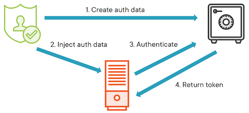
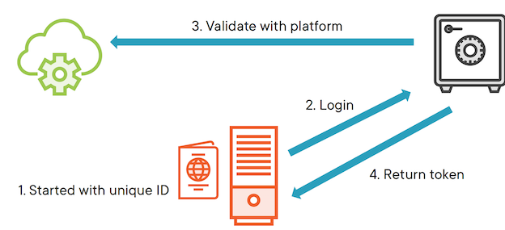
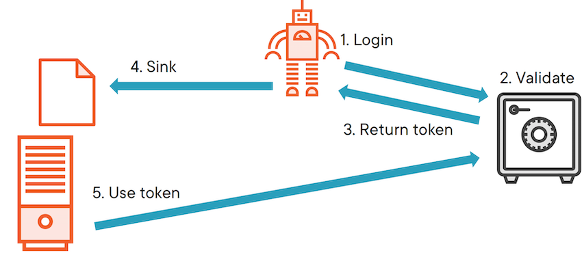

# **L2 Securely Introducing Clients Using Vault Agent**

## **1 Secure Introductions & Vault Agent**

Securely Introducing Clients using the Vault Agent

### **Vault’s Trust**

* Trust that a client owns the token it’s using

> In this case, trust that a client presenting a token is the rightful owner of that token.

* Stemming from the first introduction

> used some method to authenticate themselves and then retrieved a token for subsequent requests

* Secure introduction is a major challenge

> The secure introduction of a client is a major challenge itself and should drive your decisions when it comes to integrating other systems with Vault.

* Ignoring it undermines Vault’s security
  * Trusted orchestrator
  * Platform integration
  * Vault Agent

**There are three approaches for securely introducing a client to Vault, the Trusted orchestrator, platform integration, and the Vault agent.**

### Trusted Orchestrator

In the Trusted Orchestrator approach, authentication data is produced like an app role or certificate.

The trusted orchestrator is a system **like Terraform, Nomad, or Chef, and this orchestrator injects the authentication data into the client's environment** for it to use.

It's important to note that this is **generally not a token being injected, but a way for the client to authenticate and then retrieve a token**.

**This is where one‑time use operations like response wrapping can be useful too**.



When the client starts up, **it will use the injected authentication data to authenticate with Vault and retrieve a token linked to the appropriate policy before requesting secrets**.

In the previous module when **we integrated a GitHub runner with Vault**, I was acting as a trusted orchestrator by producing the app role and injecting the role and secret ID into the runner via environment variables.

**Obviously using human as the trusted orchestrator doesn't scale,** but you can also use orchestration engines to automate the steps I took and securely introduce clients to vault in a consistent way regardless of where they're running.

### **Platform Integration**



The introductions via platform integration, **the client is started with some platform‑specific trusted identifier**. On AWS, this might be an IAM role that an instance is running under.

**Equally, the JWT that was injected into the GitLab pipeline during the last module is another good example**.

Assuming Vault has already been set up to trust it and the client logs in with an identifier, Vault then validates that ID with the underlying platform.

In our case, this was the step requiring the **URL to the GitLab JSON Web Key Store**.

If everything checks out Vault will then **issue a token to the client and it can start requesting secrets**.

This method of introduction can be simpler to get right because you don't have to concern yourself with uniquely identifying the environment that a client is running under.

This does make you limited to the data provided by the environment though like the fields that were available in the **GitLab JWT**.

The limitations can also depend on how you're running clients in an environment.

For example, if you trust the IAM role of an instance, then any process on that instance could authenticate with Vault, meaning you now shouldn't run more than one service from it.

### **Vault agent**

This becomes less of an issue in microservice or serverless architectures.



The third approach to client introduction is **via the Vault agent which isn't a unique approach in itself, but a way to automate the login workflow for applications** that you can't or don't want to integrate with Vault directly.

If you've built your software, but **`<mark>`don't want to manage your own code for maintaining Vault tokens, then the Vault agent is a good choice for integration`</mark>`**.

With the right configuration, **the Vault agent will log into the Vault server which will validate the login and return a token.**

**The agent will then write the token to a sink where the application can pick it up and make requests back to the server for secrets**.

### **Vault agent**

**By using the agent, you get separation of concerns and a dedicated sidecar service to log in and keep tokens fresh that has been built for robustness and fault tolerance**.

**Auto-authentication**

* Major cloud platforms
* JWTs
* Kubernetes
* Kerberos

**Local file sink only**

* Sink to different files
* Or run multiple instances

**Response wrapping & encryption**

**The agent currently supports auto authentication with all of the major cloud platforms, JWTs, Kubernetes, and Kerberos, amongst others**.

### **local file sink**

The only available sink right now is a **local file sink**, but HashiCorp has indicated that they might build more in the future like a Linux socket or an API endpoint sync.

If the same secret is needed by multiple services on a machine, **you can have the agents sink to different parts of the file system** which helps keep separation of service account permissions at the file system level.

If you need separate secrets on one machine for multiple services, **you can run multiple instances of the agent and simply configure them to log into Vault with different identities**.

Then it comes down to **file system permissions again to keep services from reading each other's secrets.**

### response wrapping

The agent also comes with some advanced functionality to response wrap and encrypt tokens.

There are two approaches for response wrapping.

* **When the auth method requests a response wrapped token, then there is more security against a person‑in‑the‑middle attack**, but the **client unwrapping the token will need to renew it for themselves**.
* Alternatively, the **token could be response wrapped by the sink method after it has already been fetched from Vault**,

  * Offers less protection against person‑in‑the‑middle attacks, but **does allow the agent to continue to renew the token on behalf of the client**.

[https://bit.ly/vault-agent-token-enc](https://bit.ly/vault-agent-token-enc)

## Demo: Vault Agent Auto-Auth

**How to configure the vault agent to automatically authenticate with Vault and maintain an authentication token that could be used by another application**.

**Approle authentication is one of the methods that works with the vault agent, AutoAuth.**

So we'll set that up here and create a short‑lived token to demonstrate the agent keeping it up to date

First, we'll enable the approle auth method and upload a policy to allow read access to a secret.

Finally, I'll write a secret to the path referenced in the policy.

To configure the vault agent, we can use a HCL file and provide a path to it when invoking the executable.

```
$ vault auth enable approle
Success! Enabled approle auth method at: approle/

$ vault write -force -field=secret_id auth/approle/role/my-app/secret-id > secret-id

$ cat role-id
29924511-0d94-4310-3eb9-382ce307a1fa%

$ cat secret-id
16e3984-01ee-9f65-db85-b95f2b1da6d5%

$ vault kv put secret/my-app secret=sauce
key 						Value
created_time    2021-10-15T23:04:13.697089z
deletion_time   n/a
destroyed       false
version         1
```

Use `wrap_ttl` to response wrap the auth token

**`agent.hcl`**

```
vault {
  address = "http://localhost:8200"
}

auto_auth {
  method {
    type = "approle"

    config = {
      role_id_file_path = "role-id"
      secret_id_file_path = "secret-id"
    }
  }

  sink {
    type = "file"
    config = {
      path = "the-token"
    }
  }
}
```

```
vault agent -config=agent.hcl

VAULT_TOKEN=$(cat the-token) vault kv get secret/my-app
===== Metadata =====
key 			Value
created_time    2021-10-15T23:04:13.697089z
deletion_time   n/a
destroyed       false
version         1
===== Data =====
Key  		Value
---      	---
secret   sauce
```

## Module Review

**Secure introduction challenge**

* Trusted orchestrator
* Platform integration
* Vault agent

**Vault agent**

* Automate login & token renewal
* Trusted orchestrator & platform auth
* Integrate simple or legacy software
* Write an auth token to file(s)
* Run multiple for many identities
