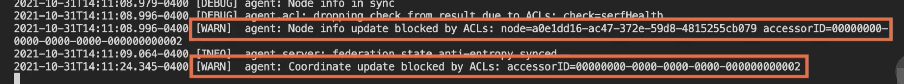
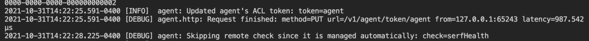
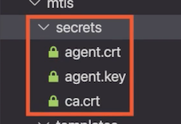
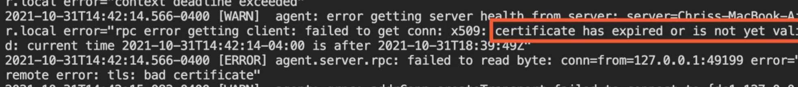
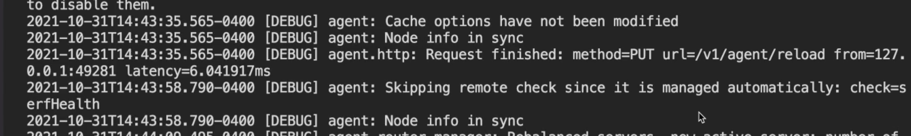

# **L4 Integrating Vault with Consul**

Consul

- Service registration
- Backend storage
- Access tokens
- TLS certificates

## Consul Service Registration

### HashiCorp Consul

**Service mesh technology**

- Became prevalent with microservices

**Separate services**

* More flexibility and speed
* More operational cost

**Consul helps solve microservice ops issues**

- Discovery
- Configuration
- Network segmentation

### Discovery

**Application is spread across runtimes**

**Previous interface**

* Classes with public methods

**New interface**

* Dedicated API on the network

**Consul provides a service registry**

**Register Vault for centralized secrets**

### Demo: Consul Service Registration

**`vault-config.hcl`**

```
service_registration "consul" {
  address = "localhost:8500"
  # check_timeout = 1m
  # scheme = "https"
  # service = "carved-rock-vault"
}
```

```
$ consul agent -dev

$ curl -i http://localhost:8500/v1/catalog/service/vault

$ dig @localhost -p 8600 vault.service.consul

...
;; ANSWER SECTION:
vault.service.consul.   0  IN   A   127.0.0.1
...
```

## Consul Key-Value Store

With an application spread over many services, configuring them all to work together becomes a challenge that scales in difficulty as the number of services grows, especially if you want to have all services configured with some common setting very quickly.

Consul provides a key‑value store that services can query for their configuration providing a unified configuration experience and a single place for operators to make changes.

### Configuration

**Configuration**

**Especially low-latency global configuration**

**Consul key-value (KV) store for config**

* Unified config & single source of truth

### Consul KV Store

* Simple in features
* Robust in replication
  * Every value replicated in servers
  * In-memory for quick access
* **Consul KV is an official Vault backend**
* **More clients & secrets means more RAM**
* **Vault persistent data is encrypted**
* **Implies Vault service registration**

### Demo: Consul Key-Value Store

**`storage-backend\vault-config.hcl`**

```
storage "consul" {
  address = "localhost:8500"
}
```

```
vault server -dev -config vault-config.hcl
```

```
$ consul kv get -keys vault/
vault/core/
vault/logical/
vault/sys/
```

```
$ consul kv get -keys vault/core/
vault/core/audit
vault/core/auth
vault/core/cluster/
vault/core/hsm/
vault/core/keyring
vault/core/leader/
vault/core/local-audit
vault/core/local-auth
vault/core/local-mounts
vault/core/lock
vault/core/master
vault/core/mounts
vault/core/seal-config
vault/core/shamir-kek
vault/core/wrapping/
```

```
$ consul kv get -base64 vault/core/master
AAAAAOLErU6VJ109wwhc+qBrwVbegcFfWL+adglLU®/sqFvww60Kca/HODrLWYbaSS]mzUgHJueOfAzz7rrLkYARKN88quoKJ3GJLIcVEoGrm/GTtv0X7SV+4Rsx0krGPH9Bg4RekLad(xY1oxkBuLDyC71+00aPamW1UPz9D5EL5VWq6Gf2obx2kDCTdSPismry
```

```
consul kv put vault/core/master whoops!
Success! Data written to: vault/core/master

$ consul kv get vault/core/master
whoops!
```

## Securing the Consul API

* Not secure by default
* Vault stores encrypted data…
* …but we should still secure endpoints
* Built-in ACL system for the API
* Authentication via tokens that Vault can make
* Process
  - Bootstrap the ACL system
  - Provide a management token to Vault
  - Create a role, bound to Consul policies

### Demo: Consul API ACL System

**`consul-tokens\consul-config.hcl`**

```
acl = {
    enabled = true
    default_policy = "deny"
    #enable_token_persistence = true
}
```

```
consul agent -dev -config-file=consul-config.hcl -node=server-0
```



```
consul acl bootstrap
AccessorID:		87d824c-0763-f8bc-e476-7ae4cffb77de
SecretID:		44074773-6988-492c-09a5-97880c11de86
Description:	Bootstrap Token (Global Management)
Local:			false
Create Time:	2021-10-31 14:13:14. 191713 -9400 EDT
Policies:	00000000-0000-0000-0000-000000000001 - global-management
```

```
export CONSUL_BOOTSTRAP_TOKEN=44074773-6988-492c-09a5-97880c11de86

$ vault secrets enable consul
Success! Enabled the consul secrets engine at: consul/

$ vault write consul/config/access
	address=http://localhost:8500 \
	token=$CONSUL_BOOTSTRAP_TOKEN

Success! Data written to: consul/config/access
```

* **`consul-server-policy.hcl`**

```
node_prefix "server-" {
  policy = "write"
}
node_prefix "" {
  policy = "read"
}
service_prefix "" {
  policy = "read"
}
acl = "read"
```

```
CONSUL_HTTP_TOKEN=$CONSUL_BOOTSTRAP_TOKEN \
	consul acl policy create \
	-name consul-server\
	-rules @consul-server-policy.hcl

ID:		1b424d83-3cb9-44a0-b096-4152c363a883
Name:	consul-server
Description:
Datacenters:
Rules:
node_prefix "server-" {
  policy = "write"
}
node_prefix "" {
  policy = "read"
}
service_prefix "" {
  policy = "read"
}
acl = "read"
```

```
vault write consul/roles/consul-server \
	policies=consul-server

Success! Data written to: consul/roles/consul-server
```

```
vault read consul/creds/consul-server
Key			Value
---			----
lease_id	consul/creds/consul-server/5fEcHIb8ynbOdqdC099NZc1N
lease_duration	768h
lease_renewable  true
accessor		fc68c6c2-7499-09e-8839-485de1e39457
local			false
token			97ea1d39-911b-485d-feb-1ea8ba8a17f1
```

```
export CONSUL SERVER TOKEN=97ea1d39-911b-485d-cfeb-1ea8ba8a17f1
export CONSUL SERVER ACCESSOR=fc68c6c2-7499-c09e-8839-485de1e39457
```

```
consul-tokens CONSUL_HTTP_TOKEN=$CONSUL_SERVER_TOKEN \
	consul acl token read -id CONSUL_SERVER_ACCESSOR
AccessorID:		fc68c6c2-7499-c09e-8839-485de1e39457
SecretID:			<hidden>
Description:	Vault consul-server root 1635704380586423000
Local:				false
Create Time:	2021-10-31 14:19:40.588897 -0400 EDT
Policies:	
	1b424d83-3cb9-44a0-b096-4152c363a883-consul-server
```

```
CONSUL_HTTP_TOKEN=$CONSUL_BOOTSTRAP_TOKEN \
	consul acl set-agent-token agent $CONSUL_SERVER_TOKEN

ACL token "agent" set successfully
```



## Consul Connect mTLS

### Network Segmentation

**Monolithic app**

* `Load balancer -> app -> database`

**Microservices**

* Vastly increased number of connections
* Each service needs at least one other
* Restrict services to others they need
* Achieving with IPs is very hard

**Consul Connect, a higher-level mechanism**

### Consul Connect

**Services communicate through**

- Consul SDK in the service code
- **Sidecar proxy**

**Secured with mTLS**

- TLS unaware apps are encrypted
- Little to no code changes for proxy
- Both services know the ID of the other

**Consul will allow or deny using**

- ID from TLS certificate
- “Intentions"

### Demo: Consul Connect mTLS

How to use Vault and consul‑template to provision and rotate TLS certificates that secure service‑to‑service communication

**Already set up two PKI engines in Vault**

```
vault write pki_int/roles/consul-dc1 \
	allowed_domains="dc1.consul"
	allow_subdomains=true
	generate_lease=true \
	max_ttl="720h"

Success! Data written to: pkiint/roles/consul-dc1
```

**One is the root CA and another as the intermediate CA. **

* `agent-certificate.template`

```
{{ with secret "pki_int/issue/consul-dc1" "common_name=server.dc1.consul" "ttl=5m" "alt_names=localhost" "ip_sans=127.0.0.1"}}
{{ .Data.certificate }}
{{ end }}
```

* `agent-key.template`

```
{{ with secret "pki_int/issue/consul-dc1" "common_name=server.dc1.consul" "ttl=5m" "alt_names=localhost" "ip_sans=127.0.0.1"}}
{{ .Data.private_key }}
{{ end }}
```

* `ca-certificate.template`

```
{{ with secret "pki_int/issue/consul-dc1" "common_name=server.dc1.consul" "ttl=5m" "alt_names=localhost" "ip_sans=127.0.0.1"}}
{{ .Data.issuing_ca }}
{{ end }}
```

* **`onsul-template-config.hcl`**

```
vault {
  address      = "http://localhost:8200"

  # You can use the Vault agent to manage the required Vault token
  # vault_agent_token_file = ""

  renew_token=false
}

template {
  source      = "templates/ca-certificate.template"
  destination = "secrets/ca.crt"
  command     = "date && consul reload"
}

template {
  source      = "templates/agent-certificate.template"
  destination = "secrets/agent.crt"
  command     = "date && consul reload"
}

template {
  source      = "templates/agent-key.template"
  destination = "secrets/agent.key"
  command     = "date && consul reload"
}
```

```
consul-template -config consul-template-config.hcl
Sun Oct 31 14:33:08 EDT 2021
Error reloading: Put
"http: //127.0.0.1:8500/v1/agent/reload": dial tcp 127.0.0.1:8500: connect: connection refused
2021-10-3114:33:08.321-0400 [ERR] (cli) 1 error occurred:
	* failed to execute command "date && consul reload" from
"templates/ca-certificate. template" =>
"secrets/ca.crt": child: command exited with a non-zero exit status:

	sh -c date && consul reload

This is assumed to be a failure. Please ensure the command
exits with a zero exit status.
```

consul‑template will quit because the consul reload command failed, but it did manage to pull the secrets from Vault.



**`consul-config.hcl`**

```
verify_incoming = true
verify_outgoing = true
verify_server_hostname = true

ca_file = "secrets/ca.crt"
cert_file = "secrets/agent.crt"
key_file = "secrets/agent.key"

auto_encrypt {
  allow_tls = true
}
```

```
consul agent -dev -config-file consul-config.hcl
```



```
$ consul-template -config consul-template-config.hcl

Sun Oct 31 14:43:35 EDT 2021
Configuration reload triggered
```



## Module Review

* HashiCorp Consul
* Register Vault as a service
* Use Consul KV for Vault storage
* Secure the API with token access
* Produce certificates for service mTLS
