# **L5 Authenticating Using Cloud Machine Identity**

Machine ID authentication

- AWS
- Azure
- GCP

## **Machine Identity**

* Create a policy to access resources
* Relate the policy to an identity
* **Attach the identity to a machine**
* **Internal requests authorized via the policy**
* **Authenticate via machine exclusive info**
* **Auth data is available automatically**
* **Stop generating keys for cloud-internal use**

### **AWS IAM Authentication**

* STS API GetCallerIdentity
  * Validate the identity of a client
* `Sign a request -> Vault -> STS API`
* IAM policy created & attached to role
* IAM profile attached to a machine
* Vault CLI will handle signing the request

### **Demo: Authenticate with AWS Machine Identity**

[https://developer.hashicorp.com/vault/docs/auth/aws#iam-authentication-inferences](https://developer.hashicorp.com/vault/docs/auth/aws#iam-authentication-inferences)

**Use IAM role access as the security boundary**

**`vault-aws-auth.json`**

```
{
  "Version": "2012-10-17",
  "Statement": [
    {
      "Effect": "Allow",
      "Action": [
        "iam:GetUser",
        "iam:GetRole"
      ],
      "Resource": "*"
    }
  ]
}

```

**`carved-rock-app.json`**

```
{
    "Version": "2012-10-17",
    "Statement": [
        {
            "Effect": "Allow",
            "Action": [
                "s3:GetObject",
                "s3:PutObject",
                "s3:DeleteObject"
            ],
            "Resource": "arn:*:s3:::carved-rock/*"
        }
    ]
}
```

**Create one app server and one vault server with attached policy**

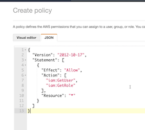

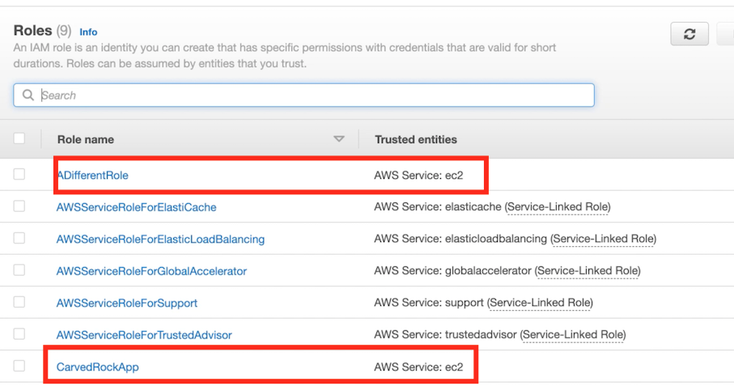

### Attach/Replace IAM Role to server

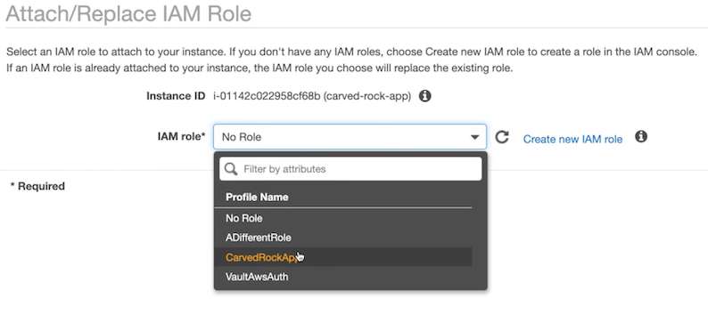

### On app server

```
ubuntu@carved-rock-app:~$ aws sts get-caller-identity
{
	"UserId": "AROARJ26BX4FVTLZGCZJE: i-01142c022958cf68b"
	"Account":	"089854689035"
	"Arn": "arn:aws:sts::089854689035:assumed-role/CarvedRockApp/i-01142c022958cf68b"
}

ubuntu@carved-rock-app:~$
```

### On Vault server

```
ubuntu@vault:~$ vault auth enable aws
Success! Enabled aws auth method at: aws/
```

```
ubuntu@vault:~$ vault write auth/aws/role/carved-rock-app\
> auth_type=iam \
> bound_iam_principal_arn=arn:aws:iam::089854689035:role/CarvedRockApp \
> policies=a-vault-policy

Success! Data written to: auth/aws/role/carved-rock-app
```

### On app server

```
ubuntu@carved-rock-app:~$ vault login -method=aws role=carved-rock-app

Success! You are now authenticated. The token information displayed below is already stored in the token helper. You do NOT need to run "vault login" again. Future Vault requests will automatically use this token.

Key  			Value
---         ----
token 			s.KmJiABiXQg4cWLUa5vdFv3jH
token_accessor  gN4UhGARbnesQVgeAdT8LUXR
token_duration	768h
token_renewable	true
token_policies	["a-vault-policy" "default"]
identity_policies	[]
policies			['a-vault-policy" "default"]
token_meta_auth_type		iam
token_meta_role_id			f07144ac-c8ab-2dee-9a67-ec265b7e22c8
token_meta_account_id	089854689035
```

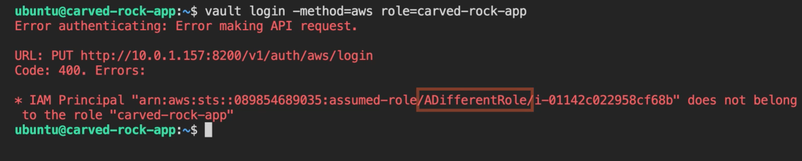

## Demo: Authenticate with Azure Machine Identity

* **Managed Service Identity (MSI)**
* **Azure Active Directory (AAD)**
* **JWT from MSI -> Vault -> AAD**
* **Machine, subscription ID or resource group**
* **Instance metadata service**
* **Least amount of automation in Vault CLI**

### Machine identity in Azure

Vault can take advantage of Managed Service Identity, which is a feature of **Azure Active Directory that allows systems to uniquely authenticate**.

**When authenticating to Vault, a machine can retrieve a signed JWT from MSI that it passes to Vault, which then goes back to Active Directory for validation**.

Vault will let you bind a role to more than the individual managed identity by using subscription ID or resource group to grant access.

**Values for the JWT, subscription ID, and resource group are all made available to the machine through the Instance Metadata Service**.

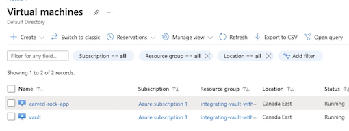

First, we need to open Azure Active Directory and go to App registrations. **This is where we register an application for machines to request JWTs for and have Vault validate them for authentication**.

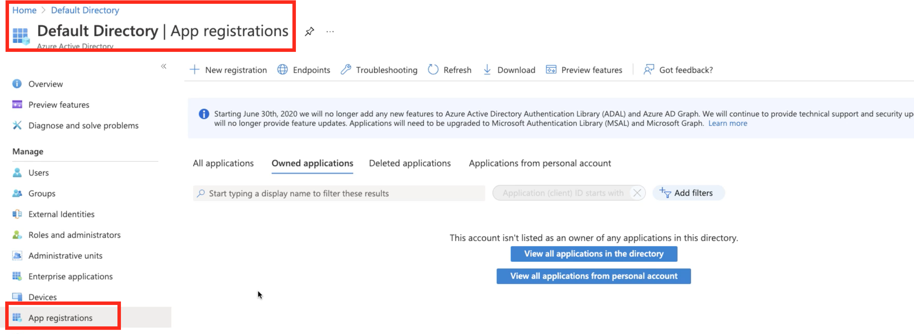

* Name: `interating-vault-with-devops-workflow`
* Applciation ID URI: **`api://carvd-rock`**

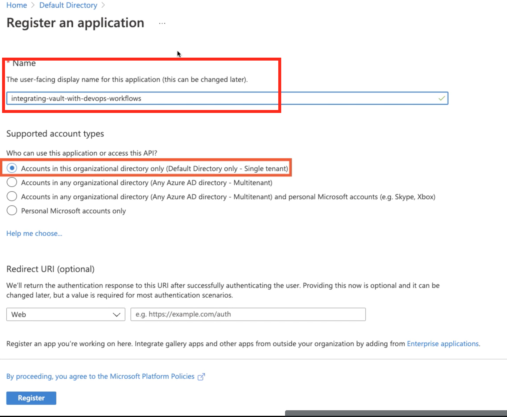

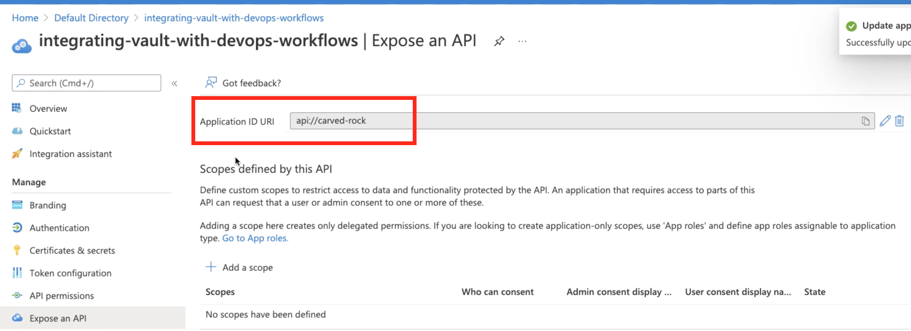

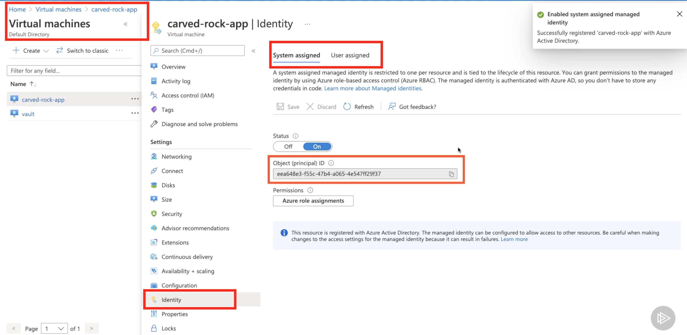

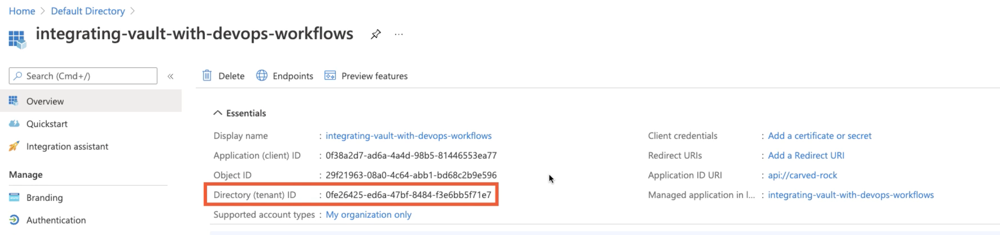

```
azureuser@vault:~$ vault auth enable azure
Success! Enabled azure auth method at: azure/

azureuser@vault:~$ vault write auth/azure/config
> tenant_id=0fe26425-ed6a-47bf-8484-f36bb5f71e7 resource=api://carved-rock

Success! Data written to: auth/azure/config


azureuser@vault:~$ vault write auth/azure/role/carved-rock-app\
> policies=a-vault-policy\
> bound_service_principal_ids=eea648e3-f55c-4764-a065-4547ff29837

Success! Data written to: auth/azure/role/carved-rock-app
```

```
azureuser@carved-rock-app:~$ curl -s \
> 'http://169.254.169.254/metadata/identity/oauth2/token?api-version=2018-02-01&resource=api%3A%2F%2Fcarved-rock'
> -H Metadata:true | jg
```

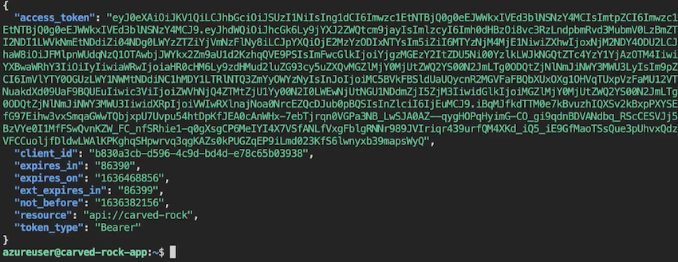

```
azureuser@carved-rock-app:~$ curl -s \
> 'http://169.254.169.254/metadata/identity/oauth2/token?api-version=2018-02-01&resource=api%3A%2F%2Fcarved-rock'
> -H Metadata:true | jg .access_token -r
```

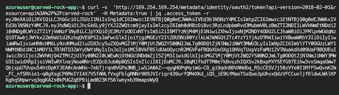

```
azureuser@carved-rock-app:~$ vault write auth/azure/login \
> role=carved-rock-app
> jwt=$(curl -s 'http://169.254.169.254/metadata/identity/oauth2/token?api-version=2018-02-01&resource=api%3A%2F%2Fcarved-rock' -H Metadata: true | jq -access_token -r)
```

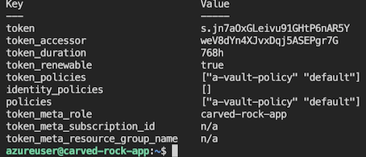

```
azureuser@vault:~$ vault write auth/azure/role/carved-rock-app policies=a-vault-policy bound_service_principal_ids=
eea648e3-f55c-4764-a065-45474f21234

Success! Data written to: auth/azure/role/carved-rock-app
```

**Change principal id will cause error**

Once if I edit the Vault role and change the `bound_service_principal_id` like this, then try the same login command again, it fails with an error saying that the Service principal is not authorized.

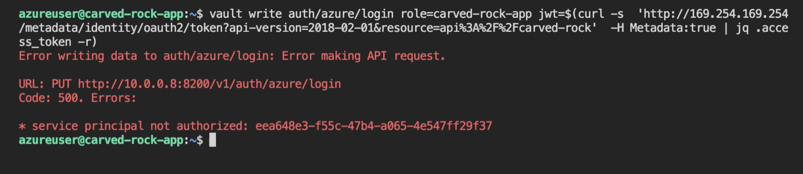

## Authenticate with GCP Machine Identity

* Specific to GCP, no Google or GSuite
* Permissions -> roles -> service account (SA)
* Apply a service account to an instance
* Call IAM API for a JWT, pass JWT to Vault
* Built-in Vault CLI helper
* Default SA is too powerful
* SA token creator role is vital

### Demo: Authenticate with GCP Machine Identity

The GCP auth method cannot be used to authenticate generic Google or GSuite users.

In GCP, **permissions are assigned to roles, roles can be given to a service account, and that service account can be applied to an instance.**

A machine can then call **Google's IAM API to create a JWT that represents a given service account.** The JWT is then passed to Vault for the authentication step.

Vault has a built‑in helper to make the JWT creation process a little easier.

### Create Service Account Key and roles

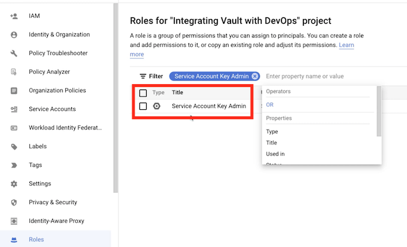

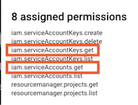

**Create Role for account with two permission**

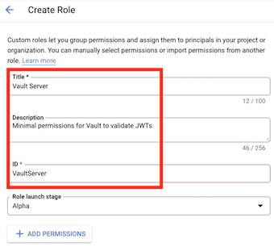

* iam.serviceAccountKeys.get
* iam.serviceAccounts.get

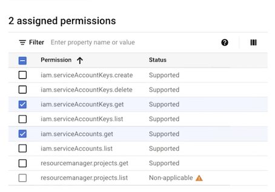

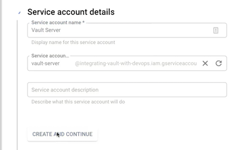

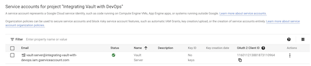

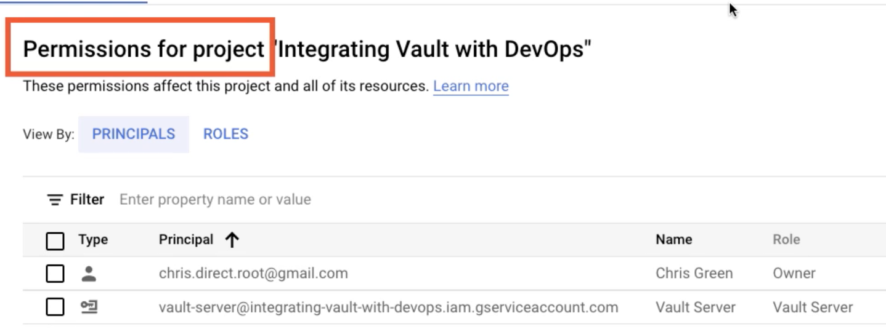

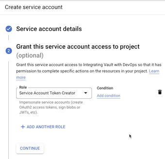

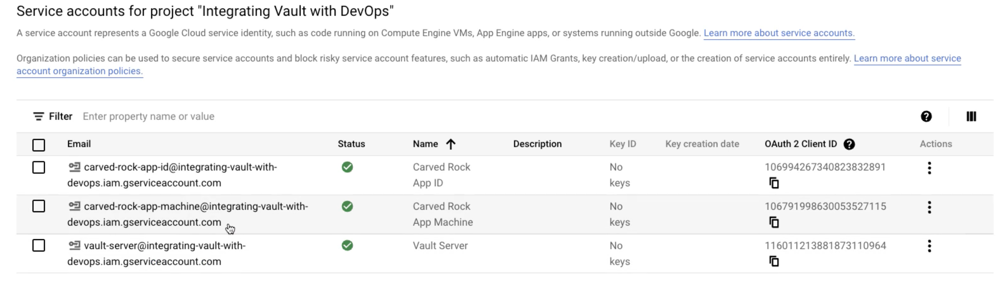

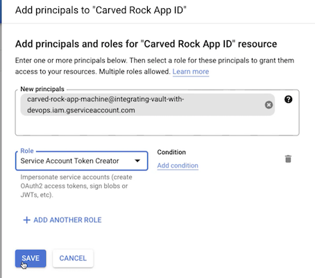

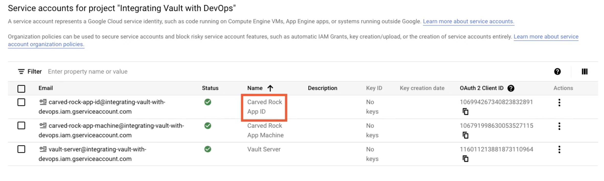

**App server**

```
gcg@vault:~$ vault auth enable gcp
Success! Enabled gcp auth method at: gcp/

gcg@vault:~$ vault write auth/gcp/role/carved-rock-app\
> type=iam\
> policies=a-vault-policy
> bound_service_accounts=carved-rock-app-id@integrating-vault-with-devops.iam.aserviceaccount.com

gcg@carved-rock-app:~$ vault login -method=gcp \
> role=carved-rock-app\
> jwt_exp=15m \
> service_account=carved-rock-app-id@integrating-vault-with-devops.iam.gserviceaccount.com
```

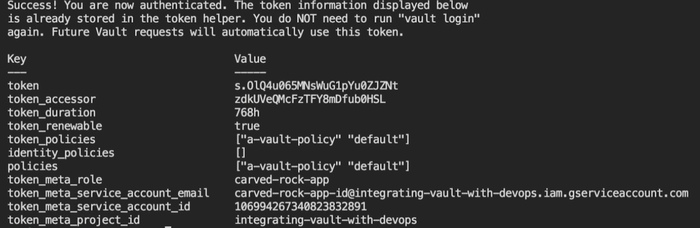

```
gcg@vault:~$ vault write auth/gcp/role/carved-rock-app\
> type=iam\
> policies=a-vault-policy \
> bound_service_accounts=carved-rock-app-machine@integrating-vault-with-devops.iam.gserviceaccount.com
```

```
gcg@carved-rock-app:~$ vault login -method=gcp \
> role=carved-rock-app
> jwt_exp=15m\
> service_account=carved-rock-app-machine@integrating-vault-with-devops.iam.gserviceaccount.com
```

```
gcg@carved-rock-app:~$ vault login -method=gcp \
> role=carved-rock-app \ 
> jwt_exp=15m \
> service_account=carved-rock-app-machine@integrating-vault-with-devops.iam.gserviceaccount.com

Error authenticating: unable to sign JWT for projects/-/serviceAccounts/carved-rock-app-machine@integrating-vault-wit
h-devops.iam.gserviceaccount.com using given Vault credentials: googleapi: Error 403: The caller does not have permission, forbidden
```
