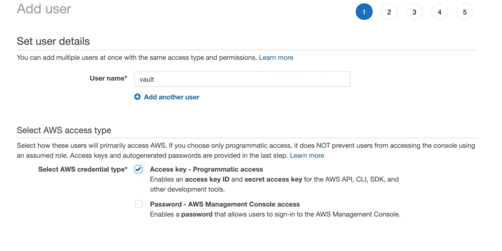
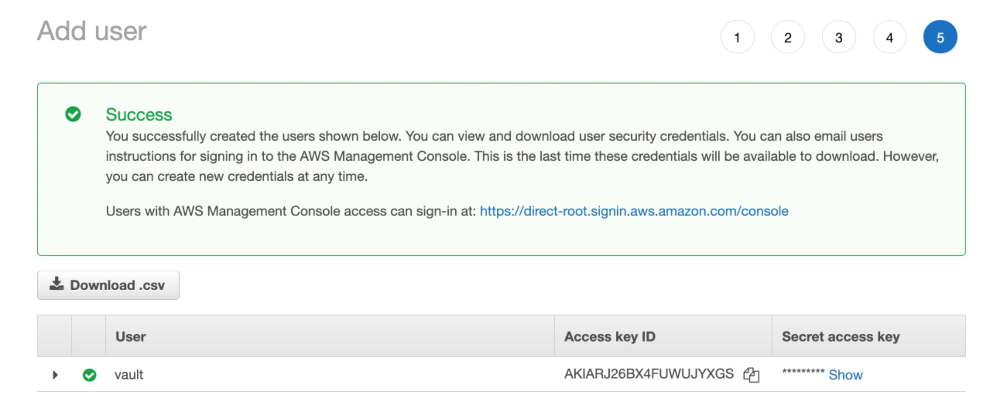
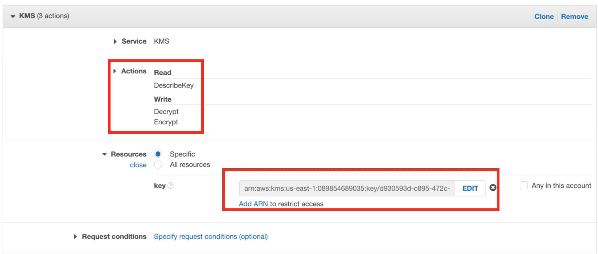
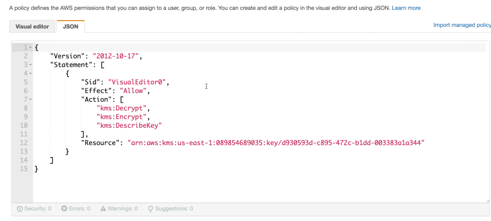
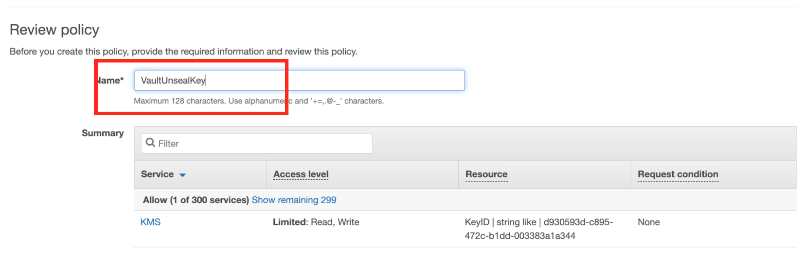
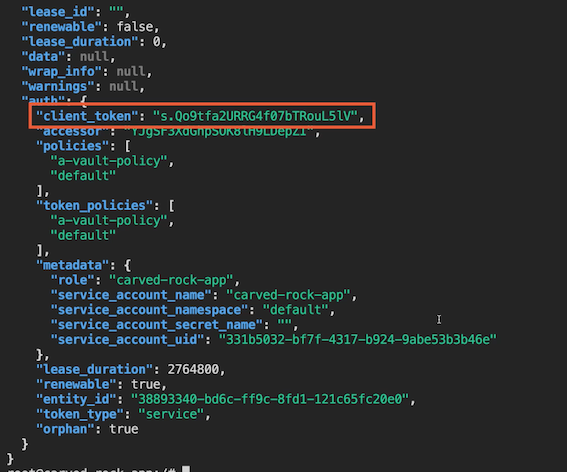

# **L6 Integrating Vault with Kubernetes**

## **1 Vault Helm Chart & Auto Unseal**

Vault Helm Chart

```
# Helm 3 & Kubernetes 1.14+
# Use Helm --dry-run flag outside of local experiments


helm install vault hashicorp/vault # Standalone

helm install vault hashicorp/vault --set "server.dev.enabled=true” # Dev

helm install vault hashicorp/vault --set "server.ha.enabled=true" # HA

helm install vault hashicorp/vault --set "injector.externalVaultAddr=..." # External
```

### Auto Unseal

Entrust the unseal key to a service

- Cloud Key Management Service (KMS)
- Another Vault Server

**Retrieve the unseal key & continue as usual**

**Automation is easier**

**Reduce wait-time to recover**

**Single service as a point of failure**

**Recovery keys for future quorum operations**


## Demo: Deploying via the Vault Helm Chart

```
$ helm repo add hashicorp https://helm.releases.hashicorp.com
"hashicorp" has been added to your repositories
```

### Install Consul

**`helm-consul-values.yml`**

```
client:
  enabled: true

server:
  replicas: 1
  bootstrapExpect: 1
  disruptionBudget:
    maxUnavailable: 0
```

```
$ helm install consul hashicorp/consul --values helm-consul-values.yml
NAME: consul
LAST DEPLOYED: Tue Jan  3 21:32:46 2023
NAMESPACE: default
STATUS: deployed
REVISION: 1
NOTES:
Thank you for installing HashiCorp Consul!

Your release is named consul.

To learn more about the release, run:

  $ helm status consul --namespace default
  $ helm get all consul --namespace default

Consul on Kubernetes Documentation:
https://www.consul.io/docs/platform/k8s

Consul on Kubernetes CLI Reference:
https://www.consul.io/docs/k8s/k8s-cli
```

### Install vault

**`helm-vault-values.yml`**

```
server:
  affinity: ""
  ha:
    enabled: true
  #extraVolumes:
  #  - name: vault-seal-config
  #    type: secret
  #extraArgs: "-config=/vault/userconfig/vault-seal-config/vault-seal.hcl"
```


```
helm install vault hashicorp/vault --values helm-vault-values.yml

NAME: vault
LAST DEPLOYED: Tue Jan  3 21:38:46 2023
NAMESPACE: default
STATUS: deployed
REVISION: 1
NOTES:
Thank you for installing HashiCorp Vault!

Now that you have deployed Vault, you should look over the docs on using
Vault with Kubernetes available here:

https://www.vaultproject.io/docs/


Your release is named vault. To learn more about the release, try:

  $ helm status vault
  $ helm get manifest vault
```

```
$ kubectl get pod
NAME                                                  READY   STATUS    RESTARTS       AGE
consul-consul-client-qwbjj                            1/1     Running   0              9m42s
consul-consul-connect-injector-69996cb66b-vjrnm       1/1     Running   0              9m42s
consul-consul-server-0                                1/1     Running   0              9m42s
consul-consul-webhook-cert-manager-654cbb5df6-xhlzg   1/1     Running   0              9m42s

vault-0                                               0/1     Running   0              3m41s
vault-1                                               0/1     Running   0              3m41s
vault-2                                               0/1     Running   0              3m40s
vault-agent-injector-8b6fd97b8-rg7b9                  1/1     Running   0              3m41s
```

```
$ kubectl exec vault-0 -- vault status
Key                Value
---                -----
Seal Type          shamir
Initialized        false
Sealed             true
Total Shares       0
Threshold          0
Unseal Progress    0/0
Unseal Nonce       n/a
Version            1.12.1
Build Date         2022-10-27T12:32:05Z
Storage Type       consul
HA Enabled         true
command terminated with exit code 2
```

```
helm uninstall vault
```

## Demo: Configuring Auto Unseal

We can configure Vault to auto unseal, we first need to set up a KMS to provide the unseal key. I'll be using AWS KMS for this demo





**`vault-seal.hcl`**

```
seal "awskms" {
  region     = "us-east-1"
  access_key = ""
  secret_key = ""
  kms_key_id = "d930593d-c895-472c-b1dd-003383a1a344"
}
```

```
$ kubectl create secret generic vault-seal-config--from-file vault-seal.hcl
secret/vault-seal-config created
```

### Add KMS Actions and Resources







```
helm install vault hashicorp/vault -values helm-vault-values.yml


$ kubectl exec vault-0 -- vault status
Key                Value
---                -----
Seal Type          awskms
Initialized        false
Sealed             true
Total Shares       0
Threshold          0
Unseal Progress    0/0
Unseal Nonce       n/a
Version            1.12.1
Build Date         2022-10-27T12:32:05Z
Storage Type       consul
HA Enabled         true
command terminated with exit code 2

kubectl exec vault-0 -- vault operator init
```


## Demo: Configuring Kubernetes Authentication


```
helm install vault hashicorp/vault 

$ kubectl exec vault-0 -- vault operator init
Unseal Key 1: R6MbZVEX1F8z3jTUocGrICh7xUdhKqwWrrqlisYlAbSp
Unseal Key 2: ep8Pn/0c5MIJrN1tTY7b0IPXBCKsxnvwhdFc5h1hx5fF
Unseal Key 3: 5PMhCbVepBY2NR9Hp1caPgpieZ+Ou/haBhMxdV+Cf0tY
Unseal Key 4: twXwW8NCuWpt23YzqsT5niy/nOBxxhNybjWDxxlDOiaZ
Unseal Key 5: xjvoDte4WLH1kvNPOy2XIj9w5PBFmbzmBRYXvZ8IhUvY

Initial Root Token: hvs.aFXwTTgmQnwUeSFZC9H01R6i

Vault initialized with 5 key shares and a key threshold of 3. Please securely
distribute the key shares printed above. When the Vault is re-sealed,
restarted, or stopped, you must supply at least 3 of these keys to unseal it
before it can start servicing requests.

Vault does not store the generated root key. Without at least 3 keys to
reconstruct the root key, Vault will remain permanently sealed!

It is possible to generate new unseal keys, provided you have a quorum of
```

```
$ kubectl get pod
NAME                                                  READY   STATUS    RESTARTS        AGE
vault-0                                               0/1     Running   0               38m
vault-1                                               0/1     Running   0               38m
vault-2                                               0/1     Running   0               38m
vault-agent-injector-8b6fd97b8-rg7b9                  1/1     Running   0               38m
```

Fix the readiness probe error

```
kubectl exec -ti vault-0 -n vault -- vault operator unseal  

# unseal first 3 keys 
```

```
$ kubectl exec -ti vault-0  -- vault operator unseal
Unseal Key (will be hidden): 
Key                Value
---                -----
Seal Type          shamir
Initialized        true
Sealed             true
Total Shares       5
Threshold          3
Unseal Progress    1/3
Unseal Nonce       b1bbf576-20c7-c09e-a9d1-d4cde9ba922e
Version            1.12.1
Build Date         2022-10-27T12:32:05Z
Storage Type       file
HA Enabled         false

$ kubectl exec -ti vault-0  -- vault operator unseal
Unseal Key (will be hidden): 
Key                Value
---                -----
Seal Type          shamir
Initialized        true
Sealed             true
Total Shares       5
Threshold          3
Unseal Progress    2/3
Unseal Nonce       b1bbf576-20c7-c09e-a9d1-d4cde9ba922e
Version            1.12.1
Build Date         2022-10-27T12:32:05Z
Storage Type       file
HA Enabled         false

$ kubectl exec -ti vault-0  -- vault operator unseal
Unseal Key (will be hidden): 
Key             Value
---             -----
Seal Type       shamir
Initialized     true
Sealed          false
Total Shares    5
Threshold       3
Version         1.12.1
Build Date      2022-10-27T12:32:05Z
Storage Type    file
Cluster Name    vault-cluster-b7f77b66
Cluster ID      dcb8d7bd-7058-3642-4bdf-62b1f04962d7
HA Enabled      false
```

```
$ kubectl get pod
NAME                                                  READY   STATUS    RESTARTS        AGE
vault-0                                               1/1     Running   0               4m24s
vault-agent-injector-8b6fd97b8-s2k5d                  1/1     Running   0               4m23s
```

* https://developer.hashicorp.com/vault/api-docs/auth/kubernetes
* https://docs.armory.io/continuous-deployment/armory-admin/secrets/vault-k8s-configuration/

```
$ kubectl exec -it vault-0 -- sh
/ $ 

$ export VAULT_TOKEN=hvs.aFXwTTgmQnwUeSFZC9H01R6i

$ vault auth enable kubernetes

# kubernetes auth config

# kubernetes auth config
vault write auth/kubernetes/config \
        kubernetes_host="https://$KUBERNETES_PORT_443_TCP_ADDR:64\43" \
        token_reviewer_jwt="$(cat /var/run/secrets/kubernetes.io/serviceaccount/token)" \
        kubernetes_ca_cert=@/var/run/secrets/kubernetes.io/serviceaccount/ca.crt \
        issuer="https://kubernetes.default.svc.cluster.local"

Success! Data written to: auth/kubernetes/config


vault write auth/kubernetes/role/carved-rock-app bound_service_account_names=carved-rock-app bound_service_account_namespaces=default policies=a-vault-policy


Success! Data written to: auth/kubernetes/role/carved-rock-app
```

```
$ kubectl create serviceaccount carved-rock-app
serviceaccount/carved-rock-app created
```

**`carved-rock-app.yml`**

```
apiVersion: v1
kind: Pod
metadata:
  name: carved-rock-app
  labels:
    app: carved-rock-app
spec:
  serviceAccountName: carved-rock-app
  containers:
  - image: ubuntu
    command:
      - "sleep"
      - "604800"
    imagePullPolicy: IfNotPresent
    name: carved-rock-app
  restartPolicy: Always
```

```
kubectl apply -f carved-rock-app.yml

kubectl exec -it carved-rock-app -- bash
root@carved-rock-app:/#
apt update && apt-get install curl dnsutils jg

root@carved-rock-app:/# nslookup vault
Server:         10.96.0.10
Address:        10.96.0.10#53

Name:   vault.default.svc.cluster.local
Address: 10.110.139.135

root@carved-rock-app:/# curl -i http://vault:8200
HTTP/1.1 307 Temporary Redirect
Cache-Control: no-store
Content-Type: text/html; charset=utf-8
Location: /ui/
Strict-Transport-Security: max-age=31536000; includeSubDomains
Date: Tue, 03 Jan 2023 15:50:16 GMT
Content-Length: 40

<a href="/ui/">Temporary Redirect</a>.

root@carved-rock-app:/# env | grep VAULT
VAULT_SERVICE_PORT_HTTPS_INTERNAL=8201
VAULT_PORT_8201_TCP_PROTO=tcp
VAULT_PORT_8200_TCP_ADDR=10.110.139.135
VAULT_SERVICE_PORT=8200
VAULT_PORT_8201_TCP_PORT=8201
VAULT_AGENT_INJECTOR_SVC_PORT_443_TCP_PROTO=tcp
VAULT_AGENT_INJECTOR_SVC_PORT=tcp://10.110.86.252:443
VAULT_AGENT_INJECTOR_SVC_SERVICE_PORT_HTTPS=443
VAULT_PORT_8200_TCP_PROTO=tcp
VAULT_PORT_8200_TCP_PORT=8200
VAULT_AGENT_INJECTOR_SVC_PORT_443_TCP_PORT=443
VAULT_PORT_8201_TCP=tcp://10.110.139.135:8201
VAULT_SERVICE_PORT_HTTP=8200
VAULT_AGENT_INJECTOR_SVC_PORT_443_TCP_ADDR=10.110.86.252
VAULT_PORT_8201_TCP_ADDR=10.110.139.135
VAULT_PORT_8200_TCP=tcp://10.110.139.135:8200
VAULT_AGENT_INJECTOR_SVC_PORT_443_TCP=tcp://10.110.86.252:443
VAULT_AGENT_INJECTOR_SVC_SERVICE_HOST=10.110.86.252
VAULT_SERVICE_HOST=10.110.139.135
VAULT_AGENT_INJECTOR_SVC_SERVICE_PORT=443
VAULT_PORT=tcp://10.110.139.135:8200


curl -X POST --data "{\"jwt\": \"$(cat /var/run/secrets/kubernetes.io/serviceaccount/token)\", \"role\": \"carved-rock-app\"}" http://vault:8200/v1/auth/kubernetes/login | jg
```




```
/ $ export VAULT_TOKEN=hvs.aFXwTTgmQnwUeSFZC9H01R6i
/ $ vault write auth/kubernetes/role/carved-rock-app bound_service_account_names=not-carved-rock-app bo
und_service_account_namespaces=default policies=a-vault-policy
Success! Data written to: auth/kubernetes/role/carved-rock-app
```

```
# curl -X POST --data "{\"jwt\": \"$(cat /var/run/secrets/kubernetes.io/serviceaccount/token)\", \"role\": \"carved-rock-app\"}" http://vault:8200/v1/auth/kubernetes/login | jq
  % Total    % Received % Xferd  Average Speed   Time    Time     Time  Current
                                 Dload  Upload   Total   Spent    Left  Speed
100  1115  100    51  100  1064   9611   195k --:--:-- --:--:-- --:--:--  217k
{
  "errors": [
    "service account name not authorized"
  ]
}
```
