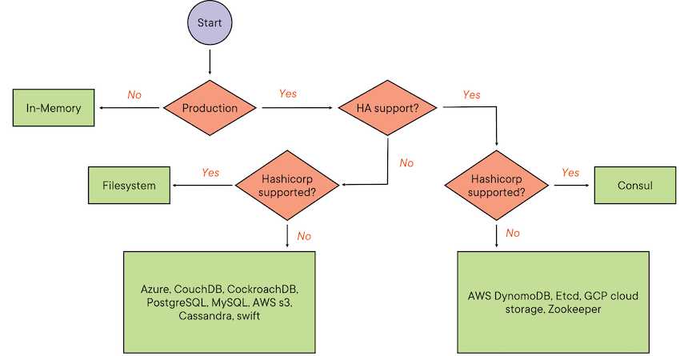
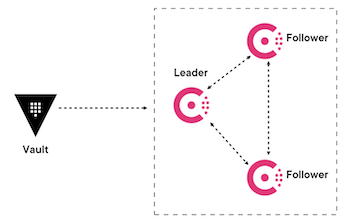
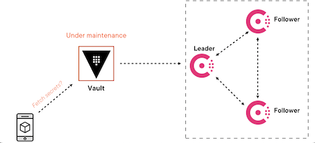
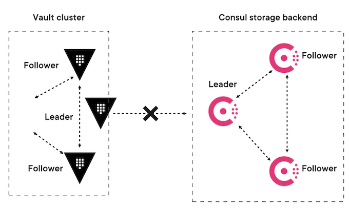
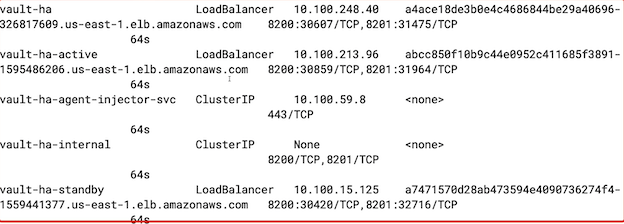
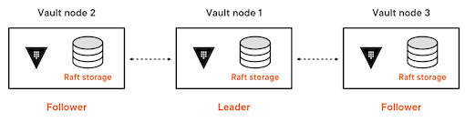
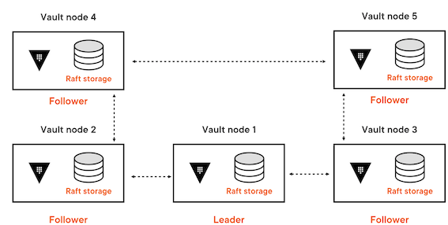
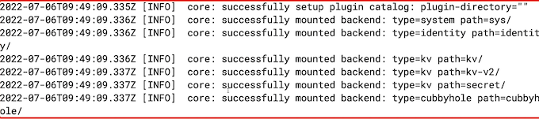
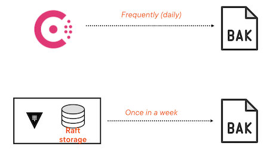
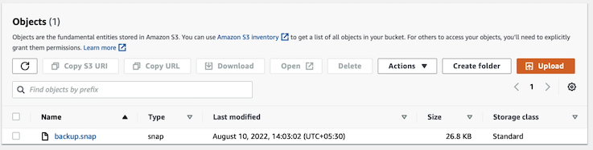

# **2 Managing the Storage Backend**

## **1 Intro to Storage Backend**

### **Storage Backend**

A database in which **vault stores secrets, system configurations, auth informations**, etc.

**Storage Backend**


* Is an untrusted component
* Stores data in an encrypted form
* Is required to persist data across Vault restarts

### Types of Storage Backend

* Structured databases
* Unstructured databases
* Object storage
* Key-value store
* Filesystem

**Broadly categorised:**

* Integrated storage backend
* External storage backend

### Integrated Storage Backend

* Comes as a part of the vault server
* Uses raft consensus
* Stores data on the vault server itself
* Replicates data across replicas in cluster mode


### External Storage Backend

* Hosted separately from the vault server
* Stores all the data on a different server

### Comparison

**Integrated storage backend**

* No additional software installation required
* Just monitor the vault server

**External storage backend**

* External storage needs to be installed and configured
* Monitor the vault server and storage backend separately



### **Storage Configuration**

* **`integrated_strorage.hcl`**

```
storage  "consul" {
	address = "127.0.0.1:8500"
	path    = "vault"
}

listener  "tcp" {
	address = "127.0.0.1:8200"
	tls_disable = 1
}
```

* **`consul storage.hcl`**

```
storage "raft" {
	path = "/path/to/raft/data"
	node_id = "raft_node_1"
}

listener "tcp" {
	address  =  "127.0.0.1:8200"
	tls_disable = 1
}
```

### **Consul storage backend**



### Single Point of Failure



## Vault HA Setup



**`values.yaml`**

```
# Vault Helm Chart Value Overrides
global:  
  enabled: true  
  tlsDisable: false

server:

  readinessProbe:
    enabled: true
    path: "/v1/sys/health?standbyok=true&sealedcode=204&uninitcode=204"
  livenessProbe:
    enabled: true
    path: "/v1/sys/health?standbyok=true"
    initialDelaySeconds: 60
  
  extraSecretEnvironmentVars:
    - envName: AWS_ACCESS_KEY_ID
      secretName: aws-secret
      secretKey: AWS_ACCESS_KEY_ID
    - envName: AWS_SECRET_ACCESS_KEY
      secretName: aws-secret
      secretKey: AWS_SECRET_ACCESS_KEY

  extraEnvironmentVars:
    VAULT_CACERT: /vault/userconfig/vault-tls/vault.ca
    VAULT_SKIP_VERIFY: true

  extraVolumes:
    - type: secret
      name: vault-tls

  ha:
    enabled: true
    replicas: 3
    config: |
      listener "tcp" {
        address = "[::]:8200"
        cluster_address = "[::]:8201"
        tls_cert_file = "/vault/userconfig/vault-tls/vault.crt"
        tls_key_file  = "/vault/userconfig/vault-tls/vault.key"

      }

      seal "awskms"
      {
        region     = "us-east-1"
        kms_key_id = "b7576d39-d159-46f4-b84b-33f5b618fce2"
      }

      storage "consul" {
        path = "vault"
        address = "HOST_IP:8500"
      }

      service_registration "kubernetes" {}

  standalone:
    enabled: "false"

    config: |
      
      listener "tcp" {
        address = "[::]:8200"
        cluster_address = "[::]:8201"
        tls_cert_file = "/vault/userconfig/vault-tls/vault.crt"
        tls_key_file  = "/vault/userconfig/vault-tls/vault.key"

      }
      seal "awskms"
      {
        region     = "us-east-1"
        kms_key_id = "b7576d39-d159-46f4-b84b-33f5b618fce2"
      }

      storage "consul" {
        path = "vault"
        address = "consul-consul-server:8500"
      }
      ui = true
      log_level = "Debug"


  service:
    type: LoadBalancer
    annotations: |
      "service.beta.kubernetes.io/aws-load-balancer-name": "vault-server"
```

```
### setup the vault address
export certificate_cn=""
export VAULT_ADDR="https://${certificate_cn}:8200"
```

```
### install the vault ha
helm install vault-ha hashicorp/vault \
  --namespace vault \
  --values values.yaml
  
### Check pods
kubectl get pods -n vault

### Get the public endpoint
kubectl get svc -n vault
```



**Integrated Backend Setup**


```
### Check the vault status
vault status -tls-skip-verify

Path  Type   Accessor  Description
---   ---    ---       ----
...
sys/ system  system_lafa27ac  system endpoints used for control, policy and debugging
```

```
### set the new token
vault login -tls-skip-verify

### List key-values
vault kv list -tls-skip-verify secret/

### Remove the old standalone setup
helm delete vault -n vault
```

## 2 Choosing a Storage Backend

**Switch from consul storage backend to integrated storage backend**

* **Achieve n-2 redundancy**



* The ideal site for a vault HA cluster is 5




### Consul backup snapshot

```
### setup the vault address
export certificate_cn=""
export VAULT_ADDR="https://${certificate_cn}:8200"

export CONSUL_HTTP_ADDR=localhost:8500

### port forward the consul service
kubectl port-forward -n vault svc/consul-consul-server 8500

```

```
$ consul snapshot save backup.snap
Saved and verified snapshot to index 59280
```

**`values.yaml`**

```
# Vault Helm Chart Value Overrides
global:  
  enabled: true  
  tlsDisable: true

server:
  readinessProbe:
    enabled: true
    path: "/v1/sys/health?standbyok=true&sealedcode=204&uninitcode=204"
  livenessProbe:
    enabled: true
    path: "/v1/sys/health?standbyok=true"
    initialDelaySeconds: 60


  extraEnvironmentVars:
    VAULT_SKIP_VERIFY: true

  extraSecretEnvironmentVars:
    - envName: AWS_ACCESS_KEY_ID
      secretName: aws-secret
      secretKey: AWS_ACCESS_KEY_ID
    - envName: AWS_SECRET_ACCESS_KEY
      secretName: aws-secret
      secretKey: AWS_SECRET_ACCESS_KEY

  extraVolumes:
    - type: secret
      name: vault-tls

  ha:
    enabled: true
    replicas: 3
    raft:
      enabled: true
      config: |
        listener "tcp" {
          address = "[::]:8200"
          cluster_address = "[::]:8201"
          tls_disable = "true"
          tls_cert_file = "/vault/userconfig/vault-tls/tls.crt"
          tls_key_file  = "/vault/userconfig/vault-tls/tls.key"

        }

        seal "awskms"
        {
          region     = "us-east-1"
          kms_key_id = "794c5350-d4ca-4ea0-af29-1f69e6681361"
        }
        
        storage "raft" {
            path = "/vault/data"
          retry_join {
            leader_api_addr = "http://vault-raft-0.vault-raft-internal:8200"
            leader_client_cert_file = "/vault/userconfig/vault-tls/tls.crt"
            leader_client_key_file = "/vault/userconfig/vault-tls/tls.key"
          }
          retry_join {
            leader_api_addr = "http://vault-raft-1.vault-raft-internal:8200"
            leader_client_cert_file = "/vault/userconfig/vault-tls/tls.crt"
            leader_client_key_file = "/vault/userconfig/vault-tls/tls.key"
          }
          retry_join {
            leader_api_addr = "http://vault-raft-2.vault-raft-internal:8200"
            leader_client_cert_file = "/vault/userconfig/vault-tls/tls.crt"
            leader_client_key_file = "/vault/userconfig/vault-tls/tls.key"
          }
        }

        service_registration "kubernetes" {}


  standalone:
    enabled: "false"

    config: |
      
      listener "tcp" {
        address = "[::]:8200"
        cluster_address = "[::]:8201"
        tls_cert_file = "/vault/userconfig/vault-tls/tls.crt"
        tls_key_file  = "/vault/userconfig/vault-tls/tls.key"
      }

      seal "awskms"
      {
        region     = "us-east-1"
        kms_key_id = "794c5350-d4ca-4ea0-af29-1f69e6681361"
      }

      storage "consul" {
        path = "vault"
        address = "consul-consul-server:8500"
      }
      ui = true
      log_level = "Debug"


  service:
    type: LoadBalancer
```

```
### install the vault ha
helm install vault-raft hashicorp/vault \
  --namespace vault \
  --values values.yaml
  
### List pods
kubectl get pods -n vault
...
vault-raft-0
vault-raft-1
vault-raft-2
...

### Get pvc 
kubectl get pvc -n vault

data-vault-raft-0

data-vault-raft-1

data-vault-raft-2

$ vault status -tls-skip-verify
Value  			Key
Recovery Seal Type  awskms
Sealed		true
...

$ vault operator init -recovery-shares 3 -recovery-threshold 2

Recovery Key 1: 5KGmlfumJQSOfti3SF5IGEA+/tEKLg×U2H1qBaKT9P77
Recovery Key 2: Jetu/TTjh8vEj2VrfnDg4Ejm+zFYOvcjfA6X36CII161
Recovery Key 3: duy1UrybAENHhi+15Mc80104Wy72jKVB02wFweDFhpmQ

Initial Root Token: hvs.SOWH99QviJoVkS4nTkFv3Eig
...
```  

## Migrate data from consul backend

**Vault Data Migration in Kubernetes**

* To be inside the Vault pod
* No Vault process running
* No lock on the database


### **Create dummy pod**

```
$ helm delete -n vault vault-raft
release "vault-raft" uninstalled

$ kubectl apply -n vault -f stateful.vaml
statefulset.apps/vault-raft created
```

* **`stateful.vaml`**

```
apiVersion: apps/v1
kind: StatefulSet
metadata:
  generation: 1
  labels:
    app.kubernetes.io/instance: vault-raft
    app.kubernetes.io/name: vault
  name: vault-raft
  namespace: vault
spec:
  podManagementPolicy: Parallel
  replicas: 1
  revisionHistoryLimit: 10
  selector:
    matchLabels:
      app.kubernetes.io/instance: vault-raft
      app.kubernetes.io/name: vault
      component: server
  serviceName: vault-raft-internal
  template:
    metadata:
      creationTimestamp: null
      labels:
        app.kubernetes.io/instance: vault-raft
        app.kubernetes.io/name: vault
        component: server
        helm.sh/chart: vault-0.20.1
    spec:
      affinity:
        podAntiAffinity:
          requiredDuringSchedulingIgnoredDuringExecution:
          - labelSelector:
              matchLabels:
                app.kubernetes.io/instance: vault-raft
                app.kubernetes.io/name: vault
                component: server
            topologyKey: kubernetes.io/hostname
      containers:
      - command:
         - cat
        tty: true
        # - /bin/sh
        # - -ec
        image: hashicorp/vault:1.10.3
        imagePullPolicy: IfNotPresent
        lifecycle:
          preStop:
            exec:
              command:
              - /bin/sh
              - -c
              - sleep 5 && kill -SIGTERM $(pidof vault)
        name: vault
        ports:
        - containerPort: 8200
          name: https
          protocol: TCP
        - containerPort: 8201
          name: https-internal
          protocol: TCP
        - containerPort: 8202
          name: https-rep
          protocol: TCP
        resources: {}
        securityContext:
          allowPrivilegeEscalation: false
        terminationMessagePath: /dev/termination-log
        terminationMessagePolicy: File
        volumeMounts:
        - mountPath: /vault/data
          name: data
        - mountPath: /home/vault
          name: home
      dnsPolicy: ClusterFirst
      restartPolicy: Always
      schedulerName: default-scheduler
      securityContext:
        fsGroup: 1000
        runAsGroup: 1000
        runAsNonRoot: true
        runAsUser: 100
      terminationGracePeriodSeconds: 10
      volumes:
      - emptyDir: {}
        name: home
  updateStrategy:
    type: OnDelete
  volumeClaimTemplates:
  - apiVersion: v1
    kind: PersistentVolumeClaim
    metadata:
      creationTimestamp: null
      name: data
    spec:
      accessModes:
      - ReadWriteOnce
      resources:
        requests:
          storage: 10Gi
      volumeMode: Filesystem
    status:
      phase: Pending
```

```
kubectl get pods -n vault
....
vault-raft-0
```

### Migrate data


```
### exec into pod
kubectl exec -it -n vault vault-raft-0 /bin/sh

$ cd / tmp
/tmp $
```

**Create migration config file**

* `vi migrate.hcl`

```
storage_source "consul" {
address = "consul-consul-server:8500"
path    = "vault"
}

storage_destination "raft" {
  path = "/vault/data"
}

cluster_addr = "https://vault-raft-0.vault-raft-internal:8201"
```

**Migrate data**

```
vault operator migrate -config=migrate.hcl

### Delete dummy pod**
kubectl delete -n vault -f stateful.yaml

### Get pvc 
kubectl get pvc -n vault

data-vault-raft-0

data-vault-raft-1

data-vault-raft-2
```

**The data is already migrated into PV `data-vault-raft`**


**reinstall the vault ha**


```
helm install vault-raft hashicorp/vault \
  --namespace vault \
  --values values.yaml

### logs
kubectl logs -n vault vault-raft-0 -f
```




### **Check Vault cluster health**

```
### exec into pod
kubectl exec -it -n vault vault-raft-0 /bin/sh

vault status -tls-skip-verify

Key      					Value
Recovery Seal Type			shamir
Initialized					true
Sealed						false
Total Recovery Shares		3
Threshold					2
Version					1.10.3
Storage Type			raft
Cluster Name			vault-cluster-d7110da1
Cluster ID				dc36dd21-147a-8eda-a553-501ae974afbb
HA Enabled				true
HA Cluster				https://vault-raft-0.vault-raft-internal:8201
HA Mode					active		
Active Since			2022-07-06T09:49:09.331675004z
Raft Committed Index		69
Raft Applied Index			69
```

```
vault secrets list -tls-skip-verify

Error listing secrets engines：Error making API request.

URL: GET https://127.0.0.1:8200/v1/sys/mounts
Code:403，Errors:

* permission denied
```

**Login into the Vault**

```
vault login

token: 	hvs.h4xour1BVcxSaVIJmaih7k30

### List the secrets
vault secrets list -tls-skip-verify

vault kv list -tls-skip-verify secret/
```

```
### Initiate the vault server
vault operator init -recovery-shares 3 -recovery-threshold 2

### Exec into 2nd and 3rd vault pod
kubectl exec -it -n vault vault-raft-1 /bin/sh
kubectl exec -it -n vault vault-raft-2 /bin/sh


### Unseal the vault server
vault operator raft join https://vault-raft-0.vault-raft-internal:8201
vault operator unseal 

### Check cluster status
vault operator raft list-peers
```

## Vault Backups

* **Mitigate**

	* Single point of failure, dependency, and migration

* **Not a full proof solution**
 
* **What if data is corrupted?**





### Backup


* Regular snapshots protect from uncertainties
* Is recommended
	* Before upgrades
	* Before Migration
	* Any significant change
	
**Is not recommended during write operation**

```
### setup the vault address
export certificate_cn=""
export VAULT_ADDR="https://${certificate_cn}:8200"

### Get the public endpoint
kubectl get svc -n vault
...
vault-raft   LoadBalancer 10.100.220.50  a0f403f1d78564986bd18f7eddac7c51-130545175.us-east-1.elb.amazonaws.com
...


export certiticate_cn="a0f403f1d78564986bd18f7eddac7c51-130545175.us-east-1.elb.amazonaws.com"


### Snapshot of the raft storage backend
vault operator raft snapshot save backup.snap
```

**Restore the snapshot when needed**



```
### restore the snapshot
vault operator raft snapshot restore -force <snapshot-name>
```

```
### Automate the vault snapshot
vault write sys/storage/raft/snapshot-auto/config/testsnap \
     storage_type=local \
     file_prefix=testsnappy \
     interval=120m \
     retain=7 \
     local_max_space=1000000 \
     path_prefix=/opt/vault/
```
