# 3 Managing the Vault Server during an Incident

## Introduction to Troubleshooting Concepts

* Define up service level indicators(SLIs)
* Set up service level objectives(SLOs)
* Create service level agreements(SLAs)

--

* Troubleshoot the incident
* Fix the incident
* Set up monitoring dashboards


**Techniques to troubleshoot and monitor the vault server**

**1st part: Debug an incident**

Use server logs, audit logs, vault-debug, vault-diagnose

**2nd part: Monitor the vault server**

* Expose and collect vault’s telemetry metrics 
* Install prometheus and grafana

### Vault Components

* Database server
* Virtual machine
* Cache server
* Messaging broker

**One System Components**

* Virtual machine (VM)
* Vault server
* Consul backend

Total components = 3

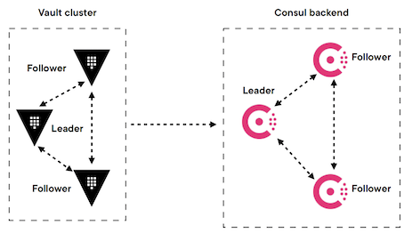

Total components = 7

### Troubleshooting

* Step-by-step process 
* Debug each components one after the other 
* Components are dependent
	* **Status of one component gives the status 
of other components**

**Standalone Setup**

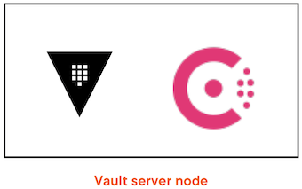

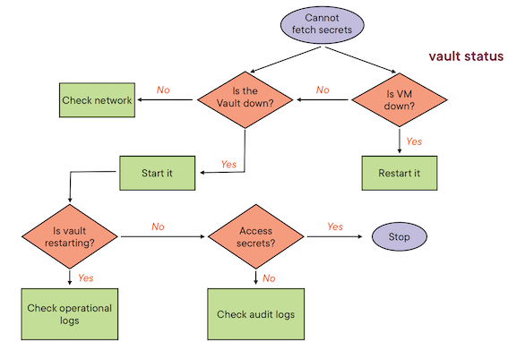

**Storage Backends**

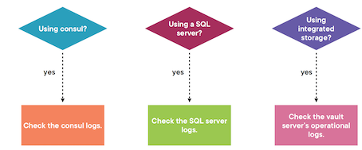

## Demo: Troubleshooting Steps

```
export certificate_cn=""
export VAULT_ADDR="http://${certificate_cn}:8200"

## List all pods
kubectl get pods -n vault

### Find the vault address
kubectl get svc -n vault

### Describe pods
kubectl describe pod -n vault vault-raft-0

### Tail the logs
kubectl logs -n vault vault-raft-0 --tail=100 -f 

[DEBUG] core:
refreshing forwarding connection
2022-08-03T20:07:35.212Z [DEBUG] core: clearing forwarding clients
2022-08-03T20:07:35.212Z [DEBUG] core:
done clearing forwarding clients
2022-08-03T20:07:35.212Z [DEBUG] core: done refreshing forwarding connection
```

* Cannot connect to storage backend:  Fix the connection
* TLS Certificate has expired: Generate new TLS certificate
* Out of memory exception: Increase the memory
requested


### Audit Logs and Debug Command

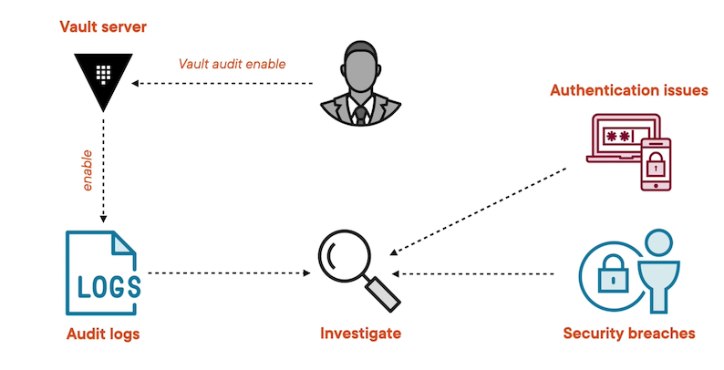

* **`values-debug.yaml`**

```
# Vault Helm Chart Value Overrides
global:  
  enabled: true  
  tlsDisable: true

server:
  readinessProbe:
    enabled: true
    path: "/v1/sys/health?standbyok=true&sealedcode=204&uninitcode=204"
  livenessProbe:
    enabled: true
    path: "/v1/sys/health?standbyok=true"
    initialDelaySeconds: 60


  extraEnvironmentVars:
    VAULT_SKIP_VERIFY: true

  extraSecretEnvironmentVars:
    - envName: AWS_ACCESS_KEY_ID
      secretName: aws-secret
      secretKey: AWS_ACCESS_KEY_ID
    - envName: AWS_SECRET_ACCESS_KEY
      secretName: aws-secret
      secretKey: AWS_SECRET_ACCESS_KEY

  extraVolumes:
    - type: secret
      name: vault-tls

  ha:
    enabled: true
    replicas: 3
    raft:
      enabled: true
      config: |
        listener "tcp" {
          address = "[::]:8200"
          cluster_address = "[::]:8201"
          tls_disable = "true"
          tls_cert_file = "/vault/userconfig/vault-tls/tls.crt"
          tls_key_file  = "/vault/userconfig/vault-tls/tls.key"

        }
        log_level = "Debug"
        seal "awskms"
        {
          region     = "us-east-1"
          kms_key_id = "794c5350-d4ca-4ea0-af29-1f69e6681361"
        }
        
        storage "raft" {
            path = "/vault/data"
          retry_join {
            leader_api_addr = "http://vault-raft-0.vault-raft-internal:8200"
            leader_client_cert_file = "/vault/userconfig/vault-tls/tls.crt"
            leader_client_key_file = "/vault/userconfig/vault-tls/tls.key"
          }
          retry_join {
            leader_api_addr = "http://vault-raft-1.vault-raft-internal:8200"
            leader_client_cert_file = "/vault/userconfig/vault-tls/tls.crt"
            leader_client_key_file = "/vault/userconfig/vault-tls/tls.key"
          }
          retry_join {
            leader_api_addr = "http://vault-raft-2.vault-raft-internal:8200"
            leader_client_cert_file = "/vault/userconfig/vault-tls/tls.crt"
            leader_client_key_file = "/vault/userconfig/vault-tls/tls.key"
          }
        }

        service_registration "kubernetes" {}


  standalone:
    enabled: "false"

    config: |
      
      listener "tcp" {
        address = "[::]:8200"
        cluster_address = "[::]:8201"
        tls_cert_file = "/vault/userconfig/vault-tls/tls.crt"
        tls_key_file  = "/vault/userconfig/vault-tls/tls.key"
      }

      seal "awskms"
      {
        region     = "us-east-1"
        kms_key_id = "794c5350-d4ca-4ea0-af29-1f69e6681361"
      }

      storage "consul" {
        path = "vault"
        address = "consul-consul-server:8500"
      }
      ui = true
      log_level = "Debug"


  service:
    type: LoadBalancer

  auditStorage:
      enabled: true
      size: 10Gi
      mountPath: "/vault/audit"
```

```
auditStorage:
    enabled: true
    size: 10Gi
    mountPath: "/vault/audit"
```

**Kubernetes doesn't allow mount new PVC**

```
### delete a service
kubectl delete statefulsets -n vault vault-raft

## upgrade the vault server
helm upgrade --install vault-raft hashicorp/vault \
  --namespace vault \
  --values values-debug.yaml
```

```
kubectl get svc -n vault

vault-raft LoadBalancer 172.21.93.101  baf366c6-us-east.lb.appdomain.cloud  8200:31468/TCP, 8201:32365/TCP  157m
``` 

```
export certificate_cn="baf366c6-us-east.lb.appdomain.cloud"
export VAULT_ADDR="http://${certificate_cn}:8200"
```

### Find the vault leader node and enable audit logs

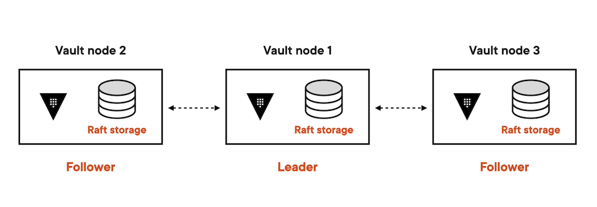

```
### Exec into the vault pods
kubectl exec -it -n vault vault-raft-0 /bin/sh

### Find the vault leader
vault operator raft list-peers

vault-raft-0.vault-raft-internal:8201    follower
vault-raft-1.vault-raft-internal:8201    follower
vault-raft-2.vault-raft-internal:8201    leader

### Exec into the vault pods
kubectl exec -it -n vault vault-raft-2 /bin/sh

### enable audit logs
vault audit enable file file_path=/vault/audit/vault-audit.log

Success! Enabled the file audit device at: file/

### read the audit-log file inside the pod
tail -f /vault/audit/vault-audit.log


### Copy the audit log file to your local
kubectl cp -n vault vault-raft-2:/vault/audit/vault-audit.log ./vault-audit.log

### Query the audit log file
export AUDIT_LOG_FILE=./vault-audit.log

#####  Display errors and their timestamp
jq 'select(.error != null) | [.time,.error]' $AUDIT_LOG_FILE

#####  Display errors and their count
jq -n '[inputs | {Errors: .error} ] | group_by(.Errors) | map({Errors: .[0].Errors, Count: length}) | sort_by(-.Count) | .[]' $AUDIT_LOG_FILE
```

### Run vault debug command

```
cd /tmp 
vault debug
....
Finished capturing information,
bundling files
Success! Bundle written to: vault-debug-2022-08-03T20-28-27.tar.gz
```

## Recovery Mode

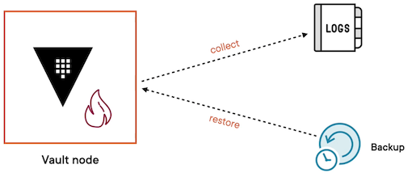

**Recovery Mode**

* Enable audit devices
* Enable resource quota on "/sys/health" path

```
vault audit enable file file_path=/vault/audit/vault-audit.log

Success! Enabled the file audit device at: file/
```

**`values-recovery.yaml`**

```
...
server:
  readinessProbe:
    enabled: false
    path: "/v1/sys/health?standbyok=true&sealedcode=204&uninitcode=204"
  livenessProbe:
    enabled: false
    path: "/v1/sys/health?standbyok=true"
    initialDelaySeconds: 60
  
extraArgs: "-recovery"
...
```

```
## upgrade the vault server
helm upgrade --install vault-raft hashicorp/vault \
  --namespace vault \
  --values values-recovery.yaml

## enable resource quota

vault write /sys/quotas/config \
    rate_limit_exempt_paths=sys/health \
    enable_rate_limit_audit_logging=true \
    enable_rate_limit_response_headers=true
Success! Data written to: sys/quotas/config

### Generate root token

vault operator generate-root -generate-otp -recovery-token

vault operator generate-root-init -otp="wbPut45KNowEQG6MnEccFcxC2V29" -recovery-token

vault operator generate-root-nonce -recovery-token

vault operator generate-root-decode="" -otp="wbPut45KNowEQG6MnEccFcxC2V29" -recovery-token
```

```
$ vault operator generate-root -init -otp="wbPut45KNowEQG6MnEccFcxC2V29" -recovery-token

Nonce   dea2166b-c2dc-6547-1aa2-dd49719e0618
Started true
Progress  0/2
Complete  false


$ vault operator generate-root -nonce dea2166b-c2dc-6547-1aa2-dd49719e0618 -recovery-token

Encoded Token H×QiWycAUxEcKRh1ZQ9RBwASEDAyMzsMWhOFSA


$ vault operator generate-root -decode="HxQiWycAUxEcKR
h1ZQ9RBWASEDAyMZsMWhOFSA" -otp="wbPut45KNowEOG6MnEccEcxc2v2g"
-recovery-token

hvr.S4fZRFo04HgJnwsStPCohk7g

$ vault list sys/raw

Keys
audit/
core/
logical/
sys/

$ vault list sys/raw/sys/quotas/
Keys
config
default_rate_limit_exempt_paths_toggle
```

**Stores all the non-sensitive infos**

```
vault read -field=value sys/raw/sys/quotas/config
{"enable_rate_limit_audit_logging": true, "enable_rate_limit_response_headers":true,
"rate_limit_exempt_paths":["sys/health"]}
```

## Enable Usage Metrics in Vault

### Successful Incidental Management

* Deploying the preventive measures
* Documenting the incident and prevention measures
* Fixing the problem
* Troubleshooting the incident
* Categorising the incident
* Logging the incident
* Detecting the incident

**Detecting the incident**

* Logging the incident
* Detecting the incident


**Deploying the preventive measures**


**Vault Metrics**

Vault exposes both:

* Usage metrics 
* Telemetry metrics


**`policy.hcl`**

```
# To retrieve the usage metrics
path "sys/internal/counters/activity" {
  capabilities = ["read"]
}

# To read and update the usage metrics configuration
path "sys/internal/counters/config" {
  capabilities = ["read", "update"]
}
```


* **`values-usage-metrics.yaml`**

```
# Vault Helm Chart Value Overrides
global:  
  enabled: true  
  tlsDisable: true

server:
  readinessProbe:
    enabled: true
    path: "/v1/sys/health?standbyok=true&sealedcode=204&uninitcode=204"
  livenessProbe:
    enabled: true
    path: "/v1/sys/health?standbyok=true"
    initialDelaySeconds: 60

  volumes:
    - name: plugins
      emptyDir: {}


  volumeMounts:
    - mountPath: /usr/local/libexec/vault
      name: plugins
      readOnly: false

  extraEnvironmentVars:
    VAULT_SKIP_VERIFY: true

  extraSecretEnvironmentVars:
    - envName: AWS_ACCESS_KEY_ID
      secretName: aws-secret
      secretKey: AWS_ACCESS_KEY_ID
    - envName: AWS_SECRET_ACCESS_KEY
      secretName: aws-secret
      secretKey: AWS_SECRET_ACCESS_KEY

  extraVolumes:
    - type: secret
      name: vault-tls

  ha:
    enabled: true
    replicas: 3
    raft:
      enabled: true
      config: |
        ui = true
        
        listener "tcp" {
          address = "[::]:8200"
          cluster_address = "[::]:8201"
          tls_disable = "true"
          tls_cert_file = "/vault/userconfig/vault-tls/tls.crt"
          tls_key_file  = "/vault/userconfig/vault-tls/tls.key"

        }

        plugin_directory = "/usr/local/libexec/vault"
  
        seal "awskms"
        {
          region     = "us-east-1"
          kms_key_id = "794c5350-d4ca-4ea0-af29-1f69e6681361"
        }
        
        storage "raft" {
            path = "/vault/data"
          retry_join {
            leader_api_addr = "http://vault-raft-0.vault-raft-internal:8200"
            leader_client_cert_file = "/vault/userconfig/vault-tls/tls.crt"
            leader_client_key_file = "/vault/userconfig/vault-tls/tls.key"
          }
          retry_join {
            leader_api_addr = "http://vault-raft-1.vault-raft-internal:8200"
            leader_client_cert_file = "/vault/userconfig/vault-tls/tls.crt"
            leader_client_key_file = "/vault/userconfig/vault-tls/tls.key"
          }
          retry_join {
            leader_api_addr = "http://vault-raft-2.vault-raft-internal:8200"
            leader_client_cert_file = "/vault/userconfig/vault-tls/tls.crt"
            leader_client_key_file = "/vault/userconfig/vault-tls/tls.key"
          }
        }

        service_registration "kubernetes" {}


  standalone:
    enabled: "false"

    config: |
      
      listener "tcp" {
        address = "[::]:8200"
        cluster_address = "[::]:8201"
        tls_cert_file = "/vault/userconfig/vault-tls/tls.crt"
        tls_key_file  = "/vault/userconfig/vault-tls/tls.key"
      }

      seal "awskms"
      {
        region     = "us-east-1"
        kms_key_id = "794c5350-d4ca-4ea0-af29-1f69e6681361"
      }

      storage "consul" {
        path = "vault"
        address = "consul-consul-server:8500"
      }
      ui = true
      log_level = "Debug"


  service:
    type: ClusterIP

  auditStorage:
      enabled: true
      size: 10Gi
      mountPath: "/vault/audit"
```

```
## upgrade the vault server
helm upgrade --install vault-raft hashicorp/vault \
  --namespace vault \
  --values values-usage-metrics.yaml
```


 
```  
## Get the leader pod
vault operator raft list-peers

## restart the standby pods
kubectl delete pods -n vault vault-raft-0 vault-raft-2

## restart the leader pod
kubectl delete pods -n vault vault-raft-1

## Port forward the vault service
kubectl port-forward -n vault svc/vault-raft 8200

## Enable the usage metrics
vault write sys/internal/counters/config enabled=enable retention_months=12

Success! Data written to: svs/internal/counters/confia
```

## Telemetry Metrics Part 1: Enabling Metrics

### Telemetry Metrics Format

**Datadog / StatsD / Prometheus / Statsite**

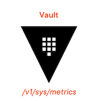

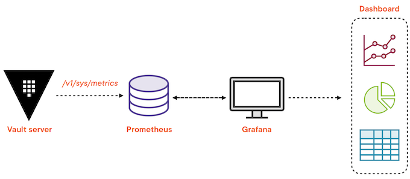

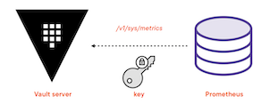


### **Types of Telemetry Metrics**

**System level metrics**


* CPU 
* Network 
* Memory 
* Disk usage

**Request & response metrics** 

**Audit device metrics**

### Demo

Expose the telemetry metrics  
Install Prometheus to scrape metrics 
Install Grafana to view metrics

**`vaules-telemetry.yaml`**

```
# Vault Helm Chart Value Overrides
global:  
  enabled: true  
  tlsDisable: true

server:
  readinessProbe:
    enabled: true
    path: "/v1/sys/health?standbyok=true&sealedcode=204&uninitcode=204"
  livenessProbe:
    enabled: true
    path: "/v1/sys/health?standbyok=true"
    initialDelaySeconds: 60

  volumes:
    - name: plugins
      emptyDir: {}


  volumeMounts:
    - mountPath: /usr/local/libexec/vault
      name: plugins
      readOnly: false

  extraEnvironmentVars:
    VAULT_SKIP_VERIFY: true

  extraSecretEnvironmentVars:
    - envName: AWS_ACCESS_KEY_ID
      secretName: aws-secret
      secretKey: AWS_ACCESS_KEY_ID
    - envName: AWS_SECRET_ACCESS_KEY
      secretName: aws-secret
      secretKey: AWS_SECRET_ACCESS_KEY

  extraVolumes:
    - type: secret
      name: vault-tls

  ha:
    enabled: true
    replicas: 3
    raft:
      enabled: true
      config: |
        ui = true
        
        telemetry {
          disable_hostname = true
          prometheus_retention_time = "12h"
        }
        
        listener "tcp" {
          address = "[::]:8200"
          cluster_address = "[::]:8201"
          tls_disable = "true"
          tls_cert_file = "/vault/userconfig/vault-tls/tls.crt"
          tls_key_file  = "/vault/userconfig/vault-tls/tls.key"

        }

        plugin_directory = "/usr/local/libexec/vault"
  
        seal "awskms"
        {
          region     = "us-east-1"
          kms_key_id = "794c5350-d4ca-4ea0-af29-1f69e6681361"
        }
        
        storage "raft" {
            path = "/vault/data"
          retry_join {
            leader_api_addr = "http://vault-raft-0.vault-raft-internal:8200"
            leader_client_cert_file = "/vault/userconfig/vault-tls/tls.crt"
            leader_client_key_file = "/vault/userconfig/vault-tls/tls.key"
          }
          retry_join {
            leader_api_addr = "http://vault-raft-1.vault-raft-internal:8200"
            leader_client_cert_file = "/vault/userconfig/vault-tls/tls.crt"
            leader_client_key_file = "/vault/userconfig/vault-tls/tls.key"
          }
          retry_join {
            leader_api_addr = "http://vault-raft-2.vault-raft-internal:8200"
            leader_client_cert_file = "/vault/userconfig/vault-tls/tls.crt"
            leader_client_key_file = "/vault/userconfig/vault-tls/tls.key"
          }
        }

        service_registration "kubernetes" {}


  standalone:
    enabled: "false"

    config: |
      
      listener "tcp" {
        address = "[::]:8200"
        cluster_address = "[::]:8201"
        tls_cert_file = "/vault/userconfig/vault-tls/tls.crt"
        tls_key_file  = "/vault/userconfig/vault-tls/tls.key"
      }

      seal "awskms"
      {
        region     = "us-east-1"
        kms_key_id = "794c5350-d4ca-4ea0-af29-1f69e6681361"
      }

      storage "consul" {
        path = "vault"
        address = "consul-consul-server:8500"
      }
      ui = true
      log_level = "Debug"


  service:
    type: ClusterIP

  auditStorage:
      enabled: true
      size: 10Gi
      mountPath: "/vault/audit"
```

Explicitly enable telemetry metrics

`telemetry Stanza`

```
telemetry {
	statsite_address = "statsite.company.local:8125"
}
```

```
## upgrade the vault server
helm upgrade --install vault-raft hashicorp/vault \
  --namespace vault \
  --values vaules-telemetry.yaml

## Get the leader pod
vault operator raft list-peers

## restart the standby pods
kubectl delete pods -n vault vault-raft-0 vault-raft-2

## restart the leader pod
kubectl delete pods -n vault vault-raft-1

## Port forward the vault service
kubectl port-forward -n vault svc/vault-raft 8200
```

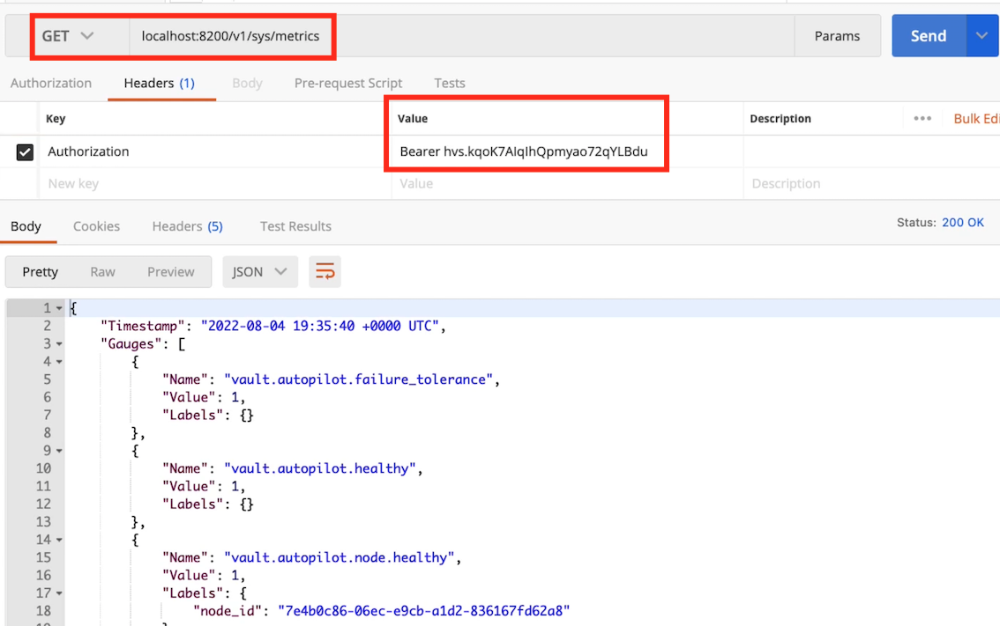

**GET** 

```
localhost:8200/v1/sys/metrics?format=prometheus
```

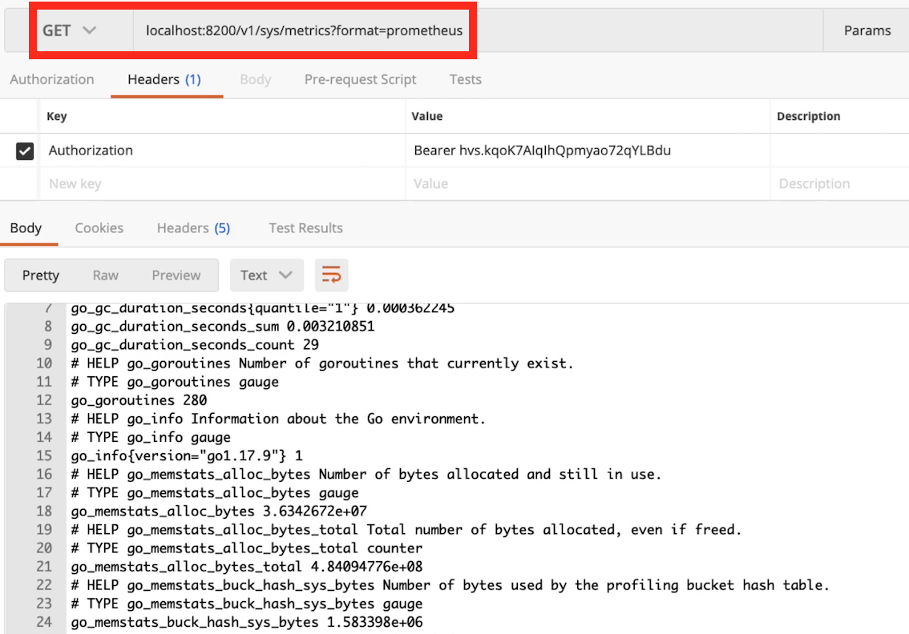


**`Prometeus.policy`**

```
# To retrieve the telemetry metrics 
path "/sys/metrics" {
	capabilities = ["read"]
}
```

```
### Create a policy
vault policy write prometheus-policy prometheus-policy.hcl

### Attach a token with this policy
vault token create -format=json -policy="prometheus-policy" -ttl 64000s
....
hvs.CAESIBht...

### Get the token
token =  hvs.CAESIBht...

```

* **`prometheus.yaml`**

```
apiVersion: rbac.authorization.k8s.io/v1
kind: ClusterRole
metadata:
  name: prometheus
rules:
- apiGroups: [""]
  resources:
  - nodes
  - nodes/proxy
  - services
  - endpoints
  - pods
  verbs: ["get", "list", "watch"]
- apiGroups:
  - extensions
  resources:
  - ingresses
  verbs: ["get", "list", "watch"]
- nonResourceURLs: ["/metrics"]
  verbs: ["get"]

---
apiVersion: v1
kind: ServiceAccount
metadata:
  name: prometheus-sa

---
apiVersion: rbac.authorization.k8s.io/v1
kind: ClusterRoleBinding
metadata:
  name: prometheus
roleRef:
  apiGroup: rbac.authorization.k8s.io
  kind: ClusterRole
  name: prometheus
subjects:
- kind: ServiceAccount
  name: prometheus-sa
  namespace: vault

---
apiVersion: v1
kind: ConfigMap
metadata:
  name: prometheus-server-conf
  labels:
    name: prometheus-server-conf
data:
  prometheus.yml: |-
    global:
      scrape_interval: 5s
      evaluation_interval: 5s
    rule_files:
      - /etc/prometheus/prometheus.rules
    alerting:
      alertmanagers:
      - scheme: http
        static_configs:
        - targets:
          - "alertmanager.monitoring.svc:9093"
    scrape_configs:
      - job_name: vault
        metrics_path: /v1/sys/metrics
        params:
          format: ['prometheus']
        scheme: http
        authorization:
          credentials: "hvs.CAESIBhtLbP5NqtwgSXlOgZm0apZEvDex6r2Fk14ODboQdQbGh4KHGh2cy5WWXFzQ25QUE5VNjM1OWJmekdLM1pBb2g"
        static_configs:
        - targets: ['vault-raft.vault:8200']

---
apiVersion: apps/v1
kind: Deployment
metadata:
  name: prometheus-deployment
  labels:
    app: prometheus-server
spec:
  replicas: 1
  selector:
    matchLabels:
      app: prometheus-server
  template:
    metadata:
      labels:
        app: prometheus-server
    spec:
      serviceAccountName: prometheus-sa
      containers:
        - name: prometheus
          image: prom/prometheus
          args:
            - "--config.file=/etc/prometheus/prometheus.yml"
            - "--storage.tsdb.path=/prometheus/"
          ports:
            - containerPort: 9090
          volumeMounts:
            - name: prometheus-config-volume
              mountPath: /etc/prometheus/
            - name: prometheus-storage-volume
              mountPath: /prometheus/
      volumes:
        - name: prometheus-config-volume
          configMap:
            defaultMode: 420
            name: prometheus-server-conf
  
        - name: prometheus-storage-volume
          emptyDir: {}

---
apiVersion: v1
kind: Service
metadata:
  name: prometheus-service
  annotations:
      prometheus.io/scrape: 'true'
      prometheus.io/port:   '9090'
  
spec:
  selector: 
    app: prometheus-server
  type: NodePort  
  ports:
    - port: 9090
      targetPort: 9090 
      nodePort: 30000
```


```
authorization:
	credentials: "hvs.CAESIBhtLbP5NqtwgSXlOgZm0apZEvDex6r2Fk14ODboQdQbGh4KHGh2cy5WWXFzQ25QUE5VNjM1OWJmekdLM1pBb2g"
```

```
kubectl get pods -n vault

prometheus-deployment-5bcfccb5c7-c4px6

### Port-forward the prometheus service
kubectl port-forward -n vault svc/prometheus-service 9090
```

**`http://localhost:9090`**

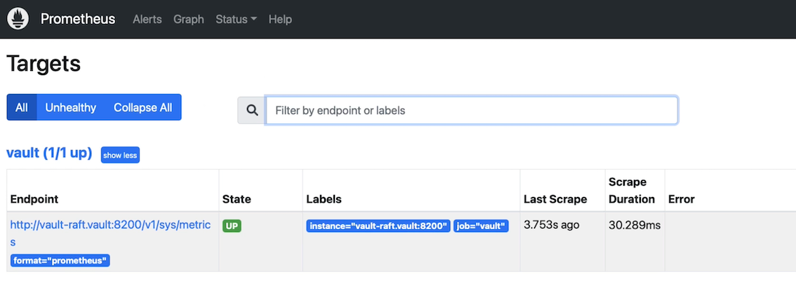

`vault_audit_log_response`

**Deploy grafana server**

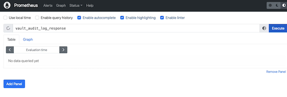

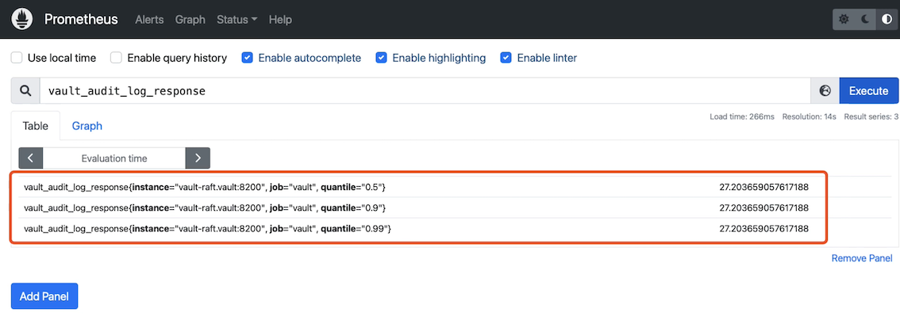

```
### Deploy the grafana
kubectl apply -n vault -f grafana.yaml

### Port-forward the grafana service
kubectl port-forward -n vault svc/grafana 3000
```

* **`grafana.yaml`**

```
apiVersion: v1
kind: ConfigMap
metadata:
  name: grafana-datasources
data:
  prometheus.yaml: |-
    {
        "apiVersion": 1,
        "datasources": [
            {
               "access":"proxy",
                "editable": true,
                "name": "vault",
                "orgId": 1,
                "type": "prometheus",
                "url": "http://prometheus-service.vault.svc:8080",
                "version": 1
            }
        ]
    }

---
apiVersion: apps/v1
kind: Deployment
metadata:
  name: grafana
spec:
  replicas: 1
  selector:
    matchLabels:
      app: grafana
  template:
    metadata:
      name: grafana
      labels:
        app: grafana
    spec:
      containers:
      - name: grafana
        image: grafana/grafana:latest
        ports:
        - name: grafana
          containerPort: 3000
        resources:
          limits:
            memory: "1Gi"
            cpu: "1000m"
          requests: 
            memory: 500M
            cpu: "500m"
        volumeMounts:
          - mountPath: /var/lib/grafana
            name: grafana-storage
          - mountPath: /etc/grafana/provisioning/datasources
            name: grafana-datasources
            readOnly: false
      volumes:
        - name: grafana-storage
          emptyDir: {}
        - name: grafana-datasources
          configMap:
              defaultMode: 420
              name: grafana-datasources

---
apiVersion: v1
kind: Service
metadata:
  name: grafana
  annotations:
      prometheus.io/scrape: 'true'
      prometheus.io/port:   '3000'
spec:
  selector: 
    app: grafana
  type: NodePort  
  ports:
    - port: 3000
      targetPort: 3000
      nodePort: 32000
```

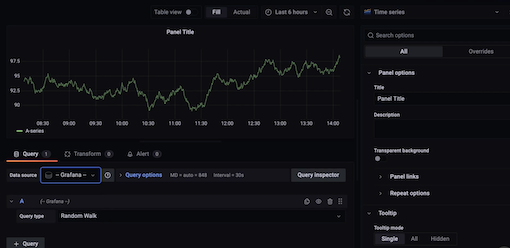

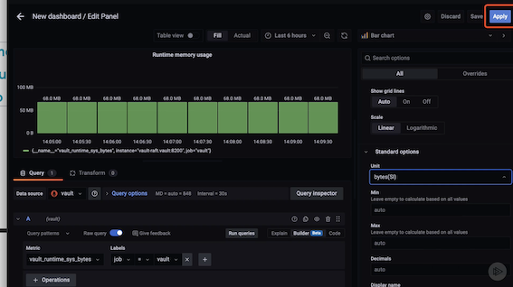

