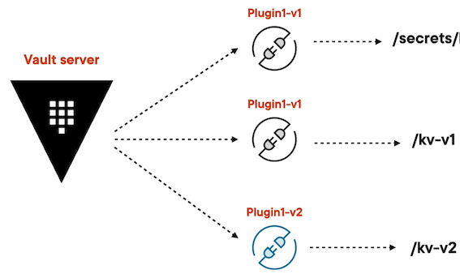
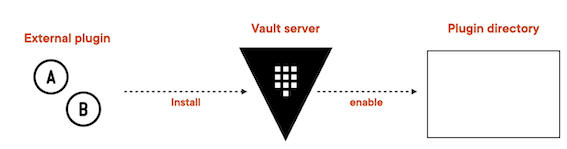

# **4 Managing External Plugins and Server Upgrades**

* Manages the lifecycle of the Vault
* Install a plugin
* Upgrade the Vault server

### Skills to expand and upgrade the Vault server

* Understand the architecture of plugin system and install an external plugin
* Upgrade the Vault server
* Understand key management secret engine in the Vault server

## Understanding Plugins

### **Plugin's Architecture**



### **Comparison**

* **Built-in plugins**

	* Come by default with in Vault server
	* Don't require an operator intervention to run
	* Share the memory space of the Vault server

* **External plugins**

	* Come separately from the Vault server
	* Require an operator intervention to run
	* Don't share the memory space of the Vault server




```
## List all plugins
vault plugin list

## List all secret plugins
vault plugin list secret

## Get the azure plugin info
vault plugin info secret azure

Key		Value
---    ----
args		[]
builtin true
command n/a
name		 azure
sha256. n/a


## Enable the key value secret
vault secrets enable -version=2 -path=kv2 kv
```

### Install new vault enable plugin

* **`values-debug.yaml`**

```
# Vault Helm Chart Value Overrides
global:  
  enabled: true  
  tlsDisable: true

server:
  readinessProbe:
    enabled: true
    path: "/v1/sys/health?standbyok=true&sealedcode=204&uninitcode=204"
  livenessProbe:
    enabled: true
    path: "/v1/sys/health?standbyok=true"
    initialDelaySeconds: 60

  volumes:
    - name: plugins
      emptyDir: {}


  volumeMounts:
    - mountPath: /usr/local/libexec/vault
      name: plugins
      readOnly: false

  extraEnvironmentVars:
    VAULT_SKIP_VERIFY: true

  extraSecretEnvironmentVars:
    - envName: AWS_ACCESS_KEY_ID
      secretName: aws-secret
      secretKey: AWS_ACCESS_KEY_ID
    - envName: AWS_SECRET_ACCESS_KEY
      secretName: aws-secret
      secretKey: AWS_SECRET_ACCESS_KEY

  extraVolumes:
    - type: secret
      name: vault-tls

  ha:
    enabled: true
    replicas: 3
    raft:
      enabled: true
      config: |
        listener "tcp" {
          address = "[::]:8200"
          cluster_address = "[::]:8201"
          tls_disable = "true"
          tls_cert_file = "/vault/userconfig/vault-tls/tls.crt"
          tls_key_file  = "/vault/userconfig/vault-tls/tls.key"

        }

        plugin_directory = "/usr/local/libexec/vault"
        ui = true
        seal "awskms"
        {
          region     = "us-east-1"
          kms_key_id = "794c5350-d4ca-4ea0-af29-1f69e6681361"
        }
        
        storage "raft" {
            path = "/vault/data"
          retry_join {
            leader_api_addr = "http://vault-raft-0.vault-raft-internal:8200"
            leader_client_cert_file = "/vault/userconfig/vault-tls/tls.crt"
            leader_client_key_file = "/vault/userconfig/vault-tls/tls.key"
          }
          retry_join {
            leader_api_addr = "http://vault-raft-1.vault-raft-internal:8200"
            leader_client_cert_file = "/vault/userconfig/vault-tls/tls.crt"
            leader_client_key_file = "/vault/userconfig/vault-tls/tls.key"
          }
          retry_join {
            leader_api_addr = "http://vault-raft-2.vault-raft-internal:8200"
            leader_client_cert_file = "/vault/userconfig/vault-tls/tls.crt"
            leader_client_key_file = "/vault/userconfig/vault-tls/tls.key"
          }
        }

        service_registration "kubernetes" {}


  standalone:
    enabled: "false"

    config: |
      
      listener "tcp" {
        address = "[::]:8200"
        cluster_address = "[::]:8201"
        tls_cert_file = "/vault/userconfig/vault-tls/tls.crt"
        tls_key_file  = "/vault/userconfig/vault-tls/tls.key"
      }

      seal "awskms"
      {
        region     = "us-east-1"
        kms_key_id = "794c5350-d4ca-4ea0-af29-1f69e6681361"
      }

      storage "consul" {
        path = "vault"
        address = "consul-consul-server:8500"
      }
      ui = true
      log_level = "Debug"


  service:
    type: ClusterIP

  auditStorage:
      enabled: true
      size: 10Gi
      mountPath: "/vault/audit"
```

* `plugin_directory = "/usr/local/libexec/vault"`

```
volumes:
	- name: plugins
	  emptyDir: {}


volumeMounts:
	- mountPath: /usr/local/libexec/vault
	  name: plugins
	  readOnly: false
```

Vault statefulset doesn't allow ADD new PVC directly.

```
### delete a service
kubectl delete statefulsets -n vault vault-raft

## upgrade the vault server
helm upgrade --install vault-raft hashicorp/vault \
  --namespace vault \
  --values values-debug.yaml

### Find the vault leader
vault operator raft list-peers

vault-raft-0.vault-raft-internal:8201  leader

## Download Google secret plugin
curl \
    --silent \
    https://github.com/GoogleCloudPlatform/vault-plugin-secrets-gcppca/releases/download/v1.1.0/vault-plugin-secrets-gcppca --output vault-plugin-secrets-gcppca

### Get the SHASMU
export SHASUM=$(shasum -a 256 "vault-plugin-secrets-gcppca" | cut -d " " -f1)
echo $SHASUM

### Copy the plugin into the pod
kubectl cp -n vault vault-plugin-secrets-gcppca vault-raft-0:/usr/local/libexec/vault/vault-plugin-secrets-gcppca
```

### Register plugin

```
### Register the plugin
vault plugin register \
    -sha256="${SHASUM}" \
    -command="vault-plugin-secrets-gcppca" \
    secret vault-plugin-secrets-gcppca

Success! Registered plugin: vault-plugin-secrets-gcppca

### Enable the plugin
vault secrets enable -path="gcppca" \
   --description='Vault CA Service Plugin' \
   --plugin-name='vault-plugin-secrets-gcppca' vault-plugin-secrets-gcppca
   
### Get plugin info
vault plugin info secret vault-plugin-secrets-gcppca
...
vault-plugin-secrets-gcppca 

### Reload the plugin
vault plugin reload -plugin vault-plugin-secrets-gcppca
``` 


## Vault Upgrade

### Vault Upgrade Steps

* Review the version upgrade notes
* Take backup of the data
* Stop the Vault server
* **Replace the existing Vault binary with the latest one**
* **Start the Vault server and unseal it**

### **Vault Key Management**

```
### Snapshot of the raft storage backend
vault operator raft snapshot save backup.snap

## Get the vault image version
kubectl describe pods -n vault vault-raft-1

## upgrade the vault server
helm upgrade --install vault-raft hashicorp/vault \
  --namespace vault \
  --values values-upgrade.yaml

## Get the leader pod
vault operator raft list-peers

## Get vault status
vault status

## restart the standby pods
kubectl delete pods -n vault --selector="vault-active=false"

## restart the leader pod
kubectl delete pods -n vault vault-raft-0
```


## Vault Key Management

**Provides a consistent way for distribution and managing the lifecycle of cryptographic keys in cloud KMS provider**

**Setup**

Most secrets engines must be configured in advance before they can perform their functions. 

These steps are usually completed by an operator or configuration management tool.

**Enable the Key Management secrets engine:**

```
$ vault secrets enable keymgmt
Success! Enabled the keymgmt secrets engine at: keymgmt/
```

By default, the secrets engine will mount at the name of the engine. 

To enable the secrets engine at a different path, use the `-path` argument.


